# 一、CSS三大特性

## 1.层叠性


```html
<head>
    <meta charset="UTF-8">
    <meta name="viewport" content="width=device-width, initial-scale=1.0">
    <meta http-equiv="X-UA-Compatible" content="ie=edge">
    <title>CSS层叠性</title>
    <style>
       div {
           color: red;
           font-size: 12px;
       }
       div {
           color: pink;
       }
    </style>
</head>
<body>
    <div>长江后浪推前浪,前浪死在沙滩上</div>
</body>
```

## 2.继承性


```
<head>
    <meta charset="UTF-8">
    <meta name="viewport" content="width=device-width, initial-scale=1.0">
    <meta http-equiv="X-UA-Compatible" content="ie=edge">
    <title>CSS继承性</title>
    <style>
        div {
            color: pink;
            font-size: 14px;
        }
    </style>
</head>
<body>
    <div>
        <p>龙生龙，凤生凤，老鼠生的孩子会打洞</p>
    </div>
</body>
```

### 2.1.行高的继承性


```
<head>
    <meta charset="UTF-8">
    <meta name="viewport" content="width=device-width, initial-scale=1.0">
    <meta http-equiv="X-UA-Compatible" content="ie=edge">
    <title>行高的继承</title>
    <style>
        body {
            color: pink;
            /* font: 12px/24px 'Microsoft YaHei'; */
            font: 12px/1.5 'Microsoft YaHei';
        }
        div {
            /* 子元素继承了父元素 body 的行高 1.5 */
            /* 这个1.5 就是当前元素文字大小 font-size 的1.5倍   所以当前div 的行高就是21像素 */
            font-size: 14px; 
        }
        p {
            /* 1.5 * 16 =  24 当前的行高 */
            font-size: 16px;
        }
        /* li 么有手动指定文字大小  则会继承父亲的 文字大小  body 12px 所以 li 的文字大小为 12px 
        
        当前li 的行高就是  12 * 1.5  =  18
        */
    </style>
</head>
<body>
    <div>粉红色的回忆</div>
    <p>粉红色的回忆</p>
    <ul>
        <li>我没有指定文字大小</li>
    </ul>
</body>
```


## 3.优先级


```
<head>
    <meta charset="UTF-8">
    <meta name="viewport" content="width=device-width, initial-scale=1.0">
    <meta http-equiv="X-UA-Compatible" content="ie=edge">
    <title>CSS优先级</title>
    <style>
        .test {
            color: red;
        }
        div {
            color: pink!important;
        }
        #demo {
            color: green;
        }
    </style>
</head>

<body>
    <div class="test" id="demo" style="color: purple">你笑起来真好看</div>
</body>
```

### 3.1.优先级注意点


```
<head>
    <meta charset="UTF-8">
    <meta name="viewport" content="width=device-width, initial-scale=1.0">
    <meta http-equiv="X-UA-Compatible" content="ie=edge">
    <title>css权重注意点</title>
    <style>
        /* 父亲的权重是 100  */
        #father {
            color: red!important;
        }
        /* p继承的权重为 0 */
        /* 所以以后我们看标签到底执行那个样式,就先看这个标签有么有直接被选出来 */
        p {
            color: pink;
        }
        body {
            color: red;
        }
        /* a链接浏览器默认制定了一个样式 蓝色的 有下划线  a {color: blue;}*/
        a {
            color: green;
        }
    </style>
</head>
<body>
    <div id="father">
        <p>你还是很好看</p>
    </div>
    <a href="#">我是单独的样式</a>
</body>
```

### 3.2.权重叠加


```
<head>
    <meta charset="UTF-8">
    <meta name="viewport" content="width=device-width, initial-scale=1.0">
    <meta http-equiv="X-UA-Compatible" content="ie=edge">
    <title>权重的叠加</title>
    <style>
       /* 复合选择器会有权重叠加的问题 */
       /* 权重虽然会叠加,但是永远不会有进位 */
       /* ul li 权重  0,0,0,1 + 0,0,0,1  =  0,0,0,2     2 */
        ul li {
            color: green;
        }
        /* li 的权重是 0,0,0,1    1 */
        li {
            color: red;
        }
        /* .nav li  权重    0,0,1,0  +  0,0,0,1  =  0,0,1,1    11 */
        .nav li {
            color: pink;
        }
    </style>
</head>

<body>
    <ul class="nav">
        <li>大猪蹄子</li>
        <li>大肘子</li>
        <li>猪尾巴</li>
    </ul>
</body>
```


### 3.3.优先级权重练习


# 二、盒子模型


## border - 边框

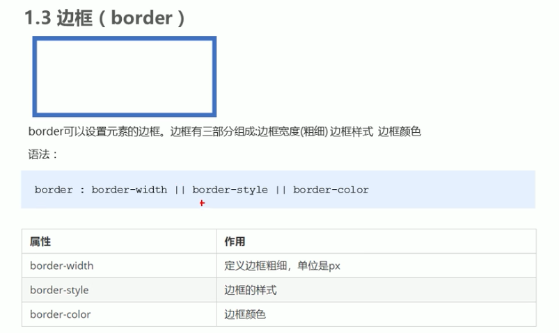

```
<style>
    div {
        width: 300px;
        height: 200px;
        /* border-width 边框的粗细  一般情况下都用 px */
        border-width: 5px;

        /* border-style 边框的样式  solid 实线边框   dashed 虚线边框  dotted 点线边框*/
        border-style: solid;

        /* border-color 边框的颜色 */
        border-color: pink;
    }
</style>
```

**复合写法**

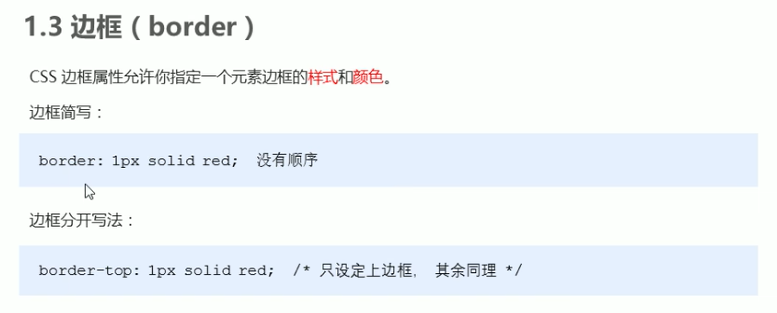

```
<style>
    div {
        width: 300px;
        height: 200px;

        /* 边框的复合写法 简写:  */
        border: 5px solid pink;

        /* 上边框 */
        border-top: 5px solid pink;

        /* 下边框 */
        border-bottom: 10px dashed purple;
    }
</style>
```

**表格边框**

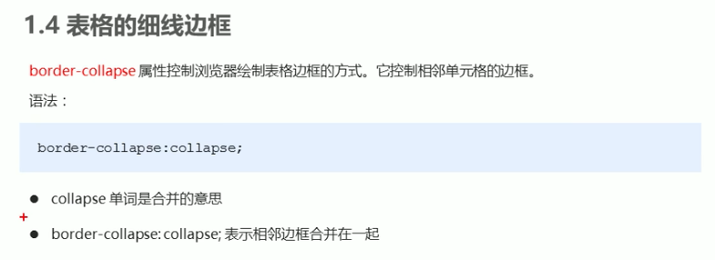

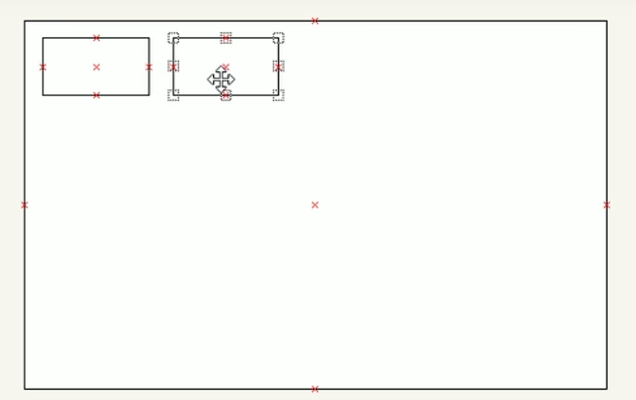

```
<style>
    table {
        width: 500px;
        height: 249px;
    }
    th {
        height: 35px;
    }
    table,
    td, th {
        border: 1px solid pink;
        /* 合并相邻的边框 */
        border-collapse: collapse;
        font-size: 14px;
        text-align: center;
    }
</style>
```

**边框影响盒子宽高**

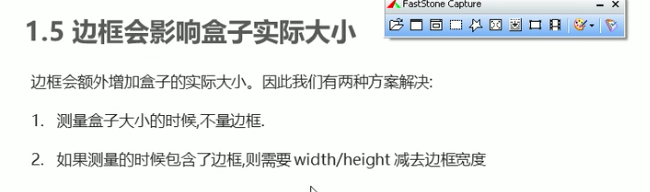

## padding - 内边距

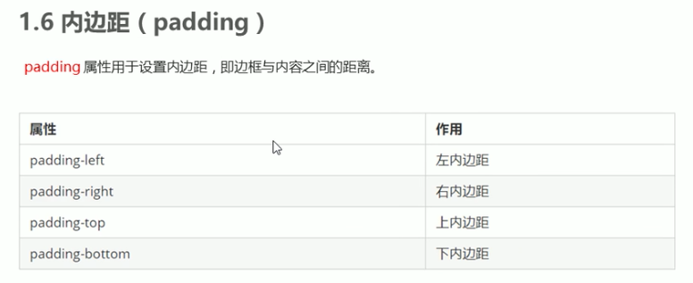

```
<style>
        div {
            width: 200px;
            height: 200px;
            background-color: pink;
            padding-left: 20px;
            padding-top: 30px;
        }
    </style>
```

**简写**

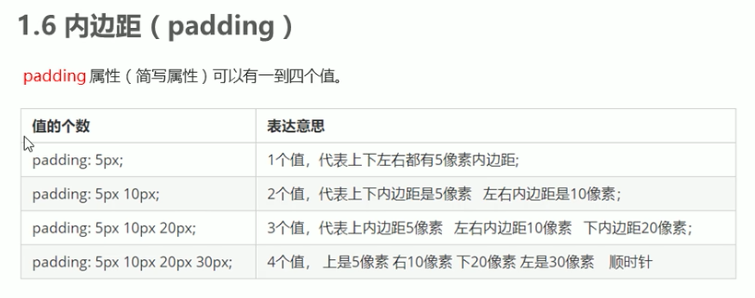

**padding影响盒子宽高**


**padding不会撑开盒子的情况**

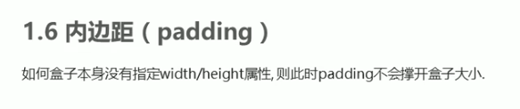

```
<head>
    <meta charset="UTF-8">
    <meta name="viewport" content="width=device-width, initial-scale=1.0">
    <meta http-equiv="X-UA-Compatible" content="ie=edge">
    <title>padding不会影响盒子大小的情况</title>
    <style>   
       h1 {
           /* width: 100%; */
           height: 200px;
           background-color: pink;
           padding: 30px;
       }
       div {
           width: 300px;
           height: 100px;
           background-color: purple;
       }
       div p {
           padding: 30px;
           background-color: skyblue;
       }
    </style>
</head>
<body>
   <h1></h1>
   <div>
       <p></p>
   </div>
</body>
```


### padding实战

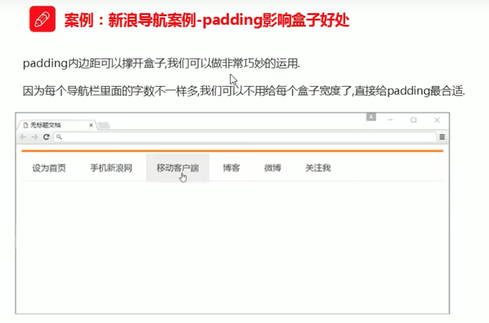


## margin - 外边距

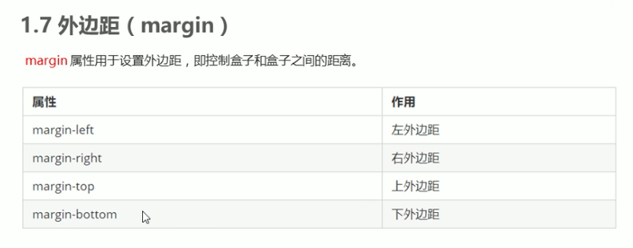

```
<head>
    <meta charset="UTF-8">
    <meta name="viewport" content="width=device-width, initial-scale=1.0">
    <meta http-equiv="X-UA-Compatible" content="ie=edge">
    <title>盒子模型之外边距margin</title>
    <style>
      div {
          width: 200px;
          height: 200px;
          background-color: pink;
      }
      /* .one {
          margin-bottom: 20px;
      } */
      .two {
          /* margin-top: 20px; */
          /* margin: 30px; */
          margin: 30px 50px;
      }
    </style>
</head>
<body>
    <div class="one">1</div>
    <div class="two">2</div>
</body>
```

### margin典型应用 - 盒子水平居中

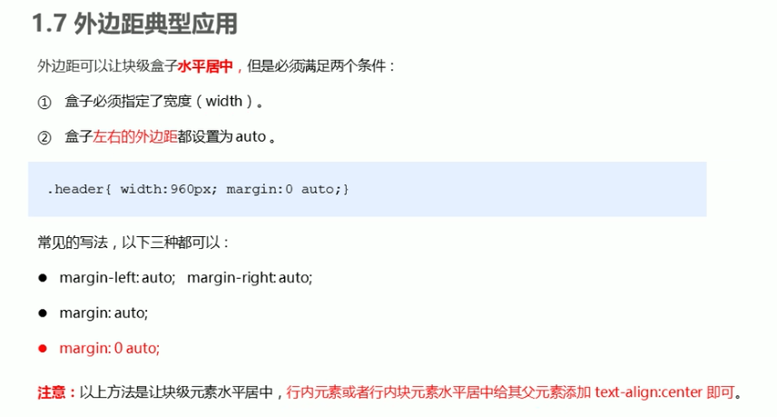

#### 块级盒子水平居中

```
<head>
    <title>块级盒子水平居中对齐</title>
    <style>
      .header {
          width: 900px;
          height: 200px;
          background-color: pink;
          margin: 100px auto;
      }
    </style>
</head>
<body>
    <div class="header"></div>
</body>
```

#### 行内元素或者行内块元素水平居中

```
<head>
    <title>行内元素/行内块元素水平居中对齐</title>
    <style>
        .header {
            width: 900px;
            height: 200px;
            background-color: pink;
            margin: 100px auto;
        
            /* 行内元素或者行内块元素水平居中给其父元素添加 text-align:center 即可 */
            text-align: center;
        }
    </style>
</head>
<body>
    <div class="header">
        <span>里面的文字</span>
    </div>
    <div class="header">
        
    </div>
</body>
```

### 外边距合并 - 嵌套塌陷

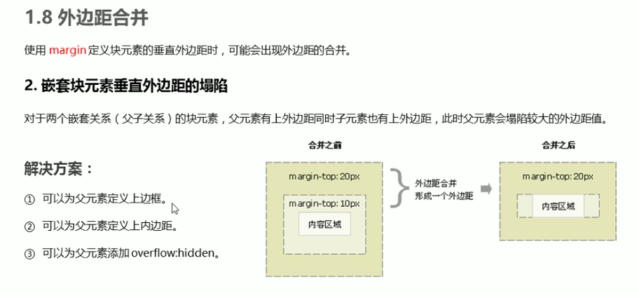

**塌陷**

> 此时 son元素无法margin  100px

```
<head>
    <meta charset="UTF-8">
    <meta name="viewport" content="width=device-width, initial-scale=1.0">
    <meta http-equiv="X-UA-Compatible" content="ie=edge">
    <title>外边距合并-嵌套块级元素垂直外边距塌陷</title>
    <style>
        .father {
            width: 400px;
            height: 400px;
            background-color: purple;
            margin-top: 50px;
        }
        .son {
            width: 200px;
            height: 200px;
            background-color: pink;
            margin-top: 100px;
        }
    </style>
</head>
<body>
    <div class="father">
        <div class="son"></div>
    </div>
</body>
```

**解决方案**

```
<head>
    <meta charset="UTF-8">
    <meta name="viewport" content="width=device-width, initial-scale=1.0">
    <meta http-equiv="X-UA-Compatible" content="ie=edge">
    <title>外边距合并-嵌套块级元素垂直外边距塌陷</title>
    <style>
        .father {
            width: 400px;
            height: 400px;
            background-color: purple;
            margin-top: 50px;

            /* 解决方案1: 新增外边框 */
            border: 1px solid red;
            border: 1px solid transparent;

            /* 解决方案2: 新增内边距 */
            padding: 1px;
            
            /* 解决方案3: 新增overflow: hidden */
            overflow: hidden;

            /* 其他解决方案：浮动、固定、绝对定位的盒子不会有塌陷的问题！！！ */
        }
        .son {
            width: 200px;
            height: 200px;
            background-color: pink;
            margin-top: 100px;
        }
    </style>
</head>
<body>
    <div class="father">
        <div class="son"></div>
    </div>
</body>
```


### 清除内外边距

* 1.先清理默认内外边距；
* 2.行内元素尽量设置左右边距，上下边距设置也不起作用；若想要设置上下边距，则需要转为块元素 或 行内块元素

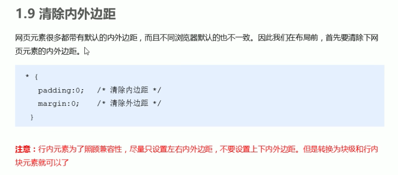

```
<style>
    /* 这句话也是我们css 的第一行代码 */
    * {
        margin: 0;
        padding: 0;
    }
</style>
```

# 三、盒子模型 - 案例


