## 目标

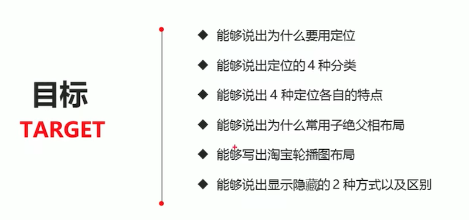


# 定位

## 为什么需要定位？

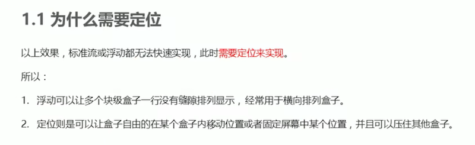

## 定位组成

> 定位 = 定位模式 + 边偏移

### 定位模式

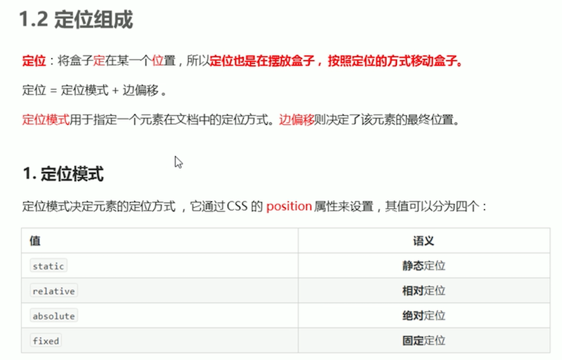

### 边偏移

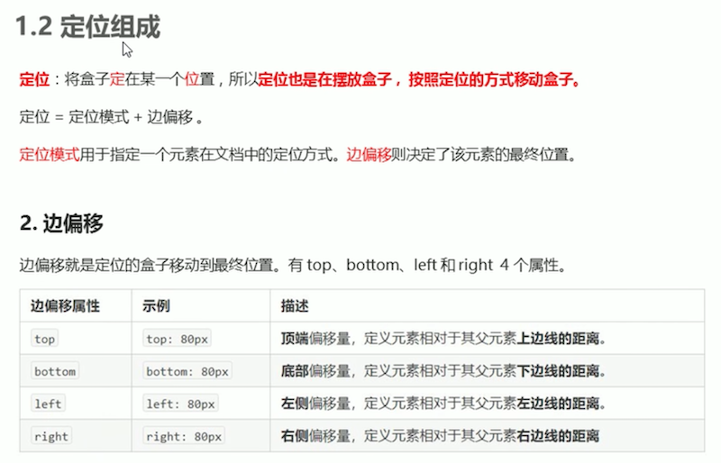


## 1.静态定位 static - 了解

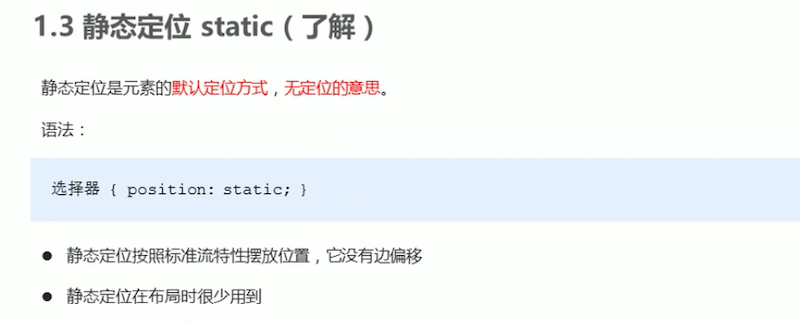


## 2.相对定位 relative - 重要

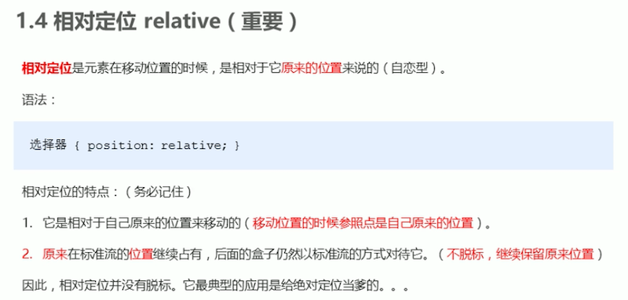


## 3.绝对定位 absolute - 重要


**情况一：无父类 或 父类无定位**
**则以浏览器为准**

```
<head>
    <title>绝对定位-无父亲或者父亲无定位</title>
    <style>
        .father {
            width: 500px;
            height: 500px;
            background-color: skyblue;
        }
        .son {
            position: absolute;
            left: 0;
            bottom: 0;
            width: 200px;
            height: 200px;
            background-color: pink;
        }
    </style>
</head>
<body>
    <div class="father">
            <div class="son"></div>
    </div>
   
</body>
```


**情况二：父亲有定位**
**以父亲为参考点**

```
<head>
    <title>绝对定位-父级有定位</title>
    <style>
        .father {
            position: relative;   /* 父亲有定位 */ 
            width: 500px;
            height: 500px;
            background-color: skyblue;
        }
        .son {
            position: absolute;
            left: 30px;
            bottom: 10px;
            width: 200px;
            height: 200px;
            background-color: pink;
        }
    </style>
</head>
<body>
    <div class="father">
        <div class="son"></div>
    </div>
</body>
```

**情况三：父亲无定位，爷爷有定位**
**以爷爷为参照**

```
<head>
    <meta charset="UTF-8">
    <meta name="viewport" content="width=device-width, initial-scale=1.0">
    <meta http-equiv="X-UA-Compatible" content="ie=edge">
    <title>绝对定位-父级有定位</title>
    <style>
        .yeye {
            position: relative;    /* 爷爷有定位 */
            width: 800px;
            height: 800px;
            background-color: hotpink;
            padding: 50px;
        }
        .father {    /* 父亲无定位 */
            width: 500px;
            height: 500px;
            background-color: skyblue;
        }
        .son {
            position: absolute;
            left: 30px;
            bottom: 10px;
            width: 200px;
            height: 200px;
            background-color: pink;
        }
    </style>
</head>
<body>
    <div class="yeye">
            <div class="father">
                    <div class="son"></div>
            </div>
    </div>
</body>
```
### 3.1.子绝父相

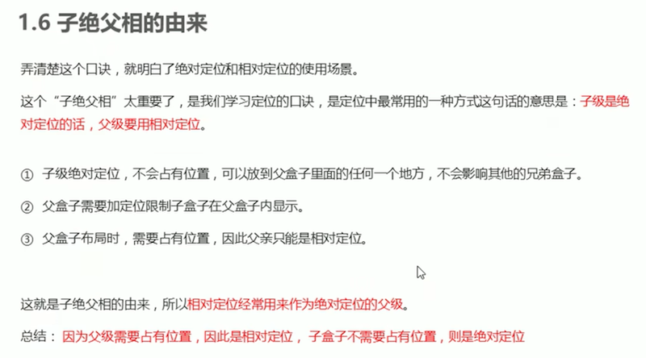

### 3.2.绝对定位水平/垂直居中


```
.box {
    position: absolute;
    /* 1. left 走 50%  父容器宽度的一半 */
    left: 50%;
    /* 2. margin 负值 往左边走 自己盒子宽度的一半 */
    margin-left: -100px;
    top: 50%;
    margin-top: -100px;
    width: 200px;
    height: 200px;
    background-color: pink;
    /* margin: auto; */
}
```

## 4.固定定位 - 重要


```
<style>
    .dj {
        position: fixed;
        top: 100px;
        left: 40px;
    }
</style>
```

### 4.1.小技巧

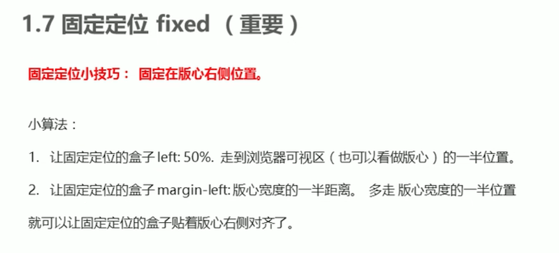

```
.fixed {
    position: fixed;
    /* 1. 走浏览器宽度的一半 */
    left: 50%;
    /* 2. 利用margin 走版心盒子宽度的一半距离 */
    /* margin-left: 405px; */
    width: 50px;
    height: 150px;
    background-color: skyblue;
}
```

## 5.粘性定位 - 了解

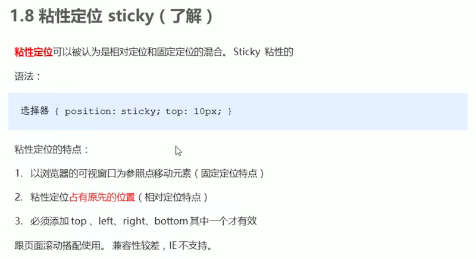

```
.nav {
    /* 粘性定位 */
    position: sticky;
    top: 0;
    width: 800px;
    height: 50px;
    background-color: pink;
    margin: 100px auto;
}
```

## 6.定位小结


## 7.Z轴定位叠放


```
<style>
    .box {
        position: absolute;
        top: 0;
        left: 0;
        width: 200px;
        height: 200px;
    }
    .xiongda {
        background-color: red;
        z-index: 1;
    }
    .xionger {
        background-color: green;
        left: 50px;
        top: 50px;
        z-index: 2;
    }
    .qiangge {
        background-color:blue;
        left: 100px;
        top: 100px;
    }
</style>
```

## 8.定位 VS 浮动

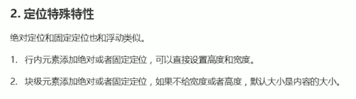

```
<style>
    span {
        position: absolute;
        top: 300px;
        width: 200px;
        height: 150px;
        background-color: pink;
    }
    div {
        position: absolute;
        background-color: skyblue;
    }
</style>
```

## 9.定位完全压住盒子


```
.box {
    /* 1.浮动的元素不会压住下面标准流的文字 */
    /* float: left; */
    /* 2. 绝对定位（固定定位） 会压住下面标准流所有的内容。 */
    position: absolute;
    width: 150px;
    height: 150px;
    background-color: pink;
}
```


## 定位综合案例 - 淘宝焦点图


# ==============================================

# 网页布局总结

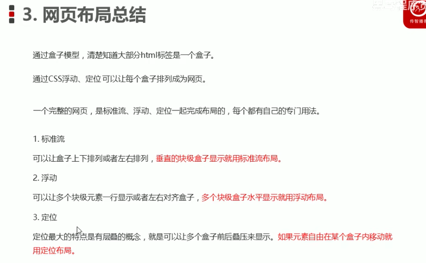


# 元素显示与隐藏

## 1.display属性


## 2.visbility属性

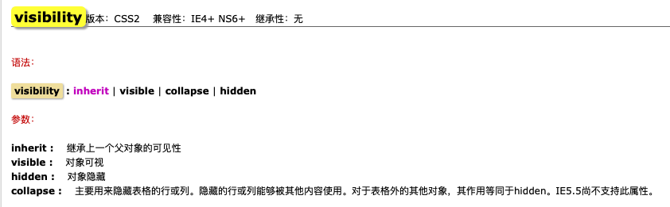


## 3.overflow溢出


## 对比


## 隐藏案例 - 土豆网


