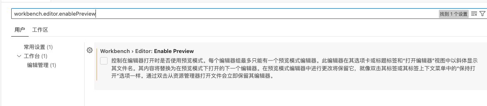
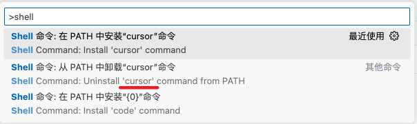

# 文档

* [Cursor](https://www.cursor.com/cn)
    * [Cursor Doc](https://docs.cursor.com/get-started/welcome)
* [Learn Cursor](https://learn-cursor.com/wiki/user-guide/programming-basics-for-beginners)
* [Cursor教程 - Runoob](https://www.runoob.com/cursor/cursor-tutorial.html)

* 其他
    * https://github.com/maomao1996/daily-notes/issues/50

# 常用快捷键 + AI 快捷键

| 快捷键              | 操作               |
| ------------------- | ------------------ |
| Command + Shift + J | 打开Cursor Setting |
|                     |                    |
|                     |                    |
|                     |                    |

- `Ctrl/⌘ + K` 在光标处插入 AI 生成的代码
- `Ctrl/⌘ + I` 对选中的代码进行快速智能编辑和补全，直接在编辑器中显示建议
- `Ctrl/⌘ + Shift + I` 打开独立的智能编辑面板，提供更详细的编辑建议和交互选项（功能和 `Ctrl/⌘ + I` 一样）
- `Ctrl/⌘ + L` 打开 AI 聊天面板,可以与 AI 进行对话交互

# 修改设置

## 1. 修改活动栏布局

Cursor 的活动栏默认是水平的，用起来很别扭

1. 打开 VSCode，按 `Command + ,` 打开设置
2. 设置 `workbench.activityBar.orientation` 为 `vertical`

## 2. 关闭页面预览，每次都打开一个新页签

* `command + ,`
* `workbench.editor.enablePreview`：取消勾选

## 3. Cursor 中文设置

* [Cursor 中文设置 - Runoob](https://www.runoob.com/cursor/cursor-extensions-chinese.html)

## 4. 安装 `cursor .`  or `code .`

* [Cursor code/cursor 命令 - Runoob](https://www.runoob.com/cursor/cursor-cursor-command.html)

| 命令                                    | 功能说明                 |
| :-------------------------------------- | :----------------------- |
| `code <路径>`                           | 打开文件或文件夹         |
| `cursor .`                              | 打开当前目录作为工作区   |
| `cursor --new-window`                   | 在新窗口中打开           |
| `cursor --diff`                         | 对比两个文件的内容       |
| `cursor --wait`                         | 等待窗口关闭后再返回终端 |
| `cursor --disable-extensions`           | 禁用所有扩展运行 VS Code |
| `cursor --install-extension <扩展名>`   | 安装指定扩展             |
| `cursor --list-extensions`              | 列出所有已安装的扩展     |
| `cursor --uninstall-extension <扩展名>` | 卸载指定扩展             |

# 技巧

## 1. 聊天中的 `@` 符号

在 AI 对话框中可以使用 `@` 符合添加对应上下文

- `@Files` 引入文件，使用文件内容进行 AI 分析
- `@Folders` 引入文件夹，可以让 AI 了解整个项目结构
- `@Code` 当前选中的代码，将选中的代码片段发送给 AI 分析
- `@Docs` 引用内置的第三方文档内容进行 AI 分析
- `@Git` 引入 Git 相关信息，如提交历史、分支等
- `@Codebase` 引入整个代码库的上下文，让 AI 了解项目全貌
- `@Web` 允许 AI 访问网络资源获取信息
- `@Chat` 引用之前的对话内容
- `@Definitions` 引入代码中的定义，如函数、类等

## 2. 提示词

[Cursor Directory](https://cursor.directory/) 收录了大量 Cursor 的提示词，可以参考使用

## 3. `.cursorignore` 文件

Cursor 会根据 `.cursorignore` 文件中的内容忽略一些文件或文件夹，可以用来排除一些不希望被 AI 分析的文件

- 官网文档 [Ignore Files | Cursor](https://docs.cursor.com/context/ignore-files)

