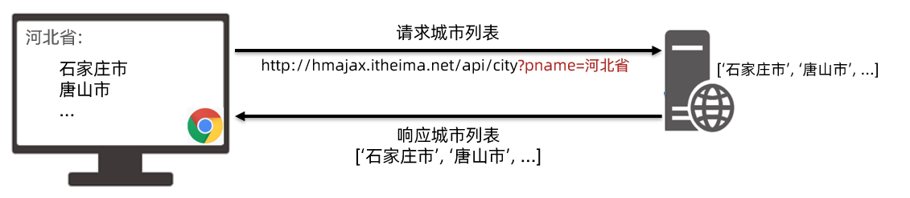

[AJAX Tutorial: What AJAX Is and How to Use it](https://www.freecodecamp.org/news/ajax-tutorial/)

<font color='red' size=5>ajax-axios-promise-demo：从各个项目中抽离总结的Axios例子！！！</font>


# 一、AJAX基础篇


## 1. AJAX 概念和 axios 使用

* 定义：[mdn](https://developer.mozilla.org/zh-CN/docs/Web/Guide/AJAX/Getting_Started)

    **AJAX 是异步的 JavaScript 和 XML （Asynchronous JavaScript And XML）。**简单点说，就是使用 ***XMLHttpRequest*** 对象与服务器通信。它可以使用 JSON、XML、HTML 和 text 文本等格式发送和接收数据。AJAX最吸引人的就是它的 **“异步“**特性，也就是说它可以在不重新刷新页面的情况下与服务器通信，交换数据，或更新页面。

* 概念：

    **AJAX 是浏览器与服务器进行数据通信的技术。**

* 它不是一种编程语言。它是一种基于 HTML、CSS、JavaScript 和 XML，让开发更好、更快和更有互动的 Web 应用的技术
* JavaScript：JavaScript 用于使网络应用程序互动、提供趣味和提高用户友好性。
* XML：可扩展标记语言（XML）是一种用于存储和传输网络服务器数据的格式。


### a. AJAX vs axios


> **AJAX** 是一种技术概念，指的是通过 JavaScript 实现的异步 HTTP 请求。
>
> **AJAX** 本质上是使用了浏览器内置的 `XMLHttpRequest` 对象
>
> **Axios** 是一个基于 AJAX 和 **Promise** 对象 实现的库，它提供了更简洁、更功能丰富的接口来处理 HTTP 请求。

* **AJAX（Asynchronous JavaScript and XML）** 是一种在网页上实现异步数据请求的技术。它允许网页在不重新加载整个页面的情况下从服务器请求数据并更新部分页面内容。尽管其名字中包含 `XML`，但 AJAX 可以处理多种数据格式，包括 `JSON`、`XML`、`HTML` 等。

    * AJAX 本质上是使用了浏览器内置的 `XMLHttpRequest` 对象，通过 JavaScript 进行异步 HTTP 请求。

        ```js
        // 使用 XMLHttpRequest 实现 AJAX 请求：
        let xhr = new XMLHttpRequest();
        xhr.open('GET', 'https://api.example.com/data', true);
        xhr.onreadystatechange = function () {
          if (xhr.readyState === 4 && xhr.status === 200) {
            console.log(xhr.responseText); // 成功获取数据
          }
        };
        xhr.send();
        ```

* **Axios** 是一个基于 `Promise` 的 JavaScript 库，用于发送 HTTP 请求。它是对 `XMLHttpRequest` 的封装，简化了 AJAX 请求的写法，并提供了更丰富的功能和更好的跨浏览器兼容性。


1. 什么是 AJAX ? 

    * 使用浏览器的 XMLHttpRequest 对象 与服务器通信

    * 浏览器网页中，使用 AJAX技术（XHR对象）发起获取省份列表数据的请求，服务器代码响应准备好的省份列表数据给前端，前端拿到数据数组以后，展示到网页

        

2. 什么是服务器？

    * 可以暂时理解为提供数据的一台电脑

3. 为何学 AJAX ?

    * 以前我们的数据都是写在代码里固定的, 无法随时变化
    * 现在我们的数据可以从服务器上进行获取，让数据变活

4. 怎么学 AJAX ?

    * 这里使用一个第三方库叫 axios, 后续在学习 XMLHttpRequest 对象了解 AJAX 底层原理
    * 因为 axios 库语法简单，让我们有更多精力关注在与服务器通信上，而且后续 Vue，React 学习中，也使用 axios 库与服务器通信

5. 需求：从服务器获取省份列表数据，展示到页面上（体验 axios 语法的使用）

    > 获取省份列表数据 - 目标资源地址：http://hmajax.itheima.net/api/province

    * 完成效果：

        

6. 接下来讲解 axios 语法，步骤：

  7. 引入 axios.js 文件到自己的网页中

     > axios.js文件链接: https://cdn.jsdelivr.net/npm/axios/dist/axios.min.js

  8. 明确axios函数的使用语法

     ```js
     axios({
       url: '目标资源地址'
     }).then((result) => {
       // 对服务器返回的数据做后续处理
     })
     ```

     > 注意：请求的 url 地址, 就是标记资源的网址
     >
     > 注意：then 方法这里先体验使用，由来后续会讲到

9. 对应代码

  ```html
  <!DOCTYPE html>
  <html lang="en">
  
  <head>
    <meta charset="UTF-8">
    <meta http-equiv="X-UA-Compatible" content="IE=edge">
    <meta name="viewport" content="width=device-width, initial-scale=1.0">
    <title>AJAX概念和axios使用</title>
  </head>
  
  <body>
    <!--
      axios库地址：https://cdn.jsdelivr.net/npm/axios/dist/axios.min.js
      省份数据地址：http://hmajax.itheima.net/api/province
  
      目标: 使用axios库, 获取省份列表数据, 展示到页面上
      1. 引入axios库
    -->
    <p class="my-p"></p>
    <script src="https://cdn.jsdelivr.net/npm/axios/dist/axios.min.js"></script>
    <script>
      // 2. 使用axios函数
      axios({
        url: 'http://hmajax.itheima.net/api/province'
      }).then(result => {
        console.log(result)
        // 好习惯：多打印，确认属性名
        console.log(result.data.list)
        console.log(result.data.list.join('<br>'))
        // 把准备好省份列表，插入到页面
        document.querySelector('.my-p').innerHTML = result.data.list.join('<br>') 
      })
    </script>
  </body>
  
  </html>
  ```
###  小结

1. AJAX 有什么用？

    <details>
    <summary>答案</summary>
    <ul>
    <li>浏览器和服务器之间通信，动态数据交互</li>
    </ul>
    </details>


2. AJAX 如何学：

    <details>
    <summary>答案</summary>
    <ul>
    <li>先掌握 axios 库使用，再了解 XMLHttpRequest 原理</li>
    </ul>
    </details>


3. 这一节 axios 体验步骤（语法）？

    <details>
    <summary>答案</summary>
    <ul>
    <li>引入 axios 库，使用 axios 相关语法</li>
    </ul>
    </details>


## 2. 认识 URL

1. 为什么要认识 URL ? [mdn](https://developer.mozilla.org/zh-CN/docs/Web/Guide/AJAX/Getting_Started)

    * 虽然是后端给我的一个地址，但是哪部分标记的是服务器电脑，哪部分标记的是资源呢？所以为了和服务器有效沟通我们要认识一下

2. 什么是 URL ？

    * 统一资源定位符，简称网址，用于定位网络中的资源（资源指的是：网页，图片，数据，视频，音频等等）

        

3. URL 的组成?

    * 协议，域名，资源路径（URL 组成有很多部分，我们先掌握这3个重要的部分即可）

        

4. 什么是 http 协议 ?

* 叫超文本传输协议，规定了浏览器和服务器传递数据的格式（而格式具体有哪些稍后我们就会学到）

    

5. 什么是域名 ?

* 标记服务器在互联网当中的方位，网络中有很多服务器，你想访问哪一台，就需要知道它的域名才可以

    

6. 什么是资源路径 ?

* 一个服务器内有多个资源，用于标识你要访问的资源具体的位置

    

7. 接下来做个需求，访问新闻列表的 URL 网址，打印新闻数据

* 效果图如下：


> 新闻列表数据 URL 网址：http://hmajax.itheima.net/api/news

```js
axios({
  url: 'http://hmajax.itheima.net/api/news'
}).then(result => {
  console.log(result)
})
```

> url解释：从黑马服务器使用http协议，访问/api/news路径下的新闻列表资源


###  小结

1. URL 是什么？

    <details>
    <summary>答案</summary>
    <ul>
    <li>统一资源定位符，网址，用于访问服务器上资源
    </li>
    </ul>
    </details>


2. 请解释这个 URL，每个部分作用？

    http://hmajax.itheima.net/api/news

    <details>
    <summary>答案</summary>
    <ul>
    <li>协议://域名/资源路径
    </li>
    </ul>
    </details>


## 3. URL 查询参数

1. 什么是查询参数 ?

    * 携带给服务器额外信息，让服务器返回我想要的某一部分数据而不是全部数据

    * 举例：查询河北省下属的城市列表，需要先把河北省传递给服务器

        

2. 查询参数的语法 ？

    * 在 url 网址后面用?拼接格式：http://xxxx.com/xxx/xxx?参数名1=值1&参数名2=值2
    * 参数名一般是后端规定的，值前端看情况传递即可

3. axios 如何携带查询参数?

    * 使用 params 选项即可

        ```js
        axios({
          url: '目标资源地址',
          params: {
            参数名: 值
          }
        }).then(result => {
          // 对服务器返回的数据做后续处理
        })
        ```

        > 查询城市列表的 url地址：[http://hmajax.itheima.net/api/city](http://hmajax.itheima.net/api/city?pname=河北省)
        >
        > 参数名：pname （值要携带省份名字）

4. 需求：获取“河北省”下属的城市列表，展示到页面，对应代码：

    ```html
    <!DOCTYPE html>
    <html lang="en">
    <head>
      <meta charset="UTF-8">
      <meta http-equiv="X-UA-Compatible" content="IE=edge">
      <meta name="viewport" content="width=device-width, initial-scale=1.0">
      <title>查询参数</title>
    </head>
    <body>
      <!-- 
        城市列表: http://hmajax.itheima.net/api/city
        参数名: pname
        值: 省份名字
      -->
      <p></p>
      <script src="https://cdn.jsdelivr.net/npm/axios/dist/axios.min.js"></script>
      <script>
        axios({
          url: 'http://hmajax.itheima.net/api/city',
          // 查询参数
          params: {
            pname: '辽宁省'
          }
        }).then(result => {
          console.log(result.data.list)
          document.querySelector('p').innerHTML = result.data.list.join('<br>')
        })
      </script>
    </body>
    </html>
    ```

    

###  小结

1. URL 查询参数有什么用？

    <details>
    <summary>答案</summary>
    <ul>
    <li>浏览器提供给服务器额外信息，获取对应的数据
    </li>
    </ul>
    </details>


2. axios 要如何携带查询参数？

    <details>
    <summary>答案</summary>
    <ul>
    <li>使用 params 选项，携带参数名和值在对象结构中
    </li>
    </ul>
    </details>


## 4. 案例-查询参数-地区列表

1. 需求：根据输入的省份名字和城市名字，查询下属地区列表

    * 完成效果如下：

        

    * 相关参数

        > 查询地区: http://hmajax.itheima.net/api/area
        >
        > 参数名：
        >
        > pname：省份名字
        >
        > cname：城市名字

    

2. 正确代码如下：

    ```js
    /*
          获取地区列表: http://hmajax.itheima.net/api/area
          查询参数:
            pname: 省份或直辖市名字
            cname: 城市名字
        */
    // 目标: 根据省份和城市名字, 查询地区列表
    // 1. 查询按钮-点击事件
    document.querySelector('.sel-btn').addEventListener('click', () => {
        // 2. 获取省份和城市名字
        let pname = document.querySelector('.province').value
        let cname = document.querySelector('.city').value
    
        // 3. 基于axios请求地区列表数据
        axios({
            url: 'http://hmajax.itheima.net/api/area',
            params: {
                pname,
                cname
            }
        }).then(result => {
            // console.log(result)
            // 4. 把数据转li标签插入到页面上
            let list = result.data.list
            console.log(list)
            let theLi = list.map(areaName => `<li class="list-group-item">${areaName}</li>`).join('')
            console.log(theLi)
            document.querySelector('.list-group').innerHTML = theLi
        })
    })
    ```

    

###  小结

1. ES6 对象属性和值简写的前提是什么？

    <details>
    <summary>答案</summary>
    <ul>
    <li>当属性名和value位置变量名同名即可简写
    </li>
    </ul>
    </details>


## 5. 常用请求方法和数据提交

1. 想要提交数据，先来了解什么是请求方法

    * 请求方法是一些固定单词的英文，例如：GET，POST，PUT，DELETE，PATCH（这些都是http协议规定的），每个单词对应一种对服务器资源要执行的操作

        

        

    * 前面我们获取数据其实用的就是GET请求方法，但是axios内部设置了默认请求方法就是GET，我们就没有写

    * 但是提交数据需要使用POST请求方法

2. 什么时候进行数据提交呢？

    * 例如：多端要查看同一份订单数据，或者使用同一个账号进行登录，那订单/用户名+密码，就需要保存在服务器上，随时随地进行访问

        

        

3. axios 如何提交数据到服务器呢？

    * 需要学习，method 和 data 这2个新的选项了（大家不用担心，这2个学完，axios常用的选项就都学完了）

        ```js
        axios({
          url: '目标资源地址',
          method: '请求方法',
          data: {
            参数名: 值
          }
        }).then(result => {
          // 对服务器返回的数据做后续处理
        })
        ```

        

4. 需求：注册账号，提交用户名和密码到服务器保存

    > 注册用户 URL 网址：http://hmajax.itheima.net/api/register
    >
    > 请求方法：POST
    >
    > 参数名：
    >
    > username：用户名（要求中英文和数字组成，最少8位）
    >
    > password：密码（最少6位）

    

5. 正确代码如下：

    ```js
    /*
      注册用户：http://hmajax.itheima.net/api/register
      请求方法：POST
      参数名：
        username：用户名（中英文和数字组成，最少8位）
        password：密码  （最少6位）
    
      目标：点击按钮，通过axios提交用户和密码，完成注册
    */
    document.querySelector('.btn').addEventListener('click', () => {
      axios({
        url: 'http://hmajax.itheima.net/api/register',
        method: 'POST',
        data: {
          username: 'itheima007',
          password: '7654321'
        }
      })
    })
    ```

    

###  小结

1. 请求方法最常用的是哪2个，分别有什么作用？

    <details>
    <summary>答案</summary>
    <ul>
    <li>POST 提交数据，GET 查询数据
    </li>
    </ul>
    </details>

2. axios 的核心配置项？

    <details>
    <summary>答案</summary>
    <ul>
    <li>url：目标资源地址，method：请求方法，params：查询参数，data：提交的数据
    </li>
    </ul>
    </details>


## 6. axios 错误处理

1. 如果注册相同的用户名，则会遇到注册失败的请求，也就是 axios 请求响应失败了，你会在控制台看到如图的错误：

    

2. 在 axios 语法中要如何处理呢？

    * 因为，普通用户不会去控制台里看错误信息，我们要编写代码拿到错误并展示给用户在页面上

3. 使用 axios 的 catch 方法，捕获这次请求响应的错误并做后续处理，语法如下：

    ```js
    axios({
      // ...请求选项
    }).then(result => {
      // 处理成功数据
    }).catch(error => {
      // 处理失败错误
    })
    ```

4. 需求：再次重复注册相同用户名，提示用户注册失败的原因

    

    

5. 对应代码

    ```js
    document.querySelector('.btn').addEventListener('click', () => {
        axios({
          url: 'http://hmajax.itheima.net/api/register',
          method: 'post',
          data: {
            username: 'itheima007',
            password: '7654321'
          }
        }).then(result => {
          // 成功
          console.log(result)
        }).catch(error => {
          // 失败
          // 处理错误信息
          console.log(error)
          console.log(error.response.data.message)
          alert(error.response.data.message)
        })
    })
    ```


###  小结

1. axios 如何拿到请求响应失败的信息？

    <details>
    <summary>答案</summary>
    <ul>
    <li>通过 axios 函数调用后，在后面接着调用 .catch 方法捕获
    </li>
    </ul>
    </details>


## 7.HTTP 协议-请求报文

1. 首先，HTTP 协议规定了浏览器和服务器返回内容的<span style="color: red;">格式</span>

2. 请求报文：是浏览器按照 <span style="color: red;">HTTP</span>协议规定的<span style="color: red;">格式</span>，发送给服务器的内容，例如刚刚注册用户时，发起的请求报文：

    

    

3. 这里的格式包含：

    * 请求行：请求方法，URL，协议
    * 请求头：以键值对的格式携带的附加信息，比如：Content-Type（指定了本次传递的内容类型）
    * 空行：分割请求头，空行之后的是发送给服务器的资源
    * 请求体：发送的资源

4. 我们切换到浏览器中，来看看刚才注册用户发送的这个请求报文以及内容去哪里查看呢

5. 代码：直接在上个代码基础上复制，然后运行查看请求报文对应关系即可


### 小结

1. 浏览器发送给服务器的内容叫做，请求报文

2. 请求报文的组成是什么？

    <details>
    <summary>答案</summary>
    <ul>
    <li>请求行，请求头，空行，请求体
    </li>
    </ul>
    </details>

3. 通过 Chrome 的网络面板如何查看请求体？

    


## 7.1. 请求报文 - GPT

HTTP（Hypertext Transfer Protocol，超文本传输协议）是用于在客户端和服务器之间进行通信的基础协议，通常用于Web浏览器和服务器之间的交互。它定义了如何格式化和传输消息，以及如何响应各种请求。以下是HTTP请求协议的几个关键部分：

### 1. **HTTP请求的组成**
HTTP请求由以下部分组成：

- **请求行**：包括请求方法、请求的资源路径（URI）和HTTP版本。例如：
  ```
  GET /index.html HTTP/1.1
  ```
  - **GET**：HTTP请求方法，用于请求数据。
  - **/index.html**：请求的资源路径。
  - **HTTP/1.1**：所使用的HTTP版本。

- **请求头（Headers）**：以键值对的形式传递额外信息，如客户端的浏览器类型、可接受的数据格式等。例如：
  ```
  Host: www.example.com
  User-Agent: Mozilla/5.0
  Accept: text/html
  ```
  常见的请求头包括：
  - **Host**：指定请求的主机名。
  - **User-Agent**：标识客户端软件。
  - **Accept**：指定客户端能处理的响应数据类型。

- **空行**：在请求头和请求体之间有一个空行，标志请求头的结束。

- **请求体（Body）**：请求方法如POST、PUT等可以携带请求数据，通常用于发送表单数据或文件。对于GET请求，请求体通常为空。

### 2. **HTTP请求方法**
HTTP协议支持多种请求方法，每种方法具有不同的语义和功能。常见的HTTP方法包括：
- **GET**：请求从服务器获取资源。不会对服务器资源产生副作用。
- **POST**：向服务器发送数据以创建或修改资源。
- **PUT**：上传指定的资源到服务器，通常用于更新资源。
- **DELETE**：删除指定的资源。
- **HEAD**：与GET类似，但只请求头部信息，不返回实际内容。
- **OPTIONS**：查询服务器支持的HTTP方法。

### 3. **HTTP状态码**
HTTP响应通过状态码表示请求的结果。常见的状态码分为五类：
- **1xx：信息性响应**，表示请求已接收，继续处理。
- **2xx：成功响应**，表示请求已成功处理。
  - **200 OK**：请求成功，服务器返回所请求的数据。
- **3xx：重定向**，表示请求的资源已移动，客户端应进行重定向。
  - **301 Moved Permanently**：资源永久移动到新的URI。
  - **302 Found**：资源临时移动。
- **4xx：客户端错误**，表示请求有错误或无法处理。
  - **404 Not Found**：请求的资源未找到。
  - **400 Bad Request**：请求格式不正确。
- **5xx：服务器错误**，表示服务器在处理请求时出现错误。
  - **500 Internal Server Error**：服务器遇到错误，无法完成请求。
  - **503 Service Unavailable**：服务器暂时不可用。

### 4. **HTTP请求的生命周期**
1. **DNS解析**：客户端首先将URL解析为服务器的IP地址。
2. **TCP连接**：客户端与服务器建立TCP连接，通常使用端口80（HTTP）或443（HTTPS）。
3. **发送请求**：客户端按照HTTP协议发送请求行、请求头和请求体。
4. **服务器处理请求**：服务器根据请求方法处理请求，生成响应。
5. **服务器发送响应**：服务器返回状态码、响应头和响应体。
6. **关闭连接**：如果使用HTTP/1.1或更新的协议，可以选择保持连接（Keep-Alive）以便复用，否则关闭连接。

### 5. **HTTPS**
HTTPS（Hypertext Transfer Protocol Secure）是HTTP的加密版本，通过SSL/TLS协议来保证数据传输的安全性，防止数据被篡改或窃听。

总体而言，HTTP请求协议是Web应用程序和互联网通信的核心，它定义了客户端和服务器之间的交互方式，确保数据能够有效且安全地传输。


## 8.HTTP 协议-响应报文

1. 响应报文：是服务器按照协议固定的格式，返回给浏览器的内容

    

    

2. 响应报文的组成：

    * 响应行（状态行）：协议，HTTP响应状态码，状态信息
    * 响应头：以键值对的格式携带的附加信息，比如：Content-Type（告诉浏览器，本次返回的内容类型）
    * 空行：分割响应头，控制之后的是服务器返回的资源
    * 响应体：返回的资源

3. HTTP 响应状态码：

    * 用来表明请求是否成功完成

    * 例如：404（客户端要找的资源，在服务器上不存在）

        


### 小结

1. 响应报文的组成？

    <details>
    <summary>答案</summary>
    <ul>
    <li>响应行，响应头，空行，响应体
    </li>
    </ul>
    </details>

2. HTTP 响应状态码是做什么的？

    <details>
    <summary>答案</summary>
    <ul>
    <li>表明请求是否成功完成，2xx都是成功的
    </li>
    </ul>
    </details>


## 8.1. 响应报文 - GPT

HTTP响应头是服务器在响应客户端请求时发送的额外信息。这些头部数据包含了关于响应内容、服务器状态、缓存、连接等方面的详细信息。HTTP响应头位于响应状态行和响应体之间，用来描述返回的数据以及服务器的相关信息。

### 1. **HTTP响应头的结构**
HTTP响应头的基本结构如下：

```
HTTP/1.1 200 OK              # 状态行（包括协议版本、状态码和状态描述）
Date: Mon, 19 Jul 2024 12:00:00 GMT   # 响应头
Content-Type: text/html; charset=UTF-8
Content-Length: 1234
Connection: keep-alive
														 # 空行
<html>...</html>             # 响应体（可选）
```

- **状态行**：包含HTTP版本、状态码（如200、404等）和状态描述。
- **响应头**：由多个键值对组成，提供关于服务器和请求的附加信息。
- **空行**：header结束的标记，分割响应头，控制之后的是服务器返回的资源
- **响应体**：实际返回的资源内容，可能是HTML、JSON、图片等。

### 2. **常见的HTTP响应头**
HTTP响应头可以分为几类：通用响应头、请求特定响应头、实体头和安全相关头。

#### 2.1 **通用响应头**
这些响应头包含与消息传输和连接相关的信息，通常适用于任何类型的HTTP响应。

- **Date**：服务器生成响应的日期和时间。
  ```
  Date: Mon, 19 Jul 2024 12:00:00 GMT
  ```
- **Connection**：控制连接是否保持活动状态。例如`keep-alive`表示保持连接，以便后续请求可以复用此连接。
  ```
  Connection: keep-alive
  ```

#### 2.2 **内容相关响应头**
这些头与响应的内容或资源类型有关，告诉客户端如何处理数据。

- **Content-Type**：指示响应内容的MIME类型，告知客户端如何解析数据。常见值包括：
  ```
  Content-Type: text/html; charset=UTF-8
  Content-Type: application/json
  Content-Type: image/png
  ```
- **Content-Length**：表示响应体的字节长度，帮助客户端知道数据大小。
  ```
  Content-Length: 1234
  ```

- **Content-Encoding**：指示数据的编码方式，比如`gzip`、`deflate`等，用于压缩数据以减少传输大小。
  ```
  Content-Encoding: gzip
  ```

- **Content-Language**：指定返回内容的语言。
  ```
  Content-Language: en-US
  ```

- **Content-Disposition**：指示如何处理响应数据，尤其用于附件下载时指定文件名。
  ```
  Content-Disposition: attachment; filename="example.pdf"
  ```

#### 2.3 **缓存相关响应头**
缓存头帮助客户端和中间代理缓存响应内容，以减少重复请求。

- **Cache-Control**：用于控制缓存的方式和时长。常见指令有：
  - `no-cache`：每次请求都需要向服务器验证数据。
  - `no-store`：不允许存储任何缓存。
  - `max-age=3600`：指定内容缓存时间（单位为秒）。
  ```
  Cache-Control: max-age=3600
  ```

- **Expires**：指明响应数据的过期时间。过期后，客户端应再次从服务器请求数据。与`Cache-Control`的`max-age`作用类似，但使用的是具体时间格式。
  ```
  Expires: Wed, 20 Jul 2024 12:00:00 GMT
  ```

- **ETag**：实体标签，标识资源的特定版本。客户端可以使用ETag来比较资源是否更新，避免不必要的下载。
  ```
  ETag: "33a64df551425fcc55e4d42a148795d9f25f89d4"
  ```

- **Last-Modified**：指示资源最后一次被修改的时间，客户端可以使用它来确定是否需要获取新的版本。
  ```
  Last-Modified: Tue, 19 Jul 2024 12:00:00 GMT
  ```

#### 2.4 **重定向相关响应头**
当资源发生重定向时，服务器使用这些头指示客户端应访问新的位置。

- **Location**：指示客户端需要请求的新URL，通常配合3xx状态码使用。
  ```
  Location: https://www.example.com/new-page
  ```

#### 2.5 **安全相关响应头**
这些头用于提升客户端和服务器之间的安全性。

- **Strict-Transport-Security (HSTS)**：告知浏览器在指定时间内只能通过HTTPS访问站点，防止降级攻击。
  ```
  Strict-Transport-Security: max-age=31536000; includeSubDomains
  ```

- **Content-Security-Policy (CSP)**：限制网页可以加载哪些资源，防止XSS攻击。
  ```
  Content-Security-Policy: default-src 'self'; script-src 'self' https://trusted.com
  ```

- **X-Frame-Options**：防止网页被嵌入到`<iframe>`中，避免点击劫持攻击。
  ```
  X-Frame-Options: DENY
  ```

- **Set-Cookie**：服务器通过该头设置HTTP Cookie，帮助客户端保存状态或会话信息。可以指定Cookie的过期时间、作用域及安全属性。
  ```
  Set-Cookie: sessionid=abc123; Expires=Wed, 21 Jul 2024 12:00:00 GMT; Secure; HttpOnly
  ```

### 3. **HTTP响应头的应用**
- **浏览器处理响应头**：浏览器根据响应头决定如何展示或处理内容。例如，根据`Content-Type`解析文件，根据`Cache-Control`决定是否从缓存加载数据。
- **安全性**：通过CSP、HSTS等响应头，可以提高Web应用的安全性，防止常见攻击。
- **性能优化**：缓存头（如`Cache-Control`、`Expires`）有助于减少重复请求，提升网页加载速度。

总之，HTTP响应头通过提供额外的上下文信息，帮助客户端和服务器之间进行高效、灵活且安全的通信。了解并正确使用响应头对于优化网站性能、安全性以及用户体验至关重要。


## 9. 案例-用户登录-主要业务

1. 先来到备课代码中，运行完成的页面，查看要完成的登录效果（登录成功和失败）

2. 需求：编写代码，查看接口文档，填写相关信息，完成登录业务

3. 分析实现的步骤

    1. 点击登录，获取并判断用户名和长度

    2. 提交数据和服务器通信

    3. 提示信息，反馈给用户（这节课先来完成前 2 个步骤）

        

4. 代码如下：

    ```js
    // 目标1：点击登录时，用户名和密码长度判断，并提交数据和服务器通信
    
    // 1.1 登录-点击事件
    document.querySelector('.btn-login').addEventListener('click', () => {
      // 1.2 获取用户名和密码
      const username = document.querySelector('.username').value
      const password = document.querySelector('.password').value
      // console.log(username, password)
    
      // 1.3 判断长度
      if (username.length < 8) {
        console.log('用户名必须大于等于8位')
        return // 阻止代码继续执行
      }
      if (password.length < 6) {
        console.log('密码必须大于等于6位')
        return // 阻止代码继续执行
      }
    
      // 1.4 基于axios提交用户名和密码
      // console.log('提交数据到服务器')
      axios({
        url: 'http://hmajax.itheima.net/api/login',
        method: 'POST',
        data: {
          username,
          password
        }
      }).then(result => {
        console.log(result)
        console.log(result.data.message)
      }).catch(error => {
        console.log(error)
        console.log(error.response.data.message)
      })
    })
    ```


# 二、XMLHttpRequest 

## 1. XMLHttpRequest - 基础使用

1. AJAX 是浏览器与服务器通信的技术，采用 XMLHttpRequest 对象相关代码

2. axios 是对 XHR 相关代码进行了封装，让我们只关心传递的接口参数

3. 学习 XHR 也是了解 axios 内部与服务器交互过程的真正原理

    

4. 语法如下：

    ```js
    const xhr = new XMLHttpRequest()
    xhr.open('请求方法', '请求url网址')
    xhr.addEventListener('loadend', () => {
      // 响应结果
      console.log(xhr.response)
    })
    xhr.send()
    ```

    

5. 需求：以一个需求来体验下原生 XHR 语法，获取所有省份列表并展示到页面上

6. 代码如下：

    ```html
    <!DOCTYPE html>
    <html lang="en">
    
    <head>
      <meta charset="UTF-8">
      <meta http-equiv="X-UA-Compatible" content="IE=edge">
      <meta name="viewport" content="width=device-width, initial-scale=1.0">
      <title>XMLHttpRequest_基础使用</title>
    </head>
    
    <body>
      <p class="my-p"></p>
      <script>
        /**
         * 目标：使用XMLHttpRequest对象与服务器通信
         *  1. 创建 XMLHttpRequest 对象
         *  2. 配置请求方法和请求 url 地址
         *  3. 监听 loadend 事件，接收响应结果
         *  4. 发起请求
        */
        // 1. 创建 XMLHttpRequest 对象
        const xhr = new XMLHttpRequest()
    
        // 2. 配置请求方法和请求 url 地址
        xhr.open('GET', 'http://hmajax.itheima.net/api/province')
    
        // 3. 监听 loadend 事件，接收响应结果
        xhr.addEventListener('loadend', () => {
          console.log(xhr.response)
          const data = JSON.parse(xhr.response)
          console.log(data.list.join('<br>'))
          document.querySelector('.my-p').innerHTML = data.list.join('<br>')
        })
    
        // 4. 发起请求
        xhr.send()
      </script>
    </body>
    
    </html>
    ```

    


### 小结

1. AJAX 原理是什么?

    <details>
    <summary>答案</summary>
    <ul>
    <li>window 提供的 XMLHttpRequest</li>
    </ul>
    </details>

2. 为什么学习 XHR ？

    <details>
    <summary>答案</summary>
    <ul>
    <li>有更多与服务器数据通信方式</li>
    <li>了解 axios 内部原理</li>
    </ul>
    </details>

3. XHR 使用步骤？

    <details>
    <summary>答案</summary>
    <ul>
    <li>1. 创建 XHR 对象 2. 调用 open 方法，设置 url 和请求方法 3. 监听 loadend 事件，接收结果 4. 调用 send 方法，发起请求</li>
    </ul>
    </details>


## 2. XMLHttpRequest - 查询参数

查询参数原理要携带的位置和语法：`http://xxxx.com/xxx/xxx?参数名1=值1&参数名2=值2`

```js
/**
 * 目标：使用XHR携带查询参数，展示某个省下属的城市列表
 */
const xhr = new XMLHttpRequest()
xhr.open('GET', 'http://hmajax.itheima.net/api/city?pname=辽宁省')
xhr.addEventListener('loadend', () => {
  console.log(xhr.response)
  const data = JSON.parse(xhr.response)
  console.log(data)
  document.querySelector('.city-p').innerHTML = data.list.join('<br>')
})
xhr.send()
```


### 多个查询参数

多个查询参数，如果自己拼接很麻烦，这里用 URLSearchParams 把参数对象转成“参数名=值&参数名=值“格式的字符串，语法如下：

```js
// 1. 创建 URLSearchParams 对象
const paramsObj = new URLSearchParams({
  参数名1: 值1,
  参数名2: 值2
})

// 2. 生成指定格式查询参数字符串
const queryString = paramsObj.toString()
// 结果：参数名1=值1&参数名2=值2
```


### 小结

1. XHR 如何携带查询参数?

    <details>
    <summary>答案</summary>
    <ul>
    <li>在调用 open 方法的时候，在 url? 后面按照指定格式拼接参数名和值</li>
    </ul>
    </details>


## 3. XMLHttpRequest - POST

步骤和语法：

1. 注意1：但是这次没有 axios 帮我们了，我们需要自己设置请求头 `Content-Type：application/json`，来告诉服务器端，我们发过去的内容类型是 JSON 字符串，让他转成对应数据结构取值使用
2. 注意2：没有 axios 了，我们前端要传递的请求体数据，也没人帮我把 JS 对象转成 JSON 字符串了，需要我们自己转换
3. 注意3：原生 XHR 需要在 send 方法调用时，传入请求体携带

```js
const xhr = new XMLHttpRequest()
xhr.open('请求方法', '请求url网址')
xhr.addEventListener('loadend', () => {
  console.log(xhr.response)
})

// 1. 告诉服务器，我传递的内容类型，是 JSON 字符串
xhr.setRequestHeader('Content-Type', 'application/json')
// 2. 准备数据并转成 JSON 字符串
const user = { username: 'itheima007', password: '7654321' }
const userStr = JSON.stringify(user)
// 3. 发送请求体数据
xhr.send(userStr)
```

核心代码如下：

```js
/**
 * 目标：使用xhr进行数据提交-完成注册功能
*/
document.querySelector('.reg-btn').addEventListener('click', () => {
  const xhr = new XMLHttpRequest()
  xhr.open('POST', 'http://hmajax.itheima.net/api/register')
  xhr.addEventListener('loadend', () => {
    console.log(xhr.response)
  })

  // 设置请求头-告诉服务器内容类型（JSON字符串）
  xhr.setRequestHeader('Content-Type', 'application/json')
  // 准备提交的数据
  const userObj = {
    username: 'itheima007',
    password: '7654321'
  }
  const userStr = JSON.stringify(userObj)
  // 设置请求体，发起请求
  xhr.send(userStr)
})
```


### 小结

1. XHR 如何提交请求体数据?

    <details>
    <summary>答案</summary>
    <ul>
    <li>在 send 中携带请求体数据，要按照后端要求的内容类型携带</li>
    </ul>
    </details>


# 三、Promise（单独文档）

> js ->  js进阶 ->  promise


# 四、Promise + XHR

尝试用 Promise 管理 XHR 异步任务

```js
/**
 * 目标：使用Promise管理XHR请求省份列表
 *  1. 创建Promise对象
 *  2. 执行XHR异步代码，获取省份列表
 *  3. 关联成功或失败函数，做后续处理
*/
// 1. 创建Promise对象
const p = new Promise((resolve, reject) => {
  // 2. 执行XHR异步代码，获取省份列表
  const xhr = new XMLHttpRequest()
  xhr.open('GET', 'http://hmajax.itheima.net/api/province')
  xhr.addEventListener('loadend', () => {
    // xhr如何判断响应成功还是失败的？
    // 2xx开头的都是成功响应状态码
    if (xhr.status >= 200 && xhr.status < 300) {
      resolve(JSON.parse(xhr.response))
    } else {
      reject(new Error(xhr.response))
    }
  })
  xhr.send()
})

// 3. 关联成功或失败函数，做后续处理
p.then(result => {
  console.log(result)
  document.querySelector('.my-p').innerHTML = result.list.join('<br>')
}).catch(error => {
  // 错误对象要用console.dir详细打印
  console.dir(error)
  // 服务器返回错误提示消息，插入到p标签显示
  document.querySelector('.my-p').innerHTML = error.message
})
```


# 五、封装_简易axios

模拟 axios 函数封装，更深入了解 axios 内部运作原理


核心语法：

```js
function myAxios(config) {
  return new Promise((resolve, reject) => {
    // XHR 请求
    // 调用成功/失败的处理程序
  })
}

myAxios({
  url: '目标资源地址'
}).then(result => {
    
}).catch(error => {
    
})
```

步骤：

1. 定义 myAxios 函数，接收配置对象，返回 Promise 对象
2. 发起 XHR 请求，默认请求方法为 GET
3. 调用成功/失败的处理程序
4. 使用 myAxios 函数，获取省份列表展示


## a. 获取省份列表

```js
/**
 * 目标：封装_简易axios函数_获取省份列表
 *  1. 定义myAxios函数，接收配置对象，返回Promise对象
 *  2. 发起XHR请求，默认请求方法为GET
 *  3. 调用成功/失败的处理程序
 *  4. 使用myAxios函数，获取省份列表展示
*/
// 1. 定义myAxios函数，接收配置对象，返回Promise对象
function myAxios(config) {
  return new Promise((resolve, reject) => {
    // 2. 发起XHR请求，默认请求方法为GET
    const xhr = new XMLHttpRequest()
    xhr.open(config.method || 'GET', config.url)
    xhr.addEventListener('loadend', () => {
      // 3. 调用成功/失败的处理程序
      if (xhr.status >= 200 && xhr.status < 300) {
        resolve(JSON.parse(xhr.response))
      } else {
        reject(new Error(xhr.response))
      }
    })
    xhr.send()
  })
}

// 4. 使用myAxios函数，获取省份列表展示
myAxios({
  url: 'http://hmajax.itheima.net/api/province'
}).then(result => {
  console.log(result)
  document.querySelector('.my-p').innerHTML = result.list.join('<br>')
}).catch(error => {
  console.log(error)
  document.querySelector('.my-p').innerHTML = error.message
})
```


## b. 支持传递查询参数

```js
function myAxios(config) {
  return new Promise((resolve, reject) => {
    const xhr = new XMLHttpRequest()
    // 1. 判断有params选项，携带查询参数
    if (config.params) {
      // 2. 使用URLSearchParams转换，并携带到url上
      const paramsObj = new URLSearchParams(config.params)
      const queryString = paramsObj.toString()
      // 把查询参数字符串，拼接在url？后面
      config.url += `?${queryString}`
    }

    xhr.open(config.method || 'GET', config.url)
    xhr.addEventListener('loadend', () => {
      if (xhr.status >= 200 && xhr.status < 300) {
        resolve(JSON.parse(xhr.response))
      } else {
        reject(new Error(xhr.response))
      }
    })
    xhr.send()
  })
}

// 3. 使用myAxios函数，获取地区列表
myAxios({
  url: 'http://hmajax.itheima.net/api/area',
  params: {
    pname: '辽宁省',
    cname: '大连市'
  }
}).then(result => {
  console.log(result)
  document.querySelector('.my-p').innerHTML = result.list.join('<br>')
})
```


## c. POST

```js
function myAxios(config) {
  return new Promise((resolve, reject) => {
    const xhr = new XMLHttpRequest()

    if (config.params) {
      const paramsObj = new URLSearchParams(config.params)
      const queryString = paramsObj.toString()
      config.url += `?${queryString}`
    }
    xhr.open(config.method || 'GET', config.url)

    xhr.addEventListener('loadend', () => {
      if (xhr.status >= 200 && xhr.status < 300) {
        resolve(JSON.parse(xhr.response))
      } else {
        reject(new Error(xhr.response))
      }
    })
    // 1. 判断有data选项，携带请求体
    if (config.data) {
      // 2. 转换数据类型，在send中发送
      const jsonStr = JSON.stringify(config.data)
      xhr.setRequestHeader('Content-Type', 'application/json')
      xhr.send(jsonStr)
    } else {
      // 如果没有请求体数据，正常的发起请求
      xhr.send()
    }
  })
}

document.querySelector('.reg-btn').addEventListener('click', () => {
  // 3. 使用myAxios函数，完成注册用户
  myAxios({
    url: 'http://hmajax.itheima.net/api/register',
    method: 'POST',
    data: {
      username: 'itheima999',
      password: '666666'
    }
  }).then(result => {
    console.log(result)
  }).catch(error => {
    console.dir(error)
  })
})
```


# 六、AJAX进阶（单独文档）

> js -> JS进阶 -> js异步编程


