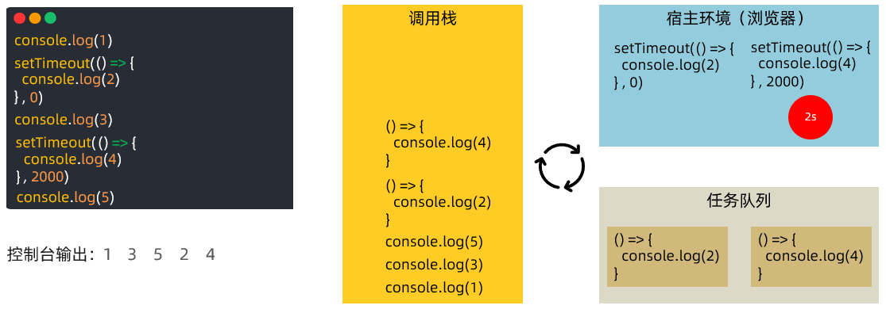
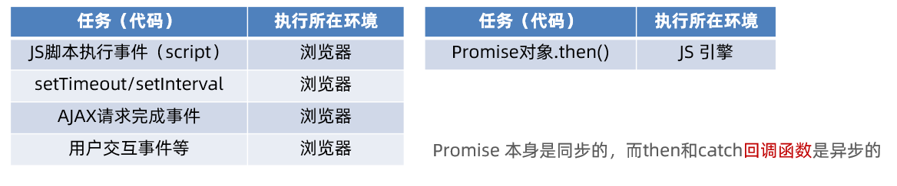
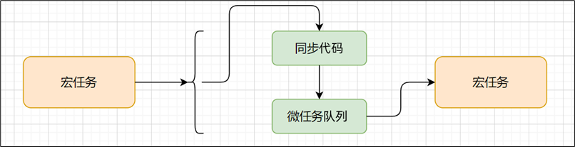
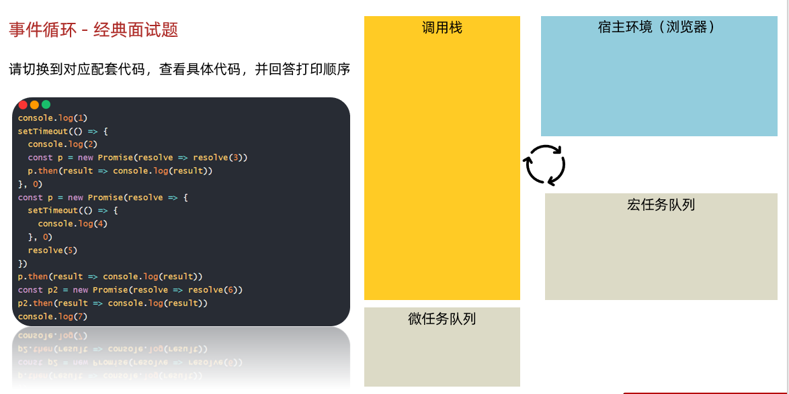
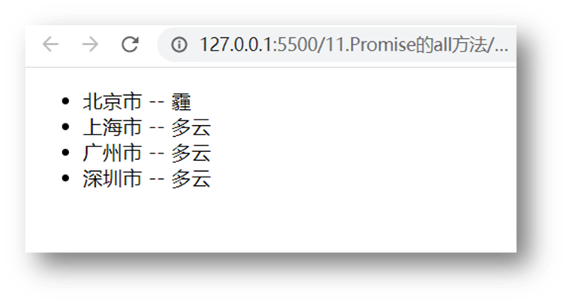

# Day04_AJAX进阶


## 知识点自测

1. 看如下标签回答如下问题？

   ```html
   <select>
       <option value="北京">北京市</option>
       <option value="南京">南京市</option>
       <option value="天津">天津市</option>
   </select>
   ```

   * 当选中第二个 option 时, JS 中获取下拉菜单 select 标签的 value 属性的值是多少?

     <details>
     <summary>答案</summary>
     <ul>
     <li>南京</li>
     </ul>
     </details>

   * 页面上看到的是北京, 还是北京市等？

     <details>
     <summary>答案</summary>
     <ul>
     <li>北京市</li>
     </ul>
     </details>


2. 我给 select 标签的 value 属性赋予"南京"会有什么效果？

   <details>
   <summary>答案</summary>
   <ul>
   <li>什么效果都没有, 没有没有一个option选项的value能匹配</li>
   </ul>
   </details>


## 目录

* 同步代码和异步代码
* 回调函数地狱和 Promise 链式调用
* async 和 await 使用
* 事件循环-EventLoop
* Promise.all 静态方法
* 案例 - 商品分类
* 案例 - 学习反馈


## 学习目标

1. 区分异步代码，回调函数地狱问题和所有解决防范（Promise 链式调用）
1. 掌握 async 和 await 使用
1. 掌握 EventLoop 的概念
1. 了解 Promise.all 静态方法作用
1. 完成省市区切换效果


## 01.同步代码和异步代码

### 目标

能够区分出哪些是异步代码


### 讲解

1. [同步代码]([https://developer.mozilla.org/zh-CN/docs/Learn/JavaScript/Asynchronous/Introducing#%E5%90%8C%E6%AD%A5%E7%BC%96%E7%A8%8B](https://developer.mozilla.org/zh-CN/docs/Learn/JavaScript/Asynchronous/Introducing))：逐行执行，需原地等待结果后，才继续向下执行


2. [异步代码](https://developer.mozilla.org/zh-CN/docs/Learn/JavaScript/Asynchronous/Introducing)：调用后耗时，不阻塞代码继续执行（不必原地等待），在将来完成后触发回调函数传递结果

3. 回答代码打印顺序：发现异步代码接收结果，使用的都是回调函数

   ```js
   const result = 0 + 1
   console.log(result)
   setTimeout(() => {
     console.log(2)
   }, 2000)
   document.querySelector('.btn').addEventListener('click', () => {
     console.log(3)
   })
   document.body.style.backgroundColor = 'pink'
   console.log(4)
   ```

   > 结果：1， 4， 2
   >
   > 按钮点击一次打印一次 3

   


### 小结

1. 什么是同步代码?

   <details>
   <summary>答案</summary>
   <ul>
   <li>逐行执行，原地等待结果后，才继续向下执行</li>
   </ul>
   </details>

2. 什么是异步代码?

   <details>
   <summary>答案</summary>
   <ul>
   <li>调用后耗时，不阻塞代码执行，将来完成后触发回调函数</li>
   </ul>
   </details>

3. JS 中有哪些异步代码?

   <details>
   <summary>答案</summary>
   <ul>
   <li>setTimeout / setInterval，事件，AJAX</li>
   </ul>
   </details>

4. 异步代码如何接收结果?

   <details>
   <summary>答案</summary>
   <ul>
   <li>依靠回调函数来接收</li>
   </ul>
   </details>


## 02.回调函数地狱

### 目标

了解回调函数地狱的概念和缺点


### 讲解

1. 需求：展示默认第一个省，第一个城市，第一个地区在下拉菜单中

   

2. 概念：在回调函数中嵌套回调函数，一直嵌套下去就形成了回调函数地狱

3. 缺点：可读性差，异常无法捕获，耦合性严重，牵一发动全身

   ```js
   axios({ url: 'http://hmajax.itheima.net/api/province' }).then(result => {
     const pname = result.data.list[0]
     document.querySelector('.province').innerHTML = pname
     // 获取第一个省份默认下属的第一个城市名字
     axios({ url: 'http://hmajax.itheima.net/api/city', params: { pname } }).then(result => {
       const cname = result.data.list[0]
       document.querySelector('.city').innerHTML = cname
       // 获取第一个城市默认下属第一个地区名字
       axios({ url: 'http://hmajax.itheima.net/api/area', params: { pname, cname } }).then(result => {
         document.querySelector('.area').innerHTML = result.data.list[0]
       })
     })
   })
   ```


### 小结

1. 什么是回调函数地狱?

   <details>
   <summary>答案</summary>
   <ul>
   <li>在回调函数一直向下嵌套回调函数，形成回调函数地狱</li>
   </ul>
   </details>

2. 回调函数地狱问题?

   <details>
   <summary>答案</summary>
   <ul>
   <li>可读性差，异常捕获困难，耦合性严重</li>
   </ul>
   </details>


## 03.Promise-链式调用

### 目标

了解 Promise 链式调用特点和语法


### 讲解

1. 概念：依靠 then() 方法会返回一个新生成的 Promise 对象特性，继续串联下一环任务，直到结束

2. 细节：then() 回调函数中的返回值，会影响新生成的 Promise 对象最终状态和结果

3. 好处：通过链式调用，解决回调函数嵌套问题

   

4. 按照图解，编写核心代码：

   ```js
   /**
    * 目标：掌握Promise的链式调用
    * 需求：把省市的嵌套结构，改成链式调用的线性结构
   */
   // 1. 创建Promise对象-模拟请求省份名字
   const p = new Promise((resolve, reject) => {
     setTimeout(() => {
       resolve('北京市')
     }, 2000)
   })
   
   // 2. 获取省份名字
   const p2 = p.then(result => {
     console.log(result)
     // 3. 创建Promise对象-模拟请求城市名字
     // return Promise对象最终状态和结果，影响到新的Promise对象
     return new Promise((resolve, reject) => {
       setTimeout(() => {
         resolve(result + '--- 北京')
       }, 2000)
     })
   })
   
   // 4. 获取城市名字
   p2.then(result => {
     console.log(result)
   })
   
   // then()原地的结果是一个新的Promise对象
   console.log(p2 === p)
   ```

   


### 小结

1. 什么是 Promise 的链式调用?

   <details>
   <summary>答案</summary>
   <ul>
   <li>使用 then 方法返回新 Promise 对象特性，一直串联下去</li>
   </ul>
   </details>

2. then 回调函数中，return 的值会传给哪里?

   <details>
   <summary>答案</summary>
   <ul>
   <li>传给 then 方法生成的新 Promise 对象</li>
   </ul>
   </details>

3. Promise 链式调用有什么用?

   <details>
   <summary>答案</summary>
   <ul>
   <li>解决回调函数嵌套问题</li>
   </ul>
   </details>


## 04.Promise-链式调用_解决回调地狱

### 目标

了解 Promise 链式调用解决回调地狱


### 讲解

1. 目标：使用 Promise 链式调用，解决回调函数地狱问题

2. 做法：每个 Promise 对象中管理一个异步任务，用 then 返回 Promise 对象，串联起来

   

3. 按照图解思路，编写核心代码：

   ```js
   /**
    * 目标：把回调函数嵌套代码，改成Promise链式调用结构
    * 需求：获取默认第一个省，第一个市，第一个地区并展示在下拉菜单中
   */
   let pname = ''
   // 1. 得到-获取省份Promise对象
   axios({url: 'http://hmajax.itheima.net/api/province'}).then(result => {
     pname = result.data.list[0]
     document.querySelector('.province').innerHTML = pname
     // 2. 得到-获取城市Promise对象
     return axios({url: 'http://hmajax.itheima.net/api/city', params: { pname }})
   }).then(result => {
     const cname = result.data.list[0]
     document.querySelector('.city').innerHTML = cname
     // 3. 得到-获取地区Promise对象
     return axios({url: 'http://hmajax.itheima.net/api/area', params: { pname, cname }})
   }).then(result => {
     console.log(result)
     const areaName = result.data.list[0]
     document.querySelector('.area').innerHTML = areaName
   })
   ```


### 小结

1. Promise 链式调用如何解决回调函数地狱?

   <details>
   <summary>答案</summary>
   <ul>
   <li>then 的回调函数中 return Promise对象，影响当前新 Promise 对象的值</li>
   </ul>
   </details>


## 05.async 函数和 await

### 目标

掌握 async 和 await 语法来编写简洁的异步代码


### 讲解

1. 概念：在 async 函数内，使用 await 关键字取代 then 函数，等待获取 Promise 对象成功状态的结果值 

2. 做法：使用 async 和 await 解决回调地狱问题

3. 核心代码：

   ```js
   /**
    * 目标：掌握async和await语法，解决回调函数地狱
    * 概念：在async函数内，使用await关键字，获取Promise对象"成功状态"结果值
    * 注意：await必须用在async修饰的函数内（await会阻止"异步函数内"代码继续执行，原地等待结果）
   */
   // 1. 定义async修饰函数
   async function getData() {
     // 2. await等待Promise对象成功的结果
     const pObj = await axios({url: 'http://hmajax.itheima.net/api/province'})
     const pname = pObj.data.list[0]
     const cObj = await axios({url: 'http://hmajax.itheima.net/api/city', params: { pname }})
     const cname = cObj.data.list[0]
     const aObj = await axios({url: 'http://hmajax.itheima.net/api/area', params: { pname, cname }})
     const areaName = aObj.data.list[0]
   
   
     document.querySelector('.province').innerHTML = pname
     document.querySelector('.city').innerHTML = cname
     document.querySelector('.area').innerHTML = areaName
   }
   
   getData()
   ```

   > 使用 await 替代 then 的方法


### 小结

1. await 的作用是什么？

   <details>
   <summary>答案</summary>
   <ul>
   <li>替代 then 方法来提取 Promise 对象成功状态的结果</li>
   </ul>
   </details>


## 06.async 函数和 await 捕获错误

### 目标

了解用 try catch 捕获同步流程的错误


### 讲解

1. try 和 catch 的作用：语句标记要尝试的语句块，并指定一个出现异常时抛出的响应

   ```js
   try {
     // 要执行的代码
   } catch (error) {
     // error 接收的是，错误消息
     // try 里代码，如果有错误，直接进入这里执行
   }
   ```
   
   > try 里有报错的代码，会立刻跳转到 catch 中

2. 尝试把代码中 url 地址写错，运行观察 try catch 的捕获错误信息能力

   ```js
   /**
    * 目标：async和await_错误捕获
   */
   async function getData() {
     // 1. try包裹可能产生错误的代码
     try {
       const pObj = await axios({ url: 'http://hmajax.itheima.net/api/province' })
       const pname = pObj.data.list[0]
       const cObj = await axios({ url: 'http://hmajax.itheima.net/api/city', params: { pname } })
       const cname = cObj.data.list[0]
       const aObj = await axios({ url: 'http://hmajax.itheima.net/api/area', params: { pname, cname } })
       const areaName = aObj.data.list[0]
   
       document.querySelector('.province').innerHTML = pname
       document.querySelector('.city').innerHTML = cname
       document.querySelector('.area').innerHTML = areaName
     } catch (error) {
       // 2. 接着调用catch块，接收错误信息
       // 如果try里某行代码报错后，try中剩余的代码不会执行了
       console.dir(error)
     }
   }
   
   getData()
   ```

   


### 小结

1. try 和 catch 有什么作用？

   <details>
   <summary>答案</summary>
   <ul>
   <li>捕获同步流程的代码报错信息</li>
   </ul>
   </details>


## 07.事件循环

### 目标

掌握事件循环模型是如何执行异步代码的


### 讲解

1. 事件循环（EventLoop）：掌握后知道 JS 是如何安排和运行代码的

   > 请回答下面 2 段代码打印的结果，并说明原因

   ```js
   console.log(1)
   setTimeout(() => {
     console.log(2)
   }, 2000)
   ```

   ```js
   console.log(1)
   setTimeout(() => {
     console.log(2)
   }, 0)
   console.log(3)
   ```

   

2. 作用：事件循环负责执行代码，收集和处理事件以及执行队列中的子任务

3. 原因：JavaScript 单线程（某一刻只能执行一行代码），为了让耗时代码不阻塞其他代码运行，设计了事件循环模型

4. 概念：执行代码和收集异步任务的模型，在调用栈空闲，反复调用任务队列里回调函数的执行机制，就叫事件循环

   ```js
   /**
    * 目标：阅读并回答执行的顺序结果
   */
   console.log(1)
   setTimeout(() => {
     console.log(2)
   }, 0)
   console.log(3)
   setTimeout(() => {
     console.log(4)
   }, 2000)
   console.log(5)
   ```

   > 具体运行过程，请参考 PPT 动画和视频讲解

   


### 小结

1. 什么是事件循环？

   <details>
   <summary>答案</summary>
   <ul>
   <li>执行代码和收集异步任务，在调用栈空闲时，反复调用任务队列里回调函数执行机制
   </li>
   </ul>
   </details>

2. 为什么有事件循环？

   <details>
   <summary>答案</summary>
   <ul>
   <li>JavaScript 是单线程的，为了不阻塞 JS 引擎，设计执行代码的模型
   </li>
   </ul>
   </details>

3. JavaScript 内代码如何执行？

   <details>
   <summary>答案</summary>
   <ul>
   <li> 执行同步代码，遇到异步代码交给宿主浏览器环境执行
    异步有了结果后，把回调函数放入任务队列排队
    当调用栈空闲后，反复调用任务队列里的回调函数
   </li>
   </ul>
   </details>


## 08.事件循环-练习

### 目标

了解事件循环的执行模型


### 讲解

1. 需求：请根据掌握的事件循环的模型概念，分析代码执行过程

   ```js
   /**
    * 目标：阅读并回答执行的顺序结果
   */
   console.log(1)
   setTimeout(() => {
     console.log(2)
   }, 0)
   function myFn() {
     console.log(3)
   }
   function ajaxFn() {
     const xhr = new XMLHttpRequest()
     xhr.open('GET', 'http://hmajax.itheima.net/api/province')
     xhr.addEventListener('loadend', () => {
       console.log(4)
     })
     xhr.send()
   }
   for (let i = 0; i < 1; i++) {
     console.log(5)
   }
   ajaxFn()
   document.addEventListener('click', () => {
     console.log(6)
   })
   myFn()
   ```
   
   
   
   

> 结果：1 5 3 2 4 点击一次document就会执行一次打印6


### 小结

暂无


## 09.宏任务与微任务

### 目标

掌握微任务和宏任务的概念和区分


### 讲解

1. ES6 之后引入了 Promise 对象， 让 JS 引擎也可以发起异步任务

2. 异步任务划分为了

   * 宏任务：由浏览器环境执行的异步代码
   * 微任务：由 JS 引擎环境执行的异步代码

3. 宏任务和微任务具体划分：

   

4. 事件循环模型

   > 具体运行效果，参考 PPT 动画或者视频

   ```js
   /**
    * 目标：阅读并回答打印的执行顺序
   */
   console.log(1)
   setTimeout(() => {
     console.log(2)
   }, 0)
   const p = new Promise((resolve, reject) => {
     resolve(3)
   })
   p.then(res => {
     console.log(res)
   })
   console.log(4)
   ```

   

   


> 注意：宏任务每次在执行同步代码时，产生微任务队列，清空微任务队列任务后，微任务队列空间释放！
>
> 下一次宏任务执行时，遇到微任务代码，才会再次申请微任务队列空间放入回调函数消息排队
>
> 总结：一个宏任务包含微任务队列，他们之间是包含关系，不是并列关系


### 小结

1. 什么是宏任务？

   <details>
   <summary>答案</summary>
   <ul>
   <li>浏览器执行的异步代码
    例如：JS 执行脚本事件，setTimeout/setInterval，AJAX请求完成事件，用户交互事件等
   </li>
   </ul>
   </details>

2. 什么是微任务？

   <details>
   <summary>答案</summary>
   <ul>
   <li>JS 引擎执行的异步代码
    例如：Promise对象.then()的回调
   </li>
   </ul>
   </details>

3. JavaScript 内代码如何执行？

   <details>
   <summary>答案</summary>
   <ul>
   <li>  执行第一个 script 脚本事件宏任务，里面同步代码
    遇到 宏任务/微任务 交给宿主环境，有结果回调函数进入对应队列
    当执行栈空闲时，清空微任务队列，再执行下一个宏任务，从1再来
   </li>
   </ul>
   </details>




## 10.事件循环 - 经典面试题

### 目标

锻炼事件循环模型的使用


### 讲解

1. 需求：请切换到对应配套代码，查看具体代码，并回答打印顺序（锻炼事件循环概念的理解，阅读代码执行顺序_）

   ```js
   // 目标：回答代码执行顺序
   console.log(1)
   setTimeout(() => {
     console.log(2)
     const p = new Promise(resolve => resolve(3))
     p.then(result => console.log(result))
   }, 0)
   const p = new Promise(resolve => {
     setTimeout(() => {
       console.log(4)
     }, 0)
     resolve(5)
   })
   p.then(result => console.log(result))
   const p2 = new Promise(resolve => resolve(6))
   p2.then(result => console.log(result))
   console.log(7)
   ```
   
   
   
   


### 小结

暂无


## 11.Promise.all 静态方法

### 目标

了解 Promise.all 作用和使用场景


### 讲解

1. 概念：合并多个 Promise 对象，等待所有同时成功完成（或某一个失败），做后续逻辑

   

2. 语法：

   ```js
   const p = Promise.all([Promise对象, Promise对象, ...])
   p.then(result => {
     // result 结果: [Promise对象成功结果, Promise对象成功结果, ...]
   }).catch(error => {
     // 第一个失败的 Promise 对象，抛出的异常对象
   })
   ```


3. 需求：同时请求“北京”，“上海”，“广州”，“深圳”的天气并在网页尽可能同时显示

   

4. 核心代码如下：

   ```html
   <!DOCTYPE html>
   <html lang="en">
   
   <head>
     <meta charset="UTF-8">
     <meta http-equiv="X-UA-Compatible" content="IE=edge">
     <meta name="viewport" content="width=device-width, initial-scale=1.0">
     <title>Promise的all方法</title>
   </head>
   
   <body>
     <ul class="my-ul"></ul>
     <script src="https://cdn.jsdelivr.net/npm/axios/dist/axios.min.js"></script>
     <script>
       /**
        * 目标：掌握Promise的all方法作用，和使用场景
        * 业务：当我需要同一时间显示多个请求的结果时，就要把多请求合并
        * 例如：默认显示"北京", "上海", "广州", "深圳"的天气在首页查看
        * code：
        * 北京-110100
        * 上海-310100
        * 广州-440100
        * 深圳-440300
       */
       // 1. 请求城市天气，得到Promise对象
       const bjPromise = axios({ url: 'http://hmajax.itheima.net/api/weather', params: { city: '110100' } })
       const shPromise = axios({ url: 'http://hmajax.itheima.net/api/weather', params: { city: '310100' } })
       const gzPromise = axios({ url: 'http://hmajax.itheima.net/api/weather', params: { city: '440100' } })
       const szPromise = axios({ url: 'http://hmajax.itheima.net/api/weather', params: { city: '440300' } })
   
       // 2. 使用Promise.all，合并多个Promise对象
       const p = Promise.all([bjPromise, shPromise, gzPromise, szPromise])
       p.then(result => {
         // 注意：结果数组顺序和合并时顺序是一致
         console.log(result)
         const htmlStr = result.map(item => {
           return `<li>${item.data.data.area} --- ${item.data.data.weather}</li>`
         }).join('')
         document.querySelector('.my-ul').innerHTML = htmlStr
       }).catch(error => {
         console.dir(error)
       })
     </script>
   </body>
   
   </html>
   ```


### 小结

1. Promise.all 什么时候使用？

   <details>
   <summary>答案</summary>
   <ul>
   <li>合并多个 Promise 对象并等待所有同时成功的结果，如果有一个报错就会最终为失败状态，当需要同时渲染多个接口数据同时到网页上时使用
   </li>
   </ul>
   </details>


## 12.案例-商品分类

### 目标

完成商品分类效果


### 讲解

1. 需求：尽可能同时展示所有商品分类到页面上

   

2. 步骤：

   1. 获取所有的一级分类数据

   2. 遍历id，创建获取二级分类请求

   3. 合并所有二级分类Promise对象

   4. 等待同时成功，开始渲染页面

3. 核心代码：

   ```js
   /**
    * 目标：把所有商品分类“同时”渲染到页面上
    *  1. 获取所有一级分类数据
    *  2. 遍历id，创建获取二级分类请求
    *  3. 合并所有二级分类Promise对象
    *  4. 等待同时成功后，渲染页面
   */
   // 1. 获取所有一级分类数据
   axios({
     url: 'http://hmajax.itheima.net/api/category/top'
   }).then(result => {
     console.log(result)
     // 2. 遍历id，创建获取二级分类请求
     const secPromiseList = result.data.data.map(item => {
       return axios({
         url: 'http://hmajax.itheima.net/api/category/sub',
         params: {
           id: item.id // 一级分类id
         }
       })
     })
     console.log(secPromiseList) // [二级分类请求Promise对象，二级分类请求Promise对象，...]
     // 3. 合并所有二级分类Promise对象
     const p = Promise.all(secPromiseList)
     p.then(result => {
       console.log(result)
       // 4. 等待同时成功后，渲染页面
       const htmlStr = result.map(item => {
         const dataObj = item.data.data // 取出关键数据对象
         return `<div class="item">
       <h3>${dataObj.name}</h3>
       <ul>
         ${dataObj.children.map(item => {
           return `<li>
           <a href="javascript:;">
             
             <p>${item.name}</p>
           </a>
         </li>`
         }).join('')}
       </ul>
     </div>`
       }).join('')
       console.log(htmlStr)
       document.querySelector('.sub-list').innerHTML = htmlStr
     })
   })
   ```


### 小结

暂无


## 13.案例-学习反馈-省市区切换

### 目标

完成省市区切换效果


### 讲解

1. 需求：完成省市区切换效果

   

2. 步骤：

   1. 设置省份数据到下拉菜单

   2. 切换省份，设置城市数据到下拉菜单，并清空地区下拉菜单

   3. 切换城市，设置地区数据到下拉菜单

3. 核心代码：

   ```js
   /**
    * 目标1：完成省市区下拉列表切换
    *  1.1 设置省份下拉菜单数据
    *  1.2 切换省份，设置城市下拉菜单数据，清空地区下拉菜单
    *  1.3 切换城市，设置地区下拉菜单数据
    */
   // 1.1 设置省份下拉菜单数据
   axios({
     url: 'http://hmajax.itheima.net/api/province'
   }).then(result => {
     const optionStr = result.data.list.map(pname => `<option value="${pname}">${pname}</option>`).join('')
     document.querySelector('.province').innerHTML = `<option value="">省份</option>` + optionStr
   })
   
   // 1.2 切换省份，设置城市下拉菜单数据，清空地区下拉菜单
   document.querySelector('.province').addEventListener('change', async e => {
     // 获取用户选择省份名字
     // console.log(e.target.value)
     const result = await axios({ url: 'http://hmajax.itheima.net/api/city', params: { pname: e.target.value } })
     const optionStr = result.data.list.map(cname => `<option value="${cname}">${cname}</option>`).join('')
     // 把默认城市选项+下属城市数据插入select中
     document.querySelector('.city').innerHTML = `<option value="">城市</option>` + optionStr
   
     // 清空地区数据
     document.querySelector('.area').innerHTML = `<option value="">地区</option>`
   })
   
   // 1.3 切换城市，设置地区下拉菜单数据
   document.querySelector('.city').addEventListener('change', async e => {
     console.log(e.target.value)
     const result = await axios({url: 'http://hmajax.itheima.net/api/area', params: {
       pname: document.querySelector('.province').value,
       cname: e.target.value
     }})
     console.log(result)
     const optionStr = result.data.list.map(aname => `<option value="${aname}">${aname}</option>`).join('')
     console.log(optionStr)
     document.querySelector('.area').innerHTML = `<option value="">地区</option>` + optionStr
   })
   ```

   

### 小结

暂无


## 14.案例-学习反馈-数据提交

### 目标

完成学习反馈数据提交


### 讲解

1. 需求：收集学习反馈数据，提交保存

   

2. 步骤：

   1. 监听提交按钮的点击事件

   2. 依靠插件收集表单数据

   3. 基于 axios 提交保存，显示结果

3. 核心代码如下：

   ```js
   /**
    * 目标2：收集数据提交保存
    *  2.1 监听提交的点击事件
    *  2.2 依靠插件收集表单数据
    *  2.3 基于axios提交保存，显示结果
    */
   // 2.1 监听提交的点击事件
   document.querySelector('.submit').addEventListener('click', async () => {
     // 2.2 依靠插件收集表单数据
     const form = document.querySelector('.info-form')
     const data = serialize(form, { hash: true, empty: true })
     console.log(data)
     // 2.3 基于axios提交保存，显示结果
     try {
       const result = await axios({
         url: 'http://hmajax.itheima.net/api/feedback',
         method: 'POST',
         data
       })
       console.log(result)
       alert(result.data.message)
     } catch (error) {
       console.dir(error)
       alert(error.response.data.message)
     }
   })
   ```

   

### 小结

暂无


## 今日重点(必须会)

1. 掌握 async 和 await 的使用

2. 理解 EventLoop 和宏任务微任务执行顺序

3. 了解 Promise.all 的作用和使用场景

4. 完成案例-学习反馈

   

## 今日作业(必完成)

参考作业文件夹里md文档的要求


## 参考文献

1. [async和await的mdn讲解](https://developer.mozilla.org/zh-CN/docs/Web/JavaScript/Reference/Statements/async_function#%E5%B0%9D%E8%AF%95%E4%B8%80%E4%B8%8B)