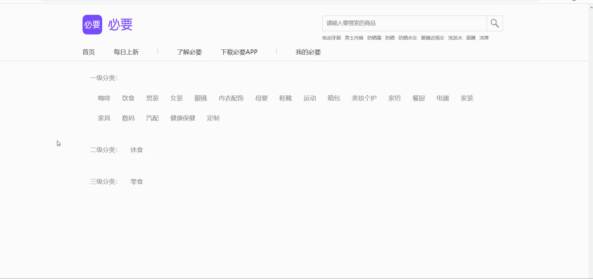

# Day02_AJAX综合案例

## 客观题

* 参考客观题目录下的excel

* 在线直接答题：https://ks.wjx.top/vm/tUvNXZ1.aspx# 

  > ps：本测试链接来自问卷星，请不要轻信问卷星广告！

## 主观题

### 作业1 - 必要商城分类

目标：完成如下分类切换效果

要求：

1. 默认上来展示所有一级分类数据
2. 点击一级分类切换，展示下属二级分类数据
3. 点击二级分类分类，展示下属三级分类数据

接口文档：https://apifox.com/apidoc/shared-1b0dd84f-faa8-435d-b355-5a8a329e34a8/api-82668107

效果如下：配套标签和样式在文件夹内

## 排错题

配套文件夹内的《案例-更换背景》里面有 6 处错误，请帮帮这位同学实现更换网站背景的效果吧

## 面试题(自行扩展)

### 1. 数组的常用方法有哪些?

> 梳理建议, 说几个常用的即可, 回想下平时写代码常用的以及他们的功能和场景说出即可

详细参考[文档](https://lamphc.github.io/fe-up/#/JavaScript/array_api?id=%e9%9d%a2%e8%af%95%e5%ae%98%ef%bc%9a%e6%95%b0%e7%bb%84%e7%9a%84%e5%b8%b8%e7%94%a8%e6%96%b9%e6%b3%95%e6%9c%89%e5%93%aa%e4%ba%9b%ef%bc%9f) 

### 2. 请回答\==和\===的区别?

详情参考[文档](https://lamphc.github.io/fe-up/#/JavaScript/%E9%9A%90%E5%BC%8F%E8%BD%AC%E6%8D%A2?id=%e9%9d%a2%e8%af%95%e5%ae%98%ef%bc%9a-%e5%92%8c-%e5%8c%ba%e5%88%ab%ef%bc%8c%e5%88%86%e5%88%ab%e5%9c%a8%e4%bb%80%e4%b9%88%e6%83%85%e5%86%b5%e4%bd%bf%e7%94%a8)

### 3. 回流和重绘是什么?

详情参考[文档](https://lamphc.github.io/fe-up/#/css/layout_painting?id=%e9%9d%a2%e8%af%95%e5%ae%98%ef%bc%9a%e6%80%8e%e4%b9%88%e7%90%86%e8%a7%a3%e5%9b%9e%e6%b5%81%e8%b7%9f%e9%87%8d%e7%bb%98%ef%bc%9f%e4%bb%80%e4%b9%88%e5%9c%ba%e6%99%af%e4%b8%8b%e4%bc%9a%e8%a7%a6%e5%8f%91%ef%bc%9f)

