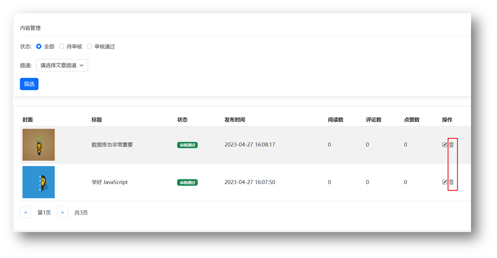

# 黑马头条-数据管理平台

## 01.项目介绍

### 目标

介绍我们要做的项目，为何做，以及怎么做

### 讲解

黑马头条-数据管理平台：对IT资讯移动网站的数据，进行数据管理

数据管理平台-演示：配套代码在本地运行

移动网站-演示： [http://](http://geek.itheima.net/)[geek.itheima.net](http://geek.itheima.net/)[/](http://geek.itheima.net/)


功能：

1.登录和权限判断

2.查看文章内容列表（筛选，分页）

3.编辑文章（数据回显）

4.删除文章

5.发布文章（图片上传，富文本编辑器）


### 小结

1. 黑马头条-数据管理平台，是什么样网站，要完成哪些功能？

   <details	>
   <summary>答案</summary>
   <ul>
   <li>数据管理网站，登录后对数据进行增删改查</li>
   </ul>
   </details>


2. 数据管理平台，未登录能否管理数据？

   <details	>
   <summary>答案</summary>
   <ul>
   <li>不能，数据是公司内部的，需账号登录后管理</li>
   </ul>
   </details>


## 02.项目准备

### 目标

了解项目需要准备哪些内容

### 讲解

技术：

基于 Bootstrap 搭建网站标签和样式

集成 wangEditor 插件实现富文本编辑器

使用原生 JS 完成增删改查等业务

基于 axios 与黑马头条线上接口交互

使用 axios 拦截器进行权限判断


项目准备：准备配套的素材代码

包含：html，css，js，静态图片，第三方插件等等


目录管理：建议这样管理，方便查找

assets：资源文件夹（图片，字体等）

lib：资料文件夹（第三方插件，例如：form-serialize）

page：页面文件夹

utils：实用程序文件夹（工具插件）


### 小结

1. 为什么要按照一定的结构，管理代码文件？

   <details	>
   <summary>答案</summary>
   <ul>
   <li>方便以后的查找和扩展</li>
   </ul>
   </details>


## 03.验证码登录

### 目标

完成验证码登录，后端设置验证码默认为 246810

### 讲解

原因：因为短信接口不是免费的，防止攻击者恶意盗刷

步骤：

1.在 utils/request.js 配置 axios 请求基地址

作用：提取公共前缀地址，配置后 axios 请求时都会 baseURL + url

```js
axios.defaults.baseURL = 'http://geek.itheima.net'
```


2.收集手机号和验证码数据

3.基于 axios 调用验证码登录接口

4.使用 Bootstrap 的 Alert 警告框反馈结果给用户


### 小结

暂无


## 04.验证码登录流程

### 目标

了解验证码登录的流程

### 讲解

手机号+验证码，登录流程：


### 小结

1. 请回答验证码登录的完整流程


## 05.token 的介绍

### 目标

了解前后端分离项目中 token 的作用

### 讲解

概念：访问权限的令牌，本质上是一串字符串

创建：正确登录后，由后端签发并返回

作用：判断是否有登录状态等，控制访问权限

注意：前端只能判断 token 有无，而后端才能判断 token 的有效性


目标：只有登录状态，才可以访问内容页面

步骤：

1.在 utils/auth.js 中判断无 token 令牌字符串，则强制跳转到登录页（手动修改地址栏测试）

2.在登录成功后，保存 token 令牌字符串到本地，再跳转到首页（手动修改地址栏测试）

```js
const token = localStorage.getItem('token')
// 没有 token 令牌字符串，则强制跳转登录页
if (!token) {
  location.href = '../login/index.html'
}
```


### 小结

1. token 的作用？

   <details	>
   <summary>答案</summary>
   <ul>
   <li>判断用户是否有登录状态等</li>
   </ul>
   </details>


2. token 的注意：

前端只能判断 token 的有无

后端通过解密可以提取 token 字符串的原始信息，判断有效性


## 06.个人信息设置和 axios 请求拦截器

### 目标

了解 axios 请求拦截器的概念和使用场景

### 讲解

需求：设置用户昵称

语法：axios 可以在 headers 选项传递请求头参数

问题：很多接口，都需要携带 token 令牌字符串

解决：在[请求拦截器](https://www.axios-http.cn/docs/interceptors)统一设置公共 headers 选项


对应代码：

```js
axios({
  url: '目标资源地址',
  headers: {
    Authorization: `Bearer ${localStorage.getItem('token')}`
  }
})
```

```js
axios.interceptors.request.use(function (config) {
  // 在发送请求之前做些什么
  return config
}, function (error) {
  // 对请求错误做些什么
  return Promise.reject(error)
})
```

```js
axios({
  // 个人信息
  url: '/v1_0/user/profile'
}).then(result => {
  // result：服务器响应数据对象
}).catch(error => {
    
})
```

```js
axios.interceptors.request.use(function (config) {
  const token = location.getItem('token')  
  token && config.headers.Authorization = `Bearer ${token}`
  // 在发送请求之前做些什么
  return config
}, function (error) {
  // 对请求错误做些什么
  return Promise.reject(error)
})
```


### 小结

1. 什么是 axios 请求拦截器？

   <details	>
   <summary>答案</summary>
   <ul>
   <li>发起请求之前，调用的一个函数，对请求参数进行设置</li>
   </ul>
   </details>


2. axios 请求拦截器，什么时候使用？

   <details	>
   <summary>答案</summary>
   <ul>
   <li>有公共配置和设置时，统一设置在请求拦截器中</li>
   </ul>
   </details>


## 07. axios 响应拦截器和身份验证失败

### 目标

了解 axios 响应拦截器的概念和使用场景，以及身份验证失败的场景流程和判断使用

### 讲解

axios 响应拦截器：响应回到 then/catch 之前，触发的拦截函数，对响应结果统一处理

例如：身份验证失败，统一判断并做处理


```js
axios.interceptors.response.use(function (response) {
  // 2xx 范围内的状态码都会触发该函数。
  return result;
}, function (error) {
  // 超出 2xx 范围的状态码都会触发该函数。
  // 对响应错误做点什么，例如：判断响应状态为 401 代表身份验证失败
  if (error?.response?.status === 401) {
    alert('登录状态过期，请重新登录')
    window.location.href = '../login/index.html'
  }
  return Promise.reject(error);
});
```


### 小结

1. 什么是 axios 响应拦截器？

   <details	>
   <summary>答案</summary>
   <ul>
   <li>响应回到 then/catch 之前，触发的拦截函数，对响应结果统一处理</li>
   </ul>
   </details>


2. axios 响应拦截器，什么时候触发成功/失败的回调函数？

   <details	>
   <summary>答案</summary>
   <ul>
   <li>状态为 2xx 触发成功回调，其他则触发失败的回调函数</li>
   </ul>
   </details>


## 08.优化 axios 响应结果

### 目标

axios 直接接收服务器返回的响应结果

### 讲解

思路：其实就是在响应拦截器里，response.data 把后台返回的数据直接取出来统一返回给所有使用这个 axios 函数的逻辑页面位置的 then 的形参上

好处：可以让逻辑页面少点一层 data 就能拿到后端返回的真正数据对象


对应代码如下：

```js
axios.interceptors.response.use(function (response) {
  // 2xx 范围内的状态码都会触发该函数。
  // 对响应数据做点什么，例如：直接返回服务器的响应结果对象
  const result = response.data
  return result;
}, function (error) {
  // 超出 2xx 范围的状态码都会触发该函数。
  // 对响应错误做点什么，例如：判断响应状态为 401 代表身份验证失败
  if (error?.response?.status === 401) {
    alert('登录状态过期，请重新登录')
    window.location.href = '../login/index.html'
  }
  return Promise.reject(error);
});
```


### 小结

暂无


## 09.发布文章-富文本编辑器

### 目标

了解富文本编辑器的概念，以及如何在前端网页中使用

### 讲解

富文本：带样式，多格式的文本，在前端一般使用标签配合内联样式实现

富文本编辑器：用于编写富文本内容的容器


目标：发布文章页，富文本编辑器的集成

使用：wangEditor 插件

[步骤](https://www.wangeditor.com/v5/getting-started.html)：参考文档

1.引入 CSS 定义样式

2.定义 HTML 结构

3.引入 JS 创建编辑器

4.监听内容改变，保存在隐藏文本域（便于后期收集）

### 小结

暂无


## 10.发布文章-频道列表

### 目标

展示频道列表，供用户选择

### 讲解

步骤：

1. 获取频道列表数据
2. 展示到下拉菜单中


### 小结

暂无


## 11.发布文章-封面设置

### 目标

文章封面的设置

### 讲解

步骤：

1. 准备标签结构和样式
2. 选择文件并保存在 FormData
3. 单独上传图片并得到图片 URL 地址
4. 回显并切换 img 标签展示（隐藏 + 号上传标签）

注意：图片地址临时存储在 img 标签上，并未和文章关联保存


### 小结

暂无


## 12.发布文章-收集并保存

### 目标

收集文章内容，并提交保存

### 讲解

步骤：

1. 基于 form-serialize 插件收集表单数据对象
2. 基于 axios 提交到服务器保存
3. 调用 Alert 警告框反馈结果给用户
4. 重置表单并跳转到列表页


### 小结

暂无


## 13.内容管理-文章列表展示

### 目标

获取文章列表并展示

### 讲解

步骤：

1. 准备查询参数对象 
2. 获取文章列表数据
3. 展示到指定的标签结构中


```js
const queryObj = {
  status: '', // 筛选状态
  channel_id: '', // 频道id
  page: 1, // 当前页码
  per_page: 2 // 每页条数
}
let totalCount = 0 // 总条数
```

### 小结

暂无


## 14.内容管理-筛选功能

### 目标

根据筛选条件，获取匹配数据展示

### 讲解

步骤：

1.设置频道列表数据

2.监听筛选条件改变，保存查询信息到查询参数对象

3.点击筛选时，传递查询参数对象到服务器

4.获取匹配数据，覆盖到页面展示


### 小结

暂无


## 15.内容管理-分页功能

### 目标

完成文章列表，分页管理功能

### 讲解

步骤：

1.保存并设置文章总条数

2.点击下一页，做临界值判断，并切换页码参数请求最新数据

3.点击上一页，做临界值判断，并切换页码参数请求最新数据


### 小结

暂无


## 16.内容管理-删除功能

### 目标

完成删除文章功能

### 讲解

步骤：

1. 关联文章 id 到删除图标
2. 点击删除时，获取文章 id
3. 调用删除接口，传递文章 id 到服务器
4. 重新获取文章列表，并覆盖展示



### 小结

暂无


## 17.内容管理-删除最后一条

### 目标

在删除最后一页，最后一条时有 Bug

### 讲解

解决：

1. 删除成功时，判断 DOM 元素只剩一条，让当前页码 page--
2. 注意，当前页码为 1 时不能继续向前翻页
3. 重新设置页码数，获取最新列表展示


### 小结

暂无


## 18.内容管理-编辑文章-回显

### 目标

编辑文章时，回显数据到表单

### 讲解

步骤：

1. 页面跳转传参（URL 查询参数方式）
2. 发布文章页面接收参数判断（共用同一套表单）
3. 修改标题和按钮文字
4. 获取文章详情数据并回显表单


对应代码：

```js
const params = `?id=1001&name=xiaoli`
// 查询参数字符串 => 查询参数对象
const result = new URLSearchParams(params)
// 需要遍历使用
result.forEach((value, key) => { 
  console.log(value, key)
  // 1001 id
  // xiaoli name
})
```


### 小结

暂无


## 19.内容管理-编辑文章-保存

### 目标

确认修改，保存文章到服务器

### 讲解

步骤：

1. 判断按钮文字，区分业务（因为共用一套表单）
2. 调用编辑文章接口，保存信息到服务器
3. 基于 Alert 反馈结果消息给用户


### 小结

暂无


## 20.退出登录

### 目标

完成退出登录效果

### 讲解

步骤：

1.绑定点击事件

2.清空本地缓存，跳转到登录页面


### 小结

暂无


