# 目标

- 能够写出列表页 
- 能够写出注册页
- 能够把品优购网站部署到本地服务器
- 能够把品优购网站上传到远程服务器

# 品优购项目

## 首页制作

### main 主体模块制作

以前书写的就是模块化中的公共部分。

**main** 主体模块是 **index** 里面专有的，注意需要新的样式文件 **index.css**

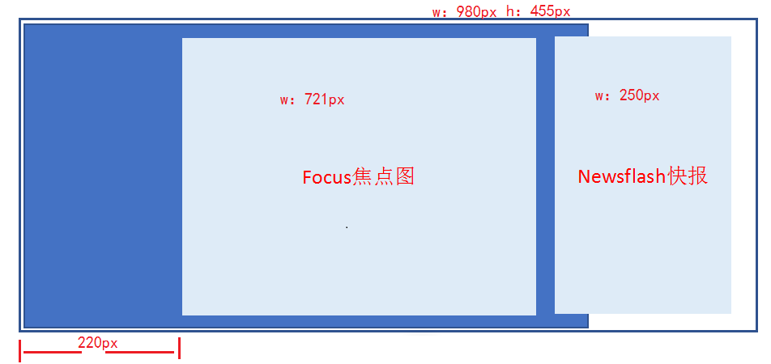 

-  main 盒子宽度为 980 像素，高度是455像素，位置距离左边 220px (margin-left ) ，给高度就不用清除浮动

- main 里面包含左侧盒子，宽度为 721像素，左浮动，focus 焦点图模块

- main 里面包含右侧盒子，宽度为 250像素，右浮动，newsflash 新闻快报模块

  **结构代码**

  ```html
  <div class="w">
      <div class="main">
          <div class="focus">
              ...
          </div>
          <div class="newsflash">
              ...
          </div>
      </div>
  </div>
  ```

  **样式代码**

  ```css
  .main {
      width: 980px;
      height: 455px;
      margin-left: 220px;
      margin-top: 10px;
  }
  .focus {
      float: left;
      width: 721px;
      height: 455px;
      background-color: purple;
  }
  .newsflash {
      float: right;
      width: 250px;
      height: 455px;
  }
  ```

#### 左侧 focus 模块制作

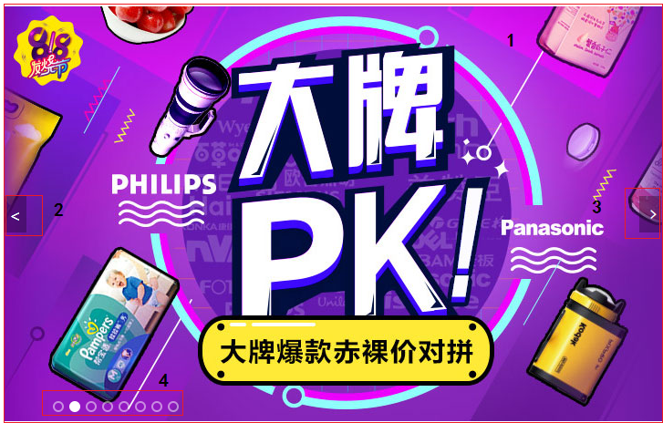

- 大的 focus 盒子  包裹 1 号展示图片的盒子，2号 3号 左右箭头的盒子，4号 小圆点的盒子

  ```html
  <div class="focus fl">
  	<a href="#" class="arrow-l"> < </a>
  	<a href="#" class="arrow-r"> > </a>
  	<ul>
  		<li>
  		  <a href="#"></a>
  		</li>
  	</ul>
  	<ol class="circle">
  		<li></li>
  		<li class="current"></li>
  		<li></li>
  		<li></li>
  		<li></li>
  		<li></li>
  		<li></li>
  		<li></li>
  	</ol>
  </div>
  ```

-  包裹 1 号盒子（`ul > li > a > img`），轮播图这样的布局是为了后面方便配置`js`逻辑代码

  

- 2 号盒子 跟 3 号盒子 左右箭头，利用定位的方式来实现

  **样式代码**

  ```css
  .arrow-l,
  .arrow-r {
  	position: absolute;
  	top: 50%;
  	margin-top: -20px;
  	width: 24px;
  	height: 40px;
  	background: rgba(0, 0, 0, .3);
  	text-align: center;
  	line-height: 40px;
  	color: #fff;
  	font-family: 'icomoon';
  	font-size: 18px;
  }
  .arrow-r {
  	right: 0;
  }
  ```

- 4 号盒子 里面放 小圆点 （`ol > li`）

  - 小圆圈利用边框实现
  - 小圆点里面背景颜色来实现

  **样式代码**

  ```css
  .circle {
  	position: absolute;
  	bottom: 10px;
  	left: 50px;
  }
  .circle li {
  	float: left;
  	width: 8px;
  	height: 8px;
  	/*background-color: #fff;*/
  	border: 2px solid rgba(255, 255, 255, 0.5);
  	margin: 0 3px;
  	border-radius: 50%;
  	/*鼠标经过显示小手*/
  	cursor: pointer;
  
  }
  .current {
  	background-color: #fff;
  	box-shadow: 
  }
  ```

#### 右侧 newsflash 模块制作

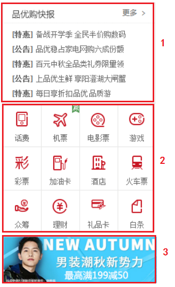

- 右侧的模块 分为上中下三个盒子

  **结构代码**

  ```html
  <div class="newsflash">
      <div class="news">
          ...
      </div>
      <div class="lifeservice">
          ...
      </div>
      <div class="bargain">
          ...
      </div>
  </div>
  ```

- 1 号盒子为 `news` 新闻模块  高度为 165px

  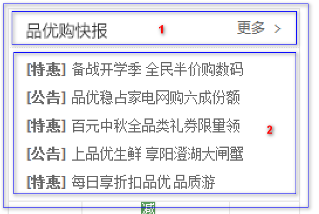

  - 分为上下两个结构，但是两个模块都用 div，上面是 `news-hd`，下面是 `news-bd`

    **结构代码**

    ```html
    <div class="news">
        <div class="news-hd">
            ...
        </div>
        <div class="news-bd">
            ...
        </div>
    </div>
    ```

    **样式代码**

    ```css
    .news {
       height: 165px;
       border: 1px solid #e4e4e4;
    }
    ```

  - 上面是`news-hd`，设置高度是 33px，设置下边框

    - 里面放一个`h5` 标题
    - 放一个a`标签`，内容是 更多，然后让 `a` 进行右浮动，三角用伪元素设置字体图标就好

    **结构代码**

    ```html
    <div class="news-hd">
        <h5>品优购快报</h5>
        <a href="#" class="more">更多</a>
    </div>
    ```

    **样式代码**

    ```css
    .news-hd {
        height: 33px;
        line-height: 33px;
        border-bottom: 1px dotted #e4e4e4;
        padding: 0 15px;
    }
    .news-hd h5 {
        float: left;
        font-size: 14px;
    }
    .news-hd .more {
        float: right;
    }
    .news-hd .more::after {
        font-family: 'icomoon';
        content: '\e920';
    }
    ```

  - 下面是`news-bd`

    - 里面包含 `ul` 和 `li` 还有链接
    - 给`li`设置高度，24px，设置单行文字溢出省略： 1. 设置 `overflow: hidden;` 2.设置 `white-space: nowrap;` 3. 设置 `text-overflow: ellipsis;`

    **结构代码**

    ```html
    <div class="news-bd">
        <ul>
            <li><a href="#"><strong>[重磅]</strong> 它来了它来了，pink老师走来了, 它是谁？</a></li>
            <li><a href="#"><strong>[重磅]</strong> 它来了它来了，pink老师走来了</a></li>
            <li><a href="#"><strong>[重磅]</strong> 它来了它来了，pink老师走来了</a></li>
            <li><a href="#"><strong>[重磅]</strong> 它来了它来了，pink老师走来了</a></li>
            <li><a href="#"><strong>[重磅]</strong> 它来了它来了，pink老师走来了, 它是谁？</a></li>
        </ul>
    </div>
    ```

    **样式代码**

    ```css
    .news-bd {
        padding: 5px 15px 0;
    }
    .news-bd ul li {
        height: 24px;
        line-height: 24px;
        overflow: hidden;
        white-space: nowrap;
        text-overflow: ellipsis;
    }
    ```

- 2 号盒子为 `lifeservice` 生活服务模块  高度为 209px

  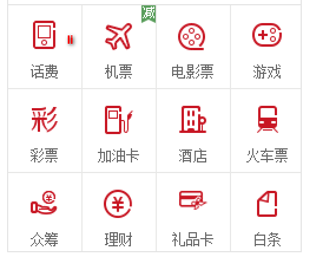

  - 设置边框（左右下 边框）
  - 里面的内容 是  `ul > 12*li`，给`li`设置宽 63px，高71px，设置 右边和下边的边框，设置浮动
  - 这样设置后，第四个li会装不开，掉下来，解决办法如下
    - `lifeservice` 盒子宽度为 250 ，但是装不开里面的 4 个小 li 
    - 可以让 `lifeservice` 里面的 `ul` 宽度为 252，就可以装的下 4 个 小 li
    - `lifeservice` 盒子 overflow 隐藏多余的部分就可以了
  - 在 `li` 里面放一个 `i`（里面放图标），下面的文本用  `p` 标签包裹
  - 给 `i` 设置 24px宽和28px的高（注意 `i` 是行内元素， 转成行内块），给 `li` 设置 `text-align:center` 让里面内容居中显示

  **结构代码**

  ```html
  <div class="lifeservice">
      <ul>
          <li>
              <i></i>
              <p>话费</p>
          </li>
          <li>
              <i></i>
              <p>话费</p>
          </li>
          <li>
              <i></i>
              <p>话费</p>
          </li>
          <li>
              <i></i>
              <p>话费</p>
          </li>
          <li>
              <i></i>
              <p>话费</p>
          </li>
          <li>
              <i></i>
              <p>话费</p>
          </li>
          <li>
              <i></i>
              <p>话费</p>
          </li>
          <li>
              <i></i>
              <p>话费</p>
          </li>
          <li>
              <i></i>
              <p>话费</p>
          </li>
          <li>
              <i></i>
              <p>话费</p>
          </li>
          <li>
              <i></i>
              <p>话费</p>
          </li>
          <li>
              <i></i>
              <p>话费</p>
          </li>
      </ul>
  </div>
  ```

  **样式代码**

  ```css
  .lifeservice {
      overflow: hidden;
      height: 209px;
      /* background-color: purple; */
      border: 1px solid #e4e4e4;
      border-top: 0;
  }
  .lifeservice ul {
      width: 252px;
  }
  .lifeservice ul li {
      float: left;
      width: 63px;
      height: 71px;
      border-right: 1px solid #e4e4e4;
      border-bottom: 1px solid #e4e4e4;
      text-align: center;
  }
  .lifeservice ul li i {
      display: inline-block;
      width: 24px;
      height: 28px;
      background-color: pink;
      margin-top: 12px;
      background: url(../images/icons.png) no-repeat -19px -15px;
  }
  ```

- 3 号盒子为 `bargain` 特价商品  

  - 这个比较简单，直接插入一张图片即可

  **结构代码**

  ```html
  <div class="bargain">
      
  </div>
  ```

  **样式代码**

  ```css
  .bargain {
      margin-top: 5px;
  }
  ```

### 推荐模块制作 -- `recom`

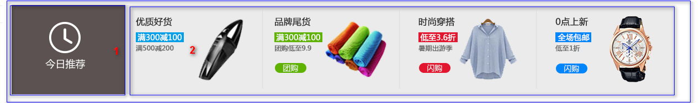

- 大盒子 `recom`  推荐模块   recommend

  - 给这个 `recom` 大盒子 设置版心，设置 163px的高，背景颜色（`#ebebeb`），设置距离上边 12px

  **结构代码**

  ```html
  <div class="w recom">
      ...
  </div>
  ```

  **样式代码**

  ```css
  .recom {
      height: 163px;
      background-color: #ebebeb;
      margin-top: 12px;
  }
  ```

- 里面包含 2 个盒子， 浮动即可

  **结构代码**

  ```html
   <div class="w recom">
      <div class="recom_hd">
          ...
      </div>
      <div class="recom_bd">
          ...
      </div>
  </div>
  ```

- 1 号盒子 `recom_hd`   

  - 设置宽度205px，高度163px
  - 里面放一个`img`标签，插入图片即可

  **结构代码**

  ```html
  <div class="recom_hd">
      
  </div>
  ```

  **样式代码**

  ```css
  .recom_hd {
      float: left;
      height: 163px;
      width: 205px;
      background-color: #5c5251;
      text-align: center;
      padding-top: 30px;
  }
  ```

- 2 号盒子 `recom_bd` ，注意里面的小竖线  

  - 右侧结构里面放 `ul` 包含 4个 `li`，每个li里面包含一个`img`
  - 直接利用切片工具把里面的内容当成一张图片
  - 给 `li` 设置浮动
  - 给 `img` 设置宽高，宽度 248px，高度 163px
  - 小竖线利用伪元素来实现，给每一个li设置一个 after 伪元素，然后给这个伪元素设置绝对定位，设置`top 10px`，给`li`设置相对定位（注意，最后一个`li`不用设置伪元素），可以利用 `nth-child(-n+3){...}`

  **结构代码**

  ```html
  <div class="recom_bd">
      <ul>
          <li></li>
          <li></li>
          <li></li>
          <li></li>
      </ul>
  </div>
  ```

  **样式代码**

  ```css
  .recom_bd {
      float: left;
  }
  .recom_bd ul li {
      position: relative;
      float: left;
  }
  .recom_bd ul li img {
      width: 248px;
      height: 163px;
  }
  .recom_bd ul li:nth-child(-n+3)::after {
      content: '';
      position: absolute;
      right: 0;
      top: 10px;
      width: 1px;
      height: 145px;
      background-color: #ddd;
  }
  ```

### 家用电器模块

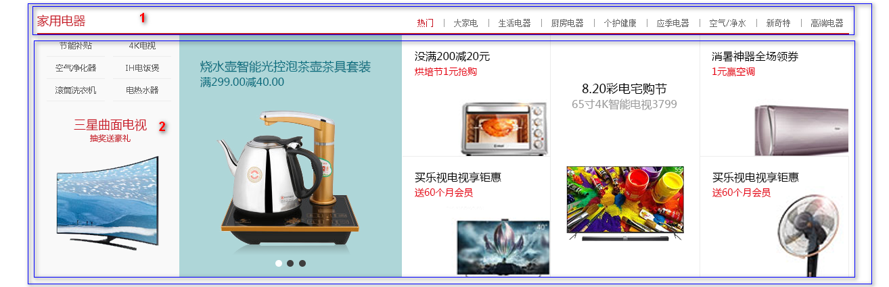

**注意这个 floor ，不要给高度，内容有多少，算多少**

第一楼是家用电器模块： 里面包含两个盒子

#### `box_hd` 制作

- 1 号盒子 `box_hd`，给一个高度，有个下边框，里面分为左右 2 个盒子

  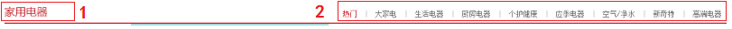

  - `box_hd` 给 30px 的高度，2个像素的下边框
  - 里面放一个左侧 h3 的盒子，右侧一个div盒子，div盒子里面放 `ul > li > a`
  - 左侧盒左浮动，右侧盒子右浮动
  - `a`标签之间的距离用左右的`padding`撑开即可

  **结构代码**

  ```html
  <div class="box_hd">
      <h3>家用电器</h3>
      <div class="tab_list">
          <ul>
              <li> <a href="#" class="style_red">热门</a>|</li>
              <li><a href="#">大家电</a>|</li>
              <li><a href="#">生活电器</a>|</li>
              <li><a href="#">厨房电器</a>|</li>
              <li><a href="#">生活电器</a>|</li>
              <li><a href="#">个护健康</a>|</li>
              <li><a href="#">应季电器</a>|</li>
              <li><a href="#">空气/净水</a>|</li>
              <li><a href="#">新奇特</a>|</li>
              <li><a href="#"> 高端电器</a></li>
          </ul>
      </div>
  </div>
  ```

  **样式代码**

  ```css
  .box_hd {
      height: 30px;
      border-bottom: 2px solid #c81623;
  }
  .box_hd  h3 {
      float: left;
      font-size: 18px;
      color: #c81623;
      font-weight: 400;
  }
  .tab_list {
      float: right;
      line-height: 30px;
  }
  .tab_list ul li {
      float: left;
  }
  .tab_list ul li a {
      margin: 0 15px;
  }
  ```

#### `box_bd` 制作

- 2 号盒子 `box_bd`，不要给高度

  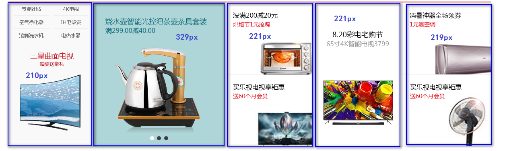

  - `box_bd` 属于是tab栏的内容区域，所以在这个里面先嵌套一个盒子 `tab_content`，在`tab_content` 里面包裹tab选项卡对应的内容
  - 内容被一个大盒子包裹（`tab_list_item`），里面是 `ul` 包裹 5个 `li`，每个`li`设置对应的宽度，然后设置浮动
  - 而这5个`li`的宽度是不一致的，在这里我们的做法是 先把宽度的样式列出来，然后给对应的`li`设置
    - 第一个小 `li` 分为上下结构，上面是 `ul` 包裹 `li` ，`li`里面包裹 `a`，下面插入一张图片
    - 上面的li设置宽高，设置浮动，这样就排列下来了
    - 后面的小 `li` 里面先放一个`a`标签，然后在`a`标签里面插入图片即可

  **结构代码**

  ```html
  <div class="box_bd">
      <div class="tab_content">
          <div class="tab_list_item">
              <div class="col_210">
                  <ul>
                      <li><a href="#">节能补贴</a></li>
                      <li><a href="#">节能补贴</a></li>
                      <li><a href="#">节能补贴</a></li>
                      <li><a href="#">节能补贴</a></li>
                      <li><a href="#">节能补贴</a></li>
                      <li><a href="#">节能补贴</a></li>
                  </ul>
                  <a href="#">
                      
                  </a>
              </div>
              <div class="col_329">
                  <a href="#">
                      
                  </a>
              </div>
              <div class="col_221">
                  <a href="#" class="bb"> </a>
                  <a href="#"> </a>
              </div>
              <div class="col_221">
                      <a href="#"> </a>
                    
              </div>
              <div class="col_219">
                      <a href="#" class="bb"> </a>
                      <a href="#"> </a>
              </div>
          </div>
      </div>
  </div>
  ```

  **样式代码**

  ```css
  .box_bd {
      height: 361px;
    
  }
  .tab_list_item>div {
      float: left;
      height: 361px;
  }
  
  .col_210 {
      width: 210px;
      background-color: #f9f9f9;
      text-align: center;
  }
  .col_210  ul li {
      float: left;
      width: 85px;
      height: 34px;
      border-bottom: 1px solid #ccc;
      text-align: center;
      line-height: 33px;
      margin-right: 10px;
  }
  .col_210  ul {
      padding-left: 12px;
  }
  .col_329 {
      width: 329px;
  }
  .col_221 {
      width: 221px;
      border-right: 1px solid #ccc;
  }
  .col_219 {
      width: 219px;
  }
  .bb {
      /* 一般情况下，a如果包含有宽度的盒子，a需要转为块级元素 */
      display: block;
      border-bottom: 1px solid #ccc;
  }
  ```

#### tab栏切换需求

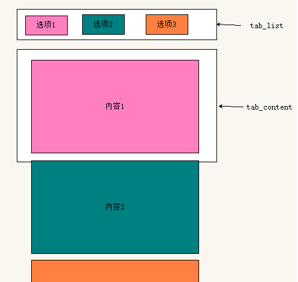

- `tab`栏的布局是  `ul > li > a`
- 有多少个`tab`选项卡，那么对应就有多少个内容
- 但是每一次只会显示一个内容块，其他内容进行的隐藏
- 等后面我们学习了`js`之后，我们就会配合`js`来实现，`tab`栏的切换

## 列表制作（★★★）

### 品优购列表页制作准备工作

- 列表页面是新的页面，我们需要新建页面文件 list.html 
- 因为列表页的头部和底部基本一致，所以我们需要把首页中的头部和底部的结构复制过来
- 头部和底部的样式也需要，因此 list.html 中还需要引入 common.css 
- 需要新的 list.css 样式文件，这是列表页专门的样式文件

### 列表页 `header` 和 `nav` 修改

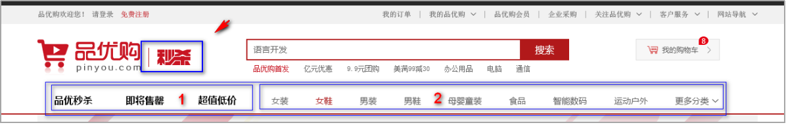

- 秒杀盒子 sk（ second  kill ）  定位即可

**结构代码**

```html
<header class="header w">
     <!-- logo模块 -->
     ...
     <!-- 列表页的秒杀模块 -->
     <div class="sk">
         
     </div>
     <!-- search搜索模块 -->
     ...
     <!-- hotwords模块制作 -->
     ...
     <!-- 购物车模块 -->
     ...
 </header>
```

**样式代码**

```css
.sk {
    position: absolute;
    left: 190px;
    top: 40px;
    border-left: 1px solid #c81523;
    padding: 3px 0 0  14px;
}
```

- 1 号盒子左侧浮动 `sk_list` 里面包含 `ul` 和 `li` 
- 2 号盒子左侧浮动 `sk_con` 里面包含 `ul` 和 `li`

**结构代码**

```html
<!-- nav模块制作 start -->
<nav class="nav">
    <div class="w">
        <div class="sk_list">
            <ul>
                <li><a href="#">品优秒杀</a></li>
                <li><a href="#">品优秒杀</a></li>
                <li><a href="#">品优秒杀</a></li>
            </ul>
        </div>
        <div class="sk_con">
            <ul>
                <li><a href="#">女装</a></li>
                <li><a href="#" class="style_red">女鞋</a></li>
                <li><a href="#">女装</a></li>
                <li><a href="#">女装</a></li>
                <li><a href="#">女装</a></li>
                <li><a href="#">女装</a></li>
                <li><a href="#">女装</a></li>
                <li><a href="#">女装</a></li>
                <li><a href="#">更多分类</a></li>
            </ul>
        </div>
    </div>
</nav>
```

**样式代码**

```css
.sk_list {
    float: left;
}
.sk_list  ul li {
    float: left;
}
.sk_list  ul li a {
    display: block;
    line-height: 47px;
    padding: 0 30px;
    font-size: 16px;
    font-weight: 700;
    color: #000;
}
.sk_con {
    float: left;
}
.sk_con ul li {
    float: left;
}
.sk_con  ul li a {
    display: block;
    line-height: 49px;
    padding: 0 20px;
    font-size: 14px;
   
}
.sk_con  ul li:last-child a::after {
    content: '\e91e';
    font-family: 'icomoon';
}
```

### 列表页主体  `sk_container`

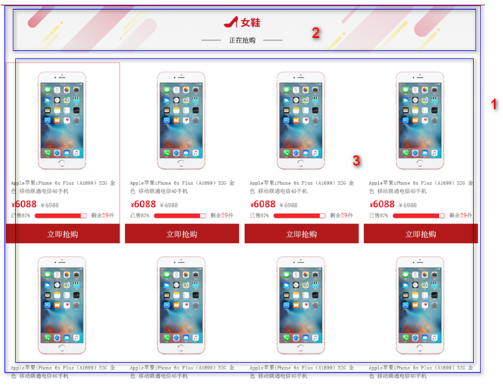

- 1 号盒子 `sk_container` 给宽度 1200，不要给高度 

**结构代码**

```html
<!-- 列表页主体部分 -->
<div class="w sk_container">
    <div class="sk_hd">
        ...
    </div>
    <div class="sk_bd">
        ...
    </div>
</div>
```

#### `sk_hd` 制作

- 2 号盒子 `sk_hd` ，插入图片即可  

**结构代码**

```html
<div class="sk_hd">
    
</div>
```

#### `sk_bd` 制作

- 3 号盒子 `sk_bd` ，里面包含很多的 `ul` 和 `li`
  - 当鼠标移入到 `li` 上面的时候显示红色的边框，在这里先给 `li` 设置透明的边框，当鼠标移入的时候 设置为红色即可
  - 由于给每个 `li` 都设置了外边距，导致一行的最后一个 `li` 掉了下来，在这里我们利用 `nth-child(4n)` 来选择出来每一行最后一个 `li`，去掉外边距就好了

**结构代码**

```html
<div class="sk_bd">
     <ul class="clearfix">
        <li>
            
        </li>
        <li>
            
        </li>
        <li>
            
        </li>
        <li>
            
        </li>
        <li>
            
        </li>
        <li>
            
        </li>
        <li>
            
        </li>
        <li>
            
        </li>
        <li>
            
        </li>
    </ul>
</div>
```

**样式代码**

```css
.sk_bd ul li {
    overflow: hidden;
    float: left;
    margin-right: 13px;
    width: 290px;
    height: 460px;
    border: 1px solid transparent;
}
.sk_bd ul li:nth-child(4n) {
    margin-right: 0;
}
.sk_bd ul li:hover {
    border: 1px solid #c81523;
}
```

## 注册页面（★★★）

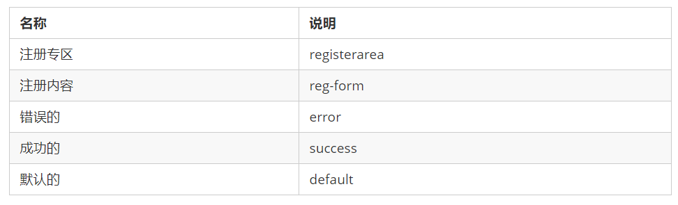

**注意：**注册页面比较隐私，为了保护用户信息，我们不需要对当前页面做SEO优化

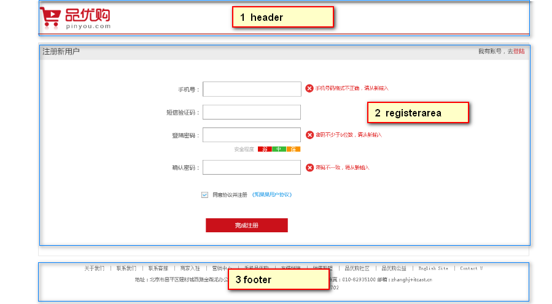

### 准备工作

- 创建register.html，引入 base.css，引入favicon图标
- 创建register.css ，在html页面进行引入

### `header` 头部实现

- 整个内容用 版心 进行包裹
- 第一个头部区域怎么简单怎么来，用一个header盒子包裹链接，链接里面放图片即可

**结构代码**

```html
<header>
    <div class="logo">
        <a href="index.html"> </a>
    </div>
</header>
```

**样式代码**

```css
.w {
    width: 1200px;
    margin: 0 auto;
}
header {
    height: 84px;
    border-bottom: 2px solid #c81523;
}
.logo {
    padding-top: 18px;
}
```

### `registerarea` 主体模块实现

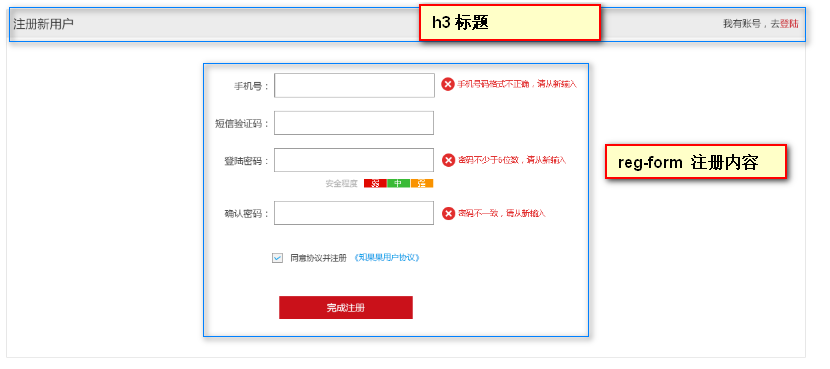

- 整个大盒子 高度为 522px，设置4个边框

  **结构代码**

  ```html
  <div class="registerarea">
     ...
  </div>
  ```

  **样式代码**

  ```css
  .registerarea {
      height: 522px;
      border: 1px solid #ccc;
      margin-top: 20px;
  }
  ```

- 1号盒子 是一个 h3 标签，放标题

  - 里面放 注册新用户 的文字，然后包一个 div的标签，让div标签右浮动

  **结构代码**

  ```html
  <h3>注册新用户
      <div class="login">我有账号，去<a href="#">登陆</a></div>
  </h3>
  ```

  **样式代码**

  ```css
  .registerarea h3 {
      height: 42px;
      border-bottom: 1px solid #ccc;
      background-color: #ececec;
      line-height: 42px;
      padding: 0 10px;
      font-size: 18px;
      font-weight: 400;
  }
  .login {
      float: right;
      font-size: 14px;
  }
  .login a {
      color: #c81523;
  }
  ```

- 2号盒子 里面放注册的内容

  - 先用一个盒子，把整个内容包裹起来，设置盒子宽度（600px），让这个盒子距上边50px，水平居中显示

  - 里面的内容利用 `ul` 包含 `li` 来实现的（不需要用表格）

  - 每个 `li` 里面，左侧放 `label` 标签， 中间放`input` 标签， 右侧放 `span` 提示信息

  - 左侧 `label`里面的文字都是右对齐，我们可以给`label`设置一个宽度（88px），然后利用`text-align` 来设置右对齐

  - input 表单设置 宽度 242px，高度 37px，设置边框

  - 右侧 span修饰一下文字颜色

  - 提示信息的样式优化

    - 定义一个 错误的样式，定义一个 正确的样式，然后给对应的盒子设置类名

    - 在span里面放一个小盒子，这个小盒子用来显示 图标的，设置一下宽高 （20x20）
    - 插入图片了之后，默认与文字是基线对齐，通过 `vertical-algin` 来设置 图片与文字对齐方式

  - 安装程度的布局，在第4个小 li 里面放 三个盒子，分别放 弱、中、强

    - 设置 `em` 的 左右 12px 的内边距，设置一下文字颜色
    - 分别设置 背景颜色

  - 同意协议 和 完成注册 都是用 `li` 进行包裹

  **结构代码**

  ```html
  <div class="reg_form">
      <form action="">
          <ul>
              <li><label for="">手机号：</label> <input type="text" class="inp">
                  <span class="error"> <i class="error_icon"></i> 手机号码格式不正确，请从新输入 </span></li>
              <li><label for="">短信验证码：</label> <input type="text" class="inp">
                  <span class="success"> <i class="success_icon"></i> 短信验证码输入正确 </span></li>
              <li><label for="">登录密码：</label> <input type="password" class="inp">
                  <span class="error"> <i class="error_icon"></i> 手机号码格式不正确，请从新输入 </span></li>
              <li class="safe">安全程度 <em class="ruo">弱</em> <em class="zhong">中</em> <em class="qiang">强</em> </li>
              <li><label for="">确认密码：</label> <input type="password" class="inp">
                  <span class="error"> <i class="error_icon"></i> 手机号码格式不正确，请从新输入 </span></li>
              <li class="agree"><input type="checkbox" name="" id=""> 
                  同意协议并注册 <a href="#">《知晓用户协议》</a>
              </li>
              <li>
                  <input type="submit" value="完成注册" class="btn">
              </li>
          </ul>
      </form>
  </div>
  ```

  **样式代码**

  ```css
  .reg_form {
      width: 600px;
  
      margin: 50px auto 0;
  }
  .reg_form ul li {
      margin-bottom: 20px;
  }
  .reg_form ul li label {
      display: inline-block;
      width: 88px;
      text-align: right;
  }
  .reg_form ul li .inp {
      width: 242px;
      height: 37px;
      border: 1px solid #ccc;
  }
  .error {
      color: #c81523;
  }
  .error_icon,
  .success_icon {
      display: inline-block;
      vertical-align: middle;
      width: 20px;
      height: 20px;
      background: url(../images/error.png) no-repeat;
      margin-top: -2px;
  }
  .success {
      color: green;
  }
  .success_icon {
      background: url(../images/success.png) no-repeat;
  }
  .safe {
      padding-left: 170px;
  }
  .safe em {
      padding: 0 12px;
      color: #fff;
  }
  .ruo {
      background-color: #de1111;
  }
  .zhong {
      background-color: #40b83f;
  }
  
  .qiang {
      background-color: #f79100;
  }
  .agree {
      padding-left: 95px;
  }
  .agree input {
      vertical-align: middle;
  }
  .agree a {
      color: #1ba1e6;
  }
  .btn {
      width: 200px;
      height: 34px;
      background-color: #c81623;
      font-size: 14px;
      color: #fff;
      margin: 30px 0 0 70px;
  }
  ```

### 底部实现

**结构代码**

```html
<footer>
    <div class="mod_copyright">
        <div class="links">
            <a href="#">关于我们</a> | <a href="#">联系我们</a> | 联系客服 | 商家入驻 | 营销中心 | 手机品优购 | 友情链接 | 销售联盟 | 品优购社区 |
            品优购公益 | English Site | Contact U
        </div>
        <div class="copyright">
            地址：北京市昌平区建材城西路金燕龙办公楼一层 邮编：100096 电话：400-618-4000 传真：010-82935100 邮箱: zhanghj+itcast.cn <br>
            京ICP备08001421号京公网安备110108007702
        </div>
    </div>
</footer>
```

**样式代码**

```css
.mod_copyright {
    text-align: center;
    padding-top: 20px;
}
.links {
    margin-bottom: 15px;
}
.links a {
    margin: 0 3px;
}
.copyright {
    line-height: 20px;
}
```

# Web服务器

把自己网站上传到服务器上，可以让其他人访问

## 什么是Web服务器

我们写的品优购网站，目前是放到自己电脑上的，只能自己访问浏览。

如果想要很多人访问我们的网站，可以把品优购放到服务器上，这样就可以多人访问我们的品优购网站了

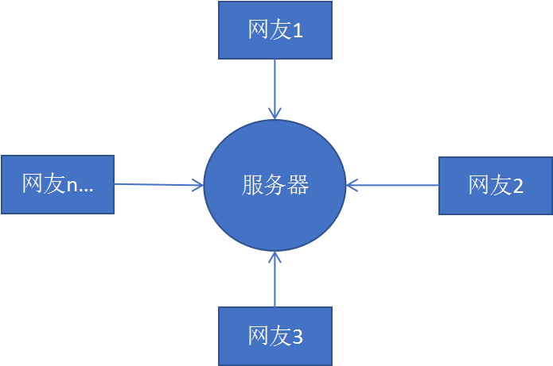

**服务器**（我们也会称之为主机）是提供计算服务的设备，它也是一台计算机。在网络环境下，根据服务器提供的服务类型不同，服务器又分为文件服务器、数据库服务器、应用程序服务器、**Web 服**

**务器**等。

**Web 服务器****一般指网站服务器**，是指驻留于因特网上某种类型计算机的程序，可以向浏览器等 Web 客户端提供文档，也可以放置网站文件，让全世界浏览；可以放置数据文件，让全世界下载。

以下服务器我们主要指的是Web服务器。

根据服务器在网络中所在的位置不同，又可分为**本地服务器**和**远程服务器**。

### 本地服务器

我们可以把自己的电脑设置为本地服务器， 这样同一个局域网内的同学就可以访问你的品优购网站了。 就业班学ajax的时候，再进行讲解

### 远程服务器

本地服务器主要在局域网中访问，如果想要在互联网中访问，可以把品优购网站上传到远程服务器。

远程服务器是通常是别的公司为我们提供的一台电脑（主机），我们只要把网站项目上传到这台电脑上，任何人都可以利用域名访问我们的网站了。

比如域名： www.mi.com      可以访问小米网站

### 小结

- 服务器就是一台电脑。因为我们主要是做网站，所以我们主要使用web服务器
- 服务器可以分为本地服务器和远程服务器
- 远程服务器是别的公司为我们提供了一台计算机。
- 我们可以把网站上传到远程服务器里面， 别人就可以通过域名访问我们的网站了

## 将自己的网站上传到远程服务器（★★★）

**注意：一般稳定的服务器都是需要收费的。  比如：阿里云**

这里给大家推荐一个免费的远程服务器（免费空间）  http://free.3v.do/ 

- 去免费空间网站注册账号。
- 记录下主机名、用户名、密码、域名。
- 利用 `utftp` 软件 上传网站到远程服务器
- 在浏览器中输入域名，即可访问我们的品优购网站了