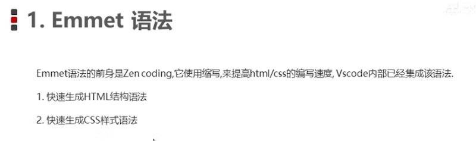
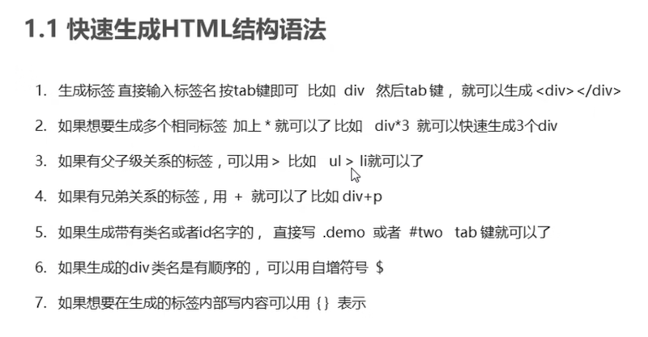
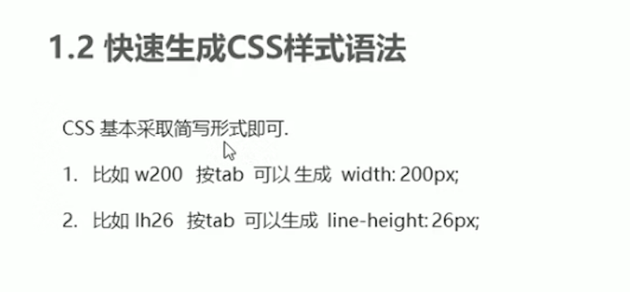
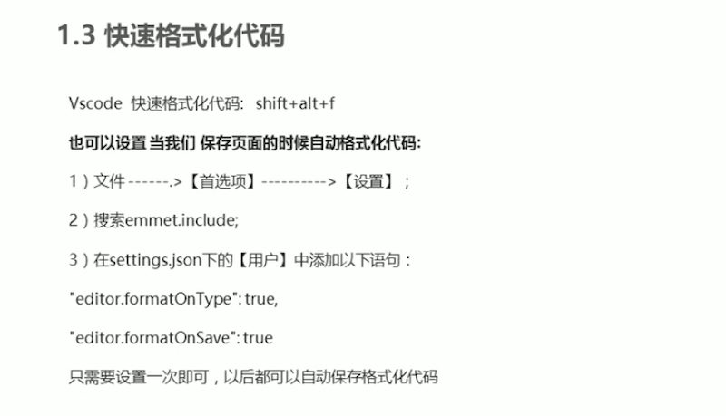

# [Emmet文档](https://code.z01.com/emmet/)


# Emmet语法




# 快速生成HTML结构语法



```html
<body>
    <!-- 1 div + tab 快速生成标签 -->
    <div></div>

    <!-- 2 div*3 + tab 快速生成多个标签 -->
    <div></div>
    <div></div>
    <div></div>

    <!-- 3 ul>li + tab 快速生成父子包含标签 -->
    <ul>
        <li></li>
    </ul>

    <!-- 4 div+p +tab 快速生成兄弟标签 -->
    <div></div>
    <p></p>

    <!-- 5 .nav + tab 带class的标签，默认div标签 -->
    <div class="nav"></div>

    <!-- 5.1 p.one + tab 指定<p>标签带class -->
    <p class="one"></p>

    <!-- 6. #banner + tab 带id的标签 -->
    <div id="banner"></div>

    <!-- 6.1 p#tow + tab 指定<p>标签带id -->
    <p id="two"></p>

    <!-- 7 复合使用 -->
    <!-- ul>li#three + tab -->
    <ul>
        <li id="three"></li>
    </ul>

    <!-- .demo*3 + tab -->
    <div class="demo"></div>
    <div class="demo"></div>
    <div class="demo"></div>

    <!-- 8 标签有序 -->
    <!-- .demo$*5 + tab 有序标签，从1开始 -->
    <div class="demo1"></div>
    <div class="demo2"></div>
    <div class="demo3"></div>
    <div class="demo4"></div>
    <div class="demo5"></div>

    <!-- 9 标签写入文本 -->
    <!-- div{这里是快速文本地方} -->
    <div>我是文本</div>

    <!-- div{文本}*3 -->
    <div>我是文本</div>
    <div>我是文本</div>
    <div>我是文本</div>

    <!-- div{我是文本$}*3 -->
    <div>我是文本1</div>
    <div>我是文本2</div>
    <div>我是文本3</div>

</body>
```


# 快速生成CSS样式语法



```html
<head>
    <meta charset="UTF-8">
    <meta name="viewport" content="width=device-width, initial-scale=1.0">
    <title>Emmet语法之快速生成CSS样式语法</title>
    <style>
        .one {
            /* tac */
            text-align: center;
            /* ti2e */
            text-indent: 2em;
            /* w */
            /* width: ; */
            /* h */
            /* height: ; */
            /* w24 */
            width: 24px;
            /* h24 */
            height: 24px;
            /* tdn */
            text-decoration: none;
        }
    </style>
</head>
```


# 快速格式化代码

`VSCode` 快速格式化代码：<kbd>Shift</kbd> + <kbd>Alt</kbd> + <kbd>F</kbd>。

`WebStorm` 快速格式化代码：<kbd>Ctrl</kbd> + <kbd>Alt</kbd> + <kbd>L</kbd>。




