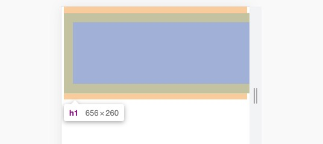
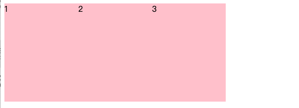

# CSS 的元素显示模式

> 元素显示模式就是元素（标签）以什么方式进行显示，比如<div>自己占一行，比如一行可以放多个<span>

* 块元素 **block**
    * 在页面中**独占一行**，不会与任何元素共用一行，是从上到下排列的。
    * 默认宽度：撑满**父元素**。 
    * 默认高度：由**内容**撑开。
    * **可以**通过 CSS 设置宽高。
* 行内元素 **inline**
    * 在页面中**不独占一行**，一行中不能容纳下的行内元素，会在下一行继续从左到右排列。
    * 默认宽度：由**内容**撑开。
    * 默认高度：由**内容**撑开。
    * **无法**通过 CSS 设置宽高
* 行内块元素 **inline-block**
    * 在页面中**不独占一行**，一行中不能容纳下的行内元素，会在下一行继续从左到右排列。
    * 默认宽度：由**内容**撑开。
    * 默认高度：由**内容**撑开。
    * **可以**通过 CSS 设置宽高


## 元素一览


#技巧：单行文字垂直居中

> CSS 没有给我们提供文字垂直居中的代码。这里我们可以使用一个小技巧来实现。
>
> 解决方案: 让文字的行高等于盒子的高度，就可以让文字在当前盒子内垂直居中

```html
<title>单行文字垂直居中</title>
<style>
    div {
        width: 200px;
        height: 40px;
        background-color: pink;
        line-height: 40px;     // 让文字的行高等于盒子的高度
    }
</style>
```


# CSS三大特性一：层叠性

> 同一个控件样式会叠加。
>
> 如下：最后是粉色pink

```css
<style>
   div {
       color: red;
       font-size: 12px;
   }
   div {
       color: pink;
   }
</style>
```


# CSS三大特性二：继承性

> 子类的元素会继承父类的特性。
>
> 如下：最后<p>标签是粉红色pink，字体14px。

```css
# CSS
<style>
    div {
        color: pink;
        font-size: 14px;
    }
</style>

# HTML
<body>
    <div>
        <p>龙生龙，凤生凤，老鼠生的孩子会打洞</p>
    </div>
</body>
```


# CSS三大特性三：优先级


# 边框会影响盒子的实际大小

```css
<style>
    /* 我们需要一个200*200的盒子, 但是这个盒子有10像素的红色边框 */
    div {
        width: 180px;
        height: 180px;
        background-color: pink;
        border: 10px solid red;
    }
</style>
```


# 内边距会影响盒子实际大小

```css
<style>
    /* 盒子宽高160px, 但是这个盒子有20像素的粉红色padding内边距，所以div实际大小为200px */
    div {
        width: 160px;
        height: 160px;
        background-color: pink;
        padding: 20px;
    }
</style>

<div>
    盒子内容是content盒子内容是content盒子内容是content盒子内容是content
</div>
```


# padding不会影响盒子大小的情况

如果盒子本身没有指定 width / height 属性，则此时padding不会撑开盒子大小。

```css
<style>
	h1 {
    	/* width: 100%; */    // 设置 or 不设置
        height: 200px;
        background-color: pink;
        padding: 30px;
    }
 </style>
```

* 未设置width属性


* 设置width 属性 = 100%




# 盒子水平居中对齐 - margin典型应用

```css
<style>
	div {
    	width: 900px;
        height: 200px;
        background-color: pink;
        margin: 100px auto;  		// 重点
  	}
</style>
```


# 行内元素 / 行内块元素 水平居中对齐

行内元素或者行内块元素水平居中给其父元素添加 text-align:center 即可

```html
# CSS
<style>
    div {
        width: 900px;
        height: 200px;
        background-color: pink;
        margin: 100px auto;
        
        /* 行内元素或者行内块元素水平居中给其父元素添加 text-align:center 即可 */
        text-align: center;   
    }
</style>

# HTML
<div class="header">
    <span>里面的文字</span>
</div>
```


# 外边距合并1 - 相邻块级元素垂直外边距合并


* 两个元素分别设置 margin，相邻的部分合并。

* 解决方案：尽量只给一个盒子添加 margin 值。

```html
<style>
    .damao, .ermao {
        width: 200px;
        height: 200px;
        background-color: pink;
    }
    .damao {
        margin-bottom: 100px;   // 重点
    }
    .ermao {
        margin-top: 200px;   // 重点
    }
</style>

<body>
    <div class="damao">大毛</div>
    <div class="ermao">二毛</div>
</body>
```


# 外边距合并2 - 嵌套元素外边距塌陷


# 移除所有边距


# 行内块中间有缝隙 - 浮动

```html
# CSS
<style>
    div {
		/* display: inline-block; */    
        width: 150px;
        height: 200px;
        background-color: pink;
    }
</style>

# HTML
<body>
    <div>1</div>
    <div>2</div>
    <div>3</div>
</body>
```

* 块元素 垂直 没有 缝隙


* 转为  行内块元素 水平 有 缝隙


* 解决方案：

```html
<style>
    div {
    	/* 使用浮动，代替行内块元素 */	
        float: left;
 		/* display: inline-block; */   

        width: 150px;
        height: 200px;
        background-color: pink;
    }
</style>
```




# 浮动特性


