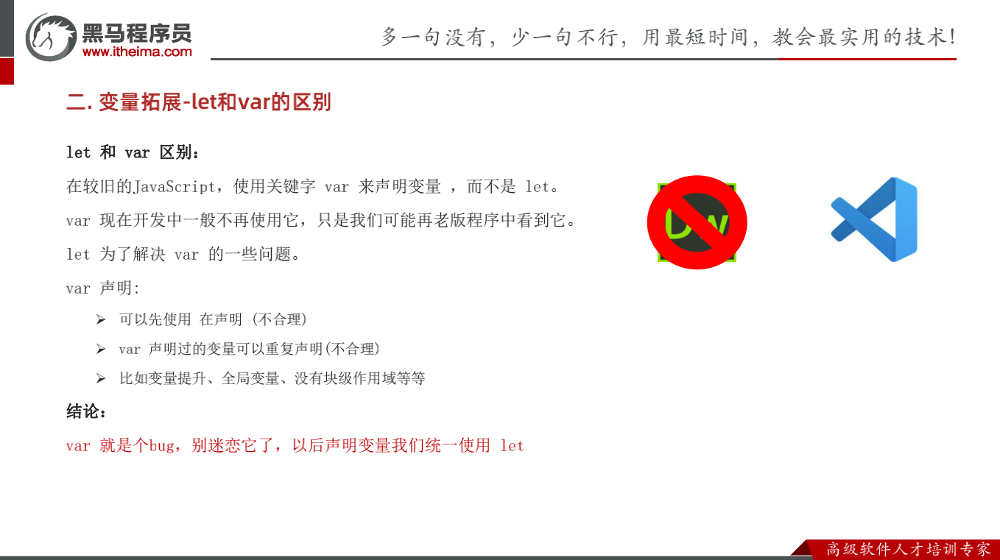
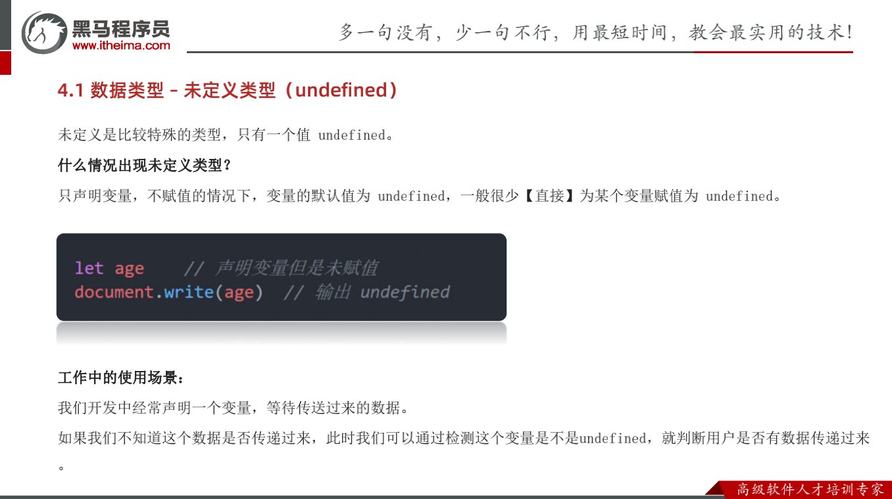
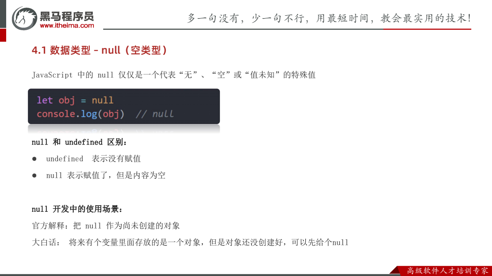

[2023年web前端开发学习路线图](https://www.bilibili.com/read/cv10431130)

[MDN](https://developer.mozilla.org/zh-CN/)

[w3school  JavaScript 教程](https://www.w3school.com.cn/js/index.asp)


# let 和 var




# 数据类型


## 基本数据类型

* number 数字型
* string 字符串型
* boolean 布尔型
* undefined 未定义型
* null 空类型


## 引用数据类型


## undefined 




## null




**undefined与null 计算有区别**

```js
// 计算有区别
console.log(undefined + 1)  // NaN
console.log(null + 1) // 1
```


## NaN - Not a Number

```js
let str = 'hello'
// 将 hello 转成数值是不现实的，当无法转换成
// 数值时，得到的结果为 NaN （Not a Number）
console.log(Number(str))
```


# 逻辑运算符 - 逻辑中断 - 第四天

```js
<script>
    // && 一假则假，后面的不执行
 	console.log(false && 22) // false
    console.log(false && 3 + 5) // false

    let age = 18
    console.log(false && age++) // false
    console.log(age) // 18

	// || 一真则真，后面不执行
    console.log(true || age++) // true
    console.log(age) // 18

    console.log(11 && 22)  // 都是真，这返回最后一个真值
    console.log(11 || 22)  // 输出第一个真值
</script>
```


# 布尔类型转换 - 第四天

> Boolean(内容) 

**记忆**： **‘’、0、undefined、null、false、NaN 转换为布尔值后都是false, 其余则为 true** 


