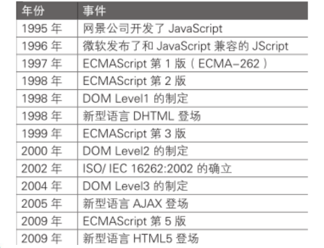
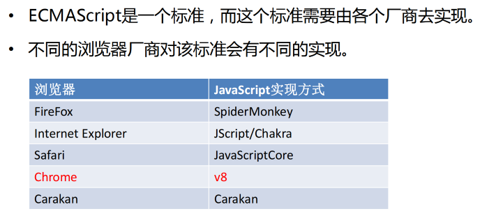
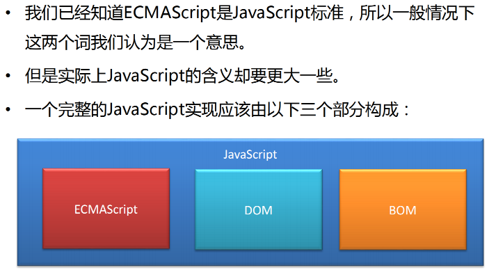

# 一、JavaScript 简史





# 二、JavaScript 的组成

* ECMAScript：规定了js基础语法核心知识。 
    * 比如：变量、分支语句、循环语句、对象等等 

* Web APIs : 
    * DOM 操作文档，比如对页面元素进行移动、大小、添加删除等操作 
    * BOM 操作浏览器，比如页面弹窗，检测窗口宽度、存储数据到浏览器等等


# 三、ECMAScript 与 JavaScript 关系






# 四、解释型语言 & 动态语言

计算机高级语言主要有『编译型』和『解释型』

* JavaScript是一门解释型语言，所谓解释型值语言不需要被编译为机器码在执行，而是直接执行。
* 解释型语言运行较慢也是它的劣势。
* 不过解释型语言中使用了JIT技术，使得运行速度得以改善。


* **动态语言（弱类型语言）**是运行时才确定数据类型的语言，变量在使用之前无需申明类型，通常变量的值是被赋值的那个值的类型。比如Php、Asp、JavaScript、Python、Perl等等。

* **静态语言（强类型语言）**是编译时变量的数据类型就可以确定的语言，大多数静态语言要求在使用变量之前必须生命数据类型。比如Java、C、C++、C#等。


* JavaScript是一门动态语言，所谓的动态语言可以暂时理解为在语言中的一切内容都是不确定的。比如一个变量，这一时刻是个整型，下一时刻可能会变成字符串了。当然这个问题我们以后再谈。

* 不过在补充一句动态语言相比静态语言性能上要差一些，不过由于JavaScript中应用的JIT技术，所以JS可能是运行速度最快的动态语言了。


# 五、JavaScript 书写位置

* CSS书写位置
    * 行内样式表
    * 内部样式表 
    * 外部样式表

* JavaScript书写位置
    * 行内 JavaScript 
    * 内部 JavaScript 
    * 外部 JavaScript （推荐）

**行内 JavaScript **

```html
<body>
		<!--
			可以将js代码编写到标签的onclick属性中
			当我们点击按钮时，js代码才会执行
			
			虽然可以写在标签的属性中，但是他们属于结构与行为耦合，不方便维护，不推荐使用
		-->
		<button onclick="alert('讨厌，你点我干嘛~~');">点我一下</button>
		
		<!--
			可以将js代码写在超链接的href属性中，这样当点击超链接时，会执行js代码
		-->
		<a href="javascript:alert('让你点你就点！！');">你也点我一下</a>
  	<!--
			这是空效果
		-->
		<a href="javascript:;">你也点我一下</a>
</body>
```

**内部 JavaScript **

```html
<!--
  可以将js代码编写到script标签	
  -->
<script type="text/javascript">	
		alert("我是script标签中的代码！！");
</script>
```

**外部 JavaScript**

```html
<!--
  可以将js代码编写到外部js文件中，然后通过script标签引入
  写到外部文件中可以在不同的页面中同时引用，也可以利用到浏览器的缓存机制
  推荐使用的方式
-->
<!--
  script标签一旦用于引入外部文件了，就不能在编写代码了，即使编写了浏览器也会忽略
  如果需要则可以在创建一个新的script标签用于编写内部代码
-->
<script type="text/javascript" src="js/script.js"></script>
<script type="text/javascript">
  alert("我是内部的JS代码");
</script>
```

**注意事项： **

* 书写的位置尽量写到文档末尾 </body> 前面 

* 外部 js 标签中间不要写代码，否则会被忽略


# 六、JavaScript 输入输出语法

```html
<body>
    <script>
        // 1.文档输出语法
        document.write('我是div标签')
        document.write('<h1>我是标题111</h1>')

        // 2.弹框输出语法
        alert('我是弹框')

        // 3.控制台输出
        console.log('我是控制台输出')

        // 4.输入弹框
        prompt('请输入姓名：')
    </script>
</body>
```


# 七、JavaScript 变量与常量

[ECMAScript 6 入门 - let](https://es6.ruanyifeng.com/#docs/let)

## 1. var

https://www.freecodecamp.org/chinese/news/javascript-var-let-and-const/

在ES2015（ES6）出现之前，必须使用 `var` 声明。

作用域

用途

变量提升

## 2.  let


## 3. var 与 let

**let 和 var 区别：** 

在较旧的JavaScript，使用关键字 var 来声明变量 ，而不是 let。 

var 现在开发中一般不再使用它，只是我们可能再老版程序中看到它。 

let 为了解决 var 的一些问题。 

var 声明: 

Ø 可以先使用 在声明 (不合理) 

Ø var 声明过的变量可以重复声明(不合理) 

Ø 比如变量提升、全局变量、没有块级作用域等等 

**结论：** 

var 就是个bug，别迷恋它了，以后声明变量我们统一使用 let


## 4. const

**概念：**使用 const 声明的变量称为“常量”。 

**使用场景：**当某个变量永远 **不会改变** 的时候，就可以使用 const 来声明，而不是let。 

**命名规范：**和变量一致 

```javascript
/*
	声明一个常量π
*/
const pi = 3.1415926;
```


# 八、JavaScript 数据类型

JavaScript中一共有5种基本数据类型：

– 字符串型（String） 

– 数值型（Number） 

– 布尔型（Boolean） 

– null型（Null） 

– undefined型（Undefined）

• 这5种之外的类型都称为Object，所以总的来看JavaScript中共有六种数


