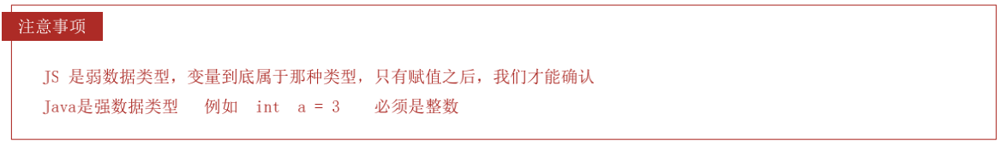

# 一、JavaScript 简史


# 二、JavaScript 的组成

* ECMAScript：规定了js基础语法核心知识。 
    * 比如：变量、分支语句、循环语句、对象等等 

* Web APIs : 
    * DOM 操作文档，比如对页面元素进行移动、大小、添加删除等操作 
    * BOM 操作浏览器，比如页面弹窗，检测窗口宽度、存储数据到浏览器等等


# 三、ECMAScript 与 JavaScript 关系


# 四、解释型语言 & 动态语言

计算机高级语言主要有『编译型』和『解释型』

* JavaScript是一门解释型语言，所谓解释型值语言不需要被编译为机器码在执行，而是直接执行。
* 解释型语言运行较慢也是它的劣势。
* 不过解释型语言中使用了JIT技术，使得运行速度得以改善。


* **动态语言（弱类型语言）**是运行时才确定数据类型的语言，变量在使用之前无需申明类型，通常变量的值是被赋值的那个值的类型。比如Php、Asp、JavaScript、Python、Perl等等。

* **静态语言（强类型语言）**是编译时变量的数据类型就可以确定的语言，大多数静态语言要求在使用变量之前必须生命数据类型。比如Java、C、C++、C#等。


* JavaScript是一门动态语言，所谓的动态语言可以暂时理解为在语言中的一切内容都是不确定的。比如一个变量，这一时刻是个整型，下一时刻可能会变成字符串了。当然这个问题我们以后再谈。

* 不过在补充一句动态语言相比静态语言性能上要差一些，不过由于JavaScript中应用的JIT技术，所以JS可能是运行速度最快的动态语言了。


# 五、JavaScript 书写位置

* CSS书写位置
    * 行内样式表
    * 内部样式表 
    * 外部样式表

* JavaScript书写位置
    * 行内 JavaScript 
    * 内部 JavaScript 
    * 外部 JavaScript （推荐）

**行内 JavaScript **

```html
<body>
		<!--
			可以将js代码编写到标签的onclick属性中
			当我们点击按钮时，js代码才会执行
			
			虽然可以写在标签的属性中，但是他们属于结构与行为耦合，不方便维护，不推荐使用
		-->
		<button onclick="alert('讨厌，你点我干嘛~~');">点我一下</button>
		
		<!--
			可以将js代码写在超链接的href属性中，这样当点击超链接时，会执行js代码
		-->
		<a href="javascript:alert('让你点你就点！！');">你也点我一下</a>
  	<!--
			这是空效果
		-->
		<a href="javascript:;">你也点我一下</a>
</body>
```

**内部 JavaScript **

```html
<!--
  可以将js代码编写到script标签	
  -->
<script type="text/javascript">	
		alert("我是script标签中的代码！！");
</script>
```

**外部 JavaScript**

```html
<!--
  可以将js代码编写到外部js文件中，然后通过script标签引入
  写到外部文件中可以在不同的页面中同时引用，也可以利用到浏览器的缓存机制
  推荐使用的方式
-->
<!--
  script标签一旦用于引入外部文件了，就不能在编写代码了，即使编写了浏览器也会忽略
  如果需要则可以在创建一个新的script标签用于编写内部代码
-->
<script type="text/javascript" src="js/script.js"></script>
<script type="text/javascript">
  alert("我是内部的JS代码");
</script>
```

**注意事项： **

* 书写的位置尽量写到文档末尾 </body> 前面 

* 外部 js 标签中间不要写代码，否则会被忽略


# 六、JavaScript 输入输出语法

```html
<body>
    <script>
        // 1.文档输出语法
        document.write('我是div标签')
        document.write('<h1>我是标题111</h1>')

        // 2.弹框输出语法
        alert('我是弹框')

        // 3.控制台输出
        console.log('我是控制台输出')

        // 4.输入弹框
        prompt('请输入姓名：')
    </script>
</body>
```

**实战案例**

```js
<body>
    <script>
        let uname = prompt('请输入姓名')
        let age = prompt('请输入年龄')
        let gender = prompt('请输入性别')
        document.write(uname, age, gender)
    </script>
</body>
```


# 七、JavaScript 变量与常量

[ECMAScript 6 入门 - let](https://es6.ruanyifeng.com/#docs/let)

## 1. var 与 let

**优化一：var可以先使用，后声明；let没有变量提升**

```js
// 10
// 描述：此时num先使用，后声明。
num = 10;
console.log(num);
var num;


// Uncaught ReferenceError: Cannot access 'num' before initialization
// 描述：let解决了此问题
num = 10;
console.log(num);
let num;
```


**优化二：var可以重复声明同名变量；let变量不能重复声明**

```js
// 20
// 描述：var重复声明变量，取最后一个。
var num = 10
var num = 20
console.log(num)


// Uncaught SyntaxError: Identifier 'num' has already been declared
// 描述：let不支持重复声明同名变量
let num = 10
let num = 20
console.log(num)
```


**优化三：var没有块级作用域；let定义块级作用域变量**

在ES6之前，我们都是用var来声明变量，而且JS只有 **函数作用域** 和 **全局作用域**，没有 **块级作用域**，所以`{}`限定不了var声明变量的访问范围。

在代码块内，使用let命令声明变量之前，该变量都是不可用的。这在语法上，称为 **“暂时性死区”**（temporal dead zone，简称 TDZ）。

```js
// 9
// 描述：var没有块级作用域
{
		var i = 9;
}
console.log(i);


// Uncaught ReferenceError: i is not defined
// 描述：let有块级作用域
{
		let i = 9;  // i变量只在 花括号内有效！！！
}
console.log(i);
```


## 2. 变量提升 

> 声明提升（hoisting）：函数声明和变量声明总是会被解释器悄悄地被"提升"到方法体的最顶部。

### a. 声明提升，初始化不会提升

[runoob - JavaScript 声明提升](https://www.runoob.com/js/js-hoisting.html)

**声明提升**

```js
// 声明提升
x = 5; // 变量 x 设置为 5
console.log(a);
var x; // 声明 x

// 输出
5
```

**初始化提升（不支持）**

```js
 // 初始化提升，失败
var x = 5; // 初始化 x
console.log(x);
console.log(y);
var y = 7; // 初始化 y

// 输出
5
undefined
```

```js
var x = 5; // 初始化 x
var y;     // 声明 y
console.log(x);
console.log(y);
y = 7;    // 设置 y 为 7

// 输出
5
undefined
```


### b. 面试题

在ES6之前，我们都是用var来声明变量，而且JS只有 **函数作用域** 和 **全局作用域**。

```js
// 常见面试题目1：
var a = 99;            // 全局变量a
f();                   // f是函数，虽然定义在调用的后面，但是函数声明会提升到作用域的顶部。 
console.log(a);        // a=>99,  此时是全局变量的a
function f() {
  console.log(a);      // 当前的a变量是下面变量a声明提升后，默认值undefined
  var a = 10;
  console.log(a);      // a => 10
}

// 输出结果：
undefined
10
99
```


## 3. let 配合for循环的独特应用

`let`非常适合用于 `for`循环内部的块级作用域。JS中的for循环体比较特殊，每次执行都是一个全新的独立的块作用域，用let声明的变量传入到 for循环体的作用域后，不会发生改变，不受外界的影响。看一个常见的面试题目：

```js
for (var i = 0; i <10; i++) {  
  	setTimeout(function() {  // 同步注册回调函数到 异步的 宏任务队列。
    		console.log(i);      // 执行此代码时，同步代码for循环已经执行完成
  	}, 0);
}
// 输出结果
10   共10个
// 这里面的知识点： JS的事件循环机制，setTimeout的机制等
```

如果把 `var`改成 `let`声明：

```js
// i虽然在全局作用域声明，但是在for循环体局部作用域中使用的时候，变量会被固定，不受外界干扰。
for (let i = 0; i < 10; i++) { 
  setTimeout(function() {
    console.log(i);    //  i 是循环体内局部作用域，不受外界影响。
  }, 0);
}
// 输出结果：
0  1  2  3  4  5  6  7  8  9
```


## 4. const

**概念：**使用 const 声明的变量称为“常量”。 

**使用场景：**当某个变量永远 **不会改变** 的时候，就可以使用 const 来声明，而不是let。 

**命名规范：**和变量一致 

```javascript
/*
	声明一个常量π
*/
const PI = 3.1415926;  

PI = 2.111; // ERROR: 1.常量不允许更改值

const PI1; // ERROR: 2.常量声明的时候必须赋值
```


# 八、JavaScript 数据类型

* 5种基本数据类型：
    * 字符串型（String） 
    * 数值型（Number） 
    * 布尔型（Boolean） 
    * null型（Null） 
    * undefined型（Undefined）

* 引用数据类型：
    * 对象（Object）




## 类型判断 - typeof

```js
/*
  可以使用一个运算符 typeof
  来检查一个变量的类型
  语法：typeof 变量	
  检查字符串时，会返回string
  检查数值时，会返回number
*/
typeof "123"  		// string
typeof 10					// number
typeof Infinity  	// number
typeof NaN  			// number
typeof false 			// boolean
typeof undefined	// undefined
```


## 标识符

```js
/*
 * 标识符
 * 	- 在JS中所有的可以由我们自主命名的都可以称为是标识符
 * 	- 例如：变量名、函数名、属性名都属于标识符
 * 	- 命名一个标识符时需要遵守如下的规则：
 * 		1.标识符中可以含有字母、数字、_、$
 * 		2.标识符不能以数字开头
 * 		3.标识符不能是ES中的关键字或保留字
 * 		4.标识符一般都采用驼峰命名法
 * 			- 首字母小写，每个单词的开头字母大写，其余字母小写
 * 			helloWorld xxxYyyZzz
 * 
 * 	- JS底层保存标识符时实际上是采用的Unicode编码，
 * 		所以理论上讲，所有的utf-8中含有的内容都可以作为标识符
 */
```


## 1. 字符串 String

### a. 转义字符

```js
/*
  在字符串中我们可以使用\作为转义字符，
    当表示一些特殊符号时可以使用\进行转义

    \" 表示 "
    \' 表示 '
    \n 表示换行
    \t 制表符
    \\ 表示\
*/
str = "我说:\"今天\t天气真不错！\"";  
str = "\\\\\\"; 

// 我说:"今天	天气真不错！"
// \\\
```


### b. 模板字符串

```js
// 模板字符串 外面用`` 里面 ${变量名}
let age = 20
document.write(`我今年${age}岁了`)
```


## 2.数值 Number

* 在JS中所有的数值都是Number类型，包括 **整数** 和 **浮点数**（小数）

* JS中可以表示的数字的最大值、最小值
     * 最大值：Number.MAX_VALUE
        * 1.7976931348623157e+308
     * 大于0的最小值：Number.MIN_VALUE
        * 5e-324

* 如果使用Number表示的数字超过了最大值，则会返回一个
       *      Infinity表示：正无穷
       *      -Infinity表示：负无穷
       *      使用 `typeof` 检查 `Infinity` 也会返回number
* `NaN` 是一个特殊的数字，表示：Not A Number
    * 使用`typeof` 检查一个 `NaN` 也会返回number


### a. Infinity

```js
// 两个很大的数相乘
a = -Number.MAX_VALUE * Number.MAX_VALUE;
console.log(a);

// -Infinity
```


### b. NaN

* `NaN` 是一个特殊的数字，表示：Not A Number

* 使用`typeof` 检查一个 `NaN` 也会返回number

```js
// 两个字符串相乘
console.log("abc" * "bcd");	 // NaN
console.log('pink老师' - 2);  // NaN
console.log(NaN - 2);	// NaN
console.log(NaN + 2);	// NaN
console.log(NaN / 2);	// NaN
console.log(NaN === NaN);	// false
```


### c. 浮点运算不精确

```js
/*
 * 如果使用JS进行浮点运算，可能得到一个不精确的结果
 * 所以千万不要使用JS进行对精确度要求比较高的运算	
 */
var c = 0.1 + 0.2;
console.log(c);

// 0.30000000000000004
```


### d. 二、八、十六进制的数字

```js
/*
 * 在js中，如果需要表示16进制的数字，则需要以0x开头
 * 			  如果需要表示8进制的数字，则需要以0开头
 * 			  如果要要表示2进制的数字，则需要以0b开头
 * 				但是不是所有的浏览器都支持
 * 	
 */

//十六进制
a = 0x10;  	// number 16
a = 0xff;		// number 255
a = 0xCafe;	// number 51966

//八进制数字
a = 070;	// number 56

//二进制数字
a = 0b10;	// number 2

//向"070"这种字符串，有些浏览器会当成8进制解析，有些会当成10进制解析
a = "070";

//可以在parseInt()中传递一个第二个参数，来指定数字的进制
a = "0101";
a = parseInt(a, 2); // 2
a = parseInt(a, 8); // 65
a = parseInt(a, 10); // 101
a = parseInt(a, 16); // 257

console.log(typeof a);
console.log(a);
```


## 3.布尔值 - Boolean

```js
/*
 * Boolean 布尔值
 * 	布尔值只有两个，主要用来做逻辑判断
 * 	true
 * 		- 表示真
 * 	false
 * 		- 表示假
 * 
 * 使用typeof检查一个布尔值时，会返回boolean
 */
var bool = false;			
console.log(typeof bool);
console.log(bool);

// boolean
// false
```


## 4. 空值 - Null

Javaseript 中的nul1 仅仅是一个代表“无”、“空”或“值未知”的特殊值。

**null工作中的使用场景：**

* 官方解释：把nul1 作为尚未创建的对象。
* 大白话：将来有个变量里面存放的是一个对象，但是对象还没创建好，可以先给个null。

```js
/*
 * Null（空值）类型的值只有一个，就是null
 * null这个值专门用来表示一个为空的对象
 * 使用typeof检查一个null值时，会返回object
 */
var a = null;
console.log(typeof a);

// object
```


## 5. 未定义 - Undefine

只声明变量，不赋值的情况下，变量的默认值为 undefined，一般很少【直接】为某个变量赋值为 undefined.

**Undefine工作中的使用场景：**

* 我们开发中经常声明一个变量，等待传送过来的数据。
* 如果我们不知道这个数据是否传递过来，此时我们可以通过检测这个变量是不是undefined，就判断用户是否有数据传递过来。

```js
/*
 * Undefined（未定义）类型的值只有一个，就undefind
 * 	当声明一个变量，但是并不给变量赋值时，它的值就是undefined
 * 	使用typeof检查一个undefined时也会返回undefined
 */
var b = undefined;
console.log(typeof b);

// undefined
```

**null 和 undefined 区别：**

- undefined 表示没有赋值
- null 表示赋值了，但是内容为空

* undefined值实际上是由null值衍生出来的，所以如果比较undefined和null是否相等，会返回true；

```js
console.log(null == undefined);  // true
console.log(null === undefined); // false
```


## 6. 对象 - Object

### a. 对象分类 + 新增、修改、删除属性

```js
/*
 * 对象的分类：
 * 	1.内建对象
 * 		- 由ES标准中定义的对象，在任何的ES的实现中都可以使用
 * 		- 比如：Math String Number Boolean Function Object....
 * 
 * 	2.宿主对象
 * 		- 由JS的运行环境提供的对象，目前来讲主要指由浏览器提供的对象
 * 		- 比如 BOM DOM
 * 
 * 	3.自定义对象
 * 		- 由开发人员自己创建的对象
 */
 
 
// 创建对象
/*
 * 使用new关键字调用的函数，是构造函数constructor
 * 	构造函数是专门用来创建对象的函数
 * 使用typeof检查一个对象时，会返回object
 */
var obj = new Object();

/*
 * 在对象中保存的值称为属性
 * 向对象添加属性
 * 	语法：对象.属性名 = 属性值;
 */

//向obj中添加一个name属性
obj.name = "孙悟空";
//向obj中添加一个gender属性
obj.gender = "男";
//向obj中添加一个age属性
obj.age = 18;

/*
 * 读取对象中的属性
 * 	语法：对象.属性名
 * 
 * 如果读取对象中没有的属性，不会报错而是会返回undefined
 */

console.log(obj.gender);
console.log(obj.hello);

/*
 * 修改对象的属性值
 * 	语法：对象.属性名 = 新值
 */
obj.name = "tom";

/*
 * 删除对象的属性
 * 	语法：delete 对象.属性名
 */
delete obj.name;
```


### b. 属性名 + 属性值

```js
/*
 * 向对象中添加属性
 * 属性名：
 * 	- 对象的属性名不强制要求遵守标识符的规范
 * 		什么乱七八糟的名字都可以使用
 * 	- 但是我们使用是还是尽量按照标识符的规范去做
 * 
 */
obj.name = "孙悟空";

//obj.var = "hello";

/*
 * 如果要使用特殊的属性名，不能采用.的方式来操作
 * 	需要使用另一种方式：
 * 		语法：对象["属性名"] = 属性值
 * 	读取时也需要采用这种方式
 * 
 * 使用[]这种形式去操作属性，更加的灵活，
 * 	在[]中可以直接传递一个变量，这样变量值是多少就会读取那个属性
 * 
 */
obj["123"] = 789;
obj["nihao"] = "你好";
var n = "nihao";
console.log(obj["123"]);

/*
 * 属性值
 * 	JS对象的属性值，可以是任意的数据类型
 * 		甚至也可以是一个对象
 */

obj.test = true;
obj.test = null;
obj.test = undefined;

//创建一个对象
var obj2 = new Object();
obj2.name = "猪八戒";

//将obj2设置为obj的属性
obj.test = obj2;


/*
 * in 运算符
 * 	- 通过该运算符可以检查一个对象中是否含有指定的属性
 * 		如果有则返回true，没有则返回false
 *  - 语法：
 * 		"属性名" in 对象
 */
//检查obj中是否含有test2属性
console.log("test2" in obj);
console.log("test" in obj);
console.log("name" in obj);
```


### c. 对象字面量

```js
/*
 * 使用对象字面量，可以在创建对象时，直接指定对象中的属性
 * 语法：{属性名:属性值,属性名:属性值....}
 * 	对象字面量的属性名可以加引号也可以不加，建议不加,
 * 	如果要使用一些特殊的名字，则必须加引号
 * 
 * 属性名和属性值是一组一组的名值对结构，
 * 	名和值之间使用:连接，多个名值对之间使用,隔开
 * 	如果一个属性之后没有其他的属性了，就不要写,
 */
var obj2 = {

    name:"猪八戒",
    age:13,
    gender:"男",
    test:{name:"沙僧"}

};
```


# 九、类型转换 - 显示转换

* 强制类型转换
     * 	指将一个数据类型强制转换为其他的数据类型
     * 	类型转换主要指，将其他的数据类型，转换为：`String` `Number` `Boolean`


## 1. 转换为String

### a. 方式一：toString()

```js
/*
 * 将其他的数据类型转换为String
 * 	方式一：
 * 		- 调用被转换数据类型的toString()方法
 * 		- 该方法不会影响到原变量，它会将转换的结果返回
 * 		- 但是注意：null和undefined这两个值没有toString()方法，
 * 			如果调用他们的方法，会报错
 */
var a = 123;
a = a.toString();

a = true;
a = a.toString();

a = null;
a = a.toString(); //报错

a = undefined;
a = a.toString(); //报错
```


### b. 方式二：String()

```js
/*
 * 将其他的数据类型转换为String 
 *  方式二：
 * 		- 调用String()函数，并将被转换的数据作为参数传递给函数
 * 		- 使用String()函数做强制类型转换时，
 * 			对于Number和Boolean实际上就是调用的toString()方法
 * 			但是对于null和undefined，就不会调用toString()方法
 * 				它会将 null 直接转换为 "null"
 * 				将 undefined 直接转换为 "undefined"
 */
var a = 123;
a = String(a);	// "123"

a = null;
a = String(a);  // "null"
typeof a				// string

a = undefined;
a = String(a);  // "undefined"
typeof a				// string
```


## 2. 转换为Number

* 有三个函数可以把非数值转换为数值：Number()、parseInt() 、parseFloat()
    * `Number()` 可以用来转换任意类型的数据，而后两者只能用于转换字符串
    * `parseInt()` 只会将字符串转换为整数
    * `parseFloat()` 可以转换为浮点数


### a. 字符串 --> 数字

**方式一： Number()函数**

* 1.如果是纯数字的字符串，则直接将其转换为数字
* 2.如果字符串中有非数字的内容，则转换为 `NaN`
* 3.如果字符串是一个空串或者是一个全是空格的字符串，则转换为0

**方式二：parseInt() 函数 与parseFloat() 函数**

* parseInt() 把一个字符串转换为一个整数
* parseFloat() 把一个字符串转换为一个浮点数

```js
//调用Number()函数来将a转换为Number类型
var a = "123";
a = Number(a);

/*
 * parseInt()可以将一个字符串中的有效的整数内容去出来，
 * 	然后转换为Number
 */
a = parseInt(a);

/*
 * parseFloat()作用和parseInt()类似，不同的是它可以获得有效的小数
 */
a = "123.456.789px";
a = parseFloat(a);
```

**非String使用parseInt()或parseFloat()**

```js
/*
 * 如果对非String使用parseInt()或parseFloat()
 * 	它会先将其转换为String然后在操作
 */
a = true;
a = parseInt(a);
console.log(typeof a);  // number
console.log(a);	// NaN

a = 198.23;
a = parseInt(a);
console.log(typeof a); // number
console.log(a); // 198
```


### b. 布尔 --> 数字

```js
/*
  true 转成 1
	false 转成 0
*/
a = false;
a = Number(a);
```


### c. null --> 数字

```js
// null --> 数字     0
a = null;
a = Number(a);  // 0
```


### d. undefined --> 数字

```js
// undefined --> 数字 NaN
a = undefined;
a = Number(a);  // NaN
```


## 3. 转换为Boolean

**记忆**： **空串、0、NaN、null、undefined 转换为布尔值后都是false, 其余则为 true** 

```js
/*
 * 将其他的数据类型转换为Boolean
 * 	- 使用Boolean()函数
 * 		- 数字 ---> 布尔
 * 			- 除了0和NaN，其余的都是true
 * 
 * 		- 字符串 ---> 布尔
 * 			- 除了空串，其余的都是true
 * 
 * 		- null和undefined都会转换为false
 * 
 * 		- 对象也会转换为true
 * 		
 */

Boolean("")	//false
Boolean(0)	//false
Boolean(NaN)	//false
Boolean(null)	//false
Boolean(undefined)	//false

// 其他都是true
Boolean(123)	//true
Boolean(-123)	//true
Boolean(Infinity)	//true
```


# 十、类型转换 - 隐式转换

```js
console.log(1 + 1)	// 2
console.log('pink' + 1)	// pink1

console.log(2 + 2)	// 4
console.log(2 + '2') // 22

console.log(2 - 2)	// 0
console.log(2 - '2')  // 0  

console.log(+12)	// 12
console.log(+'123')  // 123
```


# 十一、Unicode编码

```html
<script type="text/javascript">
  /*
   * 在字符串中使用转义字符输入Unicode编码
   * 	\u四位编码，十六进制
   */
  console.log("\u2620");
</script>


<body>
    <!--在网页中使用Unicode编码
        &#编码; 这里的编码需要的是十进制
    -->
    <h1 style="font-size: 200px;">&#9760;</h1>
    <h1 style="font-size: 200px;">&#9856;</h1>
</body>
```


# 十二、运算符（简单 省略）

## 1. 比较运算符

```js
// 比较运算符有隐式转换 把'2' 转换为 2  双等号 只判断值
console.log(2 == '2')  // true
console.log(undefined === null) // false
// === 全等 判断 值 和 数据类型都一样才行
// 以后判断是否相等 请用 ===  
console.log(2 === '2')
console.log(NaN === NaN) // NaN 不等于任何人，包括他自己
console.log(2 !== '2')  // true  
console.log(2 != '2') // false 
console.log('-------------------------')
console.log('a' < 'b') // true
console.log('aa' < 'ab') // true
console.log('aa' < 'aac') // true
console.log('-------------------------')
```


# 十三、流程控制语句（简单省略）

## 1. if - else 

```js
if(条件表达式) {
		语句...
} else {
		语句...
}
```

## 2. Switch

```js
switch(条件表达式){
		case 表达式:
				语句...
				break;
		case 表达式:
				语句...
			 	break;
		default:
				语句...
				break;
}
```

## 3. for

```js
for(var i = 0 ; i < 10 ; i++ ){
		alert(i);
}
```


# 十四、函数 - function

函数 function

* 函数也是一个对象

* 使用typeof检查一个函数对象时，会返回function


## 1. 创建函数

### a. 使用"构造函数"来创建一个函数对象

```js
var fun = new Function("console.log('Hello 这是我的第一个函数');");
```


### b. 使用 "函数声明" 来创建一个函数

```js
function fun2() {
    console.log("这是我的第二个函数~~~");
}
```


### c. 使用 "函数表达式" 来创建一个函数

```js
var fun3 = function(){
	console.log("我是匿名函数中封装的代码");
};
```


## 2. 函数的参数

```js
function sum(a,b){
    console.log(a+b);
}

/*
 * 调用函数时解析器不会检查实参的类型,
 * 	所以要注意，是否有可能会接收到非法的参数，如果有可能则需要对参数进行类型的检查
 *  函数的实参可以是任意的数据类型
 */
sum(123,"hello");
sum(true , false);

/*
 * 调用函数时，解析器也不会检查实参的数量
 * 	多余实参不会被赋值
 *  如果实参的数量少于形参的数量，则没有对应实参的形参将是undefined
 * 
 */
sum(123,456,"hello",true,null);
sum(123);
```


## 3. 函数返回值

```js
/*
 * 	如果return语句后不跟任何值就相当于返回一个undefined，
 * 	如果函数中不写return，则也会返回undefined
 * 
 * 	return后可以跟任意类型的值
 */
function sum(a , b , c) {
    var d = a + b + c;
    return d;
}

//调用函数
//变量result的值就是函数的执行结果
//函数返回什么result的值就是什么
var result = sum(4,7,8);


/*
 * 返回值可以是任意的数据类型
 * 	也可以是一个对象，也可以是一个函数
 */
function fun2(){
    //返回一个对象
    return {name:"沙和尚"};
}

function fun3(){
    //在函数内部再声明一个函数
    function fun4(){
        alert("我是fun4");
    }
    
    //将fun4函数对象作为返回值返回
    return fun4;
}
```


