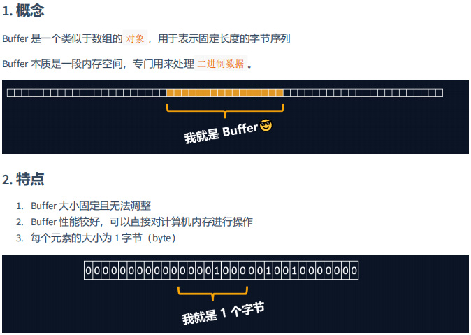
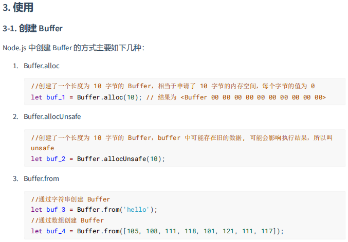
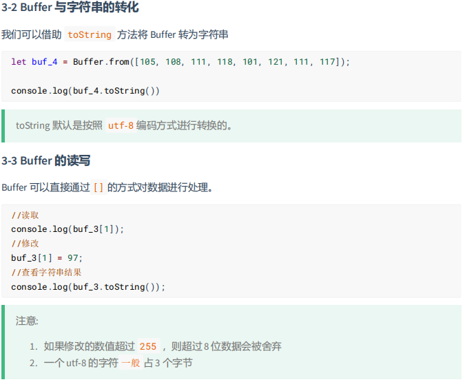

# 一、NodeJS简介

## [什么是Node.js](https://vue3.chengpeiquan.com/engineering.html#什么是-node-js)

* [node.js官网](https://nodejs.org)

> Node.js® is an open-source, cross-platform JavaScript runtime environment.
>
> Node.js是一个开源、跨平台的 JavaScript 运行时环境。
>
> Node.js （简称 Node ） 是一个基于 Chrome V8 引擎构建的 JS 运行时（ JavaScript Runtime ）。
>
> 它让 JavaScript 代码不再局限于网页上，还可以跑在客户端、服务端等场景，极大的推动了前端开发的发展，现代的前端开发几乎都离不开 Node 。
>
> 通俗来说：Node.js就是 <font color=red>一款应用程序</font>， 是<font color=red>一款软件</font>，它可以运行 JavaScript。
>

## [什么是 Runtime](https://vue3.chengpeiquan.com/engineering.html#什么是-runtime)

Runtime ，可以叫它 "运行时" 或者 "运行时环境"，这个概念是指，项目的代码在哪里运行，哪里就是运行时。

传统的 JavaScript 只能跑在浏览器上，每个浏览器都为 JS 提供了一个运行时环境，可以简单的把浏览器当成一个 Runtime ，明白了这一点，相信就能明白什么是 Node 。

Node 就是一个让 JS 可以脱离浏览器运行的环境，当然，这里并不是说 Node 就是浏览器。


# 二、下载和安装 Node

* [Current 版本](https://vue3.chengpeiquan.com/guide.html#current-版本) ：Current 是最新发布版本
* [LTS 版本](https://vue3.chengpeiquan.com/guide.html#lts-版本) ：全称 Long Time Support ，长期维护版本

> 关于 Node.js 的版本发布时间表可以在官方 GitHub 的 [Release 仓库](https://github.com/nodejs/Release) 查看。


## 方式一：手动下载安装

点击访问：[Node.js 官网下载](https://nodejs.org/zh-cn/download/)

```shell
$ node -v
```


## 方式二：homebrew

使用 brew 命令来安装：

```shell
$ brew install node
```


## 方式三：NVM

点击访问：[NVM 官方](https://github.com/nvm-sh/nvm)

> 详情 看专门文档

```shell
$ nvm --version
```


# 三、浏览器中的JavaScript 与 NodeJS中的JavaScript


## 1. 使用node运行js文件

创建一个 `001_helloworld.js` 文件：

```js
console.log("使用node运行js！！！Hello world！！！")
```

在终端运行：

```sh
$ node 001_helloworld.js 
使用node运行js！！！Hello world！！！
```


## 2. Node.js中不能使用BOM、DOM

* 浏览器中的JavaScript，包含：
    * 核心语法：ECMAScript
    * Web API：DOM、BOM、AJAX、Storage、console、定时器.....
* Node.js中的JavaScript，包含：
    * 核心语法：ECMAScript
    * Node API：fs、url、http、util、console、定时器......


**验证下：在node中调用Web API，报错！！**

```js
// DOM  不支持
console.log(document);
// BOM  不支持
console.log(window);
// 定时器 支持
setTimeout(()=> {
    console.log("i love")
}, 1000);


// 运行 报错
$ node 002_NodeJS中调用WebAPI.js
```


## 3. 顶级对象

* 浏览器中的顶级对象：window
* Node.js中的顶级对象：global、globalThis
    * global === globalThis

```js
// Node.js中的顶级对象
console.log(global)

// ES2020
console.log(globalThis)

// true
console.log(globalThis === global)
```


# 四、Buffer（缓冲器）

[Buffer课件](./尚硅谷课件/NodeJS基础课件/01_Buffer.pdf)








# 五、fs模块

fs 全称为 file system ，称之为 文件系统 ，是 Node.js 中的 **内置模块** ，可以对计算机中的磁盘进行操作。


## 1. 文件写入


# 六、path


# 七、http


# 八、模块化


# 九、express框架


# 十、


# [npm 使用介绍](https://www.runoob.com/nodejs/nodejs-npm.html)

NPM是随同Node JS一起安装的包管理工具，能解决NodeJS代码部署上的很多问题，常见的使用场景有以下几种：

- 允许用户从NPM服务器下载别人编写的第三方包到本地使用。
- 允许用户从NPM服务器下载并安装别人编写的命令行程序到本地使用。
- 允许用户将自己编写的包或命令行程序上传到NPM服务器供别人使用。

由于新版的nodejs已经集成了npm，所以之前npm也一并安装好了。同样可以通过输入 **"npm -v"** 来测试是否成功安装。命令如下，出现版本提示表示安装成功:

```shell
# 查看
$ npm -v
2.3.0

# 升级npm
$ sudo npm install npm -g

# 使用 npm 命令安装模块
$ npm install <Module Name> 		# 本地安装
$ npm install <Module Name> -g	# 全局安装

# 备注
	#本地安装
1. 将安装包放在 ./node_modules 下（运行 npm 命令时所在的目录），如果没有 node_modules 目录，会在当前执行 npm 命令的目录下生成 node_modules 目录。
2. 可以通过 require() 来引入本地安装的包。
	#全局安装
1. 将安装包放在 /usr/local 下或者你 node 的安装目录。
2. 可以直接在命令行里使用。


```


# [基础的 Node 项目](https://vue3.chengpeiquan.com/guide.html#%E5%9F%BA%E7%A1%80%E7%9A%84-node-%E9%A1%B9%E7%9B%AE)

## npm

我们强烈建议使用像 **nvm** 这样的Node版本管理器来安装Node.js和npm。

注意：安装node.js时，将自动安装npm。

```shell
$ npm -v
9.6.3
```


## npm构建node项目

```shell
# 初始化一个项目
$ npm init    

# 可以直接加上 -y 参数，这样会以 Node 推荐的答案帮快速生成项目信息。
$ npm init -y 
```


### 脚本命令的配置

在工作中，会频繁接触到 `npm run dev` 启动开发环境、 `npm run build` 构建打包等操作，这些操作其实是对命令行的一种别名。

它在 package.json 里是存放于 `scripts` 字段，以 `[key: string]: string` 为格式的键值对存放数据（ `key: value` ）。

json

```json
{
  "scripts": {
    // ...
  }
}
```

Eg:

```json
{
  "name": "hello-node",
  "version": "1.0.0",
  "description": "npm创建的第一个node项目",
  "main": "index.js",
  "scripts": {
    "test": "echo \"Error: no test specified\" && exit 1"
  },
  "author": "",
  "license": "ISC"
}
```


```sh
$ npm run test

> hello-node@1.0.0 test
> echo "Error: no test specified" && exit 1

Error: no test specified
```


# 模块化 vs 组件化

* 模块化属于 JavaScript 的概念，但作为一个页面，都知道它是由 HTML + CSS + JS 三部分组成的，既然 JS 代码可以按照不同的功能、需求划分成模块，那么页面是否也可以呢？
* 组件化：组件就是把一些可复用的 HTML 结构和 CSS 样式再做一层抽离，然后再放置到需要展示的位置。

每个组件都有自己的 “作用域” ， JavaScript 部分利用 [模块化](https://vue3.chengpeiquan.com/guide.html#学习模块化设计) 来实现作用域隔离， HTML 和 CSS 代码则借助 [Style Scoped](https://vue3.chengpeiquan.com/component.html#style-scoped) 来生成独有的 hash ，避免全局污染，这些方案组合起来，使得组件与组件之间的代码不会互相影响。

* 在 Vue ，是通过 Single-File Component （简称 SFC ， `.vue` 单文件组件）来实现组件化开发。


