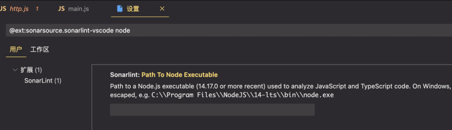
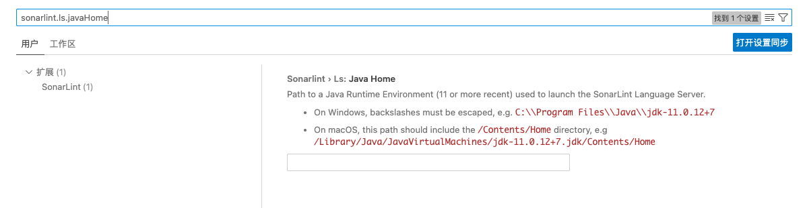

#sonarlint安装

**VSCode中安装插件之后直接就可以生效使用**

1. 安装插件sonarlint，安装链接 https://marketplace.visualstudio.com/items?itemName=SonarSource.sonarlint-vscode

2. 要求本地安装node>14.17及以上版本，推荐使用nvm安装，sonarlint会自动使用nvm的安装路径

```
nvm install 14.17.0
```


## 配置node路径

如果vscode没有自动检测到node，需要手动配置一下node路径（注意版本>=14.17.0）

在设置界面中搜索：`sonarlint` 或 `sonarlint.pathToNodeExecutable`

找到如下配置，将 `/Users/${user}/.nvm/versions/node/${version}/bin/node` 填入

示例：`/Users/weilei/.nvm/versions/node/v14.20.0/bin/node`




## 配置JAVA路径

在设置界面中搜索：`sonarlint` 或 `sonarlint.ls.javaHome`

 


