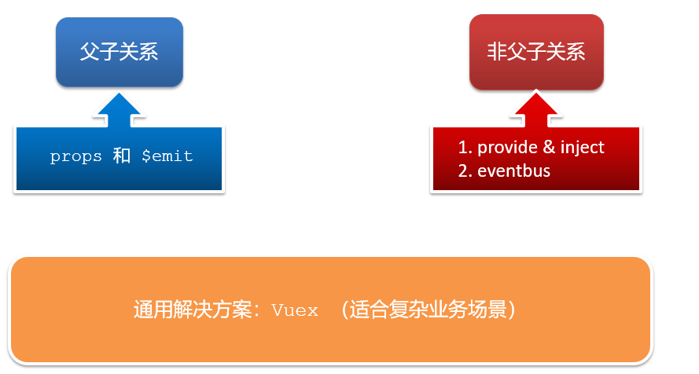

# 一、组件通信介绍

## 组件关系


## 通信解决方案




# 二、父子组件通信

* 父组件通过 **props** 将数据传递给子组件

* 子组件利用 **$emit** 通知父组件修改更新


## 2.1 父组件 -> 子组件（props）

**父向子传值步骤：**

1. 给子组件以添加属性的方式传值
2. 子组件内部通过props接收
3. 模板中直接使用 props接收的值


**父组件 App.vue**

```vue
<template>
  <div class="app" style="border: 3px solid #000; margin: 10px">
    我是APP组件
    <!-- 1.给组件标签，添加属性方式 赋值 -->
    <Son :title="myTitle"></Son>
  </div>
</template>

<script>
import Son from './components/Son.vue'
export default {
  name: 'App',
  data() {
    return {
      myTitle: '学前端，就来黑马程序员',
    }
  },
  components: {
    Son,
  },
}
</script>

<style>
</style>
```

**子组件 Son.vue**

```vue
<template>
  <div class="son" style="border:3px solid #000;margin:10px">
    <!-- 3.直接使用props的值 -->
    我是Son组件 {{title}}
  </div>
</template>

<script>
export default {
  name: 'Son-Child',
  // 2.通过props来接受
  props:['title']
}
</script>

<style>
</style>
```


## 2.2 子组件 -> 父组件（$emit）

**子向父传值步骤：**

1. $emit触发事件，给父组件发送消息通知
2. 父组件监听$emit触发的事件
3. 提供处理函数，在函数的性参中获取传过来的参数


