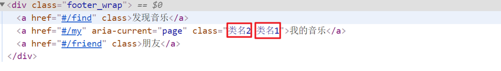

# 一、VueRouter官网

* [Vue Router中文官网](https://v3.router.vuejs.org/zh/)
    * [Vue Router - Guide](https://v3.router.vuejs.org/zh/guide/)
    * [Vue Router - installation](https://v3.router.vuejs.org/zh/installation.html)
    * [Vue Router - 示例](https://github.com/vuejs/vue-router/tree/dev/examples)
    * [VueRouter - 声明式与编程式](https://learn-vue.gitbook.io/vue-router/declarative-and-programmatic)


# 二、安装

## 版本选择

Vue2   VueRouter@3  VueX@3

Vue3 VueRouter@4  VueX@4

## 直接下载 / CDN

* https://unpkg.com/vue-router@3/dist/vue-router.js

* https://unpkg.com/vue-router@4

[Unpkg.com](https://unpkg.com/)提供了基于 NPM 的 CDN 链接。上面的链接会一直指向在 NPM 发布的最新版本。你也可以像 `https://unpkg.com/vue-router@3.0.0/dist/vue-router.js` 这样指定 版本号 或者 Tag。

在 Vue 后面加载 `vue-router`，它会自动安装的：

```html
<script src="/path/to/vue.js"></script>
<script src="/path/to/vue-router.js"></script>
```

## NPM

```bash
# VueRouter@3
npm install vue-router

# VueRouter@4
npm install vue-router@4
```


# 三、VueRouter的使用（5+2）

## 前五步：引入

固定5个固定的步骤（不用死背，熟能生巧）

1. 下载 VueRouter 模块到当前工程，版本3

    ```bash
    yarn add vue-router@3.6.5
    ```

2. main.js中引入VueRouter

    ```vue
    import VueRouter from 'vue-router'
    ```

3. 安装注册

    ```vue
    Vue.use(VueRouter)
    ```

4. 创建路由对象

    ```vue
    const router = new VueRouter()
    ```

5. 注入，将路由对象注入到new Vue实例中，建立关联

    ```vue
    new Vue({
      render: h => h(App),
      router:router
    }).$mount('#app')
    ```


当我们配置完以上5步之后 就可以看到浏览器地址栏中的路由 变成了 /#/的形式。表示项目的路由已经被Vue-Router管理了


## 两个核心步骤

1. 创建需要的组件 (views目录)，配置路由规则


1. 配置导航，配置路由出口(路径匹配的组件显示的位置)

    App.vue

    ```vue
    <div class="footer_wrap">
      <a href="#/find">发现音乐</a>
      <a href="#/my">我的音乐</a>
      <a href="#/friend">朋友</a>
    </div>
    <div class="top">
      <router-view></router-view>
    </div>
    ```


# 四、前五步的路由设置 -> 封装抽离

```vue
import Vue from 'vue'

// 1. 安装VueRouter
// 2. 引入VueRouter
import VueRouter from 'vue-router'
import HomeView from '../views/HomeView.vue'

// 3. 安装注册VueRouter
Vue.use(VueRouter)

const routes = [
  {
    path: '/',
    name: 'home',
    component: HomeView
  },
  {
    path: '/about',
    name: 'about',
    // route level code-splitting
    // this generates a separate chunk (about.[hash].js) for this route
    // which is lazy-loaded when the route is visited.
    component: () => import(/* webpackChunkName: "about" */ '../views/AboutView.vue')
  }
]

// 4. 创建路由对象
const router = new VueRouter({
  routes
})

// 5. 暴露给main.js调用
export default router
```


# 五、声明式导航 VS 编程式导航

[VueRouter官网 - 声明式与编程式](https://learn-vue.gitbook.io/vue-router/declarative-and-programmatic)

## 声明式导航

使用 `<router-link></router-link>` 创建 `a` 标签来定义导航链接的称为**声明式导航**，`to` 显示的指明了导航的目的地。

```html
<div>
  <a href="#/router_find">发现音乐 </a>
  <a href="#/router_my">我的音乐 </a>
  <a href="#/router_friend">朋友</a>
</div>

<nav>
  <router-link to="/">Home</router-link> |
  <router-link to="/about">About</router-link>
</nav>
```

## 编程式导航

编程式导航，顾名思义，就是**通过代码来进行路由的跳转**。


#六、声明式导航

## 一、声明式导航 - 导航链接

### 1.需求

实现导航高亮效果。

如果使用a标签进行跳转的话，需要给当前跳转的导航加样式，同时要移除上一个a标签的样式，太麻烦！！！


### 2.解决方案

vue-router 提供了一个全局组件 router-link (取代 a 标签)

- **能跳转**，配置 to 属性指定路径(**必须**) 。本质还是 a 标签 ，**to 无需 `#`**
- **能高亮**，默认就会提供**高亮类名**，可以直接设置高亮样式

语法： `<router-link to="path的值">发现音乐</router-link>`

```vue
  <div>
    <div class="footer_wrap">
      <router-link to="/find">发现音乐</router-link>
      <router-link to="/my">我的音乐</router-link>
      <router-link to="/friend">朋友</router-link>
    </div>
    <div class="top">
      <!-- 路由出口 → 匹配的组件所展示的位置 -->
      <router-view></router-view>
    </div>
  </div>
```

### 3.通过router-link自带的两个样式进行高亮

使用router-link跳转后，我们发现。当前点击的链接默认加了两个class的值 `router-link-exact-active`和`router-link-active`

我们可以给任意一个class属性添加高亮样式即可实现功能


## 二、声明式导航 - 两个类名

当我们使用 `<router-link></router-link>` 跳转时，自动给当前导航加了**两个类名**


### 1. `router-link-active`

**模糊匹配（用的多）**

to="/my"  可以匹配 /my    /my/a    /my/b    ....  

只要是以/my开头的路径 都可以和 to="/my"匹配到


### 2. `router-link-exact-active`

**精确匹配**

to="/my" 仅可以匹配  /my


### 3. 自定义样式

```vue
<template>
  <div id="app">
    <div class="top_wrap">
      <router-link to="/router_find">发现音乐 </router-link>
      <router-link to="/router_my">我的音乐 </router-link>
      <router-link to="/router_friend">朋友</router-link>
    </div>
  </div>
</template>

<style>
    .top_wrap a {
      flex: 1;
      text-decoration: none;
      padding: 20px 0;
      line-height: 20px;
      background-color: #333;
      color: #ccc;
      border: 1px solid black;
    }

    .top_wrap a.router-link-active {
      background-color: purple;
    }

    .top_wrap a:hover {
      background-color: orange;
    }
</style>
```


## 三、声明式导航 - 自定义类名（了解）

### 1.问题

`<router-link>` 的**两个高亮类名 太长了**，我们希望能定制怎么办?

### 2.解决方案

我们可以在创建路由对象时，额外配置两个配置项即可。 `linkActiveClass `和 `linkExactActiveClass`

```js
const router = new VueRouter({
  routes: [...],
  linkActiveClass: "类名1",
  linkExactActiveClass: "类名2"
})
```



### 3.代码演示

```js
// 创建了一个路由对象
const router = new VueRouter({
  routes: [
    ...
  ], 
  linkActiveClass: 'active', // 配置模糊匹配的类名
  linkExactActiveClass: 'exact-active' // 配置精确匹配的类名
})
```


## 四、声明式导航 - 跳转传参

### 1. 查询参数传参

#### a. 查询参数传参

- 如何传参？

    `<router-link to="/path?参数名=值"></router-link>`

- 如何接受参数

    固定用法：`$route.query.参数名`

```vue
# 传递参数
<div class="top_wrap">
  <router-link to="/router_find?key=我是参数">发现音乐 </router-link>
  <router-link to="/router_my">我的音乐 </router-link>
  <router-link to="/router_friend">朋友</router-link>
</div>

# 获取参数
<template>
  <div>
    // 省略this
    <p> {{ $route.query.key }}</p>
  </div>
</template>

# 获取参数
<script>
export default {
  created () {
    // 在created中，获取路由参数
    // this.$route.query.参数名 获取
    console.log(this.$route.query.key)
  }
}
</script>
```


### 2. 动态路由传参

- 配置动态路由

    > 动态路由后面的参数可以随便起名，但要有语义

    ```js
    const router = new VueRouter({
      routes: [
        ...,
        { 
          path: '/search/:keyparam', 
          component: Search 
        }
      ]
    })
    ```

- 配置导航链接

    `to="/path/参数值"`

    ```vue
    <template>
      <div id="app">
        <router-link to="/router_friend/我是动态参数">朋友</router-link>
      </div>
    </template>
    ```

- 对应页面组件接受参数

    `$route.params.参数名`

    > params后面的参数名要和动态路由配置的参数保持一致

    ```vue
    <script>
    export default {
      created () {
        // 在created中，获取路由参数
        // this.$route.params.参数名 获取
        console.log(this.$route.params.keyparam)
      }
    }
    </script>
    ```

    

### 3. 查询参数传参 VS 动态路由传参

1. 查询参数传参  (比较适合传**多个参数**) 

    1. 跳转：`to="/path?参数名=值&参数名2=值"`
    2. 获取：`$route.query.参数名`

2. 动态路由传参 (**优雅简洁**，传 **单个参数** 比较方便)

    1. 配置动态路由：`path: "/path/:参数名" `
    2. 跳转：`to="/path/参数值"`
    3. 获取：`$route.params.参数名 `

    注意：动态路由也可以传多个参数，但一般只传一个


# 七、编程式导航

## 一、编程式导航 - 两种路由跳转方式

### 1. path路径跳转 

**特点：简易方便**

```js
//简单写法
this.$router.push('路由路径')

//完整写法
this.$router.push({
  path: '路由路径'
})

// 实际代码
<script>
export default {
  name: 'FindMusic',
  methods: {
    goSearch () {
      // 1. 通过路径的方式跳转
      // (1) this.$router.push('路由路径') [简写]
      this.$router.push('/search')

      // (2) this.$router.push({     [完整写法]
      //         path: '路由路径' 
      //     })
      this.$router.push({
        path: '/search'
      })
    }
  }
}
</script>
```


### 2. name命名路由跳转 

**特点：适合 path 路径长的场景**

语法：

- 路由规则，必须配置name配置项

    ```js
    { name: '路由名', path: '/path/xxx', component: XXX },
    ```

- 通过name来进行跳转

    ```js
    this.$router.push({
      name: '路由名'
    })
    ```


## 二、path路径跳转传参

### 1. query传参

```js
//简单写法
this.$router.push('/路径?参数名1=参数值1&参数2=参数值2')
//完整写法
this.$router.push({
  path: '/路径',
  query: {
    参数名1: '参数值1',
    参数名2: '参数值2'
  }
})
```

**接受参数的方式依然是：`$route.query.参数名`**

### 2. 动态路由传参

```js
// 简单写法
this.$router.push('/路径/参数值')

// 完整写法
this.$router.push({
  path: '/路径/参数值'
})
```

**接受参数的方式依然是：`$route.params.参数值`**

**注意：**path不能配合params使用


## 三、name命名路由传参

### 1.  query传参

```js
this.$router.push({
  name: '路由名字',
  query: {
    参数名1: '参数值1',
    参数名2: '参数值2'
  }
})
```

### 2. 动态路由传参

```js
this.$router.push({
  name: '路由名字',
  params: {
    参数名: '参数值',
  }
})
```


# 八、Vue路由-重定向

### 1.问题

网页打开时， url 默认是 / 路径，未匹配到组件时，会出现空白


### 2.解决方案

**重定向** → 匹配 / 后, 强制跳转 /home 路径

### 3.语法

```js
{ path: 匹配路径, redirect: 重定向到的路径 },
比如：
{ path:'/' ,redirect:'/home' }
```

### 4.代码演示

```js
const router = new VueRouter({
  routes: [
    { path: '/', redirect: '/home'},
	{
	    path: '/a', // 重定向，方式一
    	redirect: '/router_my'
  	}, 
    {
    	path: '/b', // 重定向，方式二
    	component: RouterFriendddd
  	}
  ]
})
```


# 九、Vue路由-404

### 1.作用

当路径找不到匹配时，给个提示页面

### 2.位置

404的路由，虽然配置在任何一个位置都可以，但一般都**配置在其他路由规则的最后面**

### 3.语法

`path: "*"`   (任意路径) – 前面不匹配就命中最后这个

```js
import NotFind from '@/views/NotFind'

const router = new VueRouter({
  routes: [
    ...
    { path: '*', component: NotFind } //最后一个
  ]
})
```

### 4.代码示例

NotFound.vue

```vue
<template>
  <div>
    <h1>404 Not Found</h1>
  </div>
</template>

<script>
export default {

}
</script>

<style>

</style>
```

router/index.js

```js
...
import NotFound from '@/views/NotFound'
...

// 创建了一个路由对象
const router = new VueRouter({
  routes: [
     ...
    { path: '*', component: NotFound }
  ]
})

export default router
```


# 十、Vue路由-模式设置 `#`

### 1.问题

路由的路径看起来不自然, 有#，能否切成真正路径形式?

- hash路由 (默认)        例如:  http://localhost:8080/#/home
- history路由 (常用)     例如: http://localhost:8080/home   (以后上线需要服务器端支持，开发环境webpack给规避掉了history模式的问题)

### 2.语法

```js
// 创建了一个路由对象
const router = new VueRouter({
  // 注意：一旦采用了 history 模式，地址栏就没有 #，需要后台配置访问规则
  mode: 'history', //默认是hash
  routes: [
    { path: '/', redirect: '/home' },
    { path: '/home', component: Home },
    { name: 'search', path: '/search/:words?', component: Search },
    { path: '*', component: NotFound }
  ]
})
```

