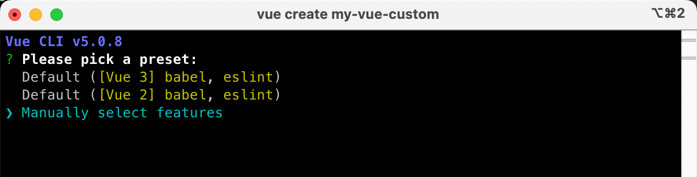
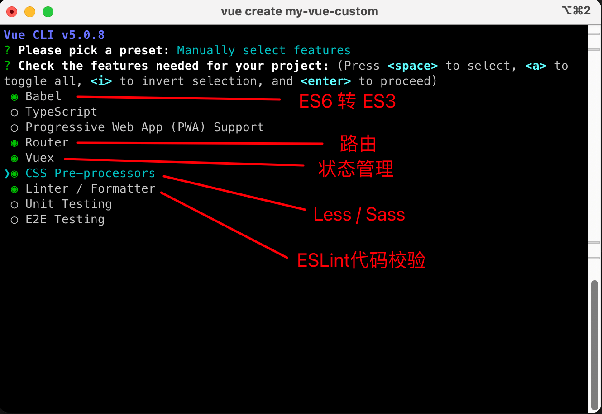
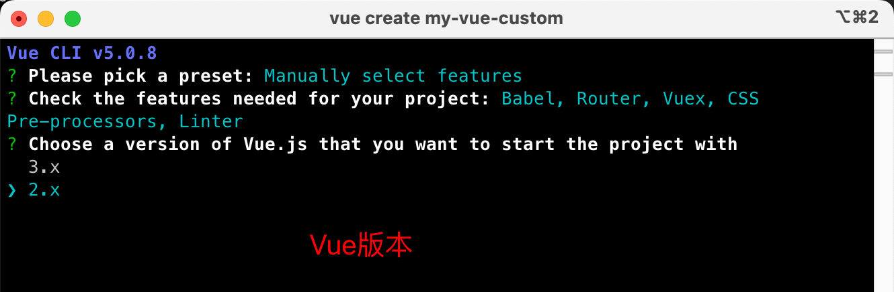
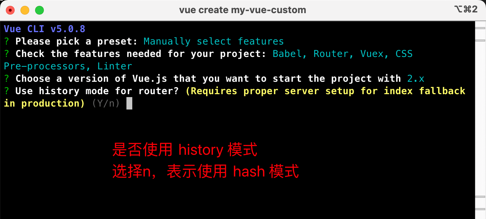
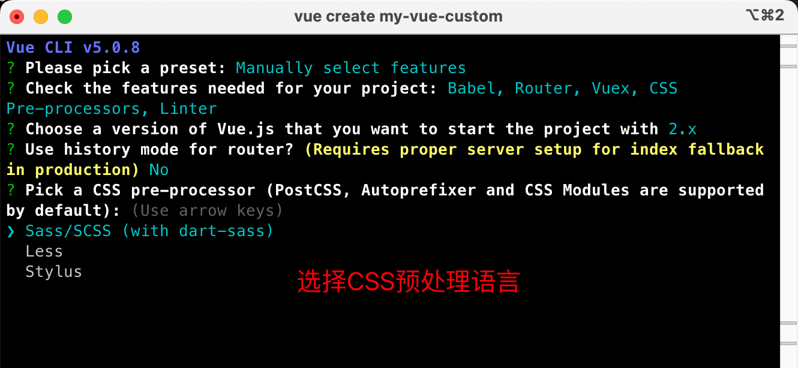
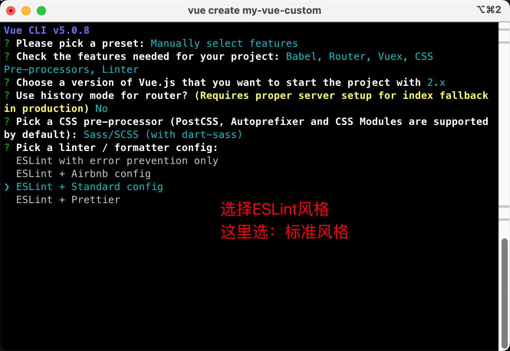
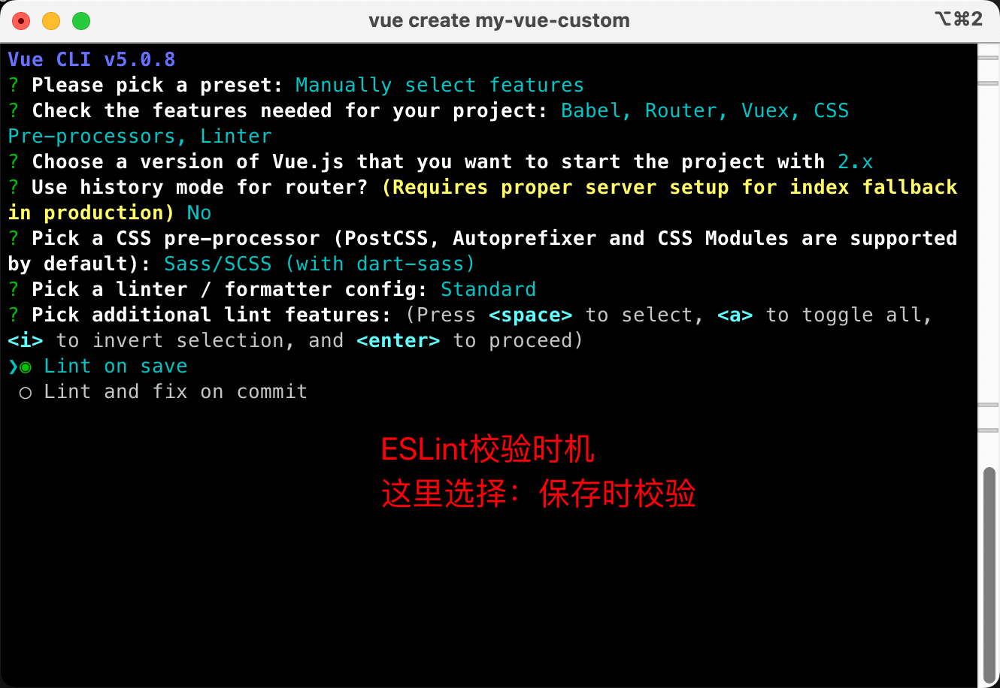
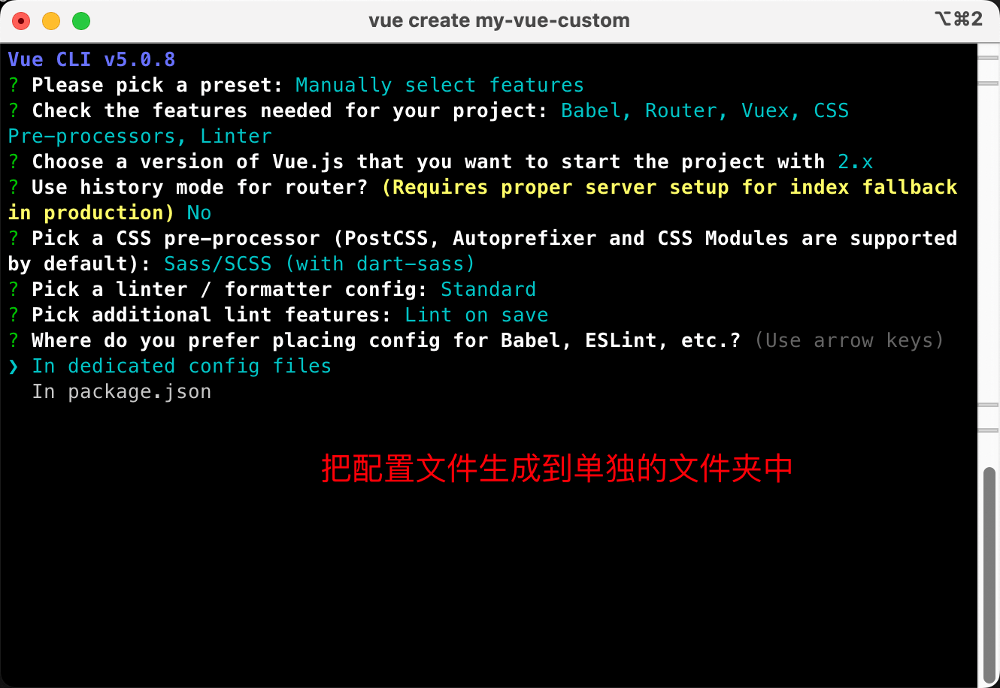
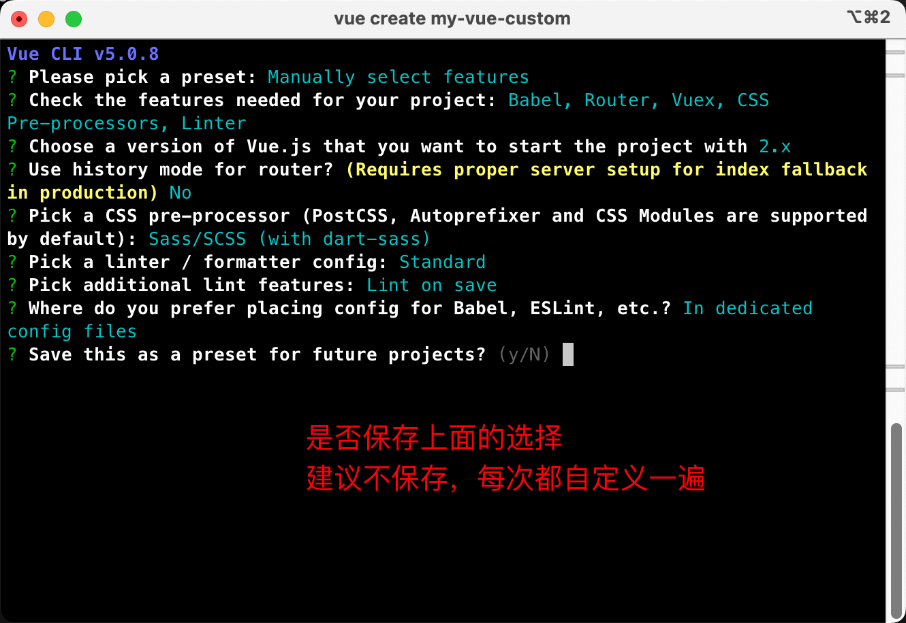
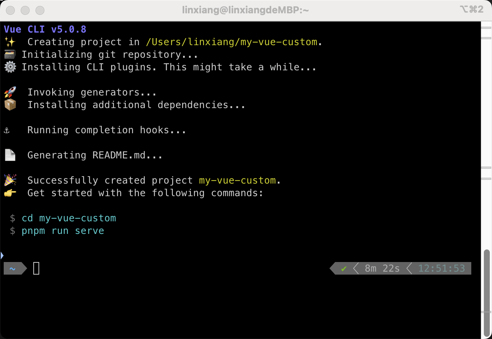

* 参考：黑马Vue2+vue3 / 笔记06 / 二十二


# VueCli 自定义创建项目

## 一、安装脚手架

```sh
# 安装
$ npm i @vue/cli -g

# 查看
$ vue -V
@vue/cli 5.0.8
```


## 二、创建项目

### 1. 创建项目

```sh
$ vue create my-vue-custom
```




### 2. 手动选择功能




### 3. 选择Vue版本




### 4. 是否使用history模式




### 5. 选择css预处理




### 6. 选择eslint的风格 

> eslint 代码规范的检验工具，检验代码是否符合规范




### 7. 选择校验的时机




### 8. 选择配置文件的生成方式




### 9. 是否保存预设，下次直接使用




### 10. 安装完成，运行！




