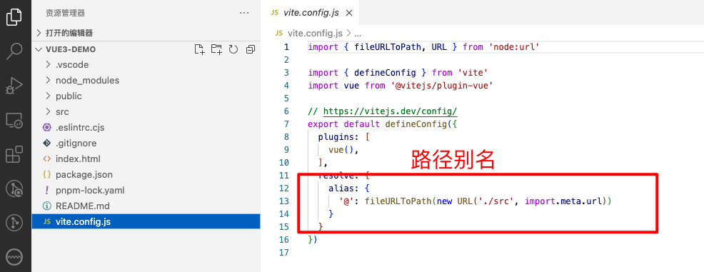

# Vue3优势

# 脚手架

* Vue2  -> [Vue CLI](https://cli.vuejs.org/zh/#%E8%B5%B7%E6%AD%A5) -> Webpack
* Vue3 -> [create-vue](https://cn.vuejs.org/guide/scaling-up/tooling.html#project-scaffolding)  -> Vite

# Vue2 / 3 项目差异

## 配置文件

* vue.config.js

* vite.config.js

