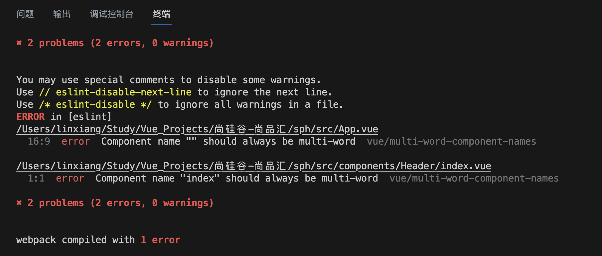
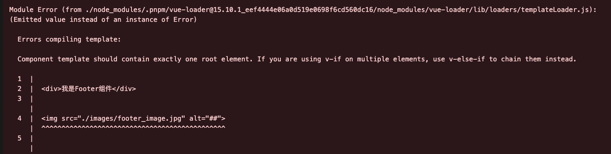
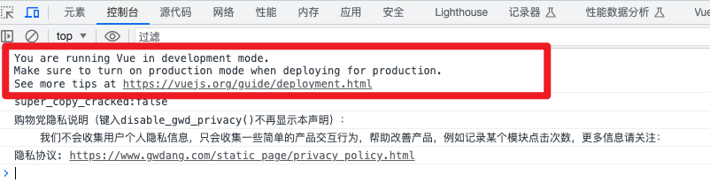
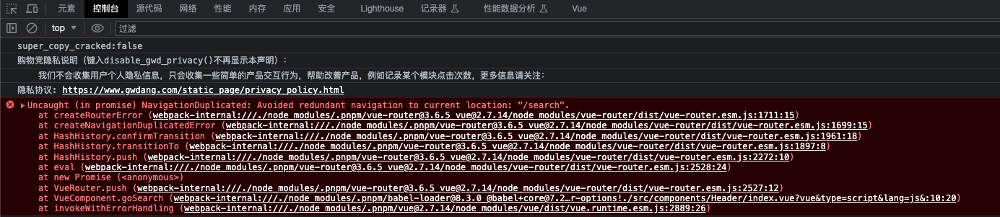

# 报错一

Vue项目报错： Component name “xxx“ should always be multi-word vue/multi-word-component-names



**原因**

在配置完 [ESlint](https://so.csdn.net/so/search?q=ESlint&spm=1001.2101.3001.7020) 后，要求代码格式规范的同时，也规定了组件的名称格式，要写成 “XXXName”的格式，不能是单个单词。

**处理**

所以除了改名，另一种解决方法是在 vue.config.js 文件中加一行

```js
module.exports = defineConfig({
  transpileDependencies: true,
  lintOnSave: false   // 新增一行
})
```


# 报错二



**原因**

组件模板应该只包含一个根元素

**处理**

写一个根div


# 警告三

运行成功，控制台提示当前Vue为开发版本



**处理**

Vue.config.productionTip = false


# 报错四

Avoided redundant navigation to current location: "/search". NavigationDuplicated: Avoided redundant navigation to current location: "/search".



**原因**

- 解决 Vue 路由传递参数时，出现 Uncaught (in promise) NavigationDuplicated: Avoided redundant navigation 问题 .
- 报错内容：Uncaught (in promise) NavigationDuplicated: Avoided redundant navigation to current location: "/search/111".
- 问题描述：重复点击导航时，控制台报错

**解决方案**

`src/router/index.js` 配置文件中添加以下代码:

```js
// src/router/index.js
import Vue from 'vue'
import VueRouter  from 'vue-router'
Vue.use(VueRouter)
 
//添加以下代码
const originalPush = VueRouter.prototype.push
VueRouter.prototype.push = function push(location) {
  return originalPush.call(this, location).catch(err => err)
}
```


