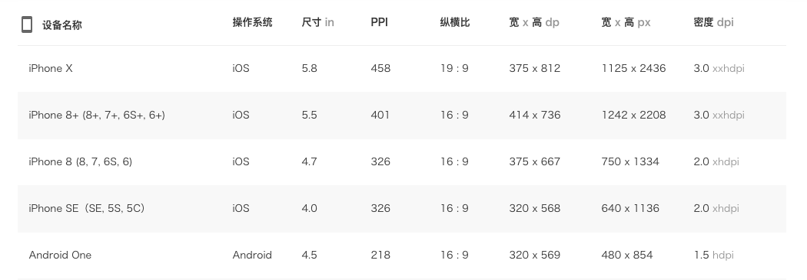
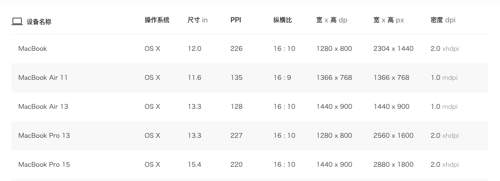
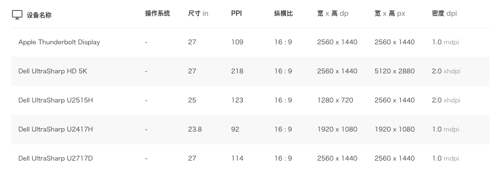
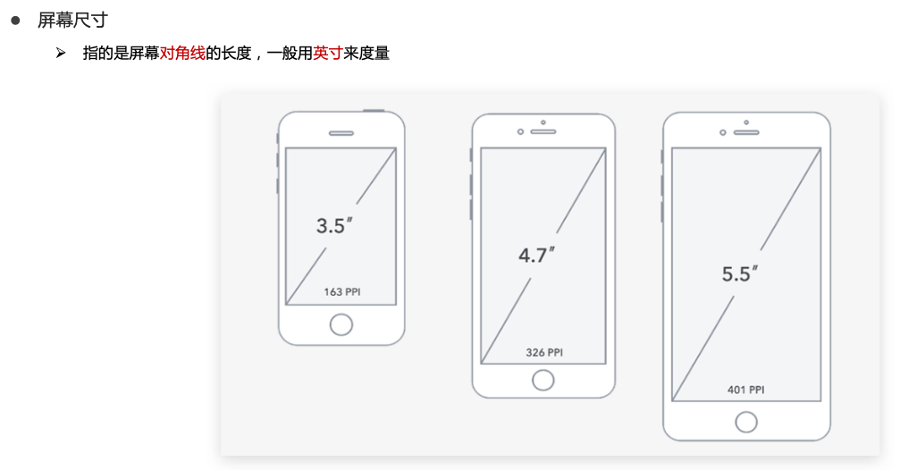
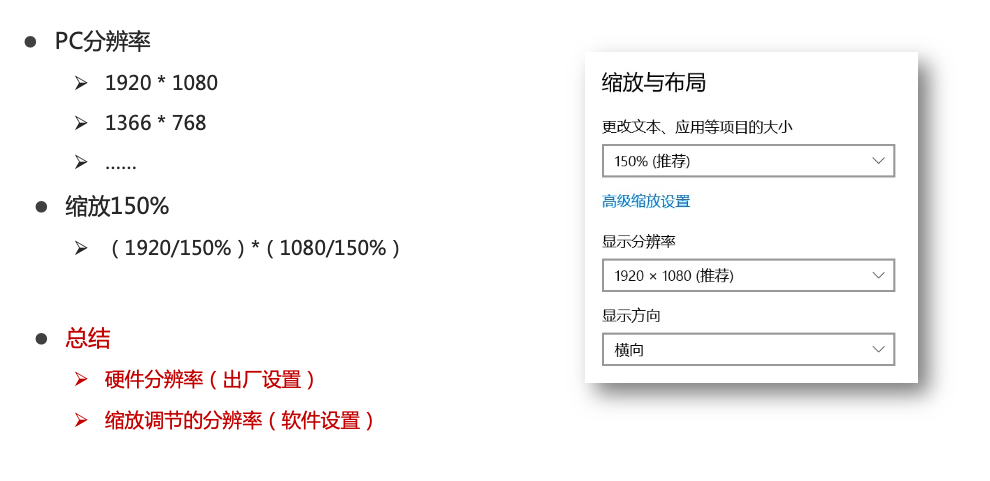
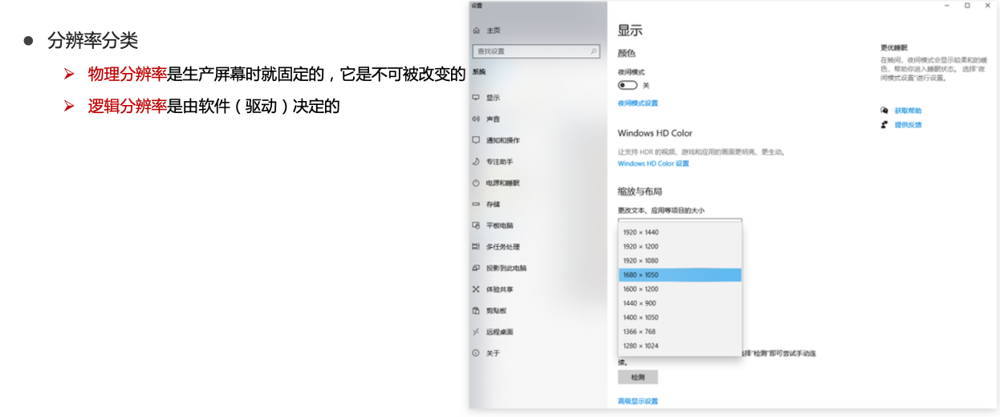
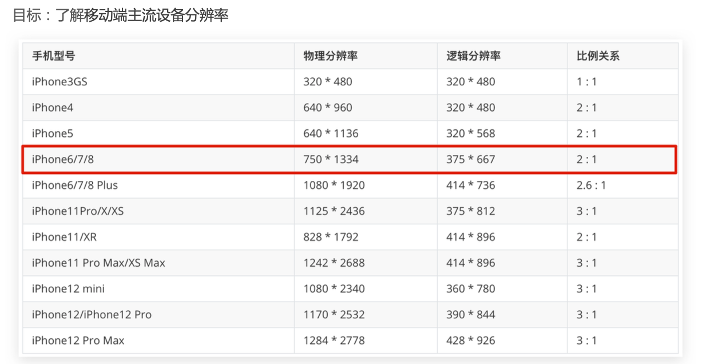
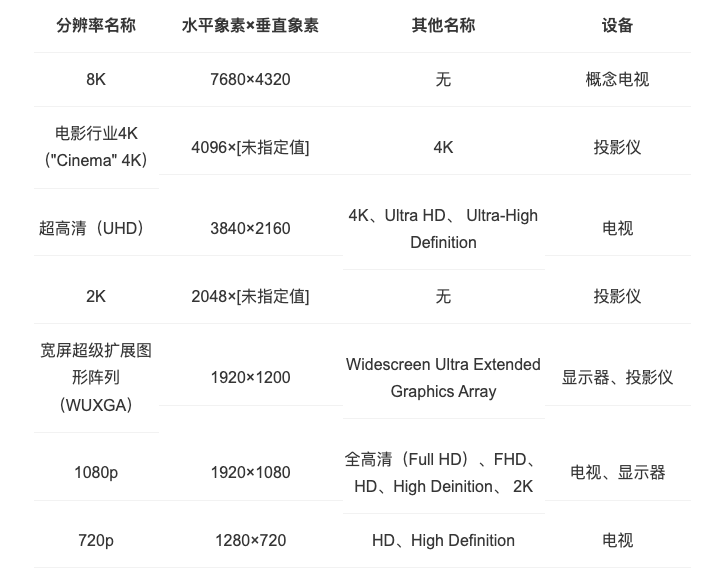
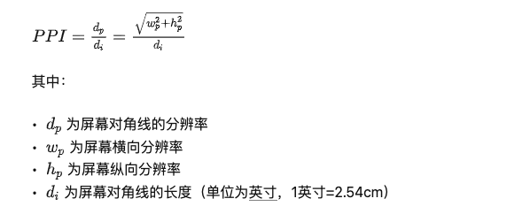
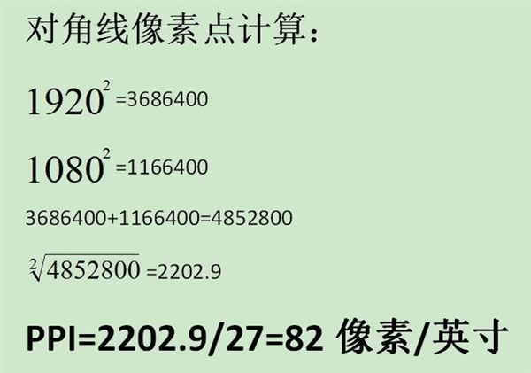

[Designer's guide to DPI](https://www.sebastien-gabriel.com/designers-guide-to-dpi/)

[屏幕尺寸大全](https://www.woshipm.com/screen/index.html)

# 参数一览

## 手机

## 电脑

## 显示器

# 屏幕尺寸

> 对角线长度

# 分辨率

> 屏幕分辨率是指纵横向上的像素点数，单位是px。
>
> 就相同大小的屏幕而言，当屏幕分辨率低时（例如 640 x 480），在屏幕上显示的像素少，单个像素尺寸比较大。屏幕分辨率高时（例如 1600 x 1200），在屏幕上显示的像素多，单个像素尺寸比较小。

## 逻辑分辨率、物理分辨率

* 物理分辨率：硬件所支持的

* 逻辑分辨率：软件可以达到的

imac的物理分辨率已经达到了5120 x 2880，但是告诉软件的时候还是说我的分辨率是1280*720，相当在看来的一个逻辑像素点，背后实际上已经有16个物理像素点为其工作了！

## iPhone分辨率

## 1080P、2K、4K、8K

> 问：如果4K是1080p的四倍，那是否意味着4K就等于4320p？
>
> 不是

### P

720P，1080P等，表示的是 **<u>“视频像素的总行数”</u>**，比如，720P表示视频有720行的像素，而1080P则表示视频总共有1080行像素数，1080P分辨率的摄像机通常像素数是1920*1080。“P”本身表示的是“逐行扫描”，是Progressive的缩写，相对于隔行扫描（Interlaced）。

### K

2K，4K等，表示的是 **<u>“视频像素的总列数”</u>**，如4K, 表示的是视频有4000列像素数，具体是3840或4096列。4K分辨率的摄像机通常像素数是3840 * 2160或4096 * 2160。

### MP

MP是像素总数，即像素的行数P及列数K相乘后的结果（百万像素）。比如，1080P摄像机是1920像素与1080像素相乘，得到2MP（百万像素）的像素总数。

### 1080P

过去曾使用 ***垂直分辨率*** 来描述分辨率。因此1080p代表的是垂直分辨率。而几乎所有的高清显示屏的纵横比都是1.78：1（即16×9，又名“宽屏”），这意味着其水平分辨率为1920像素（即1920×1080）。

### 2K

2K表示：**水平分辨率为2048像素**，虽然1920×1080很接近2K的标准，但往往不把1080p叫做2K，他们称之为1080p或全高清。

### 4K

4K意味着 **水平分辨率为4096像素**。这是数字电影倡导联盟（Digital Cinema Initiatives）所提出的分辨率。由于电影的纵横比不同，矩形屏幕的确切形状决定了电影的纵横比，所以其垂直分辨率并没有具体指定。

严格从技术上来说，“4K”不是超高清，超高清的分辨率为3840×2160。两者之间的像素区别仅13%，基本上看不到多大差异。绝大多数人都更喜欢“4K”这一名称表示超高清。

# PPI（像素密度）

PPI是英文 **Pixels Per Inch** 的缩写，翻译成中文的意思是像素/英寸，所代表的含义是 **显示器屏幕每英寸所拥有的像素数量** 。

这里的英寸（Inch）并非面积单位，它是一个长度单位，**1英寸=2.54厘米**。也就是说，**PPI是计算的显示器<u>对角线上每英寸直线穿过的像素数</u>，而不是每平方英寸的面积中拥有的像素数**。

## PPI如何计算

### 计算iPhone4 PPI 

我们以 iPhone4 为例，它的大小为 3.5 英寸，分辨率为 960x640，通过上述公式计算得出它的每英寸像素数为 326。

### 计算1080p显示器PPI

27英寸1080p分辨率显示器的PPI为82英寸

