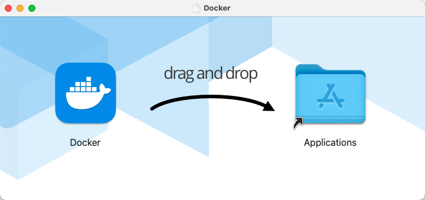
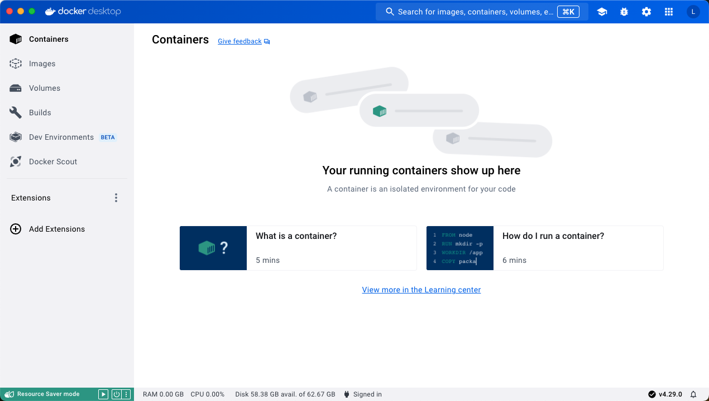
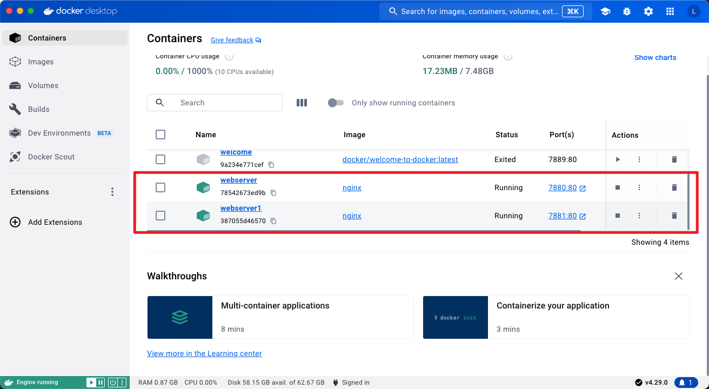
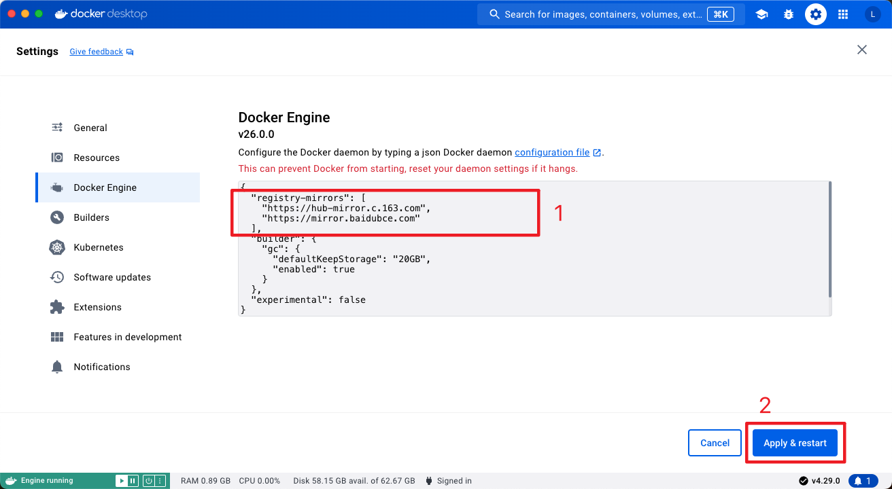
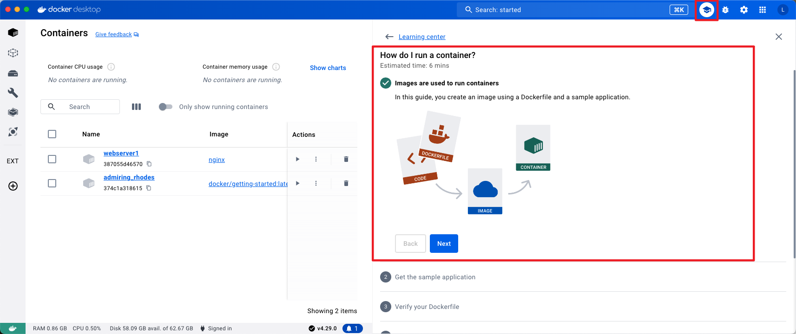

* [docker 官网](https://www.docker.com/)
* [docker hub](https://hub.docker.com/)
* [docker docs 官方文档](https://docs.docker.com/)
    * [Install Docker Desktop on Mac](https://docs.docker.com/desktop/install/mac-install/)
    * [Docker Desktop release notes](https://docs.docker.com/desktop/release-notes/)

* [菜鸟教程 - MacOS Docker 安装](https://www.runoob.com/docker/macos-docker-install.html)
* [Docker — 从入门到实践](https://yeasy.gitbook.io/docker_practice)
    * [macOS](https://yeasy.gitbook.io/docker_practice/install/mac)


# 一、Mac安装Docker Desktop

## 1. What’s Docker Desktop?

> **The fastest way to containerize applications.**
>
> Docker Desktop is secure, out-of-the-box containerization software offering developers and teams a robust, hybrid toolkit to build, share, and run applications anywhere.

容器化应用程序的最快方法

Docker Desktop是安全的，开箱即用的容器化软件，为开发人员提供了一个强大的混合工具包，可在任何地方构建，共享和运行应用程序。


## 2. 系统要求

* 系统越新越好

- At least 4 GB of RAM.


## 3. 两种安装方式

### a. 使用 Homebrew 安装

```sh
$ brew install --cask docker

# or
$ brew install --cask --appdir=/Applications docker
```

### b. 手动下载安装

首先打开Docker官网并下载 [Docker Desktop](https://www.docker.com/products/docker-desktop/)，选择Apple Chip下载。




打开Docker Desktop应用




启动终端后，通过命令可以检查安装后的 Docker 版本。

```sh
$ docker --version
Docker version 26.0.0, build 2ae903e

# or
$ docker info

# 其他
$ docker-compose --version
$ docker-machine --version
```


# 二、简单运行 Nginx

如果 `docker version`、`docker info` 都正常的话，可以尝试运行一个 [Nginx 服务器](https://hub.docker.com/_/nginx/)：

```sh
# 初次安装
$ docker run -d -p 7880:80 --name webserver nginx

Unable to find image 'nginx:latest' locally
latest: Pulling from library/nginx
26070551e657: Pull complete
cd17d01e1374: Pull complete
ef0e643bf248: Pull complete
87875ca4aaca: Pull complete
2b81c8fa4150: Pull complete
e9f795af5c8b: Pull complete
ca43e9145418: Pull complete
Digest: sha256:0463a96ac74b84a8a1b27f3d1f4ae5d1a70ea823219394e131f5bf3536674419
Status: Downloaded newer image for nginx:latest
78542673ed9b2964d8f1a279f7c22d69ed97ccf550ee6841f01c9de36ee0da3d

# 再次安装，修改 port 和 name
$ docker run -d -p 7881:80 --name webserver1 nginx
387055d465708e28147892e88e49812f17c85485ba046dd54f563728c9104917
```

在终端中执行，发现本地没有 `nginx:latest` 镜像，所以先下载镜像，然后再创建一个名为 `webserver` 的容器，端口号7880。

再创建一个名为 `webserver1`  的新容器，端口号7881。


在 docker desktop 的 image 可以看到我们刚刚下载到的 `iginx` 镜像。


在 docker desktop 容器中 可以看到，我们在终端中创建的 `webserver` 和 `webserver1` 两个容器。




分别打开 http://localhost:7880/ 与 http://localhost:7881/


成功！！！


要停止 Nginx 服务器并删除执行下面的命令：

```sh
# 停止容器运行
$ docker stop webserver

# 删除容器
$ docker rm webserver
```


**【以上操作在docker desktop的页面中都可操作！！！！】**


# 三、终端命令

```sh
$ docker --version
$ docker-compose --version
$ docker-machine --version

$ docker info

$ docker ps 查看正在运行的容器

$ docker stop 停止正在运行的容器

$ docker start 启动容器

$ docker ps -a 查看终止状态的容器

$ docker rm -f webserver命令来移除正在运行的容器

$ docker list 列出本地镜像

$ docker rmi 删除的镜像
```


# 四、镜像加速

* [Docker — 从入门到实践 -- 镜像加速器](https://yeasy.gitbook.io/docker_practice/install/mirror)

国内从 Docker Hub 拉取镜像有时会遇到困难，此时可以配置镜像加速器。国内很多云服务商都提供了国内加速器服务，例如：

- [阿里云加速器(点击管理控制台 -> 登录账号(淘宝账号) -> 左侧镜像工具 -> 镜像加速器 -> 复制加速器地址)](https://cr.console.aliyun.com/cn-hangzhou/instances)
- [网易云加速器 `https://hub-mirror.c.163.com`](https://www.163yun.com/help/documents/56918246390157312)
- [百度云加速器 `https://mirror.baidubce.com`](https://cloud.baidu.com/doc/CCE/s/Yjxppt74z#使用dockerhub加速器)

**由于镜像服务可能出现宕机，建议同时配置多个镜像。各个镜像站测试结果请到** [**docker-practice/docker-registry-cn-mirror-test**](https://github.com/docker-practice/docker-registry-cn-mirror-test/actions) **查看。**


## 1. macOS

对于使用 macOS 的用户，在任务栏点击 Docker Desktop 应用图标 -> `Settings...`，在左侧导航菜单选择 `Docker Engine`，在右侧像下边一样编辑 json 文件。修改完成之后，点击 `Apply & restart` 按钮，Docker 就会重启并应用配置的镜像地址了。

复制

```
{
  "registry-mirrors": [
    "https://hub-mirror.c.163.com",
    "https://mirror.baidubce.com"
  ]
}
```




## 2. 检查加速器是否生效

执行 `$ docker info`，如果从结果中看到了如下内容，说明配置成功。

```sh
$ docker info
.......
Registry Mirrors:
  https://hub-mirror.c.163.com/
  https://mirror.baidubce.com/
```


# 五、创建镜像

参考教程：How do I run a container?




## 1. 拉取 welcome-to-docker⁠

Clone the repository at [https://github.com/docker/welcome-to-docker⁠](https://github.com/docker/welcome-to-docker).

```
git clone https://github.com/docker/welcome-to-docker
```

The rest of this guide requires you to run commands in the new project directory. Run the following command before moving on.

```
cd welcome-to-docker
```


# 安装其他软件

## 安装Mysql Docker 容器版

https://www.zhihu.com/question/517679596


## 安装MongoDB Docker版

https://www.zhihu.com/question/517679596
