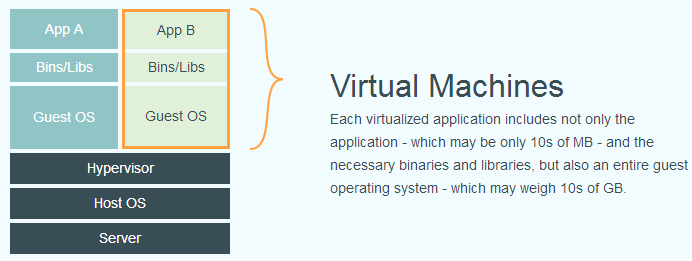
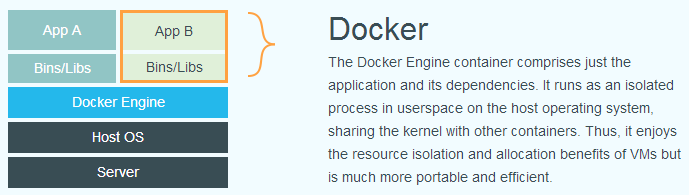

* [Docker官网](http://www.docker.com)
* [Docker官方文档](https://docs.docker.com/get-docker/)
* [Docker Hub官网（安装docker镜像的仓库）](https://hub.docker.com)

# 一、Docker简介

## 1. Docker为什么出现？

​		在传统的开发中，当代码结束开发和测试，要交给运维部署时，开发团队也得准备完整的部署文件，让维运团队得以部署应用程式，开发需要清楚的告诉运维部署团队，用的全部配置文件+所有软件环境。不过，即便如此，仍然常常发生部署失败的状况。 所以就出现了docker，从根本上解决环境配置的问题，安装的时候，把原始环境一模一样地复制过来。开发人员利用 Docker 可以消除协作编码时“在我的机器上可正常工作”的问题。

> Docker的主要目标是 “Build，Ship and Run Any App,Anywhere”。
>
> ***一句话：从原来的搬家，变成整栋楼一起搬。一次镜像，处处运行。***
>
> * 更快速的应用交付与部署
> * 更便捷的升级与扩缩容
> * 更简单的系统运维
> * 更高效的计算机资源利用

## 2. Docker与虚拟机对比

​		下面的图片比较了 **Docker** 和传统虚拟化方式的不同之处。传统虚拟机技术是虚拟出一套硬件后，在其上运行一个完整操作系统，在该系统上再运行所需应用进程；而容器内的应用进程直接运行于宿主的内核，容器内没有自己的内核，而且也没有进行硬件虚拟。因此容器要比传统虚拟机更为轻便。

* 传统虚拟化

* Docker

Docker 和传统虚拟化方式的不同之处：

- 传统虚拟机技术是虚拟出一套硬件后，在其上运行一个完整操作系统，在该系统上再运行所需应用进程；
- 容器内的应用进程直接运行于宿主的内核，容器内没有自己的内核且也没有进行硬件虚拟。因此容器要比传统虚拟机更为轻便。
- 每个容器之间互相隔离，每个容器有自己的文件系统 ，容器之间进程不会相互影响，能区分计算资源。

# 二、Docker的安装

*【前提说明】*

**Docker 并非是一个通用的容器工具，它依赖于己存在并运行的Linux 内核环境。**

Docker 实质上是在已经运行的 Linux 下制造了一个隔高的文件环境，因此它执行的效率几乎等同于所部署的 Linux 主机。

因此， Docker 必须部考在 Linux 內核的系统上。如果其他系统想部号 Docker 就必须安装一个虚拟 Linux 环境。

在Windows 上部界 Docker 的方法都足先安装一个店拟机，并在安装 Linux 系统的的處拟机中运行 Docker。

> **docker必须部署在linux内核的系统上，如果其他系统想部署docker就必须安装一个虚拟linux环境。**

## 3. Docker三要素

- **镜像**（`Image`）
- **容器**（`Container`）
- **仓库**（`Repository`）

docker三要素：镜像、仓库、容器

镜像就是模板，容器就是镜像的一个实例，docker利用容器独立运行一个或一组应用，可以把容器看作是一个简易版的Linux环境和运行在其中的应用程序，仓库是集中存放镜像的地方。

容器与镜像的关系，类似于对象与类的关系。

# 三、常用命令

# 四、Docker镜像

# 五、本地镜像发布到阿里云

