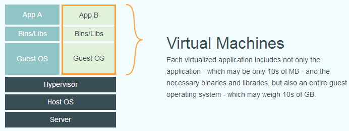
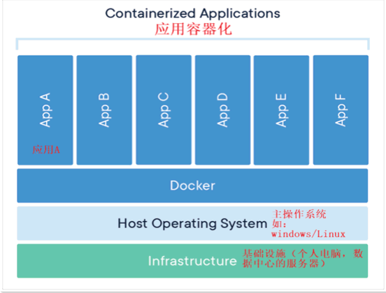
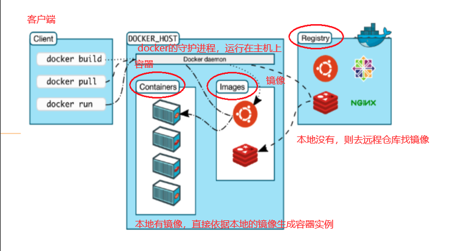

* [哔哩哔哩 - 尚硅谷Docker实战教程（docker教程天花板）](https://www.bilibili.com/video/BV1gr4y1U7CY?p=1&vd_source=dc55c355e9f5b6174832aacfb5d8b6aa)
* [Docker官网](http://www.docker.com)
* [Docker官方文档](https://docs.docker.com/get-docker/)
* [Docker Hub官网（安装docker镜像的仓库）](https://hub.docker.com)


# 一、Docker简介

## 1. Docker为什么出现？

​		在传统的开发中，当代码结束开发和测试，要交给运维部署时，开发团队也得准备完整的部署文件，让维运团队得以部署应用程式，开发需要清楚的告诉运维部署团队，用的全部配置文件+所有软件环境。不过，即便如此，仍然常常发生部署失败的状况。 所以就出现了docker，从根本上解决环境配置的问题，安装的时候，把原始环境一模一样地复制过来。开发人员利用 Docker 可以消除协作编码时“在我的机器上可正常工作”的问题。

> Docker的主要目标是 “Build，Ship and Run Any App,Anywhere”。
>
> ***一句话：从原来的搬家，变成整栋楼一起搬。一次镜像，处处运行。***
>
> * 更快速的应用交付与部署
> * 更便捷的升级与扩缩容
> * 更简单的系统运维
> * 更高效的计算机资源利用


## 2. Docker与虚拟机对比

​		下面的图片比较了 **Docker** 和传统虚拟化方式的不同之处。传统虚拟机技术是虚拟出一套硬件后，在其上运行一个完整操作系统，在该系统上再运行所需应用进程；而容器内的应用进程直接运行于宿主的内核，容器内没有自己的内核，而且也没有进行硬件虚拟。因此容器要比传统虚拟机更为轻便。

* 传统虚拟化



* Docker


Docker 和传统虚拟化方式的不同之处：

- 传统虚拟机技术是虚拟出一套硬件后，在其上运行一个完整操作系统，在该系统上再运行所需应用进程；
- 容器内的应用进程直接运行于宿主的内核，容器内没有自己的内核且也<font face="黑体" color=red size=4>没有进行硬件虚拟</font>。因此容器要比传统虚拟机更为轻便。
- 每个容器之间互相隔离，每个容器有自己的文件系统 ，容器之间进程不会相互影响，能区分计算资源。




# 二、Docker的基本组成

*【前提说明】*

**Docker 并非是一个通用的容器工具，它依赖于己存在并运行的Linux 内核环境。**

Docker 实质上是在已经运行的 Linux 下制造了一个隔高的文件环境，因此它执行的效率几乎等同于所部署的 Linux 主机。

因此， Docker 必须部考在 Linux 內核的系统上。如果其他系统想部号 Docker 就必须安装一个虚拟 Linux 环境。

在Windows 上部界 Docker 的方法都足先安装一个店拟机，并在安装 Linux 系统的的處拟机中运行 Docker。

> **docker必须部署在linux内核的系统上，如果其他系统想部署docker就必须安装一个虚拟linux环境。**


## 1. Docker三要素

- **镜像**（`Image`）
- **容器**（`Container`）
- **仓库**（`Repository`）


## 2. 正确的理解仓库/镜像/容器

​		***Docker 本身是一个容器运行载体或称之为管理引擎。***我们把应用程序和配置依赖打包好形成一个可交付的运行环境，这个打包好的运行环境就是image镜像文件。只有通过这个镜像文件才能生成Docker容器实例（类似Java中new出来一个对象）。

​		image文件可以看作是容器的模板。Docker 根据image 文件生成容器的实例。同一个 image 文件，可以生成多个同时运行的容器实例。

* 镜像文件
    * image 文件生成的容器实例，不身也是一个文件，称为镜像文件。

* 容器实例
    * 一个容器运行一种服务，当我们需要的时候，就可以通过docker客户端创建一个对应的运行实例，也就是我们的容器

* 仓库
    * 就是放一堆镜像的地方，我们可以把镜像发布到仓库中，需要的时候再从仓库中拉下来就可以了。


## 3. 理解它们之间的关系

​		镜像就是模板，容器就是镜像的一个实例，docker利用容器独立运行一个或一组应用，可以把容器看作是一个简易版的Linux环境和运行在其中的应用程序，仓库是集中存放镜像的地方。

**a. 从面向对象角度**

​		<font face="黑体" color=gree size=3>容器与镜像的关系，类似于对象与类的关系。</font>

​		Docker 利用容器（Container）独立运行的一个或一组应用，应用程序或服务运行在容器里面，容器就类似于一个虚拟化的运行环境，容器是用镜像创建的运行实例。就像是Java中的类和实例对象一样，镜像是静态的定义，容器是镜像运行时的实体。容器力镜像提供了一个标准的和隔离的运行环境，它可以被启动、开始、停止、删除。每个容器都是相互隔离的、保证安全的平台

**b. 从镜像容器角度**

​		可以把容器看做是一个简易版的Linux 环 （包括root用户权限、进程空间、用户空间和网络空间等）和运行在其中的应用程序。


# 四、Docker平台架构 - 尚硅谷

## 1. 入门



Docker是一个Client-Server结构的系统，Docker守护进程运行在主机上，然后通过Socket连接从客户端访问，守护进程从客户端接受命令并管理运行在主机上的容器。<font face="黑体" color=gree size=3>容器，是一个运行时环境，就是我们前面说到的集装箱。可以对比mysql演示对比讲解</font>


## 2. 高级

Docker 是一个 C/S模式的架构，后端是一个松耦合架构，众多模块各司其职。

Docker 运行的基本流程为：

1. 用户是使用 Docker Client 与 Docker Daemon 建立通信，并发送请求给后者。
2. Docker Daemon 作为 Docker 架构中的主体部分，首先提供 Docker Server 的功能使其可以接受 Docker Client 的请求。
3. Docker Engine 执行 Docker 内部的一系列工作，每一项工作都是以一个 Job 的形式的存在。
4. Job 的运行过程中，当需要容器镜像时，则从 Docker Registry 中下载镜像，并通过镜像管理驱动 Graph driver将下载镜像以Graph的形式存储。
5. 当需要为 Docker 创建网络环境时，通过网络管理驱动 Network driver创建并配置 Docker 容器网络环境。
6. 当需要限制 Docker容器运行资源或执行用户指令等操作时，则通过 Exec driver 来完成。
7. Libcontainer是一项独立的容器管理包，Network driver以及Exec driver都是通过Libcontainer来实现具体对容器进行的操作。


# 五、Docker architecture - 官网

* [docker docs - Docker architecture](https://docs.docker.com/get-started/overview/#docker-architecture)


### [The Docker daemon](https://docs.docker.com/get-started/overview/#the-docker-daemon)

The Docker daemon (`dockerd`) listens for Docker API requests and manages Docker objects such as images, containers, networks, and volumes. A daemon can also communicate with other daemons to manage Docker services.

### [The Docker client](https://docs.docker.com/get-started/overview/#the-docker-client)

The Docker client (`docker`) is the primary way that many Docker users interact with Docker. When you use commands such as `docker run`, the client sends these commands to `dockerd`, which carries them out. The `docker` command uses the Docker API. The Docker client can communicate with more than one daemon.

### [Docker Desktop](https://docs.docker.com/get-started/overview/#docker-desktop)

Docker Desktop is an easy-to-install application for your Mac, Windows or Linux environment that enables you to build and share containerized applications and microservices. Docker Desktop includes the Docker daemon (`dockerd`), the Docker client (`docker`), Docker Compose, Docker Content Trust, Kubernetes, and Credential Helper. For more information, see [Docker Desktop](https://docs.docker.com/desktop/).

### [Docker registries](https://docs.docker.com/get-started/overview/#docker-registries)

A Docker registry stores Docker images. Docker Hub is a public registry that anyone can use, and Docker looks for images on Docker Hub by default. You can even run your own private registry.

When you use the `docker pull` or `docker run` commands, Docker pulls the required images from your configured registry. When you use the `docker push` command, Docker pushes your image to your configured registry.

### [Docker objects](https://docs.docker.com/get-started/overview/#docker-objects)

When you use Docker, you are creating and using images, containers, networks, volumes, plugins, and other objects. This section is a brief overview of some of those objects.

#### [Images](https://docs.docker.com/get-started/overview/#images)

An image is a read-only template with instructions for creating a Docker container. Often, an image is based on another image, with some additional customization. For example, you may build an image which is based on the `ubuntu` image, but installs the Apache web server and your application, as well as the configuration details needed to make your application run.

You might create your own images or you might only use those created by others and published in a registry. To build your own image, you create a Dockerfile with a simple syntax for defining the steps needed to create the image and run it. Each instruction in a Dockerfile creates a layer in the image. When you change the Dockerfile and rebuild the image, only those layers which have changed are rebuilt. This is part of what makes images so lightweight, small, and fast, when compared to other virtualization technologies.

#### [Containers](https://docs.docker.com/get-started/overview/#containers)

A container is a runnable instance of an image. You can create, start, stop, move, or delete a container using the Docker API or CLI. You can connect a container to one or more networks, attach storage to it, or even create a new image based on its current state.

By default, a container is relatively well isolated from other containers and its host machine. You can control how isolated a container's network, storage, or other underlying subsystems are from other containers or from the host machine.

A container is defined by its image as well as any configuration options you provide to it when you create or start it. When a container is removed, any changes to its state that aren't stored in persistent storage disappear.

##### [Example docker run command](https://docs.docker.com/get-started/overview/#example-docker-run-command)

The following command runs an `ubuntu` container, attaches interactively to your local command-line session, and runs `/bin/bash`.

```console
$ docker run -i -t ubuntu /bin/bash
```

When you run this command, the following happens (assuming you are using the default registry configuration):

1. If you don't have the `ubuntu` image locally, Docker pulls it from your configured registry, as though you had run `docker pull ubuntu` manually.
2. Docker creates a new container, as though you had run a `docker container create` command manually.
3. Docker allocates a read-write filesystem to the container, as its final layer. This allows a running container to create or modify files and directories in its local filesystem.
4. Docker creates a network interface to connect the container to the default network, since you didn't specify any networking options. This includes assigning an IP address to the container. By default, containers can connect to external networks using the host machine's network connection.
5. Docker starts the container and executes `/bin/bash`. Because the container is running interactively and attached to your terminal (due to the `-i` and `-t` flags), you can provide input using your keyboard while Docker logs the output to your terminal.
6. When you run `exit` to terminate the `/bin/bash` command, the container stops but isn't removed. You can start it again or remove it.
