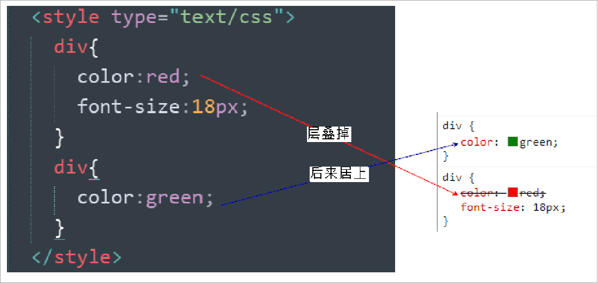
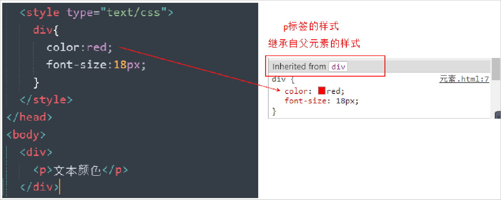
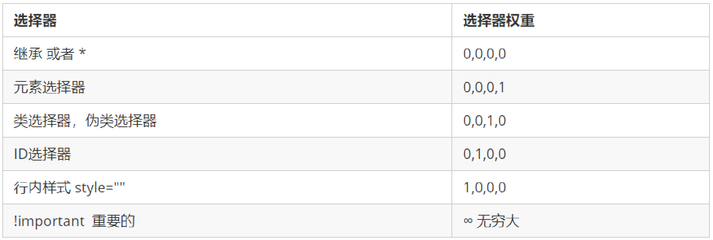
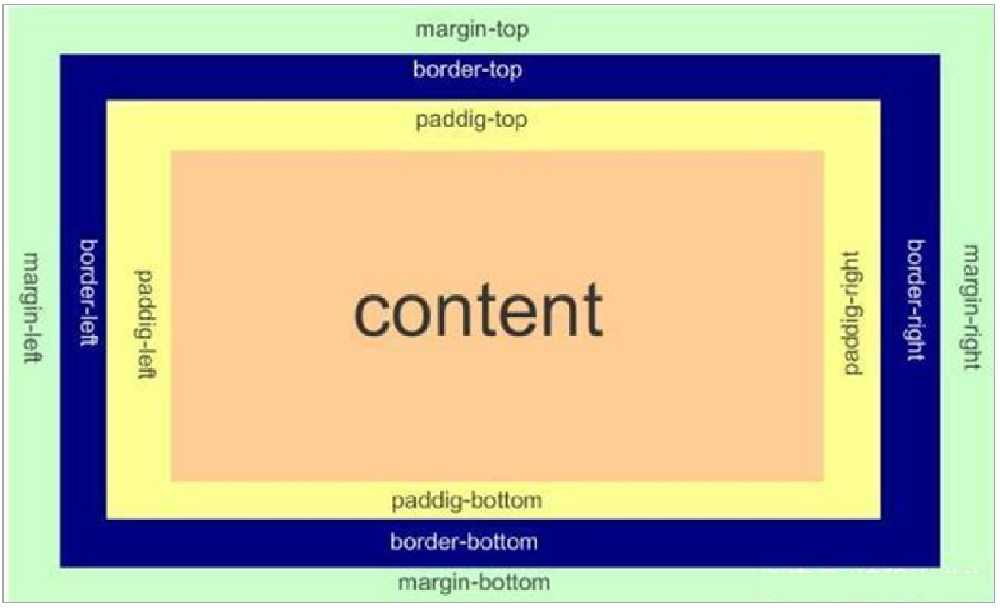
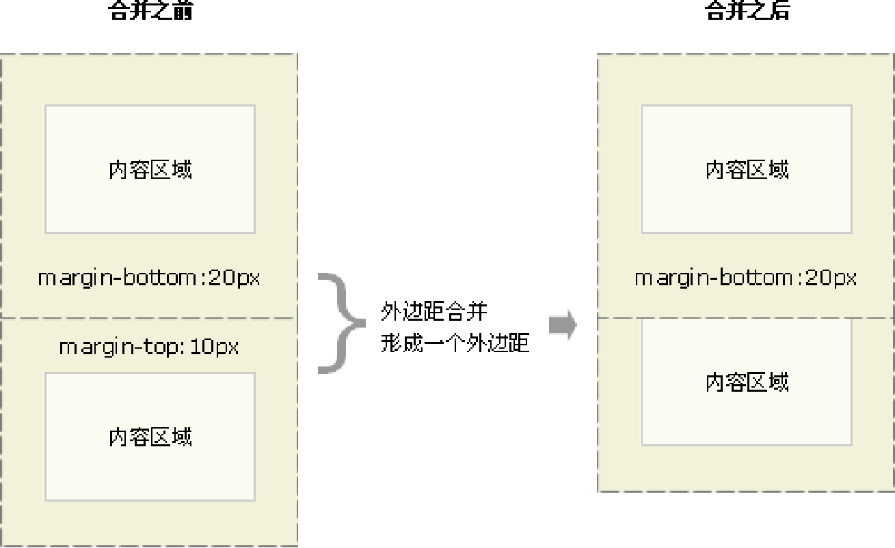
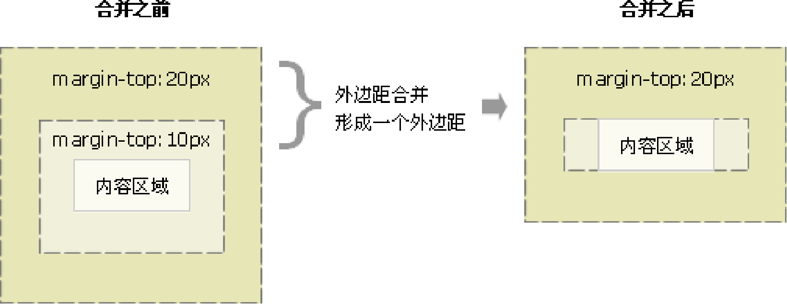
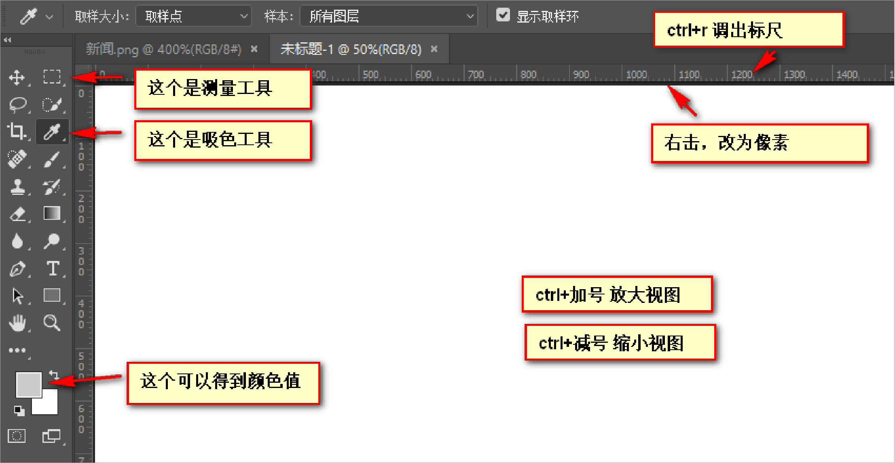

# css第03天

## 一、css三大特性

### 1、层叠性

​		相同选择器给设置相同的样式，此时一个样式就会覆盖（层叠）另一个冲突的样式。层叠性主要解决样式冲突的问题

​		层叠性原则:

- 样式冲突，遵循的原则是就近原则，哪个样式离结构近，就执行哪个样式
- 样式不冲突，不会层叠



### 2、继承性

​		CSS中的继承: 子标签会继承父标签的某些样式，如文本颜色和字号。恰当地使用继承可以简化代码，降低 CSS 样式的复杂性。




子元素可以继承父元素的样式：

​	（text-，font-，line-这些元素开头的可以继承，以及color属性）

继承性口诀：龙生龙，凤生凤，老鼠生的孩子会打洞


行高的继承性：

```css
 body {
   font:12px/1.5 Microsoft YaHei；
 }
```

- 行高可以跟单位也可以不跟单位
- 如果子元素没有设置行高，则会继承父元素的行高为 1.5
- 此时子元素的行高是：当前子元素的文字大小 * 1.5
- body 行高 1.5  这样写法最大的优势就是里面子元素可以根据自己文字大小自动调整行高

### 3、优先级

当同一个元素指定多个选择器，就会有优先级的产生。

- 选择器相同，则执行层叠性
- 选择器不同，则根据选择器权重执行


选择器优先级计算表格：




优先级注意点:

1. 权重是有4组数字组成,但是不会有进位。

2. 可以理解为类选择器永远大于元素选择器, id选择器永远大于类选择器,以此类推..

3. 等级判断从左向右，如果某一位数值相同，则判断下一位数值。

4. 可以简单记忆法:  通配符和继承权重为0, 标签选择器为1,类(伪类)选择器为 10, id选择器 100, 行内样式表为 1000, !important 无穷大.

5. 继承的权重是0， 如果该元素没有直接选中，不管父元素权重多高，子元素得到的权重都是 0。

   

权重叠加：如果是复合选择器，则会有权重叠加，需要计算权重。

- div ul  li   ------>      0,0,0,3
- .nav ul li   ------>      0,0,1,2
- a:hover      -----—>   0,0,1,1
- .nav a       ------>      0,0,1,1

## 二、盒子模型

### 1、网页布局的本质

网页布局的核心本质： 就是利用 CSS 摆盒子。


网页布局过程：

1. 先准备好相关的网页元素，网页元素基本都是盒子 Box 。
2. 利用 CSS 设置好盒子样式，然后摆放到相应位置。
3. 往盒子里面装内容

### 2、盒子模型（Box Model）组成

​		盒子模型：把 HTML 页面中的布局元素看作是一个矩形的盒子，也就是一个盛装内容的容器。

​		CSS 盒子模型本质上是一个盒子，封装周围的 HTML 元素，它包括：**边框**、**外边距**、**内边距**、和 **实际内容**



### 3、边框（border）

#### 3.1、边框的使用

1、border可以设置元素的边框。边框有三部分组成：边框宽度(粗细) 边框样式  边框颜色；

2、语法：

```css
 border : border-width || border-style || border-color;   
```


边框样式 border-style 可以设置如下值：

- none：没有边框即忽略所有边框的宽度（默认值）
- solid：边框为单实线(最为常用的)
- dashed：边框为虚线  
- dotted：边框为点线

3、边框的合写分写

边框简写：

```css
 border: 1px solid red;  
```

边框分开写法：

```css
 border-top: 1px solid red;  /* 只设定上边框， 其余同理 */   
```

#### 3.2、表格的细线边框

1、border-collapse 属性控制浏览器绘制表格边框的方式。它控制相邻单元格的边框。

2、语法：

```css
 border-collapse:collapse; 
```

collapse 单词是合并的意思

border-collapse: collapse; 表示相邻边框合并在一起

#### 3.3、边框会影响盒子实际大小

边框会额外增加盒子的实际大小。因此我们有两种方案解决：

- 测量盒子大小的时候,不量边框。
- 如果测量的时候包含了边框,则需要 width/height 减去边框宽度

### 4、内边距（padding）

#### 4.1、内边距的使用方式

1、padding 属性用于设置内边距，即边框与内容之间的距离。

2、语法：

合写属性：


分写属性：


#### 4.2、内边距会影响盒子实际大小

1、当我们给盒子指定 padding 值之后，发生了 2 件事情：

1. 内容和边框有了距离，添加了内边距。
2. padding影响了盒子实际大小。

2、内边距对盒子大小的影响：

- 如果盒子已经有了宽度和高度，此时再指定内边框，会撑大盒子。
- 如何盒子本身没有指定width/height属性, 则此时padding不会撑开盒子大小。

3、解决方案：

​		如果保证盒子跟效果图大小保持一致，则让 width/height 减去多出来的内边距大小即可。

### 5、外边距（margin）

#### 5.1、外边距的使用方式

margin 属性用于设置外边距，即控制盒子和盒子之间的距离。


#### 5.2、外边距典型应用

外边距可以让块级盒子水平居中的两个条件：

- 盒子必须指定了宽度（width）。
- 盒子左右的外边距都设置为 auto 。

常见的写法，以下三种都可以：

```css
margin-left: auto;   margin-right: auto;
margin: auto;
margin: 0 auto;
```

注意：以上方法是让块级元素水平居中，行内元素或者行内块元素水平居中给其父元素添加 text-align:center 即可。

#### 5.3、外边距合并

使用 margin 定义块元素的垂直外边距时，可能会出现外边距的合并。

主要有两种情况:

1、相邻块元素垂直外边距的合并

​		当上下相邻的两个块元素（兄弟关系）相遇时，如果上面的元素有下外边距 margin-bottom，下面的元素有上外边距 margin-top ，则他们之间的垂直间距不是 margin-bottom 与 margin-top 之和。取两个值中的较大者这种现象被称为相邻块元素垂直外边距的合并。



解决方案：
		尽量只给一个盒子添加 margin 值。

2、嵌套块元素垂直外边距的塌陷

​		对于两个嵌套关系（父子关系）的块元素，父元素有上外边距同时子元素也有上外边距，此时父元素会塌陷较大的外边距值。



解决方案：

- 可以为父元素定义上边框。
- 可以为父元素定义上内边距。
- 可以为父元素添加 overflow:hidden。

#### 5.4、清除内外边距

​		网页元素很多都带有默认的内外边距，而且不同浏览器默认的也不一致。因此我们在布局前，首先要清除下网页元素的内外边距。

```css
 * {
    padding:0;   /* 清除内边距 */
    margin:0;    /* 清除外边距 */
  }
```

​		注意：行内元素为了照顾兼容性，尽量只设置左右内外边距，不要设置上下内外边距。但是转换为块级和行内块元素就可以了

## 三、PS 基本操作

​		因为网页美工大部分效果图都是利用 PS（Photoshop）来做的，所以以后我们大部分切图工作都是在 PS 里面完成。

​		部分操作：

- 文件→打开 ：可以打开我们要测量的图片
- Ctrl+R：可以打开标尺，或者 视图→标尺
- 右击标尺，把里面的单位改为像素
- Ctrl+ 加号(+)可以放大视图， Ctrl+ 减号(-)可以缩小视图
- 按住空格键，鼠标可以变成小手，拖动 PS 视图
- 用选区拖动  可以测量大小
- Ctrl+ D 可以取消选区，或者在旁边空白处点击一下也可以取消选区


