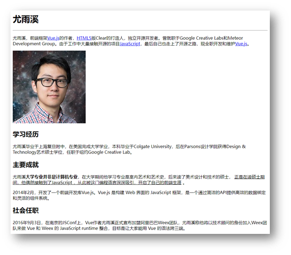
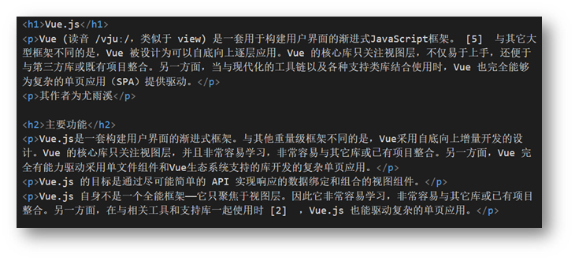
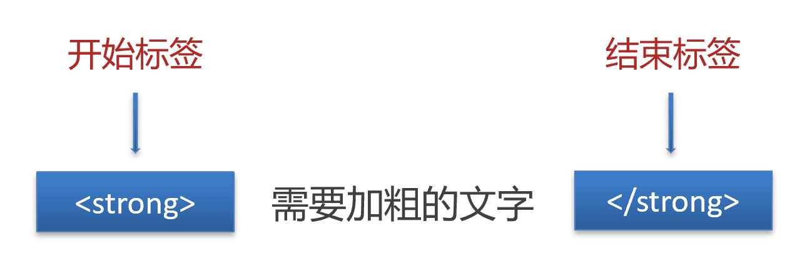
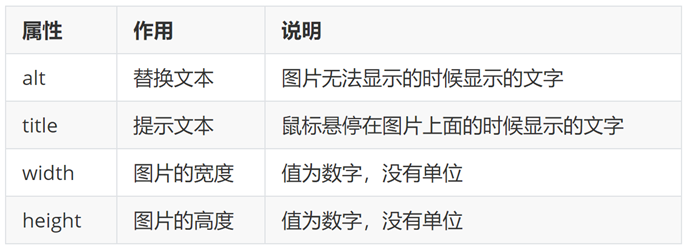
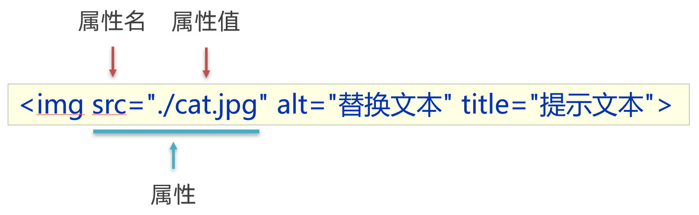
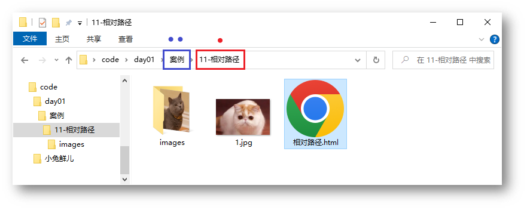
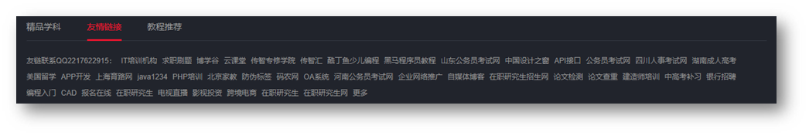
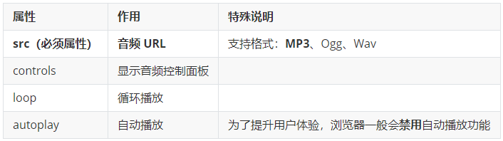
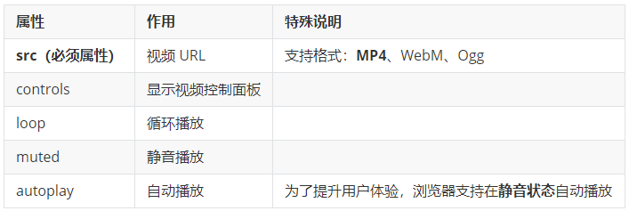

> 阶段目标：掌握HTML、CSS常用布局技巧，能够独立制作网页。

# day01：HTML 基础

> 目标：掌握标签基本语法，能够独立布局文章页。

## 01-今日课程介绍

> 今日目标：掌握标签基本语法，能够独立布局文章页。

### 核心技术点
* 网页组成

* 排版标签

* 多媒体标签及属性

* 综合案例一 - 个人简介

  

* 综合案例二 - Vue 简介

  

  

## 02-标签语法

HTML 超文本标记语言——HyperText Markup Language。 

* 超文本：链接
* 标记：标签，带尖括号的文本



### 标签结构

* 标签要成对出现，中间包裹内容
* <>里面放英文字母（标签名）
* 结束标签比开始标签多 /
* 标签分类：双标签和单标签

```html
<strong>需要加粗的文字<strong>
<br>
<hr>
```




## 03-HTML骨架

* html：整个网页
* head：网页头部，用来存放给浏览器看的信息，例如 CSS
  * title：网页标题
* body：网页主体，用来存放给用户看的信息，例如图片、文字

```html
<html>
  <head>
    <title>网页标题</title>
  </head>
  <body>
    网页主体
  </body>
</html>
```

> 提示
>
> VS Code 可以快速生成骨架：在 HTML 文件（.html）中，!（英文）配合 Enter / Tab 键

## 04-标签的关系

> 作用：明确标签的书写位置，让代码格式更整齐

* 父子关系（嵌套关系）：子级标签换行且缩进（Tab键）

  

* 兄弟关系（并列关系）：兄弟标签换行要对齐

  

  

## 05-注释

概念：注释是对代码的解释和说明，能够提高程序的可读性，方便理解、查找代码。

注释不会再浏览器中显示。

在 VS Code 中，**添加 / 删除**注释的快捷键：**Ctrl + /** 

```html
<!-- 我是 HTML 注释 -->
```

## 06-标题标签

一般用在新闻标题、文章标题、网页区域名称、产品名称等等。 

```html
<h1>一级标题</h1>
<h2>二级标题</h2>
<h3>三级标题</h3>
<h4>四级标题</h4>
<h5>五级标题</h5>
<h6>六级标题</h6>
```

显示特点：

* 文字加粗
* 字号逐渐减小
* 独占一行（换行）

> 经验
>
> 1. h1 标签在一个网页中只能用一次，用来放新闻标题或网页的 logo
> 2. h2 ~ h6 没有使用次数的限制

## 07-段落标签

一般用在新闻段落、文章段落、产品描述信息等等。 

```html
<p>段落</p>
```

显示特点：

* 独占一行
* 段落之间存在间隙

## 08-换行和水平线

* 换行：br
* 水平线：hr

```html
<br>
<hr>
```

## 09-文本格式化标签

作用：为文本添加特殊格式，以突出重点。常见的文本格式：加粗、倾斜、下划线、删除线等。 


> 提示：strong、em、ins、del 标签自带强调含义（语义）。 

## 10-图像标签

作用：在网页中插入图片

```html

```

src用于指定图像的位置和名称，是  的必须属性。 

### 图像属性



### 属性语法

* 属性名="属性值"
* 属性写在尖括号里面，标签名后面，标签名和属性之间用空格隔开，不区分先后顺序



## 11-路径

概念：路径指的是查找文件时，从**起点**到**终点**经历的**路线**。 

路径分类：

* 相对路径：从当前文件位置出发查找目标文件
* 绝对路径：从盘符出发查找目标文件
  * Windows 电脑从盘符出发
  * Mac 电脑从根目录出发

### 相对路径

查找方式：从**当前文件位置**出发查找目标文件

特殊符号：

* **/** 表示进入某个文件夹里面          → 文件夹名/
* **. ** 表示当前文件所在文件夹           → ./
* **..** 表示当前文件的上一级文件夹 → ../   



### 绝对路径

查找方式：Windows 电脑从盘符出发；Mac 电脑从根目录（/）出发

```html

```

> 提示
>
> 1. Windows 默认是 \ ，其他系统是 /，建议统一写为 / 
> 2. 特殊的绝对路径 → 文件的在线网址：<https://www.itheima.com/images/logo.png> "，应用场景：网页底部**友情链接**



## 12-超链接标签

作用：点击跳转到其他页面。 

```html
<a href="https://www.baidu.com">跳转到百度</a>
```

**href 属性值是跳转地址，是超链接的必须属性。**

超链接默认是在当前窗口跳转页面，添加 **target="_blank"** 实现**新窗口**打开页面。

拓展：开发初期，不确定跳转地址，则 href 属性值写为 **#**，表示**空链接**，页面不会跳转，在当前页面刷新一次。

```html
<a href="https://www.baidu.com/">跳转到百度</a>

<!-- 跳转到本地文件：相对路径查找 --> 
<!-- target="_blank" 新窗口跳转页面 --> 
<a href="./01-标签的写法.html" target="_blank">跳转到01-标签的写法</a>

<!-- 开发初期，不知道超链接的跳转地址，href属性值写#，表示空链接，不会跳转 -->
<a href="#">空链接</a>
```

## 13-音频

```html
<audio src="音频的 URL"></audio>
```

常用属性



> 拓展：书写 HTML5 属性时，如果属性名和属性值相同，可以简写为一个单词。 

```html
<!-- 在 HTML5 里面，如果属性名和属性值完全一样，可以简写为一个单词 -->
<audio src="./media/music.mp3" controls loop autoplay></audio>
```

## 14-视频

```html
<video src="视频的 URL"></video>
```

常用属性



```html
<!-- 在浏览器中，想要自动播放，必须有 muted 属性 -->
<video src="./media/vue.mp4" controls loop muted autoplay></video>
```

## 15-综合案例一-个人简介

> 网页制作思路：从上到下，先整体再局部，逐步分析制作
>
> 分析内容 → 写代码 → 保存 → 刷新浏览器，看效果


```html
<h1>尤雨溪</h1>
<hr>
<p>尤雨溪，前端框架<a href="../17-综合案例二/vue简介.html">Vue.js</a>的作者，<a href="#">HTML5</a>版Clear的打造人，独立开源开发者。曾就职于Google Creative Labs和Meteor Development Group。由于工作中大量接触开源的项目<a href="#">JavaScript</a>，最后自己也走上了开源之路，现全职开发和维护<a href="#">Vue.js</a>。

</p>

<h2>学习经历</h2>
<p>尤雨溪毕业于上海复旦附中，在美国完成大学学业，本科毕业于Colgate University，后在Parsons设计学院获得Design & Technology艺术硕士学位，任职于纽约Google Creative Lab。</p>
<h2>主要成就</h2>
<p>尤雨溪<strong>大学专业并非是计算机专业</strong>，在大学期间他学习专业是室内艺术和艺术史，后来读了美术设计和技术的硕士， <ins>正是在读硕士期间，他偶然接触到了JavaScript ，从此被这门编程语言深深吸引，开启了自己的前端生涯</ins> 。</p>
<p>2014年2月，开发了一个前端开发库Vue.js。Vue.js 是构建 Web 界面的 JavaScript 框架，是一个通过简洁的API提供高效的数据绑定和灵活的组件系统。</p>
<h2>社会任职</h2>
<p>2016年9月3日，在南京的JSConf上，Vue作者尤雨溪正式宣布加盟阿里巴巴Weex团队，尤雨溪称他将以技术顾问的身份加入Weex团队来做 Vue 和 Weex 的 JavaScript runtime 整合，目标是让大家能用 Vue 的语法跨三端。</p>
```

## 16-综合案例二-Vue简介


```html
<h1>Vue.js</h1>
<p>Vue (读音 /vjuː/，类似于 view) 是一套用于构建用户界面的渐进式JavaScript框架。 [5] 与其它大型框架不同的是，Vue 被设计为可以自底向上逐层应用。Vue 的核心库只关注视图层，不仅易于上手，还便于与第三方库或既有项目整合。另一方面，当与现代化的工具链以及各种支持类库结合使用时，Vue 也完全能够为复杂的单页应用（SPA）提供驱动。</p>
<p>其作者为<a href="../16-综合案例一/个人简介.html" target="_blank">尤雨溪</a></p>
<h2>主要功能</h2>
<p>Vue.js是一套构建用户界面的渐进式框架。与其他重量级框架不同的是，Vue采用自底向上增量开发的设计。Vue 的核心库只关注视图层，并且非常容易学习，非常容易与其它库或已有项目整合。另一方面，Vue 完全有能力驱动采用单文件组件和Vue生态系统支持的库开发的复杂单页应用。</p>
<p>Vue.js 的目标是通过尽可能简单的 API 实现响应的数据绑定和组合的视图组件。</p>
<p>Vue.js 自身不是一个全能框架——它只聚焦于视图层。因此它非常容易学习，非常容易与其它库或已有项目整合。另一方面，在与相关工具和支持库一起使用时 [2] ，Vue.js 也能驱动复杂的单页应用。</p>
<video src="../media/vue.mp4" controls></video>
```


