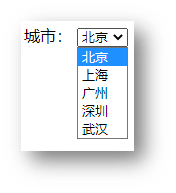
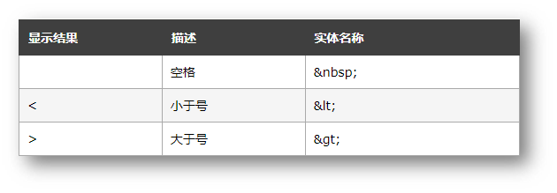

# day02：列表、表格、表单

> 目标：掌握嵌套关系标签的写法，使用列表标签布局网页

## 01-列表

作用：布局内容排列整齐的区域。

列表分类：无序列表、有序列表、定义列表。

### 无序列表

作用：布局排列整齐的**不需要规定顺序**的区域。

标签：ul 嵌套 li，ul 是无序列表，li 是列表条目。

```html
<ul>
  <li>第一项</li>
  <li>第二项</li>
  <li>第三项</li>
  ……
</ul>
```

> 注意事项：
>
> * ul 标签里面只能包裹 li 标签
> * li 标签里面可以包裹任何内容

### 有序列表

作用：布局排列整齐的**需要规定顺序**的区域。

标签：ol 嵌套 li，ol 是有序列表，li 是列表条目。

```html
<ol>
  <li>第一项</li>
  <li>第二项</li>
  <li>第三项</li>
  ……
</ol>
```

> 注意事项：
>
> * ol 标签里面只能包裹 li 标签
> * li 标签里面可以包裹任何内容

### 定义列表

标签：dl 嵌套 dt 和 dd，dl 是定义列表，dt 是定义列表的标题，dd 是定义列表的描述 / 详情。

```html
<dl>
  <dt>列表标题</dt>
  <dd>列表描述 / 详情</dd>
   ……
</dl>
```


> 注意事项：
>
> * dl 里面只能包含dt 和 dd
> * dt 和 dd 里面可以包含任何内容

## 02-表格

网页中的表格与 Excel 表格类似，用来展示数据。 


### 基本使用

标签：table 嵌套 tr，tr 嵌套 td / th。 


> 提示：在网页中，**表格默认没有边框线**，使用 **border 属性**可以为表格添加边框线。 

```html
<table border="1">
  <tr>
    <th>姓名</th>
    <th>语文</th>
    <th>数学</th>
    <th>总分</th>
  </tr>
  <tr>
    <td>张三</td>
    <td>99</td>
    <td>100</td>
    <td>199</td>
  </tr>
  <tr>
    <td>李四</td>
    <td>98</td>
    <td>100</td>
    <td>198</td>
  </tr>
  <tr>
    <td>总结</td>
    <td>全市第一</td>
    <td>全市第一</td>
    <td>全市第一</td>
  </tr>
</table>
```

### 表格结构标签-了解

作用：用表格结构标签把内容划分区域，让表格结构更清晰，语义更清晰。


> 提示：表格结构标签可以省略。

### 合并单元格

作用：将多个单元格合并成一个单元格，以合并同类信息。 


合并单元格的步骤：

1. 明确合并的目标
2. 保留**最左最上**的单元格，添加属性（取值是**数字**，表示需要**合并的单元格数量**）
   * **跨行合并**，保留最上单元格，添加属性 **rowspan**
   * **跨列合并**，保留最左单元格，添加属性 **colspan**
3. 删除其他单元格

```html
<table border="1">
  <thead>
    <tr>
      <th>姓名</th>
      <th>语文</th>
      <th>数学</th>
      <th>总分</th>
    </tr>
  </thead>
  <tbody>
    <tr>
      <td>张三</td>
      <td>99</td>
      <td rowspan="2">100</td>
      <td>199</td>
    </tr>
    <tr>
      <td>李四</td>
      <td>98</td>
      <!-- <td>100</td> -->
      <td>198</td>
    </tr>
  </tbody>
  <tfoot>
    <tr>
      <td>总结</td>
      <td colspan="3">全市第一</td>
      <!-- <td>全市第一</td>
      <td>全市第一</td> -->
    </tr>
  </tfoot>
</table>
```

> 注意：不能跨表格结构标签合并单元格（thead、tbody、tfoot）。

## 03-表单

作用：收集用户信息。

使用场景：

* 登录页面
* 注册页面
* 搜索区域

### input 标签

input 标签 type 属性值不同，则功能不同。 

```html
<input type="..." >
```


### input 标签占位文本 

占位文本：提示信息，文本框和密码框都可以使用。 

```html
<input type="..." placeholder="提示信息">
```

### 单选框

常用属性


```html
<input type="radio" name="gender" checked> 男
<input type="radio" name="gender"> 女
```

> 提示：name 属性值自定义。

### 上传文件 

默认情况下，文件上传表单控件只能上传一个文件，添加 multiple 属性可以实现文件多选功能。

```html
<input type="file" multiple>
```

### 多选框

多选框也叫复选框，默认选中：checked。

```html
<input type="checkbox" checked> 敲前端代码
```

### 下拉菜单



标签：select 嵌套 option，select 是下拉菜单整体，option是下拉菜单的每一项。

```html
<select>
  <option>北京</option>
  <option>上海</option>
  <option>广州</option>
  <option>深圳</option>
  <option selected>武汉</option>
</select>
```

> 默认显示第一项，**selected** 属性实现**默认选中**功能。

### 文本域

作用：多行输入文本的表单控件。 


```html
<textarea>默认提示文字</textarea>
```

> 注意点：
>
> * 实际开发中，使用 CSS 设置 文本域的尺寸
> * 实际开发中，一般禁用右下角的拖拽功能

### label 标签 

作用：网页中，某个标签的说明文本。 


经验：用 label 标签绑定文字和表单控件的关系，增大表单控件的点击范围。 


* 写法一
  * label 标签只包裹内容，不包裹表单控件
  * 设置 label 标签的 for 属性值 和表单控件的 id 属性值相同

```html
<input type="radio" id="man">
<label for="man">男</label>
```

* 写法二：使用 label 标签包裹文字和表单控件，不需要属性 

```html
<label><input type="radio"> 女</label>
```

> 提示：支持 label 标签增大点击范围的表单控件：文本框、密码框、上传文件、单选框、多选框、下拉菜单、文本域等等。 

### 按钮

```html
<button type="">按钮</button>
```


```html
<!-- form 表单区域 -->
<!-- action="" 发送数据的地址 -->
<form action="">
  用户名：<input type="text">
  <br><br>
  密码：<input type="password">
  <br><br>

  <!-- 如果省略 type 属性，功能是 提交 -->
  <button type="submit">提交</button>
  <button type="reset">重置</button>
  <button type="button">普通按钮</button>
</form>
```

> 提示：按钮需配合 form 标签（表单区域）才能实现对应的功能。

## 04-语义化

### 无语义的布局标签 

作用：布局网页（划分网页区域，摆放内容）

* div：独占一行
* span：不换行

```html
<div>div 标签，独占一行</div>
<span>span 标签，不换行</span>
```

### 有语义的布局标签


## 05-字符实体



## 06-综合案例一-体育新闻列表 


```html
<ul>
  <li>
    
    <h3>主帅安东尼奥回西班牙休假 国青抵达海口进行隔离</h3>
  </li>
  <li>
    
    <h3>梅州主帅：申花有强有力的教练组 球员体能水平高</h3>
  </li>
  <li>
    
    <h3>马德兴:00后球员将首登亚洲舞台 调整心态才务实</h3>
  </li>
</ul>
```

## 07-综合案例二-注册信息


```html
<h1>注册信息</h1>
<form action="">
  <!-- 表单控件 -->
  <!-- 个人信息 -->
  <h2>个人信息</h2>
  <label>姓名：</label><input type="text" placeholder="请输入真实姓名">
  <br><br>
  <label>密码：</label><input type="password" placeholder="请输入密码">
  <br><br>
  <label>确认密码：</label><input type="password" placeholder="请输入确认密码">
  <br><br>
  <label>性别：</label>
  <label><input type="radio" name="gender"> 男</label>
  <label><input type="radio" name="gender" checked> 女</label>
  <br><br>
  <label>居住城市：</label>
  <select>
    <option>北京</option>
    <option>上海</option>
    <option>广州</option>
    <option>深圳</option>
    <option>武汉</option>
  </select>
  <!-- 教育经历 -->
  <h2>教育经历</h2>
  <label>最高学历：</label>
  <select>
    <option>博士</option>
    <option>硕士</option>
    <option>本科</option>
    <option>大专</option>
  </select>
  <br><br>
  <label>学校名称：</label><input type="text">
  <br><br>
  <label>所学专业：</label><input type="text">
  <br><br>
  <label>在校时间：</label>
  <select>
    <option>2015</option>
    <option>2016</option>
    <option>2017</option>
    <option>2018</option>
  </select>
  --
  <select>
    <option>2019</option>
    <option>2020</option>
    <option>2021</option>
    <option>2022</option>
  </select>
  <!-- 工作经历 -->
  <h2>工作经历</h2>
  <label>公司名称：</label><input type="text">
  <br><br>
  <label>工作描述：</label>
  <br>
  <textarea></textarea>
  <br><br>
  <!-- 协议 和 按钮 -->
  <input type="checkbox"><label>已阅读并同意以下协议：</label>
  <ul>
    <li><a href="#">《用户服务协议》</a></li>
    <li><a href="#">《隐私政策》</a></li>
  </ul>
  <br><br>
  <button>免费注册</button>
  <button type="reset">重新填写</button>
</form>
```

