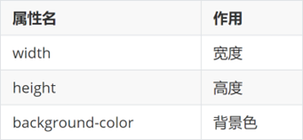
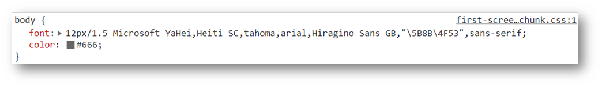
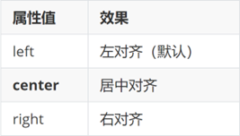
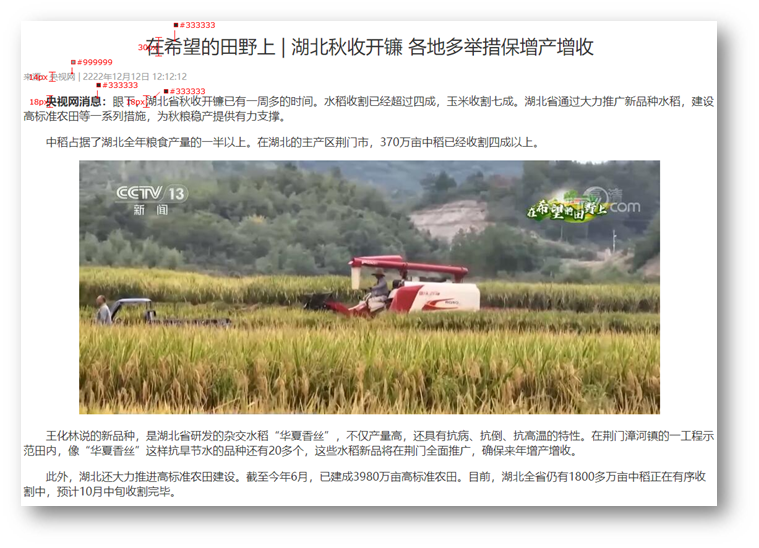

# day03-CSS基础

> 目标：掌握 CSS 属性基本写法，能够使用文字相关属性美化文章页。

## 01-CSS初体验

层叠样式表 (Cascading Style Sheets，缩写为 CSS），是一种 **样式表** 语言，用来**描述 HTML 文档的呈现**（**美化内容**）。

书写位置：**title 标签下方添加 style 双标签，style 标签里面书写 CSS 代码**。

```html
<title>CSS 初体验</title>
<style>
  /* 选择器 { } */
  p {
    /* CSS 属性 */
    color: red;
  }
</style>

<p>体验 CSS</p>
```

> 提示：属性名和属性值成对出现 → 键值对。 

## 02-CSS引入方式

* **内部**样式表：学习使用
  * CSS 代码写在 style 标签里面
* **外部**样式表：开发使用
  * CSS 代码写在单独的 CSS 文件中（**.css**）
  * 在 HTML 使用 link 标签引入

```html
<link rel="stylesheet" href="./my.css">
```

* **行内**样式：配合 JavaScript 使用
  * CSS 写在标签的 style 属性值里

```html
<div style="color: red; font-size:20px;">这是 div 标签</div>
```

## 03-选择器

作用：**查找标签**，设置样式。 

### 标签选择器

标签选择器：使用**标签名**作为选择器 → 选中**同名标签设置相同的样式**。

例如：p, h1, div, a, img......

```html
<style>
  p {
    color: red;
  }
</style>

```

> 注意：标签选择器**无法差异化**同名标签的显示效果。

### 类选择器

作用：查找标签，**差异化**设置标签的显示效果。

步骤：

* 定义类选择器 → **.类名**
* 使用类选择器 → 标签添加 **class="类名"**

```html
<style>
  /* 定义类选择器 */
  .red {
    color: red;
  }
</style>

<!-- 使用类选择器 -->
<div class="red">这是 div 标签</div>
<div class="red size">div 标签</div>
```

注意：

* 类名**自定义**，不要用纯数字或中文，尽量用英文命名
* 一个类选择器**可以供多个标签使用**
* **一个标签可以使用多个类名**，类名之间用**空格**隔开

> 开发习惯：类名见名知意，多个单词可以用 - 连接，例如：news-hd。

### id选择器

作用：查找标签，差异化设置标签的显示效果。

场景：id 选择器一般**配合 JavaScript** 使用，很少用来设置 CSS 样式

步骤：

* 定义 id 选择器 → #id名
* 使用 id 选择器 → 标签添加 id= "id名"

```html
<style>
  /* 定义 id 选择器 */
  #red {
    color: red;
  }
</style>

<!-- 使用 id 选择器 -->
<div id="red">这是 div 标签</div>
```

> 规则：同一个 id 选择器在一个页面只能使用一次。

### 通配符选择器

作用：查找页面**所有**标签，设置相同样式。

通配符选择器： ***，不需要调用**，浏览器自动查找页面所有标签，设置相同的样式

```css
* {
  color: red;
}
```

> 经验：通配符选择器可以用于**清除标签的默认样式**，例如：标签默认的外边距、内边距。


## 04-盒子尺寸和背景色



## 05-文字控制属性

### 字体大小

* 属性名：**font-size**
* 属性值：文字尺寸，PC 端网页最常用的单位 **px**

```css
p {
  font-size: 30px;
}
```

> 经验：谷歌浏览器默认字号是16px。

### 字体样式（是否倾斜） 

作用：清除文字默认的倾斜效果

属性名：**font-style**

属性值

* 正常（不倾斜）：**normal** 
* 倾斜：**italic**

### 行高

作用：设置多行文本的间距

属性名：line-height

属性值

* 数字 + px
* 数字（当前标签font-size属性值的倍数）

```css
line-height: 30px;


/* 当前标签字体大小为16px */
line-height: 2;
```


> 行高的测量方法：从一行文字的最顶端（最底端）量到下一行文字的最顶端（最底端）。 

#### 单行文字垂直居中

垂直居中技巧：**行高属性值等于盒子高度属性值**

注意：该技巧适用于单行文字垂直居中效果

```css
div {
  height: 100px;
  background-color: skyblue;

  /* 注意：只能是单行文字垂直居中 */
  line-height: 100px;
}
```

### 字体族

属性名：**font-family**

属性值：字体名

```css
font-family: 楷体;
```

> 拓展（了解）：font-family属性值可以书写多个字体名，各个字体名用逗号隔开，执行顺序是从左向右依次查找
>
> *  font-family 属性最后设置一个字体族名，网页开发建议使用无衬线字体


```css
font-family: Microsoft YaHei, Heiti SC, tahoma, arial, Hiragino Sans GB, "\5B8B\4F53", sans-serif;
```

### font复合属性

使用场景：设置网页文字公共样式 



复合属性：属性的简写方式，**一个属性对应多个值的写法**，各个属性值之间用**空格**隔开。

**font: 是否倾斜  是否加粗  字号/行高 字体（必须按顺序书写）**

```css
div {
  font: italic 700 30px/2 楷体;
}
```

> 注意：字号和字体值必须书写，否则 font 属性不生效 。

### 文本缩进 

属性名：**text-indent**

属性值：

* 数字 + px
* **数字 + em**（推荐：**1em = 当前标签的字号大小**）

```css
p {
  text-indent: 2em;
}
```

### 文本对齐方式 

作用：控制内容水平对齐方式

属性名：**text-align**



```css
text-align: center;
```

> text-align本质是控制内容的对齐方式，属性要设置给内容的父级。 

```html
<style>
  div {
    text-align: center;
  }
</style>

<div>
  
</div>
```

### 文本修饰线 

属性名： **text-decoration** 


### color 文字颜色


> 提示：只要属性值为颜色，都可以使用上述四种颜色表示方式，例如：背景色。 

## 06-调试工具

作用：检查、调试代码；帮助程序员发现代码问题、解决问题

1. 打开调试工具

* 浏览器窗口内任意位置 / 选中标签 → 鼠标右键 → 检查
* F12

2. 使用调试工具


## 07-综合案例一-新闻详情

网页制作思路：

1. 从上到下，先整体再局部
2. 先标签，再 CSS 美化



### HTML标签

```html
<h1>在希望的田野上 | 湖北秋收开镰 各地多举措保增产增收</h1>
<div>来源：央视网 | 2222年12月12日 12:12:12</div>
<p><strong>央视网消息：</strong>眼下，湖北省秋收开镰已有一周多的时间。水稻收割已经超过四成，玉米收割七成。湖北省通过大力推广新品种水稻，建设高标准农田等一系列措施，为秋粮稳产提供有力支撑。</p>
<p>中稻占据了湖北全年粮食产量的一半以上。在湖北的主产区荆门市，370万亩中稻已经收割四成以上。</p>
<div class="pic">
  
</div>
<p>王化林说的新品种，是湖北省研发的杂交水稻“华夏香丝”，不仅产量高，还具有抗病、抗倒、抗高温的特性。在荆门漳河镇的一工程示范田内，像“华夏香丝”这样抗旱节水的品种还有20多个，这些水稻新品将在荆门全面推广，确保来年增产增收。</p>
<p>此外，湖北还大力推进高标准农田建设。截至今年6月，已建成3980万亩高标准农田。目前，湖北全省仍有1800多万亩中稻正在有序收割中，预计10月中旬收割完毕。</p>
```

### CSS样式

```html
<style>
  h1 {
    text-align: center;
    font-weight: 400;
    font-size: 30px;
    color: #333;
  }

  div {
    font-size: 14px;
    color: #999;
  }

  p {
    text-indent: 2em;
    font-size: 18px;
    color: #333;
  }

  /* div {
    text-align: center;
  } */

  .pic {
    text-align: center;
  }
</style>
```

## 08-综合案例二-CSS简介


### HTML标签

```html
<h1>CSS（层叠样式表）</h1>
<p>层叠样式表 (Cascading Style Sheets，缩写为 CSS），是一种 <a href="#">样式表</a> 语言，用来描述 HTML 或 XML（包括如 SVG、MathML、XHTML 之类的 XML 分支语言）文档的呈现。CSS 描述了在屏幕、纸质、音频等其它媒体上的元素应该如何被渲染的问题。</p>
<p><strong>CSS 是开放网络的核心语言之一</strong>，由 W3C 规范 实现跨浏览器的标准化。CSS 节省了大量的工作。 样式可以通过定义保存在外部.css 文件中，同时控制多个网页的布局，这意味着开发者不必经历在所有网页上编辑布局的麻烦。CSS 被分为不同等级：CSS1 现已废弃， CSS2.1 是推荐标准， CSS3 分成多个小模块且正在标准化中。</p>
<ul>
  <li>CSS 介绍 如果你是 Web 开发的新手，请务必阅读我们的 CSS 基础 文章以学习 CSS 的含义和用法。</li>
  <li>CSS 教程 我们的 CSS 学习区 包含了丰富的教程，它们覆盖了全部基础知识，能使你在 CSS 之路上从初出茅庐到游刃有余。</li>
  <li>CSS 参考 针对资深 Web 开发者的 <a href="#">详细参考手册</a> ，描述了 CSS 的各个属性与概念。</li>
</ul>
```

### CSS样式

```html
<style>
  h1 {
    color: #333;
  }

  p {
    text-indent: 2em;
    font-size: 14px;
    color: #444;
    line-height: 30px;
  }

  a {
    color: #0069c2;
  }

  li {
    font-size: 14px;
    color: #444;
    line-height: 30px;
  }
</style>
```

