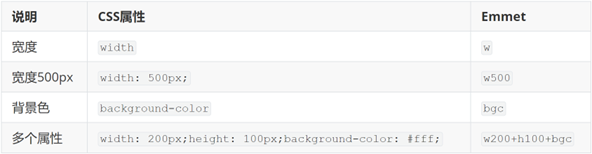
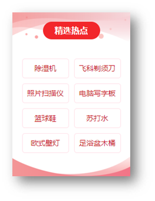
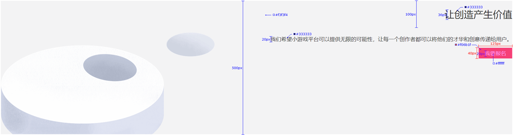

# day04-CSS进阶

> 目标：掌握复合选择器作用和写法；使用background属性添加背景效果

## 01-复合选择器

定义：由两个或多个基础选择器，通过不同的方式组合而成。

作用：更准确、更高效的选择目标元素（标签）。

### 后代选择器

后代选择器：**选中某元素的后代元素**。

选择器写法：父选择器  子选择器 { CSS 属性}，父子选择器之间用**空格**隔开。

```html
<style>
  div span {
    color: red;
  }
</style>
<span> span 标签</span>
<div>
  <span>这是 div 的儿子 span</span >
</div>
```

### 子代选择器

子代选择器：选中某元素的子代元素（**最近的子级**）。

选择器写法：父选择器 > 子选择器 { CSS 属性}，父子选择器之间用 **>** 隔开。

```html
<style>
  div > span {
    color: red;
  }
</style>

<div>
  <span>这是 div 里面的 span</span>
  <p>
    <span>这是 div 里面的 p 里面的 span</span>
  </p>
</div>

```

### 并集选择器

并集选择器：选中**多组标签**设置**相同**的样式。

选择器写法：选择器1, 选择器2, …, 选择器N { CSS 属性}，选择器之间用 **,** 隔开。

```html
<style>
  div,
  p,
  span {
    color: red;
  }
</style>

<div> div 标签</div>
<p>p 标签</p>
<span>span 标签</span>
```

### 交集选择器 

交集选择器：选中**同时满足多个条件**的元素。

选择器写法：选择器1选择器2 { CSS 属性}，选择器之间连写，没有任何符号。 

```html
<style>
  p.box {
  color: red;
}
</style>

<p class="box">p 标签，使用了类选择器 box</p>
<p>p 标签</p>
<div class="box">div 标签，使用了类选择器 box</div>
```

> 注意：如果交集选择器中有标签选择器，标签选择器必须书写在最前面。 

### 伪类选择器 

伪类选择器：伪类表示元素**状态**，选中元素的某个状态设置样式。

鼠标悬停状态：**选择器:hover { CSS 属性 }**

```html
<style>
  a:hover {
    color: red;
  }
  .box:hover {
    color: green;
  }
</style>

<a href="#">a 标签</a>
<div class="box">div 标签</div>
```

#### 超链接伪类


> 提示：如果要给超链接设置以上四个状态，需要按 LVHA 的顺序书写。 
>
> 经验：工作中，一个 a 标签选择器设置超链接的样式， hover状态特殊设置 

```css
a {
  color: red;
}

a:hover {
  color: green;
}
```

## 02-CSS特性

CSS特性：化简代码 / 定位问题，并解决问题

* 继承性
* 层叠性
* 优先级

### 继承性

继承性：子级默认继承父级的**文字控制属性**。 


> 注意：如果标签有默认文字样式会继承失败。 例如：a 标签的颜色、标题的字体大小。

### 层叠性

特点：

* 相同的属性会覆盖：**后面的 CSS 属性覆盖前面的 CSS 属性**
* 不同的属性会叠加：**不同的 CSS 属性都生效**

```html
<style>
  div {
    color: red;
    font-weight: 700;
  }
  div {
    color: green;
    font-size: 30px;
  }
</style>

<div>div 标签</div>
```

> 注意：选择器类型相同则遵循层叠性，否则按选择器优先级判断。 

### 优先级

优先级：也叫权重，当一个标签**使用了多种选择器时**，基于不同种类的选择器的**匹配规则**。

```html
<style>
  div {
    color: red;
  }
  .box {
    color: green;
  }
</style>

<div class="box">div 标签</div>
```

#### 基础选择器

规则：选择器**优先级高的样式生效**。

公式：**通配符选择器 < 标签选择器 < 类选择器 < id选择器 < 行内样式 < !important**

​           **（选中标签的范围越大，优先级越低）**

#### 复合选择器-叠加

叠加计算：如果是复合选择器，则需要**权重叠加**计算。

公式：（每一级之间不存在进位）


规则：

* 从左向右依次比较选个数，同一级个数多的优先级高，如果个数相同，则向后比较
* **!important 权重最高**
* 继承权重最低

## 03-Emmet 写法

Emmet写法：代码的**简写**方式，输入缩写 VS Code 会自动生成对应的代码。 

* HTML标签


* CSS：大多数简写方式为属性单词的**首字母** 



## 04-背景属性



### 背景图

网页中，使用背景图实现装饰性的图片效果。

* 属性名：**background-image**（bgi）
* 属性值：url(背景图 URL)

```css
div {
  width: 400px;
  height: 400px;

  background-image: url(./images/1.png);
}
```

> 提示：背景图默认有**平铺（复制）效果**。 

### 平铺方式

属性名：**background-repeat**（bgr） 


```css
div {
  width: 400px;
  height: 400px;
  background-color: pink;
  background-image: url(./images/1.png);

  background-repeat: no-repeat;
}
```

### 背景图位置

属性名：**background-position**（bgp）

属性值：水平方向位置 垂直方向位置

* 关键字


* 坐标
  * 水平：正数向右；负数向左
  * 垂直：正数向下；负数向上

```css
div {
  width: 400px;
  height: 400px;
  background-color: pink;
  background-image: url(./images/1.png);
  background-repeat: no-repeat;

  background-position: center bottom;
  background-position: 50px -100px;
  background-position: 50px center;
}
```

> 提示：
>
> * 关键字取值方式写法，可以颠倒取值顺序
> * 可以只写一个关键字，另一个方向默认为居中；数字只写一个值表示水平方向，垂直方向为居中

### 背景图缩放

作用：设置背景图大小

属性名：**background-size**（bgz）

常用属性值：

* 关键字
  *  cover：等比例缩放背景图片以完全覆盖背景区，可能背景图片部分看不见
  * contain：等比例缩放背景图片以完全装入背景区，可能背景区部分空白

* 百分比：根据盒子尺寸计算图片大小
* 数字 + 单位（例如：px）

```css
div {
  width: 500px;
  height: 400px;
  background-color: pink;
  background-image: url(./images/1.png);
  background-repeat: no-repeat;
  
  background-size: cover;
  background-size: contain;
}
```

> 提示：工作中，**图片比例与盒子比例相同**，使用 cover 或 contain 缩放背景图效果相同。

### 背景图固定

作用：背景不会随着元素的内容滚动。

属性名：**background-attachment**（bga）

属性值：**fixed**

```css
body {
  background-image: url(./images/bg.jpg);
  background-repeat: no-repeat;
  background-attachment: fixed;
}
```

### 背景复合属性

属性名：**background**（bg）

属性值：背景色 背景图 背景图平铺方式 背景图位置/背景图缩放  背景图固定（**空格隔开各个属性值，不区分顺序**）

```css
div {
  width: 400px;
  height: 400px;

  background: pink url(./images/1.png) no-repeat right center/cover;
}
```

## 05-显示模式

显示模式：标签（元素）的显示方式。 


作用：布局网页的时候，根据标签的显示模式选择合适的标签摆放内容。 

### 块级元素

特点：

* 独占一行
* 宽度默认是父级的100%
* 添加宽高属性生效


### 行内元素

特点：

* 一行可以显示多个
* 设置宽高属性不生效
* 宽高尺寸由内容撑开


### 行内块元素 

特点：

* 一行可以显示多个
* 设置宽高属性生效
* 宽高尺寸也可以由内容撑开


### 转换显示模式

属性：**display**


## 06-综合案例一-热词


### HTML标签

```html
<a href="#">HTML</a>
<a href="#">CSS</a>
<a href="#">JavaScript</a>
<a href="#">Vue</a>
<a href="#">React</a>
```

### CSS样式

```html
<style>
/* 默认效果 */
a {
display: block;
width: 200px;
height: 80px;
background-color: #3064bb;
color: #fff;
text-decoration: none;
text-align: center;
line-height: 80px;
font-size: 18px;
}

/* 鼠标悬停的效果 */
a:hover {
background-color: #608dd9;
}
</style>
```

## 07-综合案例二 – banner 效果 



### HTML标签

```html
<div class="banner">
  <h2>让创造产生价值</h2>
  <p>我们希望小游戏平台可以提供无限的可能性，让每一个创作者都可以将他们的才华和创意传递给用户。</p>
  <a href="#">我要报名</a>
</div>
```


### CSS样式

```html
<style>
  .banner {
    height: 500px;
    background-color: #f3f3f4;
    background-image: url(./images/bk.png);
    background-repeat: no-repeat;
    background-position: left bottom;

    /* 文字控制属性，继承给子级 */
    text-align: right;
    color: #333;
  }

  .banner h2 {
    font-size: 36px;
    font-weight: 400;
    line-height: 100px;
  }

  .banner p {
    font-size: 20px;
  }

  .banner a {
    width: 125px;
    height: 40px;
    background-color: #f06b1f;

    display: inline-block;
    /* 转块级无法右对齐，因为块元素独占一行 */
    /* display: block; */

    text-align: center;
    line-height: 40px;
    color: #fff;
    text-decoration: none;
    font-size: 20px;
  }
</style>
```

