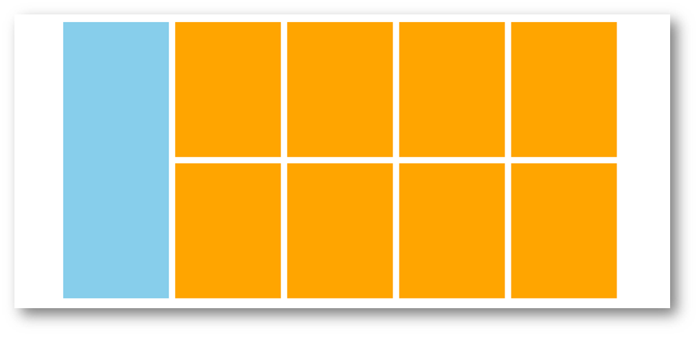

# day06-Flex布局

> 目标：熟练使用 Flex 完成结构化布局

## 01-标准流

标准流也叫文档流，指的是标签在页面中**默认的排布规则**，例如：块元素独占一行，行内元素可以一行显示多个。 


## 02-浮动

### 基本使用

作用：让块元素水平排列。

属性名：**float**

属性值

* **left**：左对齐
* **right**：右对齐

```html
<style>
  /* 特点：顶对齐；具备行内块显示模式特点；浮动的盒子会脱标 */
  .one {
    width: 100px;
    height: 100px;
    background-color: brown;

    float: left;
  }

  .two {
    width: 200px;
    height: 200px;
    background-color: orange;

    /* float: left; */

    float: right;
  }
</style>

<div class="one">one</div>
<div class="two">two</div>
```

特点：

* 浮动后的盒子**顶对齐**
* 浮动后的盒子具备**行内块**特点
* 浮动后的盒子**脱标**，**不占用标准流的位置**

### 产品区域布局



#### HTML标签

```html
<!-- 版心：左右，右面：8个产品 → 8个 li -->
<div class="product">
  <div class="left"></div>
  <div class="right">
    <ul>
      <li></li>
      <li></li>
      <li></li>
      <li></li>
      <li></li>
      <li></li>
      <li></li>
      <li></li>
    </ul>
  </div>
</div>
```


#### CSS样式

```html
<style>
  * {
    margin: 0;
    padding: 0;
  }

  li {
    list-style: none;
  }

  .product {
    margin: 50px auto;
    width: 1226px;
    height: 628px;
    background-color: pink;
  }

  .left {
    float: left;
    width: 234px;
    height: 628px;
    background-color: skyblue;
  }

  .right {
    float: right;
    width: 978px;
    height: 628px;
    background-color: brown;
  }

  .right li {
    float: left;
    margin-right: 14px;
    margin-bottom: 14px;
    width: 234px;
    height: 300px;
    background-color: orange;
  }

  /* 第四个li和第八个li 去掉右侧的margin */
  .right li:nth-child(4n) {
    margin-right: 0;
  }

  /* 细节：如果父级宽度不够，浮动的盒子会掉下来 */
</style>
```

### 清除浮动

场景：浮动元素会脱标，如果**父级没有高度**，**子级无法撑开父级高度**（可能导致页面布局错乱）

解决方法：**清除浮动**（清除浮动带来的影响）

#### 场景搭建


```html
<style>
  .top {
    margin: 10px auto;
    width: 1200px;
    /* height: 300px; */
    background-color: pink;
  }

  .left {
    float: left;
    width: 200px;
    height: 300px;
    background-color: skyblue;
  }

  .right {
    float: right;
    width: 950px;
    height: 300px;
    background-color: orange;
  }

  .bottom {
    height: 100px;
    background-color: brown;
  }

</style>

<div class="top">
  <div class="left"></div>
  <div class="right"></div>
</div>
<div class="bottom"></div>
```

#### 额外标签法

在**父元素内容的最后**添加一个**块级**元素，设置 CSS 属性 **clear: both** 

```html
<style>
.clearfix {
  clear: both;
}
</style>

<div class="father">
  <div class="left"></div>
  <div class="right"></div>
  <div class="clearfix"></div>
</div>
```

#### 单伪元素法

1. 准备 after 伪元素

```css
.clearfix::after {
  content: "";
  display: block;
  clear: both;
}
```

2. 父级使用 clearfix 类

```html
<div class="father clearfix"></div>
```

#### 双伪元素法

1. 准备 after 和 before 伪元素

```css
/* before 解决外边距塌陷问题 */
/* 双伪元素法 */
.clearfix::before,
.clearfix::after {
  content: "";
  display: table;
}

/* after 清除浮动 */
.clearfix::after {
  clear: both;
}
```

2. 父级使用 clearfix 类

```html
<div class="father clearfix"></div>
```

#### overfow法

```css
.father {
  margin: 10px auto;
  width: 1200px;
  /* height: 300px; */
  background-color: pink;

  overflow: hidden;
}
```

## 03-Flex布局

Flex 布局也叫**弹性布局**，是浏览器**提倡的布局模型**，非常适合**结构化**布局，提供了强大的空间分布和对齐能力。

Flex 模型不会产生浮动布局中脱标现象，布局网页更简单、更灵活。


### Flex组成

设置方式：给**父**元素设置 **display: flex**，子元素可以自动挤压或拉伸

组成部分：

* 弹性容器
* 弹性盒子
* 主轴：默认在**水平**方向
* 侧轴 / 交叉轴：默认在**垂直**方向


### 主轴对齐方式

属性名：**justify-content**


### 侧轴对齐方式

* align-items：当前弹性容器内**所有**弹性盒子的侧轴对齐方式（给**弹性容器**设置）
* align-self：单独控制**某个弹性盒子**的侧轴对齐方式（给**弹性盒子**设置）


### 修改主轴方向

**主轴默认在水平方向，侧轴默认在垂直方向**

属性名：**flex-direction**


### 弹性伸缩比

作用：控制弹性盒子的主轴方向的尺寸。

属性名：**flex**

属性值：整数数字，表示占用**父级剩余尺寸的份数**。

### 弹性盒子换行

弹性盒子可以自动挤压或拉伸，默认情况下，所有弹性盒子都在一行显示。

属性名：**flex-wrap**

属性值

* wrap：换行
* nowrap：不换行（默认）

### 行内对齐方式

属性名：**align-content** 


> 注意：该属性对**单行**弹性盒子模型**无效**。 

## 04-综合案例 – 抖音解决方案 


### 整体布局

```html
<style>
* {
  margin: 0;
  padding: 0;
  box-sizing: border-box;
}

li {
  list-style: none;
}

.box {
  margin: 50px auto;
  width: 1200px;
  height: 418px;
  border: 1px solid #ddd;
  border-radius: 10px;
}
</style>

<div class="box"></div>
```

### 列表布局

```html
<style>
.box ul {
  display: flex;
  /* 弹性盒子换行 */
  flex-wrap: wrap;
  /* 调整主轴对齐方式 */
  justify-content: space-between;

  /* 调整 行对齐方式 */
  align-content: space-between;

  padding: 90px 40px 90px 60px;
  height: 418px;
}

.box li {
  display: flex;
  width: 500px;
  height: 88px;
  /* background-color: pink; */
}
</style>

<div class="box">
	<ul>
    <li>1</li>
    <li>2</li>
    <li>3</li>
    <li>4</li>
  </ul>
</div>
```

### 内容样式

```html
<style>
.box .pic {
  margin-right: 15px;
}

.box .text h4 {
  line-height: 40px;
  font-size: 20px;
  font-weight: 400;
  color: #333;
}

.box .text p {
  font-size: 14px;
  color: #666;
}
</style>

<ul>
  <li>
    <div class="pic">
      
    </div>
    <div class="text">
      <h4>一键发布多端</h4>
      <p>发布视频到抖音短视频、西瓜视频及今日头条</p>
    </div>
  </li>
  <li>
    <div class="pic">
      
    </div>
    <div class="text">
      <h4>管理视频内容</h4>
      <p>支持修改已发布稿件状态和实时查询视频审核状态</p>
    </div>
  </li>
  <li>
    <div class="pic">
      
    </div>
    <div class="text">
      <h4>发布携带组件</h4>
      <p>支持分享内容携带小程序、地理位置信息等组件，扩展内容及突出地域性</p>
    </div>
  </li>
  <li>
    <div class="pic">
      
    </div>
    <div class="text">
      <h4>数据评估分析</h4>
      <p>获取视频在对应产品内的数据表现、获取抖音热点，及时进行表现评估</p>
    </div>
  </li>
</ul>
```


