# day08-CSS高级

> 目标：掌握定位的作用及特点；掌握 CSS 高级技巧

## 01-定位

作用：灵活的改变盒子在网页中的位置

实现：

1.定位模式：position

2.边偏移：设置盒子的位置

* left
* right
* top
* bottom

### 相对定位

**position: relative**

特点：

* 不脱标，占用自己原来位置
* 显示模式特点保持不变
* 设置边偏移则相对自己原来位置移动

```css
div {
  position: relative;
  top: 100px;
  left: 200px;
}	
```

### 绝对定位

**position: absolute**

使用场景：子级绝对定位，父级相对定位（**子绝父相**）

特点：

* 脱标，不占位
* 显示模式具备行内块特点
* 设置边偏移则相对最近的已经定位的祖先元素改变位置
* 如果祖先元素都未定位，则相对浏览器可视区改变位置

```css
.father {
  position: relative;
}

.father span {
  position: absolute;
  top: 0;
  right: 0;
}
```

### 定位居中

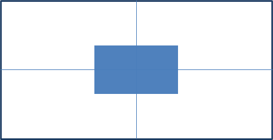

实现步骤：

1. 绝对定位
2. 水平、垂直边偏移为 50%
3. 子级向左、上移动自身尺寸的一半

* 左、上的外边距为 –尺寸的一半
* transform: translate(-50%, -50%)

```css
img {
  position: absolute;
  left: 50%;
  top: 50%;

  /* margin-left: -265px;
  margin-top: -127px; */

  /* 方便： 50% 就是自己宽高的一半 */
  transform: translate(-50%, -50%);
}
```

### 固定定位

**position: fixed**

场景：元素的位置在网页滚动时不会改变

特点：

* 脱标，不占位
* 显示模式具备行内块特点
* 设置边偏移相对浏览器窗口改变位置

```css
div {
  position: fixed;
  top: 0;
  right: 0;

  width: 500px;
}
```

### 堆叠层级z-index


默认效果：按照标签书写顺序，后来者居上

作用：设置定位元素的层级顺序，改变定位元素的显示顺序

属性名：**z-index**

属性值：**整数数字**（默认值为0，取值越大，层级越高）

```css
.box1 {
  background-color: pink;
  /* 取值是整数，默认是0，取值越大显示顺序越靠上 */
  z-index: 1;
}

.box2 {
  background-color: skyblue;
  left: 100px;
  top: 100px;

  z-index: 2;
}
```

## 02-高级技巧

### CSS精灵

CSS 精灵，也叫 **CSS Sprites**，是一种网页**图片应用处理方式**。把网页中**一些背景图片**整合到**一张图片**文件中，再**background-position** 精确的定位出背景图片的位置。

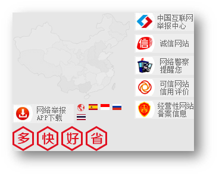

优点：减少服务器被请求次数，减轻服务器的压力，提高页面加载速度


实现步骤：

1. 创建盒子，**盒子尺寸**与**小图**尺寸**相同**
2. 设置盒子**背景图**为精灵图
3. 添加 **background-position** 属性，改变**背景图位置**

​       3.1 使用 PxCook 测量小图片**左上角坐标**

​       3.2 取**负数**坐标为 background-position 属性值（向左上移动图片位置）

### 案例-京东服务

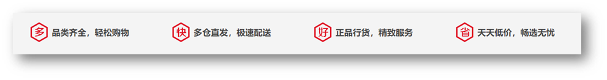

#### HTML结构

```html
<div class="service">
  <ul>
    <li>
      <h5></h5>
      <p>品类齐全，轻松购物</p>
    </li>
    <li>
      <h5></h5>
      <p>多仓直发，极速配送</p>
    </li>
    <li>
      <h5></h5>
      <p>正品行货，精致服务</p>
    </li>
    <li>
      <h5></h5>
      <p>天天低价，畅选无忧</p>
    </li>
  </ul>
</div>
```

#### CSS样式

```html
<style>
  * {
    margin: 0;
    padding: 0;
    box-sizing: border-box;
  }

  li {
    list-style: none;
  }

  .service {
    margin: 100px auto;
    width: 1190px;
    height: 42px;
    /* background-color: pink; */
  }

  .service ul {
    display: flex;
  }

  .service li {
    display: flex;
    padding-left: 40px;
    width: 297px;
    height: 42px;
    /* background-color: skyblue; */
  }

  .service li h5 {
    margin-right: 10px;
    width: 36px;
    height: 42px;
    /* background-color: pink; */
    background: url(./images/sprite.png) 0 -192px;
  }

  .service li:nth-child(2) h5 {
    background-position: -41px -192px;
  }

  .service li:nth-child(3) h5 {
    background-position: -82px -192px;
  }

  .service li:nth-child(4) h5 {
    background-position: -123px -192px;
  }

  .service li p {
    font-size: 18px;
    color: #444;
    font-weight: 700;
    line-height: 42px;
  }
</style>
```

### 字体图标

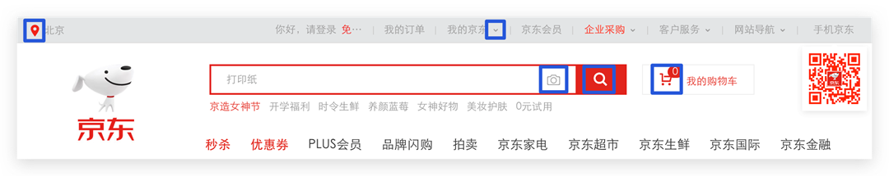

字体图标：**展示的是图标，本质是字体**

作用：在网页中添加**简单的、颜色单一**的小图标

优点

* **灵活性**：灵活地修改样式，例如：尺寸、颜色等
* **轻量级**：体积小、渲染快、降低服务器请求次数
* **兼容性**：几乎兼容所有主流浏览器
* **使用方便**：先下载再使用

#### 下载字体

iconfont 图标库：<https://www.iconfont.cn/> 

登录 → 素材库 → 官方图标库 → 进入图标库 → 选图标，加入购物车 → 购物车，添加至项目，确定 → 下载至本地 

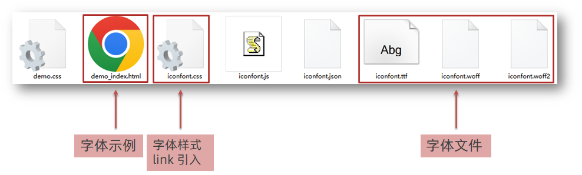

#### 使用字体

1. 引入字体样式表（iconfont.css） 

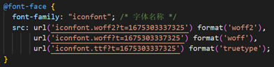

2. 标签使用字体图标类名
   * iconfont：字体图标基本样式（字体名，字体大小等等）
   * icon-xxx：图标对应的类名

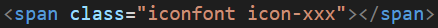

#### 上传矢量图

作用：项目特有的图标上传到 iconfont 图标库，生成字体

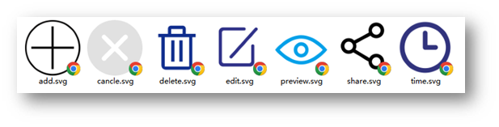

上传步骤：上传 → 上传图标 → 选择 svg 矢量图，打开 → 提交 → 系统审核

## 03-CSS修饰属性

### 垂直对齐方式 

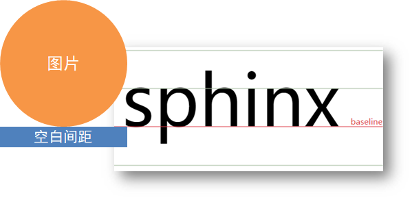

属性名：vertical-align

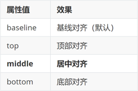

### 过渡

作用：可以为一个元素在不同状态之间切换的时候添加**过渡效果**

属性名：**transition（复合属性）**

属性值：**过渡的属性  花费时间 (s)**

提示：

* 过渡的属性可以是具体的 CSS 属性
* 也可以为 all（两个状态属性值不同的所有属性，都产生过渡效果）
* transition 设置给元素本身

```css
img {
  width: 200px;
  height: 200px;
  transition: all 1s;
}

img:hover {
  width: 500px;
  height: 500px;
}
```

### 透明度opacity

作用：设置**整个元素的透明度**（包含背景和内容）

属性名：opacity

属性值：0 – 1

* 0：完全透明（元素不可见）
* 1：不透明
* 0-1之间小数：半透明

### 光标类型cursor

作用：鼠标悬停在元素上时指针显示样式

属性名：cursor

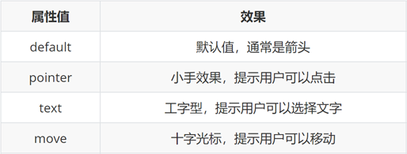

## 04-综合案例-轮播图


### 图片效果

#### HTML结构

```html
<div class="banner">
    <!-- 图: ul > li -->
    <ul>
      <li><a href="#"></a></li>
      <li><a href="#"></a></li>
      <li><a href="#"></a></li>
    </ul>
</div>
```

#### CSS样式

```css
* {
  margin: 0;
  padding: 0;
  box-sizing: border-box;
}

li {
  list-style: none;
}

.banner {
  position: relative;
  margin: 100px auto;
  width: 564px;
  height: 315px;
  /* background-color: pink; */
  overflow: hidden;
}

/* 图片 */
.banner img {
  width: 564px;
  border-radius: 12px;
  vertical-align: middle;
}

.banner ul {
  display: flex;
}
```

### 箭头

#### HTML结构

```html
<!-- 箭头 -->
<!-- 上一张 prev -->
<a href="#" class="prev">
  <i class="iconfont icon-zuoce"></i>
</a>
<!-- 下一张 next -->
<a href="#" class="next">
  <i class="iconfont icon-youce"></i>
</a>
```

#### CSS样式

```css
/* 箭头 */
.banner .prev,
.banner .next {
  /* 隐藏 */
  display: none;
  position: absolute;
  top: 50%;
  transform: translateY(-50%);

  width: 20px;
  height: 30px;
  background-color: rgba(0,0,0, 0.3);

  text-decoration: none;
  color: #fff;
  line-height: 30px;
}

/* 鼠标滑到banner区域，箭头要显示 display:block */
.banner:hover .prev,
.banner:hover .next {
  display: block;
}

.banner .prev {
  left: 0;
  border-radius: 0 15px 15px 0;
}

.banner .next {
  right: 0;
  border-radius: 15px 0 0 15px;
  text-align: center;
}
```

### 圆点

#### HTML结构

```html
<!-- 圆点 -->
<ol>
  <li></li>
  <li class="active"></li>
  <li></li>
</ol>
```

#### CSS样式

```css
/* 圆点 */
.banner ol {
  position: absolute;
  bottom: 20px;
  left: 50%;
  transform: translateX(-50%);
  height: 13px;
  background-color: rgba(255,255,255,0.3);

  display: flex;

  border-radius: 10px;
}

.banner ol li {
  margin: 3px;
  width: 8px;
  height: 8px;
  background-color: #fff;
  border-radius: 50%;
  cursor: pointer;
}

/* 橙色的li */
.banner ol .active {
  background-color: #ff5000;
}
```


