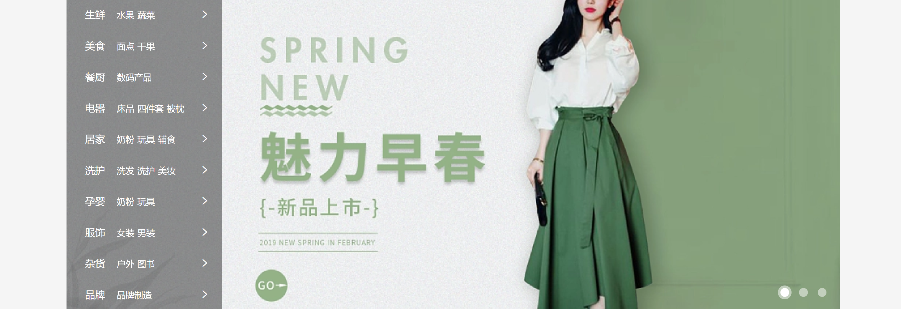
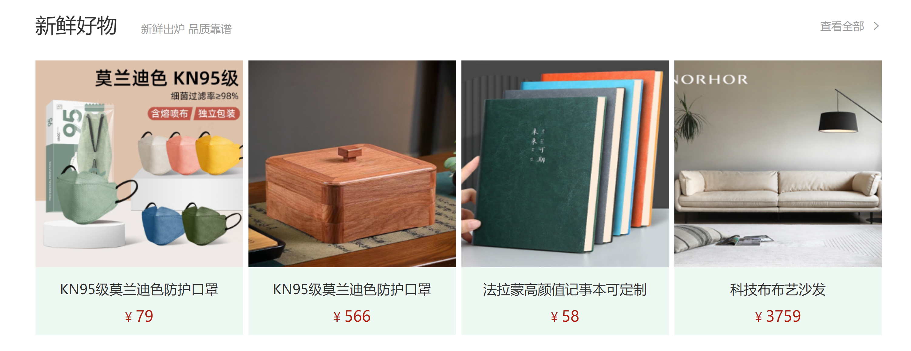
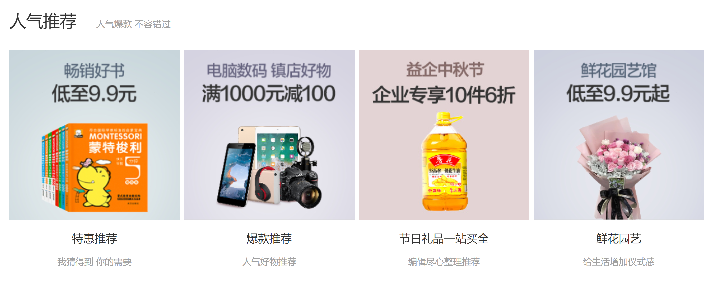
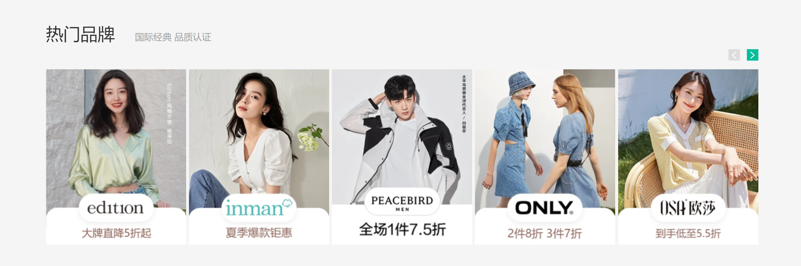
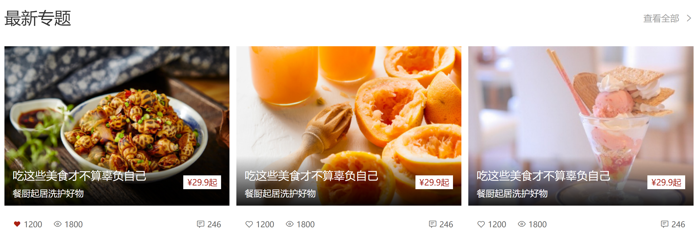

# day10-小兔鲜儿

## 01-banner-轮播图



> index.css

### HTML结构

```html
<!-- banner -->
  <div class="banner">
    <div class="wrapper">
      <!-- 图片 -->
      <ul class="pic">
        <li><a href="#"></a></li>
        <li><a href="#"></a></li>
        <li><a href="#"></a></li>
      </ul>
    </div>
</div>
```

### CSS样式

```css
/* banner */
.banner {
  height: 500px;
  background-color: #F5F5F5;
}

.banner .wrapper {
  position: relative;
  height: 500px;
  background-color: pink;
  overflow: hidden;
}

/* 图片 */
.banner .pic {
  display: flex;
  /* flex 布局，父级宽度不够，子级被挤小，不想挤小，增大父级尺寸 */
  width: 3720px;
}
```

## 02-banner-侧导航

### HTML结构

```html
<!-- 侧导航 ul -->
<div class="subnav">
  <ul>
    <li>
      <div><a href="#" class="classify">生鲜</a><a href="#">水果</a><a href="#">蔬菜</a></div>
      <span class="iconfont icon-arrow-right-bold"></span>
    </li>
    <li>
      <div><a href="#" class="classify">美食</a><a href="#">面点</a><a href="#">干果</a></div>
      <span class="iconfont icon-arrow-right-bold"></span>
    </li>
    <li>
      <div><a href="#" class="classify">餐厨</a><a href="#">数码产品</a></div>
      <span class="iconfont icon-arrow-right-bold"></span>
    </li>
    <li>
      <div><a href="#" class="classify">电器</a><a href="#">床品</a><a href="#">四件套</a><a href="#">被枕</a></div>
      <span class="iconfont icon-arrow-right-bold"></span>
    </li>
    <li>
      <div><a href="#" class="classify">居家</a><a href="#">奶粉</a><a href="#">玩具</a><a href="#">辅食</a></div>
      <span class="iconfont icon-arrow-right-bold"></span>
    </li>
    <li>
      <div><a href="#" class="classify">洗护</a><a href="#">洗发</a><a href="#">洗护</a><a href="#">美妆</a></div>
      <span class="iconfont icon-arrow-right-bold"></span>
    </li>
    <li>
      <div><a href="#" class="classify">孕婴</a><a href="#">奶粉</a><a href="#">玩具</a></div>
      <span class="iconfont icon-arrow-right-bold"></span>
    </li>
    <li>
      <div><a href="#" class="classify">服饰</a><a href="#">女装</a><a href="#">男装</a></div>
      <span class="iconfont icon-arrow-right-bold"></span>
    </li>
    <li>
      <div><a href="#" class="classify">杂货</a><a href="#">户外</a><a href="#">图书</a></div>
      <span class="iconfont icon-arrow-right-bold"></span>
    </li>
    <li>
      <div><a href="#" class="classify">品牌</a><a href="#">品牌制造</a></div>
      <span class="iconfont icon-arrow-right-bold"></span>
    </li>
    
  </ul>
</div>
```

### CSS样式

```css
/* 侧导航 */
.subnav {
  position: absolute;
  left: 0;
  top: 0;
  width: 250px;
  height: 500px;
  background-color: rgba(0,0,0,0.42);
}

.subnav li {
  display: flex;
  justify-content: space-between;
  padding-left: 30px;
  padding-right: 12px;
  height: 50px;
  /* background-color: pink; */
  line-height: 50px;
  color: #fff;

  cursor: pointer;
}

/* a所有都是小字，分类是大字 */
.subnav li a {
  margin-right: 5px;
  font-size: 14px;
  color: #fff;
}

.subnav li .classify {
  margin-right: 14px;
  font-size: 16px;
}

.subnav li .iconfont {
  font-size: 14px;
}

.subnav li:hover {
  background-color: #00BE9A;
}
```

## 03-banner-圆点指示器

### HTML结构

```html
<!-- 圆点指示器 -->
<ol>
  <li class="current"><i></i></li>
  <li><i></i></li>
  <li><i></i></li>
</ol>
```

### CSS样式

```css
/* 圆点指示器 */
.banner ol {
  position: absolute;
  bottom: 17px;
  right: 16px;
  display: flex;
}

.banner ol li {
  margin-left: 8px;
  width: 22px;
  height: 22px;
  /* background-color: pink; */
  border-radius: 50%;
  cursor: pointer;
}

.banner ol i {
  display: block;
  margin: 4px;
  width: 14px;
  height: 14px;
  background-color: rgba(255,255,255,0.5);
  border-radius: 50%;
}

/* 选中：li半透明； i白色 */
.banner ol .current {
  background-color: rgba(255,255,255,0.5);
}

.banner ol .current i {
  background-color: #fff;
}
```

## 04-新鲜好物-标题



> 考虑公共样式

### HTML结构

```html
<!-- 新鲜好物 -->
<div class="goods wrapper">
  <!-- 标题 -->
  <div class="title">
    <div class="left">
      <h3>新鲜好物</h3>
      <p>新鲜出炉 品质靠谱</p>
    </div>
    <div class="right">
      <a href="#" class="more">查看全部<span class="iconfont icon-arrow-right-bold"></span></a>
    </div>
  </div>
</div>
```

### CSS样式

```css
/* 新鲜好物 */
/* 标题 -- 公共样式 */
.title {
  display: flex;
  justify-content: space-between;
  margin-top: 40px;
  margin-bottom: 30px;
  height: 42px;
  /* background-color: pink; */
}

.title .left {
  display: flex;
}

.title .left h3 {
  margin-right: 35px;
  font-size: 30px;
}

.title .left p {
  align-self: flex-end;
  color: #A1A1A1;
}

.title .right .more {
  line-height: 42px;
  color: #A1A1A1;
}

.title .right .more .iconfont {
  margin-left: 10px;
}
```

## 05-新鲜好物-内容

### HTML结构

```html
<!-- 内容 -->
<div class="bd">
  <ul>
    <li>
      <a href="#">
        <div class="pic"></div>
        <div class="txt">
          <h4>KN95级莫兰迪色防护口罩</h4>
          <p>¥<span>79</span></p>
        </div>
      </a>
    </li>
    <li>
      <a href="#">
        <div class="pic"></div>
        <div class="txt">
          <h4>紫檀外独板三层普洱茶盒</h4>
          <p>¥<span>566</span></p>
        </div>
      </a>
    </li>
    <li>
      <a href="#">
        <div class="pic"></div>
        <div class="txt">
          <h4>法拉蒙高颜值记事本可定制</h4>
          <p>¥<span>58</span></p>
        </div>
      </a>
    </li>
    <li>
      <a href="#">
        <div class="pic"></div>
        <div class="txt">
          <h4>科技布布艺沙发</h4>
          <p>¥<span>3579</span></p>
        </div>
      </a>
    </li> 
  </ul>
</div>
```

### CSS样式

```css
/* 好物内容 -- 公共样式 */
.bd ul {
  display: flex;
  justify-content: space-between;
}

.bd li {
  width: 304px;
  height: 404px;
  background-color: #EEF9F4;
}

.bd li .pic {
  width: 304px;
  height: 304px;
}

.bd li .txt {
  text-align: center;
}

.bd li h4 {
  margin-top: 18px;
  margin-bottom: 8px;
  font-size: 20px;
}

.goods .bd p {
  font-size: 18px;
  color: #AA2113;
}

.goods .bd p span {
  margin-left: 3px;
  font-size: 22px;
}
```

## 06-人气推荐



### HTML结构

```html
<!-- 人气推荐 -->
<div class="recommend wrapper">
  <!-- 标题 -->
  <div class="title">
    <div class="left">
      <h3>人气推荐</h3>
      <p>人气爆款 不容错过</p>
    </div>
  </div>
  <!-- 内容 -->
  <div class="bd">
    <ul>
      <li>
        <a href="#">
          <div class="pic"></div>
          <div class="txt">
            <h4>特惠推荐</h4>
            <p>我猜得到 你的需要</p>
          </div>
        </a>
      </li>
      <li>
        <a href="#">
          <div class="pic"></div>
          <div class="txt">
            <h4>爆款推荐</h4>
            <p>人气好物推荐</p>
          </div>
        </a>
      </li>
      <li>
        <a href="#">
          <div class="pic"></div>
          <div class="txt">
            <h4>节日礼品一站买全</h4>
            <p>编辑尽心整理推荐</p>
          </div>
        </a>
      </li>
      <li>
        <a href="#">
          <div class="pic"></div>
          <div class="txt">
            <h4>鲜花园艺</h4>
            <p>给生活增加仪式感</p>
          </div>
        </a>
      </li>
      
    </ul>
  </div>
</div>
```

### CSS样式

```css
/* 人气推荐 */
.recommend .bd li {
  background-color: #fff;
}

.recommend .bd p {
  color: #A1A1A1;
}
```

## 07-热门品牌-布局



### HTML结构

```html
<!-- 热门品牌 -->
<div class="brand">
  <div class="wrapper">
    <!-- 标题 -->
    <div class="title">
      <div class="left">
        <h3>热门品牌</h3>
        <p>国际经典 品质认证</p>
      </div>

      <div class="button">1</div>
    </div>
  </div>
</div>
```

### CSS样式

```css
/* 热门品牌 */
.brand {
  margin-top: 60px;
  height: 468px;
  background-color: #F5F5F5;
}

.brand .wrapper {
  overflow: hidden;
  height: 468px;
  /* background-color: pink; */
}

.brand .title {
  position: relative;
  margin-bottom: 40px;
}

.brand .button {
  position: absolute;
  right: 0;
  bottom: -25px;

  /* 让a在一行显示，宽高生效 */
  display: flex;
}
```

## 08-热门品牌-内容

### HTML结构

```html
<div class="button">
  <a href="#" class="prev">
    <i class="iconfont icon-arrow-left-bold"></i>
  </a>
  <a href="#" class="next">
    <i class="iconfont icon-arrow-right-bold"></i>
  </a>
</div>


<!-- 内容 -->
<div class="bd">
  <ul>
    <li><a href="#"></a></li>
    <li><a href="#"></a></li>
    <li><a href="#"></a></li>
    <li><a href="#"></a></li>
    <li><a href="#"></a></li>
  </ul>
</div>
```

### CSS样式

```css
.brand .button a {
  margin-left: 12px;
  width: 20px;
  height: 20px;
  text-align: center;
  line-height: 20px;
  color: #fff;
}

.brand .button .prev {
  background-color: #ddd;
}

.brand .button .next {
  background-color: #00BE9A;
}

.brand .bd li {
  width: 244px;
  height: 306px;
}
```

## 09-生鲜-标题


### HTML结构

```html
<!-- 生鲜 -->
<div class="fresh wrapper">
  <!-- 标题 -->
  <div class="title">
    <div class="left">
      <h3>生鲜</h3>
    </div>
    <div class="right">
      <ul>
        <li><a href="#" class="active">热门</a></li>
        <li><a href="#">蔬菜</a></li>
        <li><a href="#">肉禽蛋</a></li>
        <li><a href="#">水果</a></li>
        <li><a href="#">海鲜</a></li>
        <li><a href="#">零食</a></li>
        <li><a href="#">饮料</a></li>
      </ul>
      <a href="#" class="more">查看全部<span class="iconfont icon-arrow-right-bold"></span></a>
    </div>
  </div>
</div>
```

### CSS样式

```css
/* 生鲜 */
.fresh .title {
  margin-top: 60px;
  margin-bottom: 20px;
}

.title .right {
  display: flex;
}

.title .right ul {
  display: flex;
  margin-top: 10px;
  margin-right: 58px;
}

.title .right ul a {
  display: block;
  margin-left: 6px;
  padding: 0 7px;
  height: 20px;
  /* background-color: pink; */
  line-height: 20px;
}

.title .right ul .active {
  background-color: #00BE9A;
  color: #fff;
}
```

## 10-生鲜-内容布局

### HTML结构

```html
<!-- 内容 -->
<div class="content">
  <div class="left">
    <a href="#"></a>
  </div>
  <div class="right">
    <ul>
      <li>1</li>
      <li>2</li>
      <li>3</li>
      <li>4</li>
      <li>5</li>
      <li>6</li>
      <li>7</li>
      <li>8</li>
    </ul>
  </div>
</div>
```

### CSS样式

```css
/* 生鲜内容 */
.content {
  display: flex;
  justify-content: space-between;
}

.content .left {
  width: 248px;
  height: 610px;
  /* background-color: pink; */
}

.content .right {
  width: 968px;
  height: 610px;
  /* background-color: pink; */
}

.content .right ul {
  display: flex;
  flex-wrap: wrap;
}

.content .right li {
  position: relative;
  padding: 10px 21px 0;
  width: 242px;
  height: 305px;
  border: 2px solid #fff;

  /* 为了隐藏绿色cover */
  overflow: hidden;
}
```

## 11-生鲜-产品内容

### HTML结构

```html
<ul>
  <li>
    <a href="#">
      <div class="pic"></div>
      <div class="txt">
        <div class="info">
          <h4>双味千层，手抓饼烤肉组合</h4>
          <p>240g/袋 4片装</p>
          <p>加热即食</p>
        </div>
        <p class="price">¥<span>89.99</span></p>
      </div>
    </a>
  </li>
  <li>
    <a href="#">
      <div class="pic"></div>
      <div class="txt">
        <div class="info">
          <h4>云南甘蔗慢熬红糖馒头</h4>
          <p>220g/袋 5个装</p>
          <p>加热即食</p>
        </div>
        <p class="price">¥<span>9.00</span></p>
      </div>
    </a>
  </li>
  <li>
    <a href="#">
      <div class="pic"></div>
      <div class="txt">
        <div class="info">
          <h4>日式风味小圆饼</h4>
          <p>圆形【海盐味】</p>
          <p>糖果零食</p>
        </div>
        <p class="price">¥<span>588.00</span></p>
      </div>
    </a>
  </li>
  <li>
    <a href="#">
      <div class="pic"></div>
      <div class="txt">
        <div class="info">
          <h4>全麦奶油浓香小面包</h4>
          <p>50g*12袋</p>
          <p>美味西点</p>
        </div>
        <p class="price">¥<span>69.00</span></p>
      </div>
    </a>
  </li>
  <li>
    <a href="#">
      <div class="pic"></div>
      <div class="txt">
        <div class="info">
          <h4>秘制外皮五福摩提大福点心</h4>
          <p>150g/盒</p>
          <p>美味西点</p>
        </div>
        <p class="price">¥<span>39.99</span></p>
      </div>
    </a>
  </li>
  <li>
    <a href="#">
      <div class="pic"></div>
      <div class="txt">
        <div class="info">
          <h4>水果面膜韩国蜂蜜柚子茶</h4>
          <p>560g/瓶</p>
          <p>冲调饮品</p>
        </div>
        <p class="price">¥<span>39.99</span></p>
      </div>
    </a>
  </li>
  <li>
    <a href="#">
      <div class="pic"></div>
      <div class="txt">
        <div class="info">
          <h4>浓情比利时巧克力礼盒装</h4>
          <p>205克/盒</p>
          <p>糖果零食</p>
        </div>
        <p class="price">¥<span>120.00</span></p>
      </div>
    </a>
  </li>
  <li>
    <a href="#">
      <div class="pic"></div>
      <div class="txt">
        <div class="info">
          <h4>抹茶奶油小蛋糕礼盒装</h4>
          <p>220克/盒</p>
          <p>美味西点</p>
        </div>
        <p class="price">¥<span>60.00</span></p>
      </div>
    </a>
  </li>
</ul>
```

### CSS样式

```css
/* 产品内容 */
.content .pic {
  width: 200px;
  height: 180px;
}

.content .info {
  margin-top: 14px;
  margin-bottom: 5px;
  height: 60px;
  line-height: 19px;
}

.content .price {
  color: #AF2F22;
}

.content .price span {
  margin-left: 5px;
  font-size: 22px;
}
```

## 12-生鲜-过渡效果

### HTML结构

```html
<div class="cover">
  <p>找相似</p>
  <p></p>
  <p>发现更多宝贝<span class="iconfont icon-arrow-right-bold"></span></p>
</div>
```

### CSS样式

```css
/* 产品底部绿色区域 */
.content li .cover {
  position: absolute;
  left: 0;
  /* bottom: 0; */
  bottom: -86px;
  padding-top: 15px;
  width: 242px;
  height: 84px;
  background-color: #00BE9A;
  text-align: center;
  color: #fff;
  transition: all 0.5s;
}

.content .cover p:nth-child(1) {
  font-size: 18px;
}

.content .cover p:nth-child(2) {
  margin: 3px auto 6px;
  width: 120px;
  height: 1px;
  background-color: rgba(255,255,255,0.11);
}

.content .cover p:nth-child(3) {
  font-size: 13px;
} 

.content .cover p:nth-child(3) .iconfont {
  font-size: 14px;
}

/* 鼠标悬停到li，显示cover，改变位置 */
.content .right li:hover .cover {
  bottom: 0;
}

.content .right li:hover {
  border: 2px solid #00BE9A;
}
```

## 13-最新专题-布局



### HTML结构

```html
<!-- 最新专题 -->
<div class="topic wrapper">
  <div class="title">
    <div class="left">
      <h3>最新专题</h3>
    </div>
    <div class="right">
      <a href="#" class="more">查看全部<span class="iconfont icon-arrow-right-bold"></span></a>
    </div>
  </div>
  <div class="topic-bd">
    <ul>
      <li>1</li>
      <li>2</li>
      <li>3</li>
    </ul>
  </div>
</div>
```

### CSS样式

```css
/* 最新专题 */
.topic {
  margin-bottom: 40px;
}

.topic .title {
  margin-top: 100px;
}

.topic-bd ul {
  display: flex;
  justify-content: space-between;
}

.topic-bd li {
  width: 405px;
  height: 355px;
  background-color: pink;
}
```

## 14-最新专题-内容

### HTML结构

```html
<ul>
  <li>
    <a href="#">
      <div class="pic">
        
      </div>
      <div class="txt">
        <div class="left">
          <p>
            <i class="iconfont icon-favorites-fill"></i>
            <span>1220</span>
          </p>
          <p>
            <i class="iconfont icon-browse"></i>
            <span>1800</span>
          </p>
        </div>
        <div class="right">
          <p>
            <i class="iconfont icon-comment"></i>
            <span>246</span>
          </p>
        </div>
      </div>
    </a>
  </li>
  <li>
    <a href="#">
      <div class="pic">
        
      </div>
      <div class="txt">
        <div class="left">
          <p>
            <i class="iconfont icon-favorites-fill"></i>
            <span>1220</span>
          </p>
          <p>
            <i class="iconfont icon-browse"></i>
            <span>1800</span>
          </p>
        </div>
        <div class="right">
          <p>
            <i class="iconfont icon-comment"></i>
            <span>246</span>
          </p>
        </div>
      </div>
    </a>
  </li>
  <li>
    <a href="#">
      <div class="pic">
        
      </div>
      <div class="txt">
        <div class="left">
          <p>
            <i class="iconfont icon-favorites-fill"></i>
            <span>1220</span>
          </p>
          <p>
            <i class="iconfont icon-browse"></i>
            <span>1800</span>
          </p>
        </div>
        <div class="right">
          <p>
            <i class="iconfont icon-comment"></i>
            <span>246</span>
          </p>
        </div>
      </div>
    </a>
  </li>
</ul>
```

### CSS样式

```css
.topic-bd ul {
  display: flex;
  justify-content: space-between;
}

.topic-bd li {
  width: 405px;
  height: 355px;
  background-color: pink;
}

.topic-bd .pic {
  position: relative;
  width: 405px;
  height: 288px;
}

.topic-bd .txt {
  display: flex;
  justify-content: space-between;
  align-items: center;
  padding: 0 15px;
  width: 405px;
  height: 67px;
  /* background-color: skyblue; */
  font-size: 14px;
  color: #666;
}

.topic-bd .txt .left {
  display: flex;
}

.topic-bd .txt .left p {
  margin-right: 20px;
}

.topic-bd .txt .left p:nth-child(1) i {
  color: #AA2113;
}
```

## 15-最新专题-定位文字

### HTML结构

```html
<div class="pic">
  
  <!-- 定位区域 -->
  <div class="cover">
    <div class="left">
      <h4>吃这些美食才不算辜负自己</h4>
      <p>餐厨起居洗护好物</p>
    </div>
    <div class="right">￥<span>29.9</span><span>起</span></div>
  </div>
</div>
```

### CSS样式

```css
/* 定位区域 - 文字 */
.topic-bd .cover {
  position: absolute;
  left: 0;
  bottom: 0;

  display: flex;
  justify-content: space-between;
  align-items: center;

  padding: 0 15px;
  width: 405px;
  height: 90px;
  background-image: linear-gradient(180deg, rgba(137,137,137,0.00) 0%, rgba(0,0,0,0.90) 100%);
}

.topic-bd .cover .left {
  color: #fff;
}

.topic-bd .cover .left h4 {
  margin-bottom: 6px;
  font-size: 20px;
}

.topic-bd .cover .right {
  padding: 0 7px;
  height: 25px;
  background-color: #fff;
  color: #AA2113;
  font-size: 15px;
}

.topic-bd .cover .right span {
  font-size: 18px;
}
```

