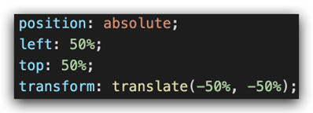

# 移动 Web 第一天

> 目标：使用位移、缩放、旋转、渐变效果丰富网页元素的呈现方式。

## 01-平面转换

### 简介

作用：为元素添加动态效果，一般与过渡配合使用

概念：改变盒子在平面内的形态（位移、旋转、缩放、倾斜）


平面转换也叫 2D 转换，属性是 **transform**

### 平移

```css
transform: translate(X轴移动距离, Y轴移动距离);
```

* 取值
  * 像素单位数值
  * 百分比（参照**盒子自身尺寸**计算结果）
  * **正负**均可
* 技巧
  * translate() **只写一个值**，表示沿着 **X** 轴移动
  * 单独设置 X 或 Y 轴移动距离：translateX() 或 translateY()

### 定位居中

* 方法一：margin


* 方法二：平移 → 百分比参照盒子自身尺寸计算结果 



### 案例-双开门


* HTML 结构

```html
<div class="father">
    <div class="left"></div>
    <div class="right"></div>
</div>
```

* CSS 样式

```css
* {
    margin: 0;
    padding: 0;
}

/* 1. 布局：父子结构，父级是大图，子级是左右小图 */
.father {
    display: flex;
    margin: 0 auto;
    width: 1366px;
    height: 600px;
    background-image: url(./images/bg.jpg);

    overflow: hidden;
}

.father .left,
.father .right {
    width: 50%;
    height: 600px;
    background-image: url(./images/fm.jpg);

    transition: all .5s;
}

.father .right {
    /* right 表示的取到精灵图右面的图片 */
    background-position: right 0;
}

/* 2. 鼠标悬停的效果：左右移动 */
.father:hover .left {
    transform: translate(-100%);
}

.father:hover .right {
    transform: translateX(100%);
}
```

### 旋转

```css
transform: rotate(旋转角度);
```

* 取值：角度单位是 **deg** 
* 技巧
  * 取值正负均可
  * 取值为正，顺时针旋转
  * 取值为负，逆时针旋转

### 转换原点

> 默认情况下，转换原点是盒子中心点 

```css
transform-origin: 水平原点位置 垂直原点位置;
```

取值：

* **方位名词**（left、top、right、bottom、center）
* 像素单位数值
* 百分比

### 案例-时钟


```css
.hour {
  width: 6px;
  height: 50px;
  background-color: #333;
  margin-left: -3px;
  transform: rotate(15deg);
  transform-origin: center bottom;
}

.minute {
  width: 5px;
  height: 65px;
  background-color: #333;
  margin-left: -3px;
  transform: rotate(90deg);
  transform-origin: center bottom;
}

.second {
  width: 4px;
  height: 80px;
  background-color: red;
  margin-left: -2px;
  transform: rotate(240deg);
  transform-origin: center bottom;
}
```

### 多重转换

多重转换技巧：先平移再旋转

```css
transform: translate() rotate();
```

* 多重转换原理：以第一种转换方式坐标轴为准转换形态
  * 旋转会改变网页元素的坐标轴向
  * 先写旋转，则后面的转换效果的轴向以旋转后的轴向为准，会影响转换结果

### 缩放

```css
transform: scale(缩放倍数);
transform: scale(X轴缩放倍数, Y轴缩放倍数);
```

* 技巧
  * 通常，只为 scale() 设置一个值，表示 X 轴和 Y 轴等比例缩放
  * 取值大于1表示放大，取值小于1表示缩小

### 案例-播放特效


* CSS 样式

```css
/* 1. 摆放播放按钮：图片区域的中间 */
.box li {
  overflow: hidden;
}

.pic {
  position: relative;
}

.pic::after {
  position: absolute;
  left: 50%;
  top: 50%;
  /* margin-left: -29px;
  margin-top: -29px; */
  /* transform: translate(-50%, -50%); */

  content: '';
  width: 58px;
  height: 58px;
  background-image: url(./images/play.png);
  transform: translate(-50%, -50%) scale(5);
  opacity: 0;

  transition: all .5s;
}
/* 2. hover效果：大按钮，看不见：透明是0 → 小按钮，看得见：透明度1 */
.box li:hover .pic::after {
  transform: translate(-50%, -50%) scale(1);
  opacity: 1;
}
```

### 倾斜

```css
transform: skew();
```

取值：角度度数 deg

## 02-渐变

渐变是多个颜色逐渐变化的效果，一般用于设置盒子背景 

分类：

* 线性渐变


* 径向渐变


### 线性渐变

```css
background-image: linear-gradient(
  渐变方向,
  颜色1 终点位置,
  颜色2 终点位置,
  ......
);
```

取值：

* 渐变方向：可选
  * to 方位名词
  * 角度度数
* 终点位置：可选
  * 百分比

### 案例-产品展示


* HTML 结构

```html
<div class="box">
  
  <div class="title">OceanStor Pacific 海量存储斩获2021 Interop金奖</div>
  <div class="mask"></div>
</div>
```

* CSS 样式

```css
.mask {
  position: absolute;
  left: 0;
  top: 0;
  width: 100%;
  height: 100%;
  background-image: linear-gradient(
      transparent,
      rgba(0,0,0,0.5)
  );
  opacity: 0;

  transition: all .5s;
}

.box:hover .mask {
  opacity: 1;
}
```

### 径向渐变

```css
background-image: radial-gradient(
  半径 at 圆心位置,
  颜色1 终点位置,
  颜色2 终点位置,
  ......
);
```

取值：

* 半径可以是2条，则为椭圆
* 圆心位置取值：像素单位数值 / 百分比 / 方位名词

## 03-综合案例


### 导航-频道

#### 箭头旋转

```css
.x-header-nav .nav-item:hover .icon-down {
  transform: rotate(-180deg);
}
```

#### 频道列表

```css
.channel-layer {
  position: absolute;
  top: 60px;
  left: 50%;
  z-index: -2;
  width: 1080px;
  height: 120px;
  padding: 10px;
  margin-left: -540px;
  color: #72727b;
  background-color: #f5f5f5;
  border: 1px solid #e4e4e4;
  border-top: none;
  transition: all 0.5s;
  transform: translateY(-120px);
}

/* TODO 2. 弹窗频道 */
.x-header-nav .nav-item:hover .channel-layer {
  transform: translateY(0);
}
```

### 渐变按钮

#### 搜索按钮

```css
.x-header-search form .btn {
  position: absolute;
  top: 0;
  right: 0;
  width: 60px;
  height: 40px;
  line-height: 40px;
  text-align: center;
  background-color: #f86442;
  border-top-right-radius: 20px;
  border-bottom-right-radius: 20px;
  background-image: linear-gradient(
    to right,
    rgba(255, 255, 255, 0.3),
    #f86442
  );
}
```

#### 登录按钮

```css
/* TODO 7. 渐变按钮 */
.card .card-info .login {
  padding: 3px 34px;
  color: #fff;
  background-color: #ff7251;
  border-radius: 30px;
  box-shadow: 0 4px 8px 0 rgb(252 88 50 / 50%);
  background-image: linear-gradient(
    to right,
    rgba(255, 255, 255, 0.2),
    #ff7251
  );
}
```

#### 客户端按钮

```css
/* TODO 8. 径向渐变 */
.download .dl .dl-btn {
  width: 68px;
  height: 34px;
  line-height: 34px;
  color: #fff;
  text-align: center;
  border-radius: 4px;
  background-image: radial-gradient(
    50px at 10px 10px,
    rgba(255, 255, 255, 0.5),
    transparent
  );
}
```

### 轮播图

```css
/* TODO 4. 摆放图片 */
.banner .banner-list .banner-item.left {
  z-index: 0;
  transform: translate(-160px) scale(0.8);
  transform-origin: left center;
}

.banner .banner-list .banner-item.right {
  z-index: 0;
  transform: translate(160px) scale(0.8);
  transform-origin: right center;
}
```

### 猜你喜欢

```css
/* TODO 5. 播放按钮和遮罩 */
.album-item .album-item-box::after {
  position: absolute;
  left: 0;
  top: 0;
  content: '';
  width: 100%;
  height: 100%;
  background: rgba(0,0,0,.5) url(../assets/play.png) no-repeat center / 20px;
  opacity: 0;
  transition: all .5s;
}

.album-item .album-item-box:hover::after {
  opacity: 1;
  background-size: 50px;
}


/* TODO 6. 图片缩放 */
.album-item .album-item-box:hover img {
  transform: scale(1.1);
}
```

