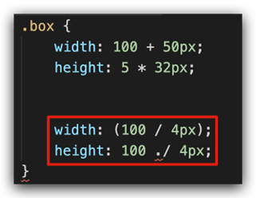

# 移动 Web 第三题

## 01-移动 Web 基础

### 谷歌模拟器

模拟移动设备，方便查看页面效果


### 屏幕分辨率

分类：

* 物理分辨率：硬件分辨率（出厂设置）
* 逻辑分辨率：软件 / 驱动设置

结论：**制作网页参考 逻辑分辨率** 


### 视口

作用：显示 HTML 网页的区域，用来约束 HTML 的尺寸

```html
<!DOCTYPE html>
<html lang="en">
<head>
  <meta charset="UTF-8">
  <meta http-equiv="X-UA-Compatible" content="IE=edge">

  <!– 视口标签 -->
  <meta name="viewport" content="width=device-width, initial-scale=1.0">

  <title>Document</title>
</head>
<body>
  
</body>
</html>
```

* width=device-width：视口宽度 = 设备宽度
* initial-scale=1.0：缩放1倍（不缩放）

### 二倍图

概念：设计稿里面每个元素的尺寸的倍数

作用：防止图片在高分辨率屏幕下模糊失真

使用方法：


### 适配方案

* 宽度适配：宽度自适应
  * 百分比布局
  * Flex 布局

* 等比适配：宽高等比缩放
  * rem
  * vw

## 02-rem

### 简介

* rem单位，是相对单位
* rem单位是相对于HTML标签的字号计算结果
* 1rem = 1HTML字号大小

### 媒体查询

媒体查询能够检测视口的宽度，然后编写差异化的 CSS 样式

当某个条件成立, 执行对应的CSS样式


```css
@media (width:320px) {
  html {
    background-color: green;
  }
}
```

### rem 布局

目前rem布局方案中，将网页等分成10份， HTML标签的字号为视口宽度的 1/10。


### flexible.js

flexible.js 是手淘开发出的一个用来适配移动端的 js 库。

核心原理就是根据不同的视口宽度给网页中 html 根节点设置不同的 font-size。

```html
<body>
  ......
  <script src="./js/flexible.js"></script>
</body>
```

### rem 移动适配

rem单位尺寸

1.  确定基准根字号

* 查看设计稿宽度 → 确定参考设备宽度(视口宽度) → 确定基准根字号（1/10视口宽度）

2.  rem单位的尺寸

* **rem单位的尺寸 = px单位数值 / 基准根字号**

## 03-less

Less是一个CSS预处理器, Less文件后缀是.less。扩充了 CSS 语言, 使 CSS 具备一定的逻辑性、计算能力

注意：浏览器不识别 Less 代码，目前阶段，网页要引入对应的 CSS 文件

VS Code 插件：Easy LESS，保存 less文件后自动生成对应的 CSS 文件


### 注释

* 单行注释
  * 语法：// 注释内容
  * 快捷键：ctrl + /
* 块注释
  * 语法：/* 注释内容 */
  * 快捷键： Shift + Alt + A

### 运算

* 加、减、乘直接书写计算表达式
* 除法需要添加 小括号 或 .
* 表达式存在多个单位以第一个单位为准



### 嵌套

作用：快速生成后代选择器


提示：用 & 表示当前选择器，不会生成后代选择器，通常配合伪类或伪元素使用


### 变量

概念：容器，存储数据

作用：存储数据，方便使用和修改

语法：

* 定义变量：@变量名: 数据; 
* 使用变量：CSS属性：@变量名;

```less
// 定义变量
@myColor: pink;
// 使用变量
.box {
  color: @myColor;
}
a {
  color: @myColor;
}
```

### 导入

作用：导入 less 公共样式文件

语法：导入: @import “文件路径”;

提示：如果是 less 文件可以省略后缀

```less
@import './base.less';
@import './common';
```

### 导出

写法：在 less 文件的第一行添加 // out: 存储URL

提示：文件夹名称后面添加 /

```less
// out: ./index.css
// out: ./css/
```

### 禁止导出

写法：在 less 文件第一行添加:  // out: false 


## 04-综合案例-极速问诊


### 准备工作

* 项目目录


* HTML 结构

```html
<link rel="stylesheet" href="./iconfont/iconfont.css">
<link rel="stylesheet" href="./css/index.css">

<body>
  ......
  <script src="./js/flexible.js"></script>
</body>
```

* less 样式

```less
// out: ../css/

@import "./base";
```

### 头部布局

* HTML 结构

```html
<!-- 头部 -->
<header>1</header>
```

* less 样式

```less
// 头部
header {
  display: flex;
  justify-content: space-between;
  padding: 0 (15 / @rootSize);
  height: (44 / @rootSize);
  background-color: pink;
  line-height: (44 / @rootSize);
}
```

### 头部内容

* HTML 结构

```html
<a href="#" class="back"><span class="iconfont icon-left"></span></a>
<h3>极速问诊</h3>
<a href="#" class="note">问诊记录</a>
```

* less 样式

```less
.icon-left {
  font-size: (22 / @rootSize);
}

h3 {
  font-size: (17 / @rootSize);
}

.note {
  font-size: (15 / @rootSize);
  color: #2CB5A5;
}
```

### banner 区域

* HTML 结构

```html
<!-- banner -->
<div class="banner">
  
  <p><span>20s</span> 快速匹配专业医生</p>
</div>
```

* less 样式

```less
// banner
.banner {
  margin-top: (30 / @rootSize);
  margin-bottom: (34 / @rootSize);
  text-align: center;
  img {
    margin-bottom: (18 / @rootSize);
    width: (240 / @rootSize);
    height: (206 / @rootSize);
  }

  p {
    font-size: (16 / @rootSize);
    span {
      color: #16C2A3;
    }
  }
}
```

### 问诊类型布局

* HTML 结构

```html
<!-- 问诊类型 -->
<div class="type">
  <ul>
    <li>
      <a href="#">
        <div class="pic">1</div>
        <div class="txt">2</div>
        <span class="iconfont icon-right"></span>
      </a>
    </li>
    <li>2</li>
  </ul>
</div>
```

* less 样式

```less
// 问诊类型
.type {
  padding: 0 (15 / @rootSize);
  li {
    margin-bottom: (15 / @rootSize);
    padding: 0 (15 / @rootSize);
    height: (78 / @rootSize);
    border: 1px solid #EDEDED;
    border-radius: (4 / @rootSize);
    a {
      display: flex;
      align-items: center;
      // 内容在78里面垂直居中
      height: (78 / @rootSize);
    }
  }
}
```

### 问诊类型内容

- HTML 结构

```html
<div class="pic">
  
</div>
<div class="txt">
  <h4>三甲图文问诊</h4>
  <p>三甲主治及以上级别医生</p>
</div>
<span class="iconfont icon-right"></span>
```

- less 样式

```less
img {
  margin-right: (14 / @rootSize);
  width: (40 / @rootSize);
  height: (40 / @rootSize);
}
.txt {
  flex:1;
  h4 {
    font-size: (16 / @rootSize);
    color: #3C3E42;
    line-height: (24 / @rootSize);
  }
  p {
    font-size: (13 / @rootSize);
    color: #848484;
  }
}
.iconfont {
  font-size: (16 / @rootSize);
}
```

