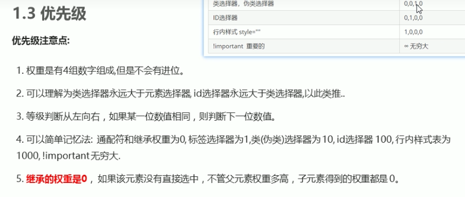
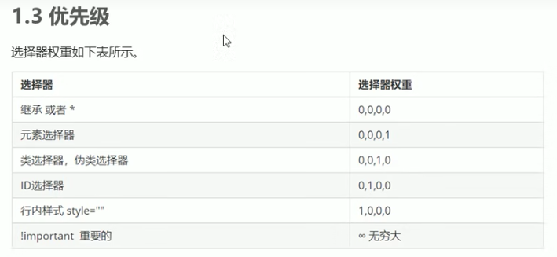
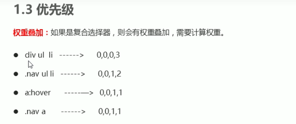
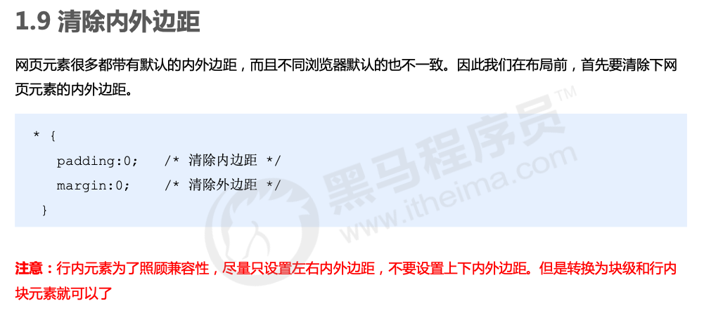

# CSS 的元素显示模式

> 元素显示模式就是元素（标签）以什么方式进行显示，比如<div>自己占一行，比如一行可以放多个<span>

* 块元素 **block**
    * 在页面中**独占一行**，不会与任何元素共用一行，是从上到下排列的。
    * 默认宽度：撑满**父元素**。 
    * 默认高度：由**内容**撑开。
    * **可以**通过 CSS 设置宽高。
* 行内元素 **inline**
    * 在页面中**不独占一行**，一行中不能容纳下的行内元素，会在下一行继续从左到右排列。
    * 默认宽度：由**内容**撑开。
    * 默认高度：由**内容**撑开。
    * **无法**通过 CSS 设置宽高
* 行内块元素 **inline-block**
    * 在页面中**不独占一行**，一行中不能容纳下的行内元素，会在下一行继续从左到右排列。
    * 默认宽度：由**内容**撑开。
    * 默认高度：由**内容**撑开。
    * **可以**通过 CSS 设置宽高


## 元素一览


#技巧：单行文字垂直居中

> CSS 没有给我们提供文字垂直居中的代码。这里我们可以使用一个小技巧来实现。
>
> 解决方案: 让文字的行高等于盒子的高度，就可以让文字在当前盒子内垂直居中

```html
<title>单行文字垂直居中</title>
<style>
    div {
        width: 200px;
        height: 40px;
        background-color: pink;
        line-height: 40px;     // 让文字的行高等于盒子的高度
    }
</style>
```


# CSS三大特性一：层叠性

> 同一个控件样式会叠加。
>
> 如下：最后是粉色pink

```css
<style>
   div {
       color: red;
       font-size: 12px;
   }
   div {
       color: pink;
   }
</style>
```


# CSS三大特性二：继承性

> 子类的元素会继承父类的特性。
>
> 如下：最后<p>标签是粉红色pink，字体14px。

```css
# CSS
<style>
    div {
        color: pink;
        font-size: 14px;
    }
</style>

# HTML
<body>
    <div>
        <p>龙生龙，凤生凤，老鼠生的孩子会打洞</p>
    </div>
</body>
```


# CSS三大特性三：优先级








# 边框会影响盒子的实际大小

```css
<style>
    /* 我们需要一个200*200的盒子, 但是这个盒子有10像素的红色边框 */
    div {
        width: 180px;
        height: 180px;
        background-color: pink;
        border: 10px solid red;
    }
</style>
```


# 内边距会影响盒子实际大小

```css
<style>
    /* 盒子宽高160px, 但是这个盒子有20像素的粉红色padding内边距，所以div实际大小为200px */
    div {
        width: 160px;
        height: 160px;
        background-color: pink;
        padding: 20px;
    }
</style>

<div>
    盒子内容是content盒子内容是content盒子内容是content盒子内容是content
</div>
```


# padding不会影响盒子大小的情况

如果盒子本身没有指定 width / height 属性，则此时padding不会撑开盒子大小。

```css
<style>
	h1 {
    	/* width: 100%; */    // 设置 or 不设置
        height: 200px;
        background-color: pink;
        padding: 30px;
    }
 </style>
```

* 未设置width属性


* 设置width 属性 = 100%


# 盒子水平居中对齐 - margin典型应用

```css
<style>
	div {
    	width: 900px;
        height: 200px;
        background-color: pink;
        margin: 100px auto;  		// 重点
  	}
</style>
```


# 行内元素 / 行内块元素 水平居中对齐

行内元素或者行内块元素水平居中给其父元素添加 text-align:center 即可

```html
# CSS
<style>
    div {
        width: 900px;
        height: 200px;
        background-color: pink;
        margin: 100px auto;
        
        /* 行内元素或者行内块元素水平居中给其父元素添加 text-align:center 即可 */
        text-align: center;   
    }
</style>

# HTML
<div class="header">
    <span>里面的文字</span>
</div>
```


# 元素居中

```css
.son {
    position: absolute;
    left: 50%;
    top: 50%;
    
    /* 方式一：margin */
    margin-left: -100px;
    margin-top: -50px;

    /* 方式二：transform */
    transform: translate(-50%, -50%);

    width: 203px;
    height: 100px;
    background-color: pink;          
}
```


# 外边距合并1 - 相邻块级元素垂直外边距合并


* 两个元素分别设置 margin，相邻的部分合并。

* 解决方案：尽量只给一个盒子添加 margin 值。

```html
<style>
    .damao, .ermao {
        width: 200px;
        height: 200px;
        background-color: pink;
    }
    .damao {
        margin-bottom: 100px;   // 重点
    }
    .ermao {
        margin-top: 200px;   // 重点
    }
</style>

<body>
    <div class="damao">大毛</div>
    <div class="ermao">二毛</div>
</body>
```


# 外边距合并2 - 嵌套元素外边距塌陷


# 移除所有边距





# 行内块中间有缝隙 - 浮动

```html
# CSS
<style>
    div {
		/* display: inline-block; */    
        width: 150px;
        height: 200px;
        background-color: pink;
    }
</style>

# HTML
<body>
    <div>1</div>
    <div>2</div>
    <div>3</div>
</body>
```

* 块元素 垂直 没有 缝隙


* 转为  行内块元素 水平 有 缝隙


* 解决方案：

```html
<style>
    div {
    	/* 使用浮动，代替行内块元素 */	
        float: left;
 		/* display: inline-block; */   

        width: 150px;
        height: 200px;
        background-color: pink;
    }
</style>
```


# 浮动 - 脱标


# 清除浮动


## 清除浮动一：额外标签法


## 清除浮动二：父级添加 overflow


## 清除浮动三： :after 伪元素法


## 清除浮动四：双伪元素清除浮动


# 定位 = 定位模式 + 边偏移 

```css
position: relative; 
top: 10px;
```


## static

静态定位：默认定位方式，无定位的意思。


## relative

**相对定位**是元素在移动位置的时候，是相对于它原来的位置来说的（自恋型）。

相对定位的特点：（务必记住）

1. 它是相对于自己原来的位置来移动的（移动位置的时候参照点是自己原来的位置）。

2. 原来在标准流的位置继续占有，后面的盒子仍然以标准流的方式对待它。

因此，相对定位并 **没有脱标** 。它最典型的应用是给绝对定位当爹的。


## absolute

**绝对定位**是元素在移动位置的时候，是相对于它祖先元素来说的（拼爹型）。

绝对定位的特点：（务必记住）

1. 如果没有祖先元素或者祖先元素没有定位，则以浏览器为准定位（Document 文档）。

2. 如果祖先元素有定位（相对、绝对、固定定位），则以最近一级的有定位祖先元素为参考点移动位置。

3. 绝对定位不再占有原先的位置。（脱标）

所以绝对定位是 **脱离标准流** 的。


## fix

**固定定位**是元素固定于 **浏览器可视区 ** 的位置。

固定定位的特点：（务必记住）

1. 以浏览器的可视窗口为参照点移动元素。 
    1. 跟父元素没有任何关系
    2. 不随滚动条滚动。

2. 固定定位 **不在占有原先的位置**。

固定定位也是 **脱标** 的，其实固定定位也可以看做是一种 **特殊的绝对定位** 。


## sticky - 很少


# 元素的隐藏

## 方式一：display

display 隐藏元素后，不再占有原来的位置。

```css
# 隐藏对象
display: none;

# 除了转换为块级元素之外，同时还有显示元素的意思
display: block;
```


## 方式二：visibility VS display

visibility 隐藏元素后，继续占有原来的位置。

```css
visibility：visible; #元素可视

visibility：hidden;  #元素隐藏，继续占有原来的位置。

display: none;  #隐藏元素，不占用原来位置
```


## 方式三：overflow

溢出显示隐藏 但是只是对于溢出的部分处理

```css
overflow: visible;

overflow: hidden;

/* scroll 溢出的部分显示滚动条  不溢出也显示滚动条 */
overflow: scroll;

/* auto 溢出的时候才显示滚动条 不溢出不显示滚动条 */
overflow: auto;
```


# vertical-align 属性应用

## 应用一：图片、表单和文字对齐

图片、表单都属于行内块元素，默认的 vertical-align 是基线对齐。

```css
<style>
    img {
        /* 让图片和文字垂直居中 */
        vertical-align: middle;
    }
    textarea {
        vertical-align: middle;
    }
</style>
```


## 应用二：解决图片底部默认空白缝隙问题

bug：图片底侧会有一个空白缝隙，原因是行内块元素会和文字的基线对齐。

主要解决方法有两种：

1. 给图片添加 vertical-align:middle | top| bottom 等。 （提倡使用的）

2. 把图片转换为块级元素 display: block;

```css
img {
    /* 解决方案一： */
	vertical-align: middle;
    
    /* 解决方案二： */
    display: block;
}
```


# 文本溢出省略号

## 单行文本

```css
/*1. 先强制一行内显示文本*/
white-space: nowrap; （ 默认 normal 自动换行）
/*2. 超出的部分隐藏*/
overflow: hidden;
/*3. 文字用省略号替代超出的部分*/
text-overflow: ellipsis;
```

## 多行文本

多行文本溢出显示省略号，有较大兼容性问题， 适合于webKit浏览器或移动端（移动端大部分是webkit内核）

```css
overflow: hidden;
text-overflow: ellipsis;
/* 弹性伸缩盒子模型显示 */
display: -webkit-box;
/* 限制在一个块元素显示的文本的行数 */
-webkit-line-clamp: 3;
/* 设置或检索伸缩盒对象的子元素的排列方式 */
-webkit-box-orient: vertical;
```


