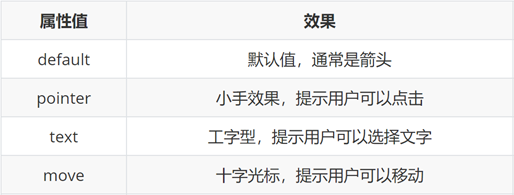
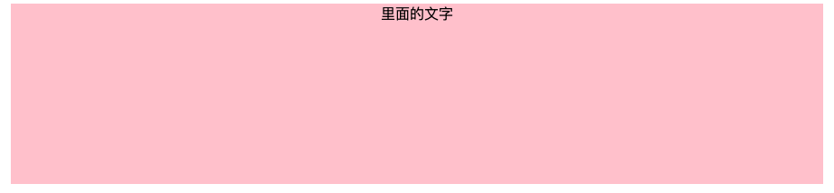

# 一、HTML基础

## 1. 什么是 HTML

HTML 指的是超文本标记语言 (Hyper Text Markup Language) ，它是用来描述网页的一种语言。

HTML 不是一种编程语言，而是一种标记语言 (markup language)。

标记语言是一套标记标签 (markup tag)。

所谓超文本，有 2 层含义：

1. 它可以加入图片、声音、动画、多媒体等内容（超越了文本限制 ）。
2. 它还可以从一个文件跳转到另一个文件，与世界各地主机的文件连接（超级链接文本 ）。


## 2. 浏览器与其内核


## 3.  Web 标准

Web 标准是由 W3C 组织和其他标准化组织制定的一系列标准的集合。W3C（万维网联盟）是国际最著名的标准化组织。


## 4. 特殊字符

[HTML 特殊符号编码对照表](https://tool.chinaz.com/tools/htmlchar.aspx)

[常用特殊符号的HTML代码(HTML字符实体)](https://www.cnblogs.com/xyyt/p/3515397.html)

在 HTML 页面中，一些特殊的符号很难或者不方便直接使用，此时我们就可以使用下面的字符来替代。

<font color='red' size=4>重点记住：空格 、大于号、 小于号 这三个， 其余的使用很少，如果需要回头查阅即可。</font>


# 二. HTML5

* HTML5 的新增特性主要是针对于以前的不足，增加了一些<font color='red' size=4>新的标签、新的表单和新的表单属性</font>等。

* 这些新特性都有<font color='red' size=4>兼容性问题</font>，基本是 IE9+ 以上版本的浏览器才支持，如果不考虑兼容性问题，可以大量使用这些新特性。


## 1. 新增的语义化标签


## 2. 新增多媒体标签


## 3.  新增的 input 类型


<font color='red' size=5>可以通过以下设置方式修改placeholder里面的字体颜色：</font>

```css
input::placeholder {
 	color: pink;
}
```


# 三、CSS基础

## 1. 什么是CSS

**CSS** 是层叠样式表 **( Cascading Style Sheets ) ** 的简称.

有时我们也会称之为 <font color='red' size=4>CSS 样式表 或 级联样式表</font>。


## 2. CSS引入方式

* **内部**样式表：学习使用

    * CSS 代码写在 style 标签里面

* **外部**样式表：开发使用

    * CSS 代码写在单独的 CSS 文件中（**.css**）

    * 在 HTML 使用 link 标签引入

        ```html
        <link rel="stylesheet" href="./my.css">
        ```

* **行内**样式：配合 JavaScript 使用

    * CSS 写在标签的 style 属性值里

        ```html
        <div style="color: red; font-size:20px;">这是 div 标签</div>
        ```


## 3. 选择器（大全）

* 基础选择器

    * 标签选择器

    * 类选择器

    * id选择器

    * 通配符选择器

* 复合选择器 / 组合选择器

    * 后代选择器
    * 子代选择器
    * 并集选择器
    * 交集选择器
    * 伪类选择器
        * 超链接伪类

* 伪类和伪元素

    * `:hover`：当用户将鼠标悬停在元素上时应用样式。
    * `:nth-child()`：选择满足条件的特定子元素。
    * `::before`、`::after`：在元素内容前后插入虚拟元素。
    * 结构伪类选择器 
    * 伪元素选择器 

    

    ```css
    div::before {
      content: "before 伪元素";
    }
    div::after {
      content: "after 伪元素";
    }
    ```

    


## 4. CSS三大特性

### a. 层叠性

> 同一个控件样式会叠加。
>
> 如下：最后是粉色pink

```css
<style>
   div {
       color: red;
       font-size: 12px;
   }
   div {
       color: pink;
   }
</style>
```


### b. 继承性

> 子类的元素会继承父类的特性。
>
> 如下：最后<p>标签是粉红色pink，字体14px。

```html
<body>
    <div>
        <p>龙生龙，凤生凤，老鼠生的孩子会打洞</p>
    </div>
</body>

<style>
    div {
        color: pink;
        font-size: 14px;
    }
</style>
```


### c. 优先级


## 5. 文本属性

* 字体大小

    * `font-size`，单位 **px**
    * 经验：谷歌浏览器默认字号是16px

* 字体样式（是否倾斜）

    * `font-style`
        * 正常（不倾斜）：**normal** 
        * 倾斜：**italic**

* 行高

    * `line-height`

        * 数字 + px

            ```css
            line-height: 30px;
            ```

        * 数字（当前标签font-size属性值的倍数）

            ```css
            /* 当前标签字体大小为16px */
            line-height: 2;
            ```

    * **应用：单行文字垂直居中**

        ```css
        div {
          height: 100px;
          /* 注意：只能是单行文字垂直居中 */
          line-height: 100px;
        }
        ```

* 字体族

    * `font-family`

    * font-family属性值可以书写多个字体名，各个字体名用逗号隔开，执行顺序是从左向右依次查找

        ```css
        font-family: Microsoft YaHei, Heiti SC, tahoma, arial, Hiragino Sans GB, "\5B8B\4F53", sans-serif;
        ```

* font复合属性

    * **font：是否倾斜  是否加粗  字号/行高 字体（必须按顺序书写）**

    * **注意：字号和字体值必须书写，否则 font 属性不生效 。**

        ```css
        div {
            font: italic 700 30px/2 楷体;
        }
        ```

* 文本缩进

    * `text-indent`

        * 数字 + px

        * **数字 + em**（推荐：**1em = 当前标签的字号大小**）

            ```css
            p {
                text-indent: 2em;
            }
            ```

* 文本对齐方式

    * `text-align`：`letf、center、right`

* 文本修饰线

    *  `text-decoration`

        

* color 文字颜色

    


## 6. 背景属性

* 背景图

    * `background-image`

        ```css
        div {
          /* 提示：背景图默认有 平铺（复制）效果 */
          background-image: url(./images/1.png);
        }
        ```

* 平铺方式

    * `background-repeat`

        

* 背景图位置

    * `background-position`

        

    * 水平：正数向右；负数向左

    * 垂直：正数向下；负数向上

        ```css
        div {
            width: 400px;
            height: 400px;
            background-color: pink;
            background-image: url(./images/1.png);
            background-repeat: no-repeat;
        
            background-position: center bottom;
            background-position: 50px -100px;
            background-position: 50px center;
        }
        ```

* 背景图缩放

    * `background-size`
    * 关键字
        *  cover：等比例缩放背景图片以完全覆盖背景区，可能背景图片部分看不见
        *  contain：等比例缩放背景图片以完全装入背景区，可能背景区部分空白
    * 百分比：根据盒子尺寸计算图片大小
    * 数字 + 单位（例如：px）

* 背景图固定

    * `background-attachment`
    * `fixed`：背景不会随着元素的内容滚动。

* 背景复合属性

    * `background`

    * 属性值：背景色 背景图 背景图平铺方式 背景图位置/背景图缩放  背景图固定（**空格隔开各个属性值，不区分顺序**）

        ```css
        div {
          	background: pink url(./images/1.png) no-repeat right center/cover;
        }
        ```

        

## 7. CSS 的元素显示模式

> 元素显示模式就是元素（标签）以什么方式进行显示，比如<div>自己占一行，比如一行可以放多个<span>

```css
div {
		display: block / inline / inline-block;
}
```

* 块元素 **block**
    * 在页面中**独占一行**，不会与任何元素共用一行，是从上到下排列的。
    * 默认宽度：撑满**父元素**。（宽度默认是父级的100%）
    * 默认高度：由**内容**撑开。
    * **可以** 通过 CSS 设置宽高。
* 行内元素 **inline**
    * 在页面中**不独占一行**，一行中不能容纳下的行内元素，会在下一行继续从左到右排列。
    * 默认宽度：由**内容**撑开。
    * 默认高度：由**内容**撑开。
    * **无法** 通过 CSS 设置宽高
* 行内块元素 **inline-block**
    * 在页面中**不独占一行**，一行中不能容纳下的行内元素，会在下一行继续从左到右排列。
    * 默认宽度：由**内容**撑开。
    * 默认高度：由**内容**撑开。
    * **可以** 通过 CSS 设置宽高


### a. 标签分类


## 8. 定位

定位 = 定位模式 + 边偏移 

```css
position: relative; 
top: 10px;
```


CSS 中的定位决定了元素在页面上的具体位置：

- **static**：默认值，元素按文档流排列。
- **relative**：相对定位，相对于元素原始位置进行偏移。
- **absolute**：绝对定位，相对于最近的已定位祖先元素（非 static）进行定位。
- **fixed**：固定定位，相对于浏览器窗口进行定位，不随页面滚动而变化。
- **sticky**：粘性定位，元素在某些条件下相对于视口固定，其他条件下正常滚动。


### a. static

静态定位：默认定位方式，无定位的意思。


### b. relative

**相对定位**是元素在移动位置的时候，是相对于它原来的位置来说的（自恋型）。

相对定位的特点：（务必记住）

1. 它是相对于自己原来的位置来移动的（移动位置的时候参照点是自己原来的位置）。

2. 原来在标准流的位置继续占有，后面的盒子仍然以标准流的方式对待它。

因此，相对定位并 **没有脱标** 。它最典型的应用是给绝对定位当爹的。


### c. absolute

**绝对定位**是元素在移动位置的时候，是相对于它祖先元素来说的（拼爹型）。

绝对定位的特点：（务必记住）

1. 如果没有祖先元素或者祖先元素没有定位，则以浏览器为准定位（Document 文档）。

2. 如果祖先元素有定位（相对、绝对、固定定位），则以最近一级的有定位祖先元素为参考点移动位置。

3. 绝对定位不再占有原先的位置。（脱标）

所以绝对定位是 **脱离标准流** 的。


### d. fix

**固定定位**是元素固定于 **浏览器可视区 ** 的位置。

固定定位的特点：（务必记住）

1. 以浏览器的可视窗口为参照点移动元素。 
    1. 跟父元素没有任何关系
    2. 不随滚动条滚动。

2. 固定定位 **不在占有原先的位置**。

固定定位也是 **脱标** 的，其实固定定位也可以看做是一种 **特殊的绝对定位** 。


### e. sticky 

很少


## 9. 堆叠层级z-index

默认效果：按照标签书写顺序，后来者居上

作用：设置定位元素的层级顺序，改变定位元素的显示顺序

属性名：**z-index**

属性值：**整数数字**（默认值为0，取值越大，层级越高）

```css
.box1 {
  background-color: pink;
  /* 取值是整数，默认是0，取值越大显示顺序越靠上 */
  z-index: 1;
}

.box2 {
  background-color: skyblue;
  left: 100px;
  top: 100px;

  z-index: 2;
}
```


## 9. 垂直对齐 - vertical-align


属性名：vertical-align


### a. 应用一：图片、表单和文字对齐

图片、表单都属于行内块元素，默认的 vertical-align 是基线对齐。

```css
<style>
    img {
        /* 让图片和文字垂直居中 */
        vertical-align: middle;
    }
    textarea {
        vertical-align: middle;
    }
</style>
```


### b. 应用二：解决图片底部默认空白缝隙问题

bug：图片底侧会有一个空白缝隙，原因是行内块元素会和文字的基线对齐。

主要解决方法有两种：

1. 给图片添加 vertical-align:middle | top| bottom 等。 （提倡使用的）

2. 把图片转换为块级元素 display: block;

```css
img {
    /* 解决方案一： */
	vertical-align: middle;
    
    /* 解决方案二： */
    display: block;
}
```


## 10. 过渡

作用：可以为一个元素在不同状态之间切换的时候添加**过渡效果**

属性名：**transition（复合属性）**

属性值：**过渡的属性  花费时间 (s)**

提示：

* 过渡的属性可以是具体的 CSS 属性
* 也可以为 all（两个状态属性值不同的所有属性，都产生过渡效果）
* transition 设置给元素本身

```css
img {
  width: 200px;
  height: 200px;
  transition: all 1s;
}

img:hover {
  width: 500px;
  height: 500px;
}
```


## 11. 元素溢出

* overflow


## 11. 透明度

作用：设置**整个元素的透明度**（包含背景和内容）

属性名：opacity

属性值：0 – 1

* 0：完全透明（元素不可见）
* 1：不透明
* 0-1之间小数：半透明


## 12. 光标类型 - cursor

作用：鼠标悬停在元素上时指针显示样式

属性名：cursor




## 13. 动画和过渡（Animation & Transition）

CSS 提供了实现动画和过渡效果的功能：

- **过渡（Transition）**：用于元素状态的渐变效果，常见于 `hover` 效果。

    ```css
    div {
      transition: all 0.3s ease;
    }
    ```

- **动画（Animation）**：通过 `@keyframes` 定义元素的动画效果。

    ```css
    @keyframes example {
      from { background-color: red; }
      to { background-color: yellow; }
    }
    div {
      animation: example 5s infinite;
    }
    ```


## 14. 变换（Transform）

`transform` 属性用于旋转、缩放、倾斜或移动元素：

- `rotate()`：旋转。
- `scale()`：缩放。
- `translate()`：平移。
- `skew()`：倾斜。


## 14. icon + 精灵图

### a. CSS精灵

CSS 精灵，也叫 **CSS Sprites**，是一种网页**图片应用处理方式**。把网页中**一些背景图片**整合到**一张图片**文件中，再**background-position** 精确的定位出背景图片的位置。


### b. iconfont


## 15. 布局模型

布局是决定元素如何在页面上排列的方式，主要的布局模型有：

- **普通流（Normal Flow）**： 元素按照文档流从上到下、从左到右排列，通常用于块级元素。

- **浮动布局（Float Layout）**： 使用 `float` 属性让元素浮动，常用于文字环绕和传统布局。

- **弹性盒模型（Flexbox）**： 用于构建一维布局，可以通过定义父容器为 `display: flex` 来实现子元素的灵活布局。Flexbox 解决了水平和垂直居中的问题，非常适合动态、响应式布局。

    常用属性：

    - `justify-content`：在主轴上对齐元素（水平）。
    - `align-items`：在交叉轴上对齐元素（垂直）。
    - `flex-direction`：定义主轴的方向。

- **网格布局（Grid Layout）**： 用于创建二维布局，通过 `display: grid` 定义容器，并使用行和列来安排元素的位置。

    常用属性：

    - `grid-template-columns`、`grid-template-rows`：定义网格的列和行。
    - `grid-column`、`grid-row`：为元素指定它所占用的网格区域。


## 18. 响应式设计（Responsive Design）

响应式设计确保网页在不同屏幕尺寸下具有良好的显示效果。常用技术包括：

- **媒体查询（Media Queries）**：根据设备的宽度、分辨率等特征应用不同的 CSS 样式。

    ```
    css
    
    
    复制代码
    @media (max-width: 600px) {
      .container {
        width: 100%;
      }
    }
    ```

- **弹性单位**：使用相对单位（如 `em`、`rem`、`%` 等）来适应不同屏幕尺寸。

- **视口（Viewport）设置**：通过 `<meta>` 标签定义视口的宽度和缩放行为。


## 20. 圆角

作用：设置元素的外边框为圆角。

属性名：**border-radius**

属性值：数字+px / 百分比

提示：属性值是圆角半径


多值写法


> 技巧：从左上角开始顺时针赋值，当前角没有数值则与对角取值相同。 

* 正圆形状：给正方形盒子设置圆角属性值为 **宽高的一半 / 50%**

```css
img {
  width: 200px;
  height: 200px;
  
  border-radius: 100px;
  border-radius: 50%;
}
```


* 胶囊形状：给长方形盒子设置圆角属性值为 盒子高度的一半 

```css
div {
  width: 200px;
  height: 80px;
  background-color: orange;
  border-radius: 40px;
}
```


## 21. 盒子阴影

作用：给元素设置阴影效果

属性名：**box-shadow**

属性值：X 轴偏移量  Y 轴偏移量  模糊半径  扩散半径  颜色  内外阴影

注意： 

* X 轴偏移量 和 Y 轴偏移量 必须书写
* 默认是外阴影，内阴影需要添加 inset

```css
div {
  width: 200px;
  height: 80px;
  background-color: orange;
  box-shadow: 2px 5px 10px 0 rgba(0, 0, 0, 0.5) inset;
}
```


## 22. CSS 页面布局三大布局

**浮动：**常见的问题就是清除浮动，优点是兼容性比较好。只要把清除浮动做的好，那么它的兼容性是比较好的。因为浮动是脱离文档流的。

**绝对定位：**优点是快捷。缺点是已经脱离文档流了，那么子元素也必须脱离文档流。导致这个方案的有效性是比较差的。

**Flexbox****布局：**是比较完美的一个，尤其是在移动端，基本上都是使用flex布局。

**表格布局：**在很多场景中是比较适用的，表格布局的兼容性是非常好的。可以兼容IE8，因为IE8是不支持flex的。缺点是，当某一个单元格的高度变高时，其他的单元格的高度也会自己变高。

**网格布局：**网格布局是新出的技术。


* 流式布局
* 浮动布局
* 层布局
    * 定位


# 四、CSS3 

## 1.  新增属性选择器 

## 2.  新增结构伪类选择器

## 3.  新增伪元素选择器

## 4. CSS3 盒子模型

## 5. CSS3滤镜filter - 模糊效果

## 6. CSS3 calc函数

## 7. CSS3 过渡


# 五、实战


## 1. 居中

### a. 技巧：单行文字垂直居中

> CSS 没有给我们提供文字垂直居中的代码。这里我们可以使用一个小技巧来实现。
>
> 解决方案: 让文字的行高等于盒子的高度，就可以让文字在当前盒子内垂直居中

```html
<title>单行文字垂直居中</title>
<style>
    div {
        width: 200px;
        height: 40px;
        background-color: pink;
      
	      /* 注意：只能是单行文字垂直居中 */
        /* 让文字的行高等于盒子的高度 */
        line-height: 40px;     
    }
</style>
```


### b. 盒子水平居中对齐 - margin典型应用

```css
<style>
	div {
    	width: 900px;
        height: 200px;
        background-color: pink;
        margin: 100px auto;  		// 重点
  	}
</style>
```


### c. 行内元素 / 行内块元素 水平居中对齐

行内元素或者行内块元素水平居中给其父元素添加 text-align:center 即可

```html
<div class="header">
    <span>里面的文字</span>
</div>

<style>
    div {
        width: 900px;
        height: 200px;
        background-color: pink;
        margin: 100px auto;
        
        /* 行内元素或者行内块元素水平居中给其父元素添加 text-align:center 即可 */
        text-align: center;   
    }
</style>
```




### d. 元素居中

```css
.son {
    position: absolute;
    left: 50%;
    top: 50%;
    
    /* 方式一：margin */
    margin-left: -100px;
    margin-top: -50px;

    /* 方式二：transform */
    transform: translate(-50%, -50%);

    width: 203px;
    height: 100px;
    background-color: pink;          
}
```


## 2. 盒子大小

### a. 边框会影响盒子的实际大小

```css
<style>
    /* 我们需要一个200*200的盒子, 但是这个盒子有10像素的红色边框 */
    div {
        width: 180px;
        height: 180px;
        background-color: pink;
        border: 10px solid red;
    }
</style>
```

### b. 内边距会影响盒子实际大小

```css
<style>
    /* 盒子宽高160px, 但是这个盒子有20像素的粉红色padding内边距，所以div实际大小为200px */
    div {
        width: 160px;
        height: 160px;
        background-color: pink;
        padding: 20px;
    }
</style>

<div>
    盒子内容是content盒子内容是content盒子内容是content盒子内容是content
</div>
```

### c. padding不会影响盒子大小的情况

如果盒子本身没有指定 width / height 属性，则此时padding不会撑开盒子大小。

```css
<style>
	h1 {
    	/* width: 100%; */    // 设置 or 不设置
        height: 200px;
        background-color: pink;
        padding: 30px;
    }
 </style>
```

* 未设置width属性


* 设置width 属性 = 100%


### d. 外边距合并1 - 相邻块级元素垂直外边距合并


* 两个元素分别设置 margin，相邻的部分合并。

* 解决方案：尽量只给一个盒子添加 margin 值。

```html
<style>
    .damao, .ermao {
        width: 200px;
        height: 200px;
        background-color: pink;
    }
    .damao {
        margin-bottom: 100px;   // 重点
    }
    .ermao {
        margin-top: 200px;   // 重点
    }
</style>

<body>
    <div class="damao">大毛</div>
    <div class="ermao">二毛</div>
</body>
```


### e. 外边距合并2 - 嵌套元素外边距塌陷


### f. 移除所有边距


## 3. 浮动

### a. 行内块中间有缝隙 - 浮动

```html
# CSS
<style>
    div {
		/* display: inline-block; */    
        width: 150px;
        height: 200px;
        background-color: pink;
    }
</style>

# HTML
<body>
    <div>1</div>
    <div>2</div>
    <div>3</div>
</body>
```

* 块元素 垂直 没有 缝隙


* 转为  行内块元素 水平 有 缝隙


* 解决方案：

```html
<style>
    div {
    	/* 使用浮动，代替行内块元素 */	
        float: left;
 		/* display: inline-block; */   

        width: 150px;
        height: 200px;
        background-color: pink;
    }
</style>
```


### b. 浮动 - 脱标


### c. 清除浮动


#### 清除浮动一：额外标签法


#### 清除浮动二：父级添加 overflow


#### 清除浮动三： :after 伪元素法


#### 清除浮动四：双伪元素清除浮动


## 4. 文本

### a. 文本溢出省略号

* 单行文本

```css
/*1. 先强制一行内显示文本*/
white-space: nowrap; （ 默认 normal 自动换行）
/*2. 超出的部分隐藏*/
overflow: hidden;
/*3. 文字用省略号替代超出的部分*/
text-overflow: ellipsis;
```

* 多行文本

多行文本溢出显示省略号，有较大兼容性问题， 适合于webKit浏览器或移动端（移动端大部分是webkit内核）

```css
overflow: hidden;
text-overflow: ellipsis;
/* 弹性伸缩盒子模型显示 */
display: -webkit-box;
/* 限制在一个块元素显示的文本的行数 */
-webkit-line-clamp: 3;
/* 设置或检索伸缩盒对象的子元素的排列方式 */
-webkit-box-orient: vertical;
```


## 5. 元素的隐藏

### a. 方式一：display

display 隐藏元素后，不再占有原来的位置。

```css
# 隐藏对象
display: none;

# 除了转换为块级元素之外，同时还有显示元素的意思
display: block;
```


### b. 方式二：visibility VS display

visibility 隐藏元素后，继续占有原来的位置。

```css
visibility：visible; #元素可视

visibility：hidden;  #元素隐藏，继续占有原来的位置。

display: none;  #隐藏元素，不占用原来位置
```


### c. 方式三：overflow

溢出显示隐藏 但是只是对于溢出的部分处理

```css
overflow: visible;

overflow: hidden;

/* scroll 溢出的部分显示滚动条  不溢出也显示滚动条 */
overflow: scroll;

/* auto 溢出的时候才显示滚动条 不溢出不显示滚动条 */
overflow: auto;
```


