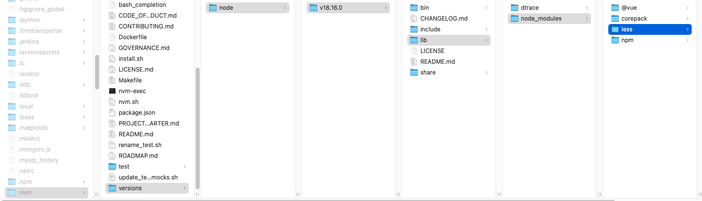

* [Sass](https://sass-lang.com/)
    * [Sass中文官网](https://www.sasscss.com/)
    * [Sass香港](https://www.sass.hk/)
    * [Sass练习测试](https://www.sassmeister.com/)
    * [What's the difference between SCSS and Sass?](https://stackoverflow.com/questions/5654447/whats-the-difference-between-scss-and-sass)
* [Less](https://lesscss.org/)
    * [Less中文官网](https://less.devjs.cn/)
* [Stylus](http://www.stylus.org/)
    * [Stylus中文官网](https://www.stylus-lang.cn/)
    * [stylus中文版参考文档](https://www.zhangxinxu.com/jq/stylus/)


# 一、CSS预编译器

## 1-1. 什么是CSS预处理器

> - CSS预处理器定义了一种新的语言，其基本思想是，用一种专门的编程语言，为 CSS 增加了一些编程的特性，将 CSS作为目标生成文件，然后开发者就只要使用这种语言进行编码工作。
> - 通俗的说，“CSS 预处理器用一种专门的编程语言，进行 Web 页面样式设计，然后再编译成正常的 CSS 文件，以供项目使用。CSS 预处理器为 CSS 增加一些编程的特性，无需考虑浏览器的兼容性问题”，例如你可以在 CSS 中使用变量、简单的逻辑程序、函数（如右侧代码编辑器中就使用了变量$color）等等在编程语言中的一些基本特性，可以让你的 CSS 更加简洁、适应性更强、可读性更佳，更易于代码的维护等诸多好处。

## 1-2. CSS预处理器的特点

> - 基于CSS的另一种语言
> - 通过工具编译成CSS
> - 添加了很多CSS不具备的特性
> - 能提升CSS文件的组织

## 1-3. CSS预处理器的作用

> - 帮助更好地组织CSS代码
> - 提高代码复用率
> - 提升可维护性

## 1-4. CSS预处理器的优缺点

> - 优点：提高代码复用率和可维护性
> - 缺点：需要引入编译过程 有学习成本


# 二、Less

* [Less官网](https://less.devjs.cn/)
* Less相关教程
    * https://blog.dselegent.icu/front_end/css_advanced/less/01.html

**用node运行Less**

1. 安装 node.js，我实用nvm管理Node.js
2. 检查是否安装成功，使用 cmd 命令输入 `node -v` 查看版本即可
3. 基于 node.js 在线安装 Less，使用 cmd 命令输入 `npm install -g less` 即可
4. 检查是否安装成功，使用 cmd 命令 `lessc -v` 查看版本即可

```bash
$ npm install -g less   # 全局安装
```

**全局安装的安装路径**

> .nvm -> versions -> node -> v18.16.0 -> lib -> node_modules -> less




# 三、Sass (推荐)

[Sass](https://sass-lang.com/)

* [Sass中文官网](https://www.sasscss.com/)
* [Sass香港](https://www.sass.hk/)
* [Sass练习测试](https://www.sassmeister.com/)


## 3.1 安装Sass

* [Sass中文官网 - 安装 Sass](https://www.sasscss.com/install)


## 3.2 Sass基础

* [Sass中文官网 - Sass Basics](https://www.sasscss.com/guide)

`sass` 基于 `Ruby`语言开发而成，因此安装 `sass` 前需要[安装Ruby](http://rubyinstaller.org/downloads)。

### 1. 安装ruby

省略

### 2. 安装Sass & compass

```shell
$ gem install sass

$ sass -v
Ruby Sass 3.7.4

$ where sass
/Users/qiyeyun/.rbenv/shims/sass


$ gem install compass

$ compass -v
Compass 1.0.3 (Polaris)
Copyright (c) 2008-2023 Chris Eppstein
Released under the MIT License.
Compass is charityware.
Please make a tax deductable donation for a worthy cause: http://umdf.org/compass

$ where compass
/Users/qiyeyun/.rbenv/shims/compass
```

### 3. 其他命令

```sh
//更新sass
$ gem update sass

//查看sass版本
$ sass -v

//查看sass帮助
$ sass -h
```

### 4. compass

**Compass是什么？**

简单说，Compass是Sass的工具库（toolkit）。

Sass本身只是一个编译器，Compass在它的基础上，封装了一系列有用的模块和模板，补充Sass的功能。它们之间的关系，有点像Javascript和jQuery、Ruby和Rails、python和Django的关系。


## 3.3 编译sass的几种方式

### 方式一：命令行编译

```shell
# 单文件转换命令
$ sass input.scss output.css

# 单文件监听命令，每次修改并保存时自动编译：
$ sass --watch input.scss:output.css

# 如果你有很多的sass文件的目录，你也可以告诉sass监听整个目录：
$ sass --watch app/sass:public/stylesheets

# 更多命令的用法请通过 sass --help 获取帮助。
```

### 方式二：软件方式编译

推荐 [koala](http://koala-app.com/index-zh.html)，koala是一个国产免费前端预处理器语言图形编译工具，支持Less、Sass、Compass、CoffeeScript，帮助web开发者更高效地使用它们进行开发。跨平台运行，完美兼容windows、linux、mac。

* [koala官网](http://koala-app.com/index-zh.html)
* [LESS/Sass 编译工具Koala介绍](https://www.sass.hk/skill/koala-app.html)

### 方式三：VSCode扩展 - Live Sass编译器

* [Visual Studio Code插件Live Sass Compiler可将Sass或Scss实时编译为CSS](https://www.sass.hk/skill/sass154.html)


## 3.4 命令行编译配置选项

```sh
# 编译格式
$ sass --watch input.scss:output.css --style compact

# 编译添加调试map
$ sass --watch input.scss:output.css --sourcemap

# 选择编译格式并添加调试map
$ sass --watch input.scss:output.css --style expanded --sourcemap

# 开启debug信息
$ sass --watch input.scss:output.css --debug-info
```

- `--style` 表示解析后的`css`是什么排版格式，sass内置有四种编译格式：
    - `nested`
    - `expanded`
    - `compact`
    - `compressed`
- `--sourcemap` 表示开启 `sourcemap` 调试。开启 `sourcemap` 调试后，会生成一个后缀名为 `.css.map` 文件。


## 3.5 scss 与 sass 语法格式 (Syntax)

* [Sass香港官网 - 中文文档](https://www.sass.hk/docs/)

Sass 有两种语法格式：scss与sass。

​		首先是 SCSS (Sassy CSS) —— 也是本文示例所使用的格式 —— 这种格式仅在 CSS3 语法的基础上进行拓展，所有 CSS3 语法在 SCSS 中都是通用的，同时加入 Sass 的特色功能。此外，SCSS 也支持大多数 CSS hacks 写法以及浏览器前缀写法 (vendor-specific syntax)，以及早期的 IE 滤镜写法。这种格式以 `.scss` 作为拓展名。

​		另一种也是最早的 Sass 语法格式，被称为缩进格式 (Indented Sass) 通常简称 "Sass"，是一种简化格式。它使用 “缩进” 代替 “花括号” 表示属性属于某个选择器，用 “换行” 代替 “分号” 分隔属性，很多人认为这样做比 SCSS 更容易阅读，书写也更快速。缩进格式也可以使用 Sass 的全部功能，只是与 SCSS 相比个别地方采取了不同的表达方式，具体请查看 [the indented syntax reference](http://sass-lang.com/docs/yardoc/file.INDENTED_SYNTAX.html)。这种格式以 `.sass` 作为拓展名。

​		任何一种格式可以直接 [导入 (@import)](https://www.sass.hk/docs/#t7-1) 到另一种格式中使用，或者通过 `sass-convert` 命令行工具转换成另一种格式：

```sh
# Convert Sass to SCSS
$ sass-convert style.sass style.scss

# Convert SCSS to Sass
$ sass-convert style.scss style.sass
```


##  3.6 Sass基本使用

SASS文件就是普通的文本文件。

[【Sass初级】开始使用Sass和Compass](https://www.sass.hk/skill/sass71.html)

