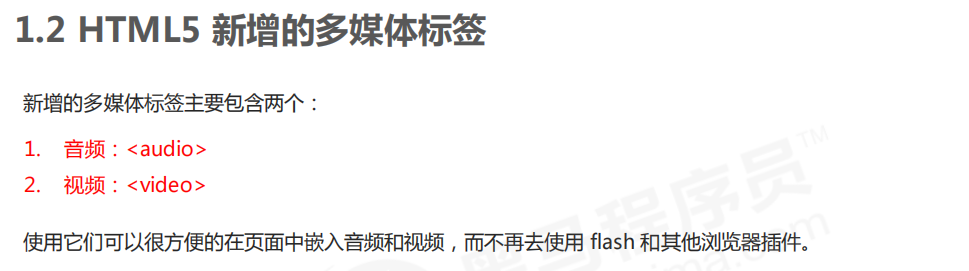
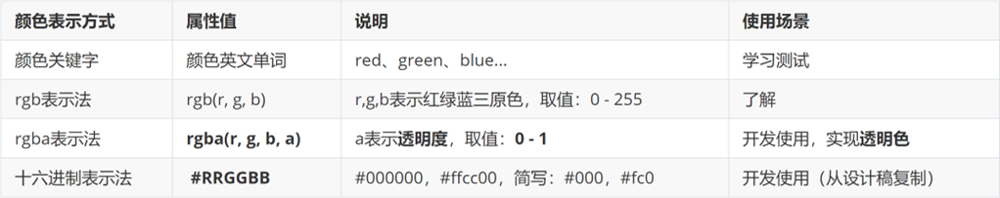
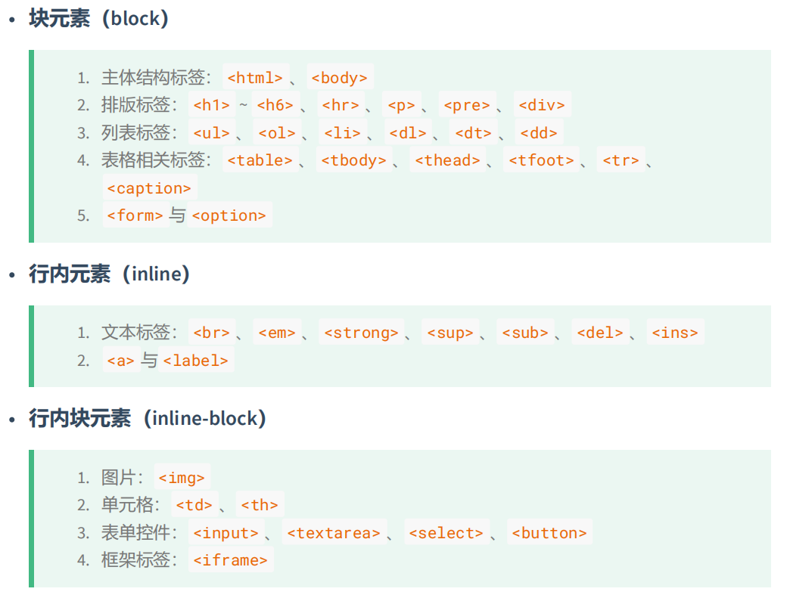
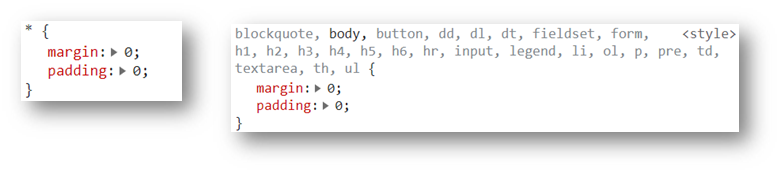
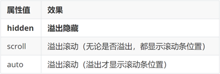
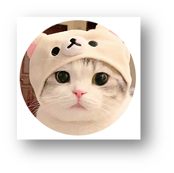
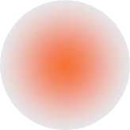
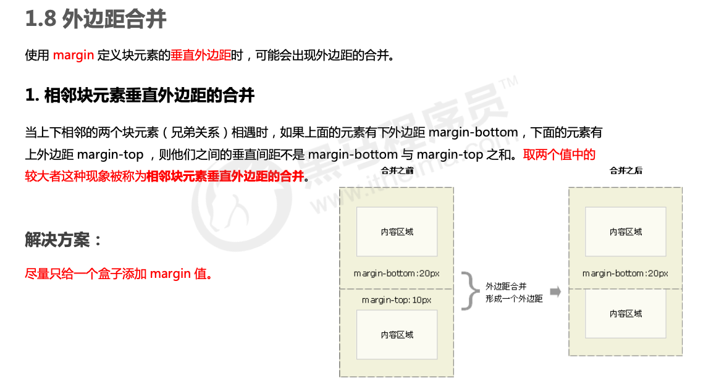
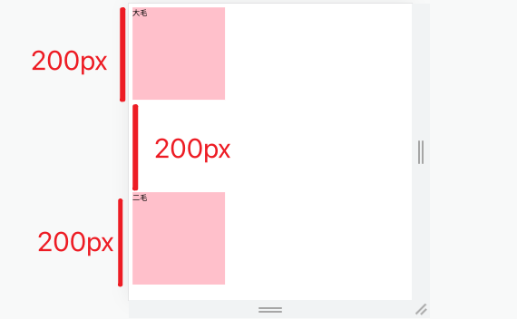

# 一、HTML基础

## 1. 什么是 HTML

HTML 指的是超文本标记语言 (Hyper Text Markup Language) ，它是用来描述网页的一种语言。

HTML 不是一种编程语言，而是一种标记语言 (markup language)。

标记语言是一套标记标签 (markup tag)。

所谓超文本，有 2 层含义：

1. 它可以加入图片、声音、动画、多媒体等内容（超越了文本限制 ）。
2. 它还可以从一个文件跳转到另一个文件，与世界各地主机的文件连接（超级链接文本 ）。


## 2. 浏览器与其内核


## 3.  Web 标准

Web 标准是由 W3C 组织和其他标准化组织制定的一系列标准的集合。W3C（万维网联盟）是国际最著名的标准化组织。


## 4. 特殊字符

[HTML 特殊符号编码对照表](https://tool.chinaz.com/tools/htmlchar.aspx)

[常用特殊符号的HTML代码(HTML字符实体)](https://www.cnblogs.com/xyyt/p/3515397.html)

在 HTML 页面中，一些特殊的符号很难或者不方便直接使用，此时我们就可以使用下面的字符来替代。

<font color='red' size=4>重点记住：空格 、大于号、 小于号 这三个， 其余的使用很少，如果需要回头查阅即可。</font>


# 二. HTML5

* HTML5 的新增特性主要是针对于以前的不足，增加了一些<font color='red' size=4>新的标签、新的表单和新的表单属性</font>等。

* 这些新特性都有<font color='red' size=4>兼容性问题</font>，基本是 IE9+ 以上版本的浏览器才支持，如果不考虑兼容性问题，可以大量使用这些新特性。


## 1. 新增的语义化标签


## 2. 新增多媒体标签




## 3.  新增的 input 类型


<font color='red' size=5>可以通过以下设置方式修改placeholder里面的字体颜色：</font>

```css
input::placeholder {
 	color: pink;
}
```


# 三、CSS基础

## 1. 什么是CSS

**CSS** 是层叠样式表 **( Cascading Style Sheets ) ** 的简称.

有时我们也会称之为 <font color='red' size=4>CSS 样式表 或 级联样式表</font>。


## 2. CSS引入方式

[HTML 中引入 CSS 的方式](https://www.runoob.com/w3cnote/html-import-css-method.html)

有 4 种方式可以在 HTML 中引入 CSS。其中有 2 种方式是在 HTML 文件中直接添加 CSS 代码，另外两种是引入 外部 CSS 文件。

* 内联方式 / **行内**样式

    * CSS 写在标签的 style 属性值里

        ```html
        <div style="color: red; font-size:20px;">这是 div 标签</div>
        ```

* 嵌入方式 / **内部**样式表

    * 嵌入方式指的是在 HTML 头部中的 **<style>** 标签下书写 CSS 代码。

    ```html
    <head>
        <style>
        .content {
            background: red;
        }
        </style>
    </head>
    ```

* 链接方式 / **外部**样式表

    * CSS 代码写在单独的 CSS 文件中（**.css**）
    * 链接方式指的是使用 HTML 头部的 **<head>** 标签引入外部的 CSS 文件。

    ```html
    <head>
        <link rel="stylesheet" type="text/css" href="style.css">
        <link rel="stylesheet" href="./my.css">
    </head>
    ```

* 导入方式

    ```css
    <style>
        @import url(style.css);
        @import '@/assets/base.css';
    </style>
    ```


### a. 比较链接方式和导入方式

链接方式（下面用 link 代替）和导入方式（下面用 **@import** 代替）都是引入外部的 CSS 文件的方式，下面我们来比较这两种方式，并且说明为什么不推荐使用 **@import**。

- link 属于 HTML，通过 **<link>** 标签中的 href 属性来引入外部文件，而 **@import** 属于 CSS，所以导入语句应写在 CSS 中，要注意的是导入语句应写在样式表的开头，否则无法正确导入外部文件；
- **@import** 是 CSS2.1 才出现的概念，所以如果浏览器版本较低，无法正确导入外部样式文件；
- 当 HTML 文件被加载时，link 引用的文件会同时被加载，而 **@import** 引用的文件则会等页面全部下载完毕再被加载；

------

**小结**：我们应尽量使用 **<link>** 标签导入外部 CSS 文件，避免或者少用使用其他三种方式。


## 3. 选择器（大全）

[MDN - CSS 选择器](https://developer.mozilla.org/zh-CN/docs/Web/CSS/CSS_selectors)

* 基础选择器

    * 标签选择器：`div`
    * 类选择器：`.myclass`
    * id选择器：`#myId`
    * 通配符选择器：`*`
    
* 复合选择器 / 组合选择器

    * 后代选择器：`div span`，选择 div 内的所有 span
    * 子代选择器：`div > span`，选择 div 的直接子元素 span
    * 并集选择器：`div, p, span`
    * 交集选择器：`div.myclass`
    * 一般兄弟选择器：`h1 ~ p`，选择 `h1` 后面的所有兄弟元素 `p`
    * 相邻兄弟选择器：`h1 + p`，选择紧接在 `h1` 之后的第一个兄弟元素 `p`

* [属性选择器（Attribute Selectors）MDN](https://developer.mozilla.org/zh-CN/docs/Web/CSS/Attribute_selectors)

    * [`[attr]`](https://developer.mozilla.org/zh-CN/docs/Web/CSS/Attribute_selectors#attr)
    
        表示带有以 *attr* 命名的属性的元素。
    
    * [`[attr=value]`](https://developer.mozilla.org/zh-CN/docs/Web/CSS/Attribute_selectors#attrvalue)

        表示带有以 *attr* 命名的属性，且属性值为 *value* 的元素。

    * [`[attr~=value]`](https://developer.mozilla.org/zh-CN/docs/Web/CSS/Attribute_selectors#attrvalue_2)
    
        表示带有以 *attr* 命名的属性的元素，并且该属性是一个以空格作为分隔的值列表，其中至少有一个值为 *value*。
    
    * [`[attr|=value]`](https://developer.mozilla.org/zh-CN/docs/Web/CSS/Attribute_selectors#attrvalue_3)
    
        表示带有以 *attr* 命名的属性的元素，属性值为“value”或是以“value-”为前缀（`-` 为连字符，Unicode 编码为 U+002D）开头。典型的应用场景是用来匹配语言简写代码（如 zh-CN、zh-TW 可以用 zh 作为 value）。
    
    * [`[attr^=value]`](https://developer.mozilla.org/zh-CN/docs/Web/CSS/Attribute_selectors#attrvalue_4)
    
        表示带有以 *attr* 命名的属性，且属性值是以 *value* 开头的元素。
    
    * [`[attr$=value]`](https://developer.mozilla.org/zh-CN/docs/Web/CSS/Attribute_selectors#attrvalue_5)
    
        表示带有以 *attr* 命名的属性，且属性值是以 *value* 结尾的元素。
    
    * [`[attr*=value]`](https://developer.mozilla.org/zh-CN/docs/Web/CSS/Attribute_selectors#attrvalue_6)
    
        表示带有以 *attr* 命名的属性，且属性值至少包含一个 *value* 值的元素。
    
    * [`[attr operator value i]`](https://developer.mozilla.org/zh-CN/docs/Web/CSS/Attribute_selectors#attr_operator_value_i)
    
        在属性选择器的右方括号前添加一个用空格隔开的字母 `i`（或 `I`），可以在匹配属性值时忽略大小写（支持 ASCII 字符范围之内的字母）。
    
    * [`[attr operator value s]`](https://developer.mozilla.org/zh-CN/docs/Web/CSS/Attribute_selectors#attr_operator_value_s) 实验性
    
        在属性选择器的右方括号前添加一个用空格隔开的字母 `s`（或 `S`），可以在匹配属性值时区分大小写（支持 ASCII 字符范围之内的字母）。
    
    ```css
    <ul>
      <li><a href="#internal">内部链接</a></li>
      <li><a href="http://example.com">示例链接</a></li>
      <li><a href="#InSensitive">非敏感内部链接</a></li>
      <li><a href="http://example.org">示例 org 链接</a></li>
      <li><a href="https://example.org">示例 https org 链接</a></li>
    </ul>
    
    /* CSS */
    a {
      color: blue;
    }
    
    /* 以 "#" 开头的页面内部链接 */
    a[href^="#"] {
      background-color: gold;
    }
    
    /* 包含 "example" 的链接 */
    a[href*="example"] {
      background-color: silver;
    }
    
    /* 包含 "insensitive" 的链接，不区分大小写 */
    a[href*="insensitive" i] {
      color: cyan;
    }
    
    /* 包含 "cAsE" 的链接，区分大小写 */
    a[href*="cAsE" s] {
      color: pink;
    }
    
    /* 以 ".org" 结尾的链接 */
    a[href$=".org"] {
      color: red;
    }
    
    /* 以 "https" 开始，".org" 结尾的链接 */
    a[href^="https"][href$=".org"] {
      color: green;
    }
    ```
    
* [伪类选择器](https://developer.mozilla.org/zh-CN/docs/Web/CSS/Pseudo-classes)（单独文档）：伪类由冒号（`:`）后跟着伪类名称组成。

    * `:link`：选择未被访问的链接
    * `:visited`：选取已被访问的链接
    * `:focus`：是某个标签获得焦点的时候（比如某个输入框获得焦点）
    * `:hover`：鼠标放到某个标签上的时候
    * `:active`：点击某个标签没有松鼠标时
    * `:first-child`：父元素的首个子元素
    * `:nth-child()`：选择满足条件的特定子元素。
    * ........还有很多，可以前往MDN查看

* [伪元素选择器](https://developer.mozilla.org/zh-CN/docs/Web/CSS/Pseudo-elements)（单独文档）：一个选择器中只能使用一个伪元素。伪元素必须紧跟在语句中的简单选择器/基础选择器之后。

    * `::before`：在元素内容前插入虚拟元素。
    * `::after`：在元素内容后插入虚拟元素。
    * `::first-line`：第一行应用样式。
    * ........还有很多，可以前往MDN查看

    


## 4. CSS三大特性

### a. 继承性

* 子级默认继承父级的文字控制属性。

```html
<body>
    <div>
        <p>龙生龙，凤生凤，老鼠生的孩子会打洞</p>
    </div>
</body>

<style>
    div {
        color: pink;
        font-size: 14px;
    }
</style>
```


### b. 层叠性

* 相同的属性会覆盖：**后面的 CSS 属性覆盖前面的 CSS 属性**
* 不同的属性会叠加：**不同的 CSS 属性都生效**

```css
<style>
   div {
       color: red;
       font-size: 12px;
   }
   div {
       color: pink;
   }
</style>
```


### c. 优先级

[有趣：256个class选择器可以干掉1个id选择器](https://www.zhangxinxu.com/wordpress/2012/08/256-class-selector-beat-id-selector/)

[深度的发现之256个class打平1个id](https://www.cnblogs.com/zhuyingyan/archive/2012/09/19/2694472.html)

也叫权重，当一个标签使用了多种选择器时，基于不同种类的选择器的匹配规则。

规则：<font color='red' size=4>选择器优先级高的样式生效。 </font>

公式：<font color='red' size=4>通配符选择器 < 标签选择器 < 类选择器 < id选择器 < 行内样式 < !important  </font>

<font color='red' size=4>（选中标签的范围越大，优先级越低） </font>


当同一个元素指定多个选择器，就会有优先级的产生。 

* 选择器相同，则执行层叠性
* 选择器不同，则根据选择器权重执行


### d. 优先级计算 - GPT

在 CSS 中，**优先级**（Specificity）是用来决定当多个选择器应用到同一个元素时，哪条规则会被应用。优先级的计算规则基于选择器的类型和结构。优先级高的选择器会覆盖优先级低的选择器，具体计算方式如下。

1. **优先级的结构**

CSS 的优先级可以分为四个部分，通常表示为一个四位的数字：`(a, b, c, d)`。

- `a`：内联样式的权重，如果是内联样式则为 `1`，否则为 `0`。
- `b`：ID 选择器的数量。
- `c`：类选择器、属性选择器、伪类选择器的数量。
- `d`：元素选择器、伪元素选择器的数量。

每个部分的权重从左到右依次递减，即：`a` > `b` > `c` > `d`。权重越高的部分，优先级越高。

2. **优先级计算规则**

- **元素选择器**：每个元素选择器和伪元素选择器（如 `p`、`h1`、`::before`）都增加 `d` 的权重。
- **类选择器**、**属性选择器**、**伪类选择器**：每个类选择器（如 `.class`）、属性选择器（如 `[type="text"]`）和伪类选择器（如 `:hover`、`:nth-child()`）都会增加 `c` 的权重。
- **ID 选择器**：每个 ID 选择器（如 `#id`）都会增加 `b` 的权重。
- **内联样式**：直接在元素的 `style` 属性中写的样式增加 `a` 的权重。

3. **计算示例**

以下是一些选择器的优先级计算示例：

- `*`（通配符选择器）：优先级 `(0, 0, 0, 0)`
- `p`（元素选择器）：优先级 `(0, 0, 0, 1)`
- `.class`（类选择器）：优先级 `(0, 0, 1, 0)`
- `#id`（ID 选择器）：优先级 `(0, 1, 0, 0)`
- `input[type="text"]`（属性选择器）：优先级 `(0, 0, 1, 1)`
- `a:hover`（伪类选择器）：优先级 `(0, 0, 1, 1)`
- `#header .nav a:hover`（ID、类、伪类组合）：优先级 `(0, 1, 2, 1)`
- 内联样式：`<p style="color: red;">`：优先级 `(1, 0, 0, 0)`

4. **多个选择器的组合**

当一个选择器由多个部分组成时，需要分别计算它们的优先级。例如：
```css
#main .container p {
    color: blue;
}
```
- `#main` 是 ID 选择器，优先级为 `(0, 1, 0, 0)`。
- `.container` 是类选择器，优先级为 `(0, 0, 1, 0)`。
- `p` 是元素选择器，优先级为 `(0, 0, 0, 1)`。

最终优先级为 `(0, 1, 1, 1)`，即 ID 选择器的权重大于类选择器和元素选择器。

5. **`!important`**

`!important` 是一种特殊的声明，用于强制某条 CSS 规则的应用。`!important` 不依赖于优先级，它会覆盖所有常规样式规则，即使优先级较低也会生效。但如果有多个 `!important` 声明，则优先级规则仍适用，比较权重来决定哪条规则生效。

```css
p {
    color: blue !important;
}

p {
    color: red;
}
```
在这个例子中，即使第二条规则位于后面，由于第一条规则使用了 `!important`，最终 `p` 元素的颜色仍然会是蓝色。

6. **继承的样式**

一些样式属性（如 `color`、`font-size`）可以被子元素继承，但继承的样式的优先级是低于显式声明的。如果在子元素中有其他声明，即使优先级较低，也会覆盖继承的样式。

7. **权重比较**

当选择器应用到相同元素时，优先级高的选择器会覆盖优先级低的选择器。如果选择器的优先级相同，那么按照代码在样式表中的出现顺序，后定义的样式会覆盖前面的样式。

总结

CSS 优先级从高到低可以概括如下：
1. **内联样式**：`(1, 0, 0, 0)`。
2. **ID 选择器**：`(0, 1, 0, 0)`。
3. **类选择器、伪类选择器、属性选择器**：`(0, 0, 1, 0)`。
4. **元素选择器、伪元素选择器**：`(0, 0, 0, 1)`。
5. **通配符选择器**、**继承**：最优先级最低。

通过理解这些规则，你可以更好地控制 CSS 样式的应用顺序。


## 5. 文本属性

* 字体大小

    * `font-size`，单位 **px**
    * 经验：谷歌浏览器默认字号是16px

* 字体样式（是否倾斜）

    * `font-style`
        * 正常（不倾斜）：**normal** 
        * 倾斜：**italic**

* 行高

    * `line-height`

        * 数字 + px

            ```css
            line-height: 30px;
            ```

        * 数字（当前标签font-size属性值的倍数）

            ```css
            /* 当前标签字体大小为16px */
            line-height: 2;
            ```

    * **应用：单行文字垂直居中**

        ```css
        div {
          height: 100px;
          /* 注意：只能是单行文字垂直居中 */
          line-height: 100px;
        }
        ```

* 字体族

    * `font-family`

    * font-family属性值可以书写多个字体名，各个字体名用逗号隔开，执行顺序是从左向右依次查找

        ```css
        font-family: Microsoft YaHei, Heiti SC, tahoma, arial, Hiragino Sans GB, "\5B8B\4F53", sans-serif;
        ```

* font复合属性

    * **font：是否倾斜  是否加粗  字号/行高 字体（必须按顺序书写）**

    * **注意：字号和字体值必须书写，否则 font 属性不生效 。**

        ```css
        div {
            font: italic 700 30px/2 楷体;
        }
        ```

* 文本缩进

    * `text-indent`

        * 数字 + px

        * **数字 + em**（推荐：**1em = 当前标签的字号大小**）

            ```css
            p {
                text-indent: 2em;
            }
            ```

* 文本对齐方式

    * `text-align`：`letf、center、right`

* 文本修饰线

    *  `text-decoration`

        

* color 文字颜色

    

* 总览


## 6. 背景属性

* 背景图

    * `background-image`

        ```css
        div {
          /* 提示：背景图默认有 平铺（复制）效果 */
          background-image: url(./images/1.png);
        }
        ```

* 平铺方式

    * `background-repeat`

        

* 背景图位置

    * `background-position`

        

    * 水平：正数向右；负数向左

    * 垂直：正数向下；负数向上

        ```css
        div {
            width: 400px;
            height: 400px;
            background-color: pink;
            background-image: url(./images/1.png);
            background-repeat: no-repeat;
        
            background-position: center bottom;
            background-position: 50px -100px;
            background-position: 50px center;
        }
        ```

* 背景图缩放

    * `background-size`
    * 关键字
        *  cover：等比例缩放背景图片以完全覆盖背景区，可能背景图片部分看不见
        *  contain：等比例缩放背景图片以完全装入背景区，可能背景区部分空白
    * 百分比：根据盒子尺寸计算图片大小
    * 数字 + 单位（例如：px）

* 背景图固定

    * `background-attachment`
    * `fixed`：背景不会随着元素的内容滚动。

* 背景复合属性

    * `background`

    * 属性值：背景色 背景图 背景图平铺方式 背景图位置/背景图缩放  背景图固定（**空格隔开各个属性值，不区分顺序**）

        ```css
        div {
          	background: pink url(./images/1.png) no-repeat right center/cover;
        }
        ```

        

## 7. 显示模式 - display

> 元素显示模式就是元素（标签）以什么方式进行显示，比如<div>自己占一行，比如一行可以放多个<span>

```css
div {
		display: block / inline / inline-block;
}
```

* 块元素 **block**
    * 在页面中**独占一行**，不会与任何元素共用一行，是从上到下排列的。
    * 默认宽度：撑满**父元素**。（宽度默认是父级的100%）
    * 默认高度：由**内容**撑开。
    * **可以** 通过 CSS 设置宽高。
* 行内元素 **inline**
    * 在页面中**不独占一行**，一行中不能容纳下的行内元素，会在下一行继续从左到右排列。
    * 默认宽度：由**内容**撑开。
    * 默认高度：由**内容**撑开。
    * **无法** 通过 CSS 设置宽高
* 行内块元素 **inline-block**
    * 在页面中**不独占一行**，一行中不能容纳下的行内元素，会在下一行继续从左到右排列。
    * 默认宽度：由**内容**撑开。
    * 默认高度：由**内容**撑开。
    * **可以** 通过 CSS 设置宽高


### a. 标签分类




## 8. 盒子模型 - margin、padding、border

### a. 盒子模型 - 组成

* 内容区域 – width & height
* 内边距 – padding（出现在内容与盒子边缘之间）
* 边框线 – border 
* 外边距 – margin（出现在盒子外面）

```css
div {
  margin: 50px;
  border: 5px solid brown;
  padding: 20px;
  width: 200px;
  height: 200px;
}
```


### b. 边框线 - border

```css
div {
  border: 5px solid brown;

  /* 边框线粗细  线条样式  颜色（不区分顺序） */
  border-top: 2px solid red;      /* 实线 */
  border-right: 3px dashed green; /* 虚线 */
  border-bottom: 4px dotted blue; /* 点线 */
  border-left: 5px solid orange;
}
```


### c. 盒子尺寸计算 - box-sizing

[MDN - box-sizing](https://developer.mozilla.org/en-US/docs/Web/CSS/box-sizing)


默认情况：盒子尺寸 = 内容尺寸 + border 尺寸 + 内边距尺寸

结论：给盒子加 border / padding 会撑大盒子

解决：

* 手动做减法，减掉 border / padding 的尺寸
* 內减模式：**box-sizing: border-box**


### d. 版心居中

左右 margin 值 为 auto（盒子要有宽度）

```css
div {
  margin: 0 auto;   /* 核心 */
  width: 1000px;
  height: 200px;
  background-color: pink;
}
```


### e. 清除默认样式



```css
/* 清除默认内外边距 */
* {
  margin: 0;
  padding: 0;
  box-sizing: border-box;
}

/* 清除列表项目符号 */
li {
  list-style: none;
}
```


### f. 元素溢出 - overflow




### g. 圆角 - border-radius

作用：设置元素的外边框为圆角。

属性名：**border-radius**

属性值：数字+px / 百分比

提示：属性值是圆角半径


多值写法


> 技巧：从左上角开始顺时针赋值，当前角没有数值则与对角取值相同。 

* 正圆形状：给正方形盒子设置圆角属性值为 **宽高的一半 / 50%**

```css
img {
  width: 200px;
  height: 200px;
  
  border-radius: 100px;
  border-radius: 50%;
}
```



* 胶囊形状：给长方形盒子设置圆角属性值为 盒子高度的一半 

```css
div {
  width: 200px;
  height: 80px;
  background-color: orange;
  border-radius: 40px;
}
```


### h. 盒子阴影 - box-shadow

作用：给元素设置阴影效果

属性名：**box-shadow**

属性值：X 轴偏移量  Y 轴偏移量  模糊半径  扩散半径  颜色  内外阴影

注意： 

* X 轴偏移量 和 Y 轴偏移量 必须书写
* 默认是外阴影，内阴影需要添加 inset

```css
div {
  width: 200px;
  height: 80px;
  background-color: orange;
  box-shadow: 2px 5px 10px 0 rgba(0, 0, 0, 0.5) inset;
}
```


### i. 外边距问题

#### Ⅰ. 合并现象

场景：**垂直**排列的兄弟元素，上下 **margin** 会**合并**

现象：取两个 margin 中的**较大值生效**


```css
.one {
  margin-bottom: 50px;
}
.two {
  margin-top: 20px;
}
```


#### Ⅱ. 外边距塌陷

场景：父子级的标签，子级的添加 **上外边距** 会产生**塌陷**问题

现象：**导致父级一起向下移动**

```css
.son {
  margin-top: 50px;
  width: 100px;
  height: 100px;
  background-color: orange;
}
```


解决方法：

* 取消子级margin，父级设置padding
* 父级设置 overflow: hidden
* 父级设置 border-top


### j. 行内元素 – 内外边距问题 

场景：行内元素添加 margin 和 padding，无法改变元素垂直位置

解决方法：给行内元素添加 **line-height** 可以改变垂直位置

```css
span {
  /* margin 和 padding 属性，无法改变垂直位置 */
  margin: 50px;
  padding: 20px;
  /* 行高可以改变垂直位置 */
  line-height: 100px;
}
```


## 9. 布局方案（单独文档）

布局是决定元素如何在页面上排列的方式，主要的布局方案有：

- 传统布局方案（标准流、浮动流、定位流）
- `flex`布局方案
- `grid`布局方案


## 10. 浮动（单独文档）

基础作用：让块元素水平排列。

```css
div {
	float: left;
}
```


## 11. 定位（单独文档）

<font color='' size=4>定位 = 定位模式 + 边偏移</font>

```css
position: relative; 
top: 10px;
```

CSS 中的定位决定了元素在页面上的具体位置：

- **static**：默认值，元素按文档流排列。
- **relative**：相对定位，相对于元素原始位置进行偏移。
- **absolute**：绝对定位，相对于最近的已定位祖先元素（非 static）进行定位。
- **fixed**：固定定位，相对于浏览器窗口进行定位，不随页面滚动而变化。
- **sticky**：粘性定位，元素在某些条件下相对于视口固定，其他条件下正常滚动。


## 12. 堆叠层级z-index

默认效果：按照标签书写顺序，后来者居上

作用：设置定位元素的层级顺序，改变定位元素的显示顺序

属性名：**z-index**

属性值：**整数数字**（默认值为0，取值越大，层级越高）

```css
.box1 {
  background-color: pink;
  /* 取值是整数，默认是0，取值越大显示顺序越靠上 */
  z-index: 1;
}

.box2 {
  background-color: skyblue;
  left: 100px;
  top: 100px;

  z-index: 2;
}
```


## 13. 精灵图  +  iconfont

### a. CSS精灵

[在线运行案例](https://www.cainiaoplus.com/run/css-display-individual-icon-from-image-sprite.html)

CSS 精灵，也叫 **CSS Sprites**，是一种网页**图片应用处理方式**。把网页中**一些背景图片**整合到**一张图片**文件中，再**background-position** 精确的定位出背景图片的位置。

```html
<!DOCTYPE html>
<html>
<head>
<meta charset="utf-8">
<title>CSS Sprite精灵图片示例</title>
<style>
    .sprite {
        background: url("/run/images/mySprite.png") no-repeat;
    }
    .ie {
        width: 50px; /* Icon width */
        height: 50px; /* Icon height */
        display: inline-block; /* Display icon as inline block */
        background-position: 0 -200px; /* Icon background position in sprite */
    }
</style>
</head>
<body>
	<span class="sprite ie"></span>
</body>
</html>
```


### b. iconfont

[iconfont官网](https://www.iconfont.cn/)


## 14. 垂直对齐 - vertical-align

[MDN - vertical-align](https://developer.mozilla.org/zh-CN/docs/Web/CSS/vertical-align)

**`vertical-align`** 用来指定行内元素（inline）或表格单元格（table-cell）元素的垂直对齐方式。

注意 `vertical-align` 只对行内元素、行内块元素和表格单元格元素生效：不能用它垂直对齐[块级元素](https://developer.mozilla.org/zh-CN/docs/Glossary/Block-level_content)。


```css
vertical-align : baseline | top | middle | bottom
```


vertical-align 属性可被用于两种环境：

- 使行内元素盒模型与其行内元素容器垂直对齐。例如，用于垂直对齐一行文本内的图片``
- 垂直对齐表格单元内容。


### a. 应用一：图片、表单和文字对齐

图片、表单都属于行内块元素，默认的 vertical-align 是基线对齐。

```css
<style>
    img {
        /* 让图片和文字垂直居中 */
        vertical-align: middle;
    }
    textarea {
        vertical-align: middle;
    }
</style>
```


### b. 应用二：解决图片底部默认空白缝隙问题

bug：图片底侧会有一个空白缝隙，原因是行内块元素会和文字的基线对齐。

主要解决方法有两种：

1. 给图片添加 ` vertical-align:middle | top| bottom ` 等。 （提倡使用的）

2. 把图片转换为块级元素 `display: block;`

```css
img {
    /* 解决方案一： */
	vertical-align: middle;
    
    /* 解决方案二： */
    display: block;
}
```


## 15. 过渡 - transition

[MDN - transition](https://developer.mozilla.org/zh-CN/docs/Web/CSS/transition)

[MDN - 使用 CSS 过渡](https://developer.mozilla.org/zh-CN/docs/Web/CSS/CSS_transitions/Using_CSS_transitions)

作用：可以为一个元素在不同状态之间切换的时候添加**过渡效果**

属性名：**transition（复合属性）**

属性值：**过渡的属性  花费时间 (s)**

提示：

* 过渡的属性可以是具体的 CSS 属性
* 也可以为 all（两个状态属性值不同的所有属性，都产生过渡效果）
* transition 设置给元素本身

```css
<style>
    div {
        width: 200px;
        height: 100px;
        background-color: pink;
        
        /* transition: 变化的属性 花费时间 运动曲线 何时开始; */
        /* transition: width .5s ease 0s, height .5s ease 1s; */
        
        /* 如果想要写多个属性，利用逗号进行分割 */
        /* transition: width .5s, height .5s; */
        
        /* 如果想要多个属性都变化，属性写all就可以了 */
        /* transition: height .5s ease 1s; */
        
        /* 谁做过渡，给谁加 */
        transition: all 0.5s;
    }
    div:hover {
        width: 400px;
        height: 200px;
        background-color: skyblue;
    }
</style>
```


## 16. 动画 - animation

[CSS动画](https://www.runoob.com/cssref/css-animatable.html)

CSS 提供了实现动画和过渡效果的功能：

- **过渡（transition）**：用于元素状态的渐变效果，常见于 `hover` 效果。

    ```css
    div {
      transition: all 0.3s ease;
    }
    ```

- **动画（animation）**：通过 `@keyframes` 定义元素的动画效果。

    ```css
    @keyframes example {
      from { background-color: red; }
      to { background-color: yellow; }
    }
    div {
      animation: example 5s infinite;
    }
    ```


## 17. 透明度 - opacity

作用：设置**整个元素的透明度**（包含背景和内容）

属性名：opacity

属性值：0 – 1

* 0：完全透明（元素不可见）
* 1：不透明
* 0-1之间小数：半透明


## 18. 光标类型 - cursor

作用：鼠标悬停在元素上时指针显示样式

属性名：cursor


## 19. 2D转换 - transform

[MDN - transform](https://developer.mozilla.org/en-US/docs/Web/CSS/transform)

作用：为元素添加动态效果，一般与过渡配合使用

概念：改变盒子在平面内的形态（位移、旋转、缩放、倾斜）

平面转换也叫 2D 转换，属性是 **transform**

`transform` 属性用于旋转、缩放、倾斜或移动元素：

- `rotate()`：旋转。
- `scale()`：缩放。
- `translate()`：平移。
- `skew()`：倾斜。


### a. 位移 - translate

```css
transform: translate(X轴移动距离, Y轴移动距离);
```

* 取值
    * 像素单位数值
    * 百分比（参照**盒子自身尺寸**计算结果）
    * **正负**均可
* 技巧
    * translate() **只写一个值**，表示沿着 **X** 轴移动
    * 单独设置 X 或 Y 轴移动距离：translateX() 或 translateY()

#### Ⅰ. 应用 - 居中

* 方式一：


* 方式二：


```css
.box {
    position: absolute;
    left: 50%;
    top: 50%;

    /* 方式一：向左向上移动自身尺寸一半 */
    margin-left: -100px;
    margin-top: -50px;

    /* 方式二：向左向上移动自身尺寸的一半 */
    transform: translate(-50%, -50%);

    width: 200px;
    height: 100px;
    background-color: pink;          
}
```


### b. 旋转 - rotate()

```css
transform: rotate(旋转角度);
```

* 取值：角度单位是 **deg** 
* 技巧
    * 取值正负均可
    * 取值为正，顺时针旋转
    * 取值为负，逆时针旋转


### c. 转换原点 - transform-origin

> 默认情况下，转换原点是盒子中心点 

```css
transform-origin: 水平原点位置 垂直原点位置;
```

取值：

* **方位名词**（left、top、right、bottom、center）
* 像素单位数值
* 百分比


### d. 多重转换

多重转换技巧：先平移再旋转

```css
transform: translate() rotate();
```

* 多重转换原理：以第一种转换方式坐标轴为准转换形态
    * 旋转会改变网页元素的坐标轴向
    * 先写旋转，则后面的转换效果的轴向以旋转后的轴向为准，会影响转换结果


### e. 缩放 - scale()

```css
transform: scale(缩放倍数);
transform: scale(X轴缩放倍数, Y轴缩放倍数);
```

* 技巧
    * 通常，只为 scale() 设置一个值，表示 X 轴和 Y 轴等比例缩放
    * 取值大于1表示放大，取值小于1表示缩小


### f. 倾斜 - skew()

```css
div:hover {
    transform: skew(30deg);
    transform: skew(-30deg);
}
```

取值：角度度数 deg


## 20. 3D转换 - transform

### a. 平移 - translateX()

```css
transform: translate3d(x, y, z);
transform: translateX();
transform: translateY();
transform: translateZ();
```

> 取值与平面转换相同
>
> 默认情况下，Z 轴平移没有效果，原因：电脑屏幕默认是平面，无法显示 Z 轴平移效果


### b. 旋转 - rotateX()

X 轴：rotateX()

Y 轴：rotateY()

Z 轴：rotateZ()


#### Ⅰ. 左手法则

作用：根据旋转方向确定取值正负

使用：左手握住旋转轴, 拇指指向正值方向, 其他四个手指弯曲方向为旋转正值方向 


#### Ⅱ. rotate3d

* rotate3d(x, y, z, 角度度数) ：用来设置自定义旋转轴的位置及旋转的角度
* x，y，z 取值为0-1之间的数字


### c. 缩放

```css
transform: scale3d(x, y, z);
transform: scaleX();
transform: scaleY();
transform: scaleZ();
```


### d. 立体呈现 - transform-style

作用：设置元素的子元素是位于 3D 空间中还是平面中

属性名：transform-style

属性值：

* flat：子级处于平面中
* preserve-3d：子级处于 3D 空间


### e. 视距 - perspective

作用：指定了观察者与 Z=0 平面的距离，为元素添加透视效果

透视效果：近大远小、近实远虚

属性：(添加给父级，取值范围 800-1200)

```css
perspective: 视距;
```


## 21. 渐变

### a. 线性渐变


```css
background-image: linear-gradient(
  渐变方向,
  颜色1 终点位置,
  颜色2 终点位置,
  ......
);
```

取值：

* 渐变方向：可选
    * to 方位名词
    * 角度度数
* 终点位置：可选
    * 百分比

```css
div {
    width: 200px;
    height: 200px;
    background-color: green;
    background-image: linear-gradient(
      	red,
      	green
    );
    background-image: linear-gradient(
      	to right,
      	red,
      	green
    );
    background-image: linear-gradient(
      	45deg,
      	red,
      	green
    );
    background-image: linear-gradient(
      	red 80%,
      	green
    );
}
```


### b. 径向渐变



```css
background-image: radial-gradient(
  半径 at 圆心位置,
  颜色1 终点位置,
  颜色2 终点位置,
  ......
);
```

取值：

* 半径可以是2条，则为椭圆
* 圆心位置取值：像素单位数值 / 百分比 / 方位名词

```css
div {
    width: 100px;
    height: 100px;
    background-color: pink; 
    border-radius: 50%;
    background-image: radial-gradient(
        50px at center center,
        red,
        pink
    );
    background-image: radial-gradient(
        50px 20px at center center,
        red,
        pink
    );
    background-image: radial-gradient(
        50px at 50px 30px,
        red,
        pink 50%
    );
}
```


## 22. 响应式设计（Responsive Design）

响应式设计确保网页在不同屏幕尺寸下具有良好的显示效果。常用技术包括：

- **媒体查询（Media Queries）**：根据设备的宽度、分辨率等特征应用不同的 CSS 样式。

    ```css
    @media (max-width: 600px) {
      .container {
        width: 100%;
      }
    }
    ```
    
- **弹性单位**：使用相对单位（如 `em`、`rem`、`%` 等）来适应不同屏幕尺寸。

- **视口（Viewport）设置**：通过 `<meta>` 标签定义视口的宽度和缩放行为。


## 23. prefers-color-scheme

[MDN - prefers-color-scheme](https://developer.mozilla.org/zh-CN/docs/Web/CSS/@media/prefers-color-scheme)

`prefers-color-scheme `是一个CSS媒体功能，用于检测用户系统的主题偏好（明亮模式或暗黑模式），从而让网站或应用可以根据用户的主题偏好选择相应的样式。

`prefers-color-scheme `可以接受三个值：

- `light`：表示用户偏好明亮模式。
- `dark`：表示用户偏好暗黑模式。
- `no-preference`：表示用户没有指定特定的主题偏好。

使用`prefers-color-scheme`，可以为不同主题模式下设置不同的样式，提供更好的用户体验。以下是一个示例：

```css
body {
  background-color: white;
  color: black;
}

@media (prefers-color-scheme: dark) {
  body {
    background-color: black;
    color: white;
  }
}
```

在上面的示例中，我们首先为`body`元素设置了明亮模式下的样式（白色背景，黑色文字），然后通过`@media`查询和`prefers-color-scheme`媒体特性，为暗黑模式下设置了不同的样式（黑色背景，白色文字）。

通过使用`prefers-color-scheme`，我们可以让网站或应用根据用户系统的主题偏好自动调整样式，提供更加个性化和舒适的用户体验。这在支持主题切换的网站和应用中尤其有用。


## 24. 浏览器私有前缀

1. 私有前缀

* `-moz-`：代表 firefox 浏览器私有属性
* `-ms-`：代表 ie 浏览器私有属性
* `-webkit-`：代表 safari、chrome 私有属性
* `-o-`：代表 Opera 私有属性

2. 提倡的写法

```css
div {
    -moz-border-radius: 10px; 
    -webkit-border-radius: 10px; 
    -o-border-radius: 10px; 
    border-radius: 10px;
}
```


# 四、CSS3 

## 1.  新增选择器 

CSS3 给我们新增了选择器，可以更加便捷，更加自由的选择目标元素。

1. 属性选择器
2. 结构伪类选择器
3. 伪元素选择器


## 4. CSS3 盒子模型

CSS3 中可以通过 box-sizing 来指定盒模型，有2个值：即可指定为 content-box、border-box，这样我们

计算盒子大小的方式就发生了改变。

**2.5 CSS3 盒子模型**

可以分成两种情况：

1. box-sizing: content-box 盒子大小为 width + padding + border （以前默认的）

2. box-sizing: border-box 盒子大小为 width

如果盒子模型我们改为了box-sizing: border-box ， 

那padding和border就不会撑大盒子了（前提padding和border不会超过width宽度）


## 5. CSS3 滤镜filter - 模糊效果

filter CSS属性将模糊或颜色偏移等图形效果应用于元素。

```css
filter: 函数(); 
例如： filter: blur(5px); blur模糊处理 数值越大越模糊
```


## 6. CSS3 calc函数

calc() 此CSS函数让你在声明CSS属性值时执行一些计算。

```css
width: calc(100% - 80px);
```


# 五、移动Web


# 六、实战


## 1. 居中

### a. 技巧：单行文字垂直居中

> CSS 没有给我们提供文字垂直居中的代码。这里我们可以使用一个小技巧来实现。
>
> 解决方案: 让文字的行高等于盒子的高度，就可以让文字在当前盒子内垂直居中

```html
<title>单行文字垂直居中</title>
<style>
    div {
        width: 200px;
        height: 40px;
        background-color: pink;
      
	      /* 注意：只能是单行文字垂直居中 */
        /* 让文字的行高等于盒子的高度 */
        line-height: 40px;     
    }
</style>
```


### b. 盒子水平居中对齐 - margin典型应用

```css
<style>
	div {
    	width: 900px;
        height: 200px;
        background-color: pink;
        margin: 100px auto;  		// 重点
  	}
</style>
```


### b-1. 绝对定位的盒子居中

加了绝对定位的盒子不能通过 `margin:0 auto;` 水平居中，但是可以通过以下计算方法实现水平和垂直居中。

① left: 50%;：让盒子的左侧移动到父级元素的水平中心位置。 

② margin-left: -100px;：让盒子向左移动自身宽度的一半。


### c. 行内元素 / 行内块元素 水平居中对齐

行内元素或者行内块元素水平居中给其父元素添加 text-align:center 即可

```html
<div class="header">
    <span>里面的文字</span>
</div>

<style>
    div {
        width: 900px;
        height: 200px;
        background-color: pink;
        margin: 100px auto;
        
        /* 行内元素或者行内块元素水平居中给其父元素添加 text-align:center 即可 */
        text-align: center;   
    }
</style>
```


### d. 元素居中

```css
.son {
    position: absolute;
    left: 50%;
    top: 50%;
    
    /* 方式一：margin */
    margin-left: -100px;
    margin-top: -50px;

    /* 方式二：transform */
    transform: translate(-50%, -50%);

    width: 203px;
    height: 100px;
    background-color: pink;          
}
```


## 2. 盒子模型

### a. 边框会影响盒子的实际大小

```css
<style>
    /* 我们需要一个200*200的盒子, 但是这个盒子有10像素的红色边框 */
    div {
        width: 180px;
        height: 180px;
        background-color: pink;
        border: 10px solid red;
    }
</style>
```

### b. 内边距会影响盒子实际大小

```css
<style>
    /* 盒子宽高160px, 但是这个盒子有20像素的粉红色padding内边距，所以div实际大小为200px */
    div {
        width: 160px;
        height: 160px;
        background-color: pink;
        padding: 20px;
    }
</style>

<div>
    盒子内容是content盒子内容是content盒子内容是content盒子内容是content
</div>
```

### c. padding不会影响盒子大小的情况

如果盒子本身没有指定 width / height 属性，则此时padding不会撑开盒子大小。

```css
<style>
	h1 {
    	/* width: 100%; */    // 设置 or 不设置
        height: 200px;
        background-color: pink;
        padding: 30px;
    }
 </style>
```

* 未设置width属性


* 设置width 属性 = 100%


### d. 外边距合并1 - 相邻块级元素垂直外边距合并



* 两个元素分别设置 margin，相邻的部分合并。

* 解决方案：尽量只给一个盒子添加 margin 值。

```html
<style>
    .damao, .ermao {
        width: 200px;
        height: 200px;
        background-color: pink;
    }
    .damao {
        margin-bottom: 100px;   // 重点
    }
    .ermao {
        margin-top: 200px;   // 重点
    }
</style>

<body>
    <div class="damao">大毛</div>
    <div class="ermao">二毛</div>
</body>
```




### e. 外边距合并2 - 嵌套元素外边距塌陷


### f. 移除所有边距


## 3. 文本

### a. 文本溢出省略号

* 单行文本

```css
/*1. 先强制一行内显示文本*/
white-space: nowrap; （ 默认 normal 自动换行）
/*2. 超出的部分隐藏*/
overflow: hidden;
/*3. 文字用省略号替代超出的部分*/
text-overflow: ellipsis;
```

* 多行文本

多行文本溢出显示省略号，有较大兼容性问题， 适合于webKit浏览器或移动端（移动端大部分是webkit内核）

```css
overflow: hidden;
text-overflow: ellipsis;
/* 弹性伸缩盒子模型显示 */
display: -webkit-box;
/* 限制在一个块元素显示的文本的行数 */
-webkit-line-clamp: 3;
/* 设置或检索伸缩盒对象的子元素的排列方式 */
-webkit-box-orient: vertical;
```


## 4. 元素的隐藏

### a. 方式一：display

display 隐藏元素后，不再占有原来的位置。

```css
# 隐藏对象
display: none;

# 除了转换为块级元素之外，同时还有显示元素的意思
display: block;
```


### b. 方式二：visibility VS display

visibility 隐藏元素后，继续占有原来的位置。

```css
visibility：visible; #元素可视

visibility：hidden;  #元素隐藏，继续占有原来的位置。

display: none;  #隐藏元素，不占用原来位置
```


### c. 方式三：overflow

溢出显示隐藏 但是只是对于溢出的部分处理

```css
overflow: visible;

overflow: hidden;

/* scroll 溢出的部分显示滚动条  不溢出也显示滚动条 */
overflow: scroll;

/* auto 溢出的时候才显示滚动条 不溢出不显示滚动条 */
overflow: auto;
```


## 5. CSS三角

原理：也就是border的一个边，其他边不显示。

```css
div {
    width: 0;
    height: 0;
    line-height: 0;
    font-size: 0;
    border: 50px solid transparent;
    border-left-color: pink;
}
```


```css
.b {
    width: 0;
    height: 0;
    border-color: transparent red transparent transparent;
    border-style: solid;
    border-width: 100px 50px 0 0;
}
```


