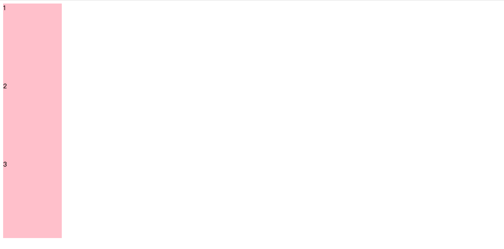
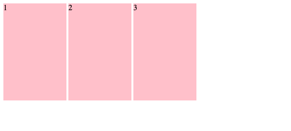
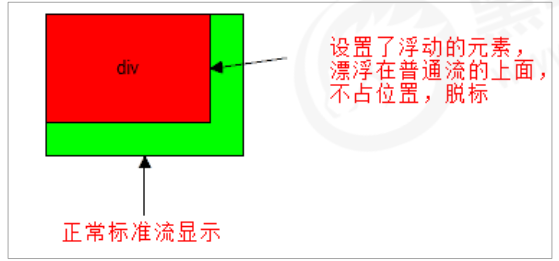
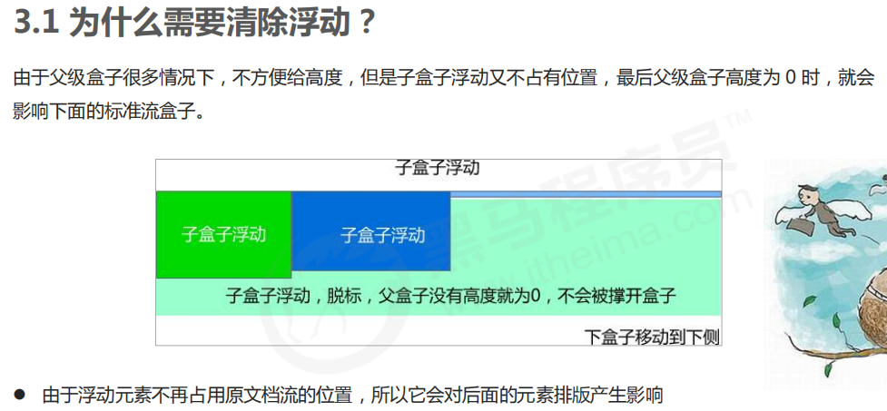
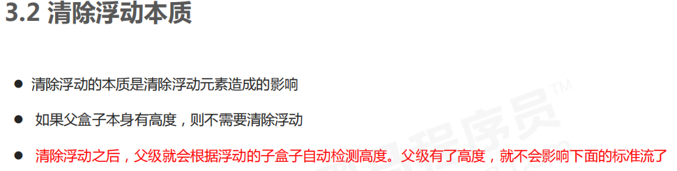
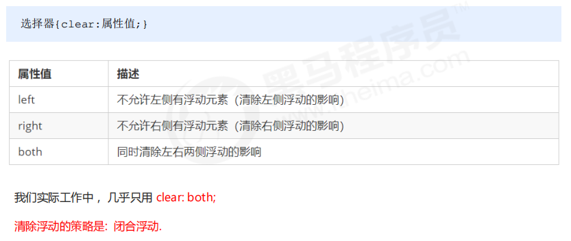
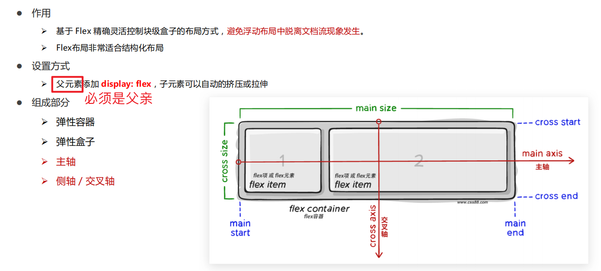
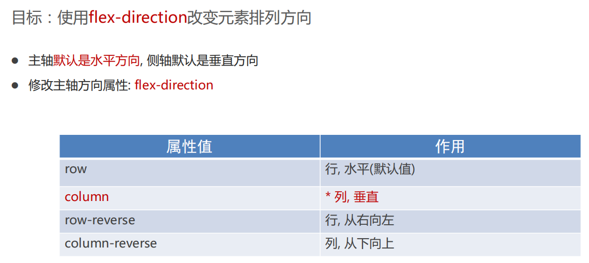

[【CSS】细说网页布局中的标准流、浮动流与定位流](https://juejin.cn/post/6959831922872680478)

[bilibili - 前端最新布局、弹性盒布局、自适应与响应式、网格布局、实战、重构、传统布局、经典布局模式](https://www.bilibili.com/video/BV1yJ4m1P7wA?p=1&vd_source=dc55c355e9f5b6174832aacfb5d8b6aa)


布局是决定元素如何在页面上排列的方式，主要的布局方案有：

- 传统布局方案（标准流、浮动流、定位流）
- `flex`布局方案
- `grid`布局方案


# 一、传统布局方案

## 1. 标准流

标准流也叫文档流，指的是标签在页面中**默认的排布规则**，例如：块元素独占一行，行内元素可以一行显示多个。 


## 2. 浮动

如何实现横向布局？？

虽然转换为行内块元素可以实现一行显示，但是他们之间会有大的空白缝隙，很难控制。

网页布局第一准则：<font color='red'>多个块级元素纵向排列找标准流，多个块级元素横向排列找浮动。</font>


### a. 浮动特点

1. 浮动元素会脱离标准流(脱标)

2. 浮动的元素会一行内显示并且元素顶部对齐

3. 浮动的元素会具有行内块元素的特性.


### b. 行内块水平布局中间有缝隙 - 浮动解决

```html
<body>
    <div>1</div>
    <div>2</div>
    <div>3</div>
</body>

<style>
div {
    /* display: inline-block; */    
    width: 150px;
    height: 200px;
    background-color: pink;
}
</style>
```

- 块元素 垂直 没有 缝隙



- 转为  行内块元素 水平 有 缝隙



- 解决方案：

```css
 <style>
     div {
         /* 行内块 一行显示有空隙 */
      	 display: inline-block;
      
      	 /* 使用浮动，代替行内块元素 */
      	 float: left;
 
         width: 150px;
         height: 200px;
         background-color: pink;
     }
 </style>
```


### c. 浮动 - 脱标




### d. 清除浮动






#### Ⅰ. 清除浮动一：额外标签法

> 又称为为隔墙法，是 W3C 推荐的做法。



额外标签法会在浮动元素末尾添加一个空的标签。例如 `<div style="clear:both"></div>` 或者其他标签（如 `<br />`等）。

**注意： 要求这个新的空标签必须是块级元素。** 

* 优点： 通俗易懂，书写方便

* 缺点： 添加许多无意义的标签，结构化较差


#### Ⅱ. 清除浮动二：父级添加 overflow

可以给 **父级添加 overflow 属性，将其属性值设置为 hidden、 auto 或 scroll **。

子不教，父之过。注意是给父元素添加代码。

* 优点：代码简洁

* 缺点：无法显示溢出的部分


#### Ⅲ. 清除浮动三： :after 伪元素法

`:after`方式是额外标签法的升级版。也是给父元素添加

* 优点：没有增加标签，结构更简单

* 缺点：照顾低版本浏览器

* 代表网站： 百度、淘宝网、网易等

```html
<style>
/* 单伪元素法 */
.clearfix::after {
	content: "";
	display: block;
	clear: both;
}
</style>

<div class="father clearfix">
    <div class="left"></div>
    <div class="right"></div>
</div>
<div class="bottom"></div>
```


#### Ⅳ. 清除浮动四：双伪元素清除浮动

也是给给**父元素**添加。

* 优点：代码更简洁

* 缺点：照顾低版本浏览器

* 代表网站：小米、腾讯等

```html

<style>

/* before 解决外边距塌陷问题 */
/* 双伪元素法 */
.clearfix::before, .clearfix::after {
	content: "";
	display: table;
}

/* after 清除浮动 */
.clearfix::after {
	clear: both;
}
</style>

<div class="father clearfix">
    <div class="left"></div>
    <div class="right"></div>
</div>
<div class="bottom"></div>
```


## 3. 定位


### a. static - 静态定位

静态定位：默认定位方式，无定位的意思。

```css
div { 
	position: static; 
}
```


### b. relative - 相对定位

**相对定位**是元素在移动位置的时候，是相对于它原来的位置来说的（自恋型）。

特点：（务必记住）

1. **它是相对于自己原来的位置来移动的（移动位置的时候参照点是自己原来的位置）。**

2. **原来在标准流的位置继续占有，后面的盒子仍然以标准流的方式对待它。**

因此，相对定位并 **没有脱标** 。它最典型的应用是给绝对定位当爹的。

```css
div { 
	position: relative; 
}
```


### c. absolute - 绝对定位

**绝对定位**是元素在移动位置的时候，是相对于它祖先元素来说的（拼爹型）。

特点：（务必记住）

1. 如果没有祖先元素或者祖先元素没有定位，则以浏览器为准定位（Document 文档）。

2. 如果祖先元素有定位（相对、绝对、固定定位），则以最近一级的有定位祖先元素为参考点移动位置。

3. **绝对定位不再占有原先的位置。（脱标）**

所以绝对定位是 **脱离标准流** 的。


### d. fixed - 固定定位

**固定定位**是元素固定于 **浏览器可视区 ** 的位置。

特点：（务必记住）

1. 以 **浏览器的可视窗口为参照点** 移动元素。 
    * 跟父元素没有任何关系
    
    * 不随滚动条滚动。
    
2. 固定定位 **不在占有原先的位置**。

固定定位也是 **脱标** 的，其实固定定位也可以看做是一种 **特殊的绝对定位** 。


### e. sticky - 粘性定位

**粘性定位**可以被认为是相对定位和固定定位的混合。 

特点：

1. 以浏览器的可视窗口为参照点移动元素（固定定位特点）

2. **粘性定位占有原先的位置（相对定位特点）**

3. **必须添加 top 、left、right、bottom 其中一个才有效**

跟页面滚动搭配使用。 兼容性较差，IE 不支持。

```css
选择器 { 
    position: sticky; 
    top: 10px; 
}
```


### f. 子绝父相

<font color='red' size=4>子级是绝对定位的话，父级要用相对定位。</font>

① 子级绝对定位，不会占有位置，可以放到父盒子里面的任何一个地方，不会影响其他的兄弟盒子。 

② 父盒子需要加定位限制子盒子在父盒子内显示。

③ 父盒子布局时，需要占有位置，因此父亲只能是相对定位。 


### g. 拓展

#### Ⅰ. 绝对定位的盒子居中

加了绝对定位的盒子不能通过 `margin:0 auto;` 水平居中，但是可以通过以下计算方法实现水平和垂直居中。

① left: 50%;：让盒子的左侧移动到父级元素的水平中心位置。 

② margin-left: -100px;：让盒子向左移动自身宽度的一半。

#### Ⅱ. 定位特殊特性

绝对定位和固定定位也和浮动类似。

1. 行内元素添加绝对或者固定定位，可以直接设置高度和宽度。

2. 块级元素添加绝对或者固定定位，如果不给宽度或者高度，默认大小是内容的大小。

#### Ⅲ. 脱标的盒子不会触发外边距塌陷

浮动元素、绝对定位(固定定位）元素的都不会触发外边距合并的问题

#### Ⅳ. 绝对定位（固定定位）会完全压住盒子

浮动元素不同，只会压住它下面标准流的盒子，但是不会压住下面标准流盒子里面的文字（图片）

但是绝对定位（固定定位） 

会压住下面标准流所有的内容。

浮动之所以不会压住文字，因为浮动产生的目的最初是为了做文字环绕效果的。 文字会围绕浮动元素。


# 二、flex布局

## 1. flex是什么？

Flex布局/弹性布局：

* 是一种浏览器提倡的布局模型
* 布局网页更简单、灵活
* 避免浮动脱标的问题


`flex`是一个用于创建灵活的布局的CSS属性。它是CSS3中的一个模块，用于实现弹性盒子布局（Flexbox Layout）。通过使用`flex`属性，可以轻松地控制元素在容器内的布局方式和空间分配。

Flexbox布局模型通过在容器和其中的项目之间建立弹性关系来实现布局。容器是指应用Flexbox布局的父元素，而项目则是容器内部的子元素。通过使用不同的`flex`属性值，可以定义项目的大小、顺序和对齐方式。

以下是一些常用的`flex`属性值：

- `flex-grow`：定义项目在空间分配中的扩展比例，如果所有项目具有相同的值，则它们将平均分配剩余空间。
- `flex-shrink`：定义项目在空间不足时的收缩比例。
- `flex-basis`：定义项目的初始大小。
- `flex-direction`：定义项目的排列方向，可以是水平方向（`row`）或垂直方向（`column`）。
- `flex-wrap`：定义项目是否换行。
- `justify-content`：定义项目在主轴上的对齐方式。
- `align-items`：定义项目在交叉轴上的对齐方式。
- `align-self`：定义单个项目在交叉轴上的对齐方式，覆盖`align-items`。

使用`flex`属性可以创建响应式布局，适应不同屏幕尺寸和设备。Flexbox布局非常灵活且易于使用，成为了现代Web开发中常用的布局技术之一。


## 2. flex使用场景限制

> 大部分场景推荐使用flex。
>
> 需要兼容低版本的IE等浏览器的 不建议使用flex。


## 3. flex介绍与使用




### a. 主轴对齐方式 - justify-content


```css
display: flex;

/* 1.靠左 */
justify-content: flex-start;

/* 2.靠右 */
justify-content: flex-end;

/* 3.居中 */
justify-content: center;

/* 4.间距在弹性盒子(子级)之间 */
justify-content: space-between;

/* 5.所有地方的间距都相等 */
justify-content: space-evenly;

/* 间距加在子级的两侧 */
/* 视觉效果: 子级之间的距离是父级两头距离的2倍 */
justify-content: space-around;
```


### b. 侧轴对齐方法 - align-items / align-self


### c. 伸缩比


```css
.box div:nth-child(1) {
    /* width: 50px; */
    flex: 2;
}

.box div:nth-child(2) {
    /* 占用父级剩余尺寸的份数 */
    flex: 3;
}

.box div:nth-child(3) {
    flex: 1;
}
```


### d. 修改主轴方向 - flxe-direction

* flex-direction




```css
display: flex;

/* 1. 先确定主轴方向; 2. 再选择对应的属性实现主轴或侧轴的对齐方式 */
/* 修改主轴方向: 列 */
flex-direction: column;

/* 视觉效果: 实现盒子水平居中 */
align-items: center;

/* 视觉效果: 垂直居中 */
justify-content: center;
```


### e. 弹性盒子换行 - flex-wrap

```css
display: flex;

/* 默认值, 不换行 */
/* flex-wrap: nowrap; */

/* 弹性盒子换行 */
flex-wrap: wrap;
```


### f. 行对齐方式 - align-content

```css
display: flex;

/* 调节行对齐方式 */
/* align-content: center; */
/* align-content: space-around; */
align-content: space-between;
```


# 三、grid布局


