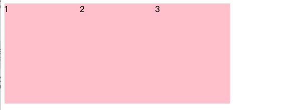
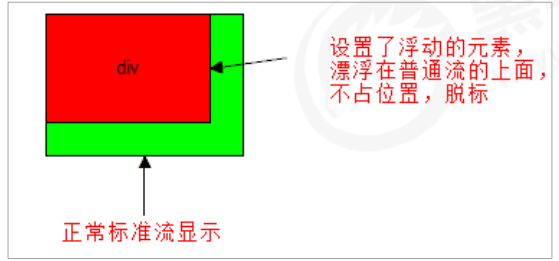
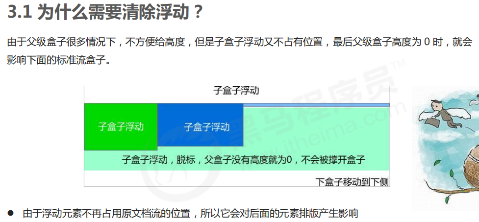

[【CSS】细说网页布局中的标准流、浮动流与定位流](https://juejin.cn/post/6959831922872680478)

[bilibili - 前端最新布局、弹性盒布局、自适应与响应式、网格布局、实战、重构、传统布局、经典布局模式](https://www.bilibili.com/video/BV1yJ4m1P7wA?p=1&vd_source=dc55c355e9f5b6174832aacfb5d8b6aa)


布局是决定元素如何在页面上排列的方式，主要的布局方案有：

- 传统布局方案（标准流、浮动流、定位流）
- `flex`布局方案
- `grid`布局方案


# 一、传统布局方案

## 1. 标准流

标准流也叫文档流，指的是标签在页面中**默认的排布规则**，例如：块元素独占一行，行内元素可以一行显示多个。 


## 2. 浮动

### a. 行内块中间有缝隙 - 浮动

```html
<body>
    <div>1</div>
    <div>2</div>
    <div>3</div>
</body>

<style>
div {
    /* display: inline-block; */    
    width: 150px;
    height: 200px;
    background-color: pink;
}
</style>
```

- 块元素 垂直 没有 缝隙


- 转为  行内块元素 水平 有 缝隙


- 解决方案：

```
 <style>
     div {
         /* 使用浮动，代替行内块元素 */  
         float: left;
         /* display: inline-block; */   
 
         width: 150px;
         height: 200px;
         background-color: pink;
     }
 </style>
```


### b. 浮动 - 脱标


### c. 清除浮动


#### 清除浮动一：额外标签法


#### 清除浮动二：父级添加 overflow


#### 清除浮动三： :after 伪元素法


#### 清除浮动四：双伪元素清除浮动


## 3. 定位


### a. static

静态定位：默认定位方式，无定位的意思。


### b. relative

**相对定位**是元素在移动位置的时候，是相对于它原来的位置来说的（自恋型）。

相对定位的特点：（务必记住）

1. 它是相对于自己原来的位置来移动的（移动位置的时候参照点是自己原来的位置）。

2. 原来在标准流的位置继续占有，后面的盒子仍然以标准流的方式对待它。

因此，相对定位并 **没有脱标** 。它最典型的应用是给绝对定位当爹的。


### c. absolute

**绝对定位**是元素在移动位置的时候，是相对于它祖先元素来说的（拼爹型）。

绝对定位的特点：（务必记住）

1. 如果没有祖先元素或者祖先元素没有定位，则以浏览器为准定位（Document 文档）。

2. 如果祖先元素有定位（相对、绝对、固定定位），则以最近一级的有定位祖先元素为参考点移动位置。

3. 绝对定位不再占有原先的位置。（脱标）

所以绝对定位是 **脱离标准流** 的。


### d. fix

**固定定位**是元素固定于 **浏览器可视区 ** 的位置。

固定定位的特点：（务必记住）

1. 以浏览器的可视窗口为参照点移动元素。 
    1. 跟父元素没有任何关系
    2. 不随滚动条滚动。

2. 固定定位 **不在占有原先的位置**。

固定定位也是 **脱标** 的，其实固定定位也可以看做是一种 **特殊的绝对定位** 。


### e. sticky 

很少


# 二、flex布局

## 1. flex是什么？

Flex布局/弹性布局：

* 是一种浏览器提倡的布局模型
* 布局网页更简单、灵活
* 避免浮动脱标的问题


`flex`是一个用于创建灵活的布局的CSS属性。它是CSS3中的一个模块，用于实现弹性盒子布局（Flexbox Layout）。通过使用`flex`属性，可以轻松地控制元素在容器内的布局方式和空间分配。

Flexbox布局模型通过在容器和其中的项目之间建立弹性关系来实现布局。容器是指应用Flexbox布局的父元素，而项目则是容器内部的子元素。通过使用不同的`flex`属性值，可以定义项目的大小、顺序和对齐方式。

以下是一些常用的`flex`属性值：

- `flex-grow`：定义项目在空间分配中的扩展比例，如果所有项目具有相同的值，则它们将平均分配剩余空间。
- `flex-shrink`：定义项目在空间不足时的收缩比例。
- `flex-basis`：定义项目的初始大小。
- `flex-direction`：定义项目的排列方向，可以是水平方向（`row`）或垂直方向（`column`）。
- `flex-wrap`：定义项目是否换行。
- `justify-content`：定义项目在主轴上的对齐方式。
- `align-items`：定义项目在交叉轴上的对齐方式。
- `align-self`：定义单个项目在交叉轴上的对齐方式，覆盖`align-items`。

使用`flex`属性可以创建响应式布局，适应不同屏幕尺寸和设备。Flexbox布局非常灵活且易于使用，成为了现代Web开发中常用的布局技术之一。


## 2. flex使用场景限制

> 大部分场景推荐使用flex。
>
> 需要兼容低版本的IE等浏览器的 不建议使用flex。


## 3. flex介绍与使用


### a. 主轴对齐方式 - justify-content


```css
display: flex;

/* 1.靠左 */
justify-content: flex-start;

/* 2.靠右 */
justify-content: flex-end;

/* 3.居中 */
justify-content: center;

/* 4.间距在弹性盒子(子级)之间 */
justify-content: space-between;

/* 5.所有地方的间距都相等 */
justify-content: space-evenly;

/* 间距加在子级的两侧 */
/* 视觉效果: 子级之间的距离是父级两头距离的2倍 */
justify-content: space-around;
```


### b. 侧轴对齐方法 - align-items / align-self




### c. 伸缩比



```css
.box div:nth-child(1) {
    /* width: 50px; */
    flex: 2;
}

.box div:nth-child(2) {
    /* 占用父级剩余尺寸的份数 */
    flex: 3;
}

.box div:nth-child(3) {
    flex: 1;
}
```


### d. 修改主轴方向 - flxe-direction

* flex-direction




```css
display: flex;

/* 1. 先确定主轴方向; 2. 再选择对应的属性实现主轴或侧轴的对齐方式 */
/* 修改主轴方向: 列 */
flex-direction: column;

/* 视觉效果: 实现盒子水平居中 */
align-items: center;

/* 视觉效果: 垂直居中 */
justify-content: center;
```


### e. 弹性盒子换行 - flex-wrap

```css
display: flex;

/* 默认值, 不换行 */
/* flex-wrap: nowrap; */

/* 弹性盒子换行 */
flex-wrap: wrap;
```


### f. 行对齐方式 - align-content

```css
display: flex;

/* 调节行对齐方式 */
/* align-content: center; */
/* align-content: space-around; */
align-content: space-between;
```


# 三、grid布局


