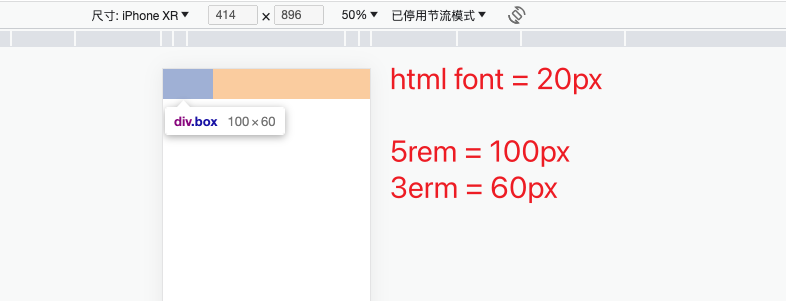
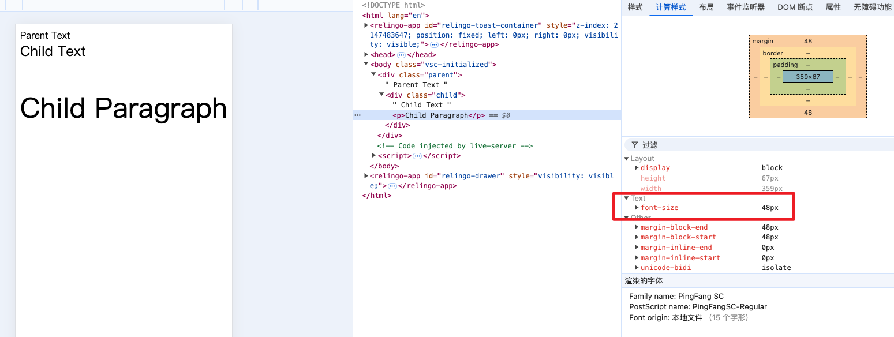

[Vant4 浏览器适配方案](https://vant-ui.github.io/vant/#/zh-CN/advanced-usage#liu-lan-qi-gua-pei)


# 移动适配技术方案

宽度适配：宽度自适应 

* 百分比布局 

* Flex 布局 

等比适配：宽高等比缩放 

* rem 

* vw 


* 目前推荐：rem
* 未来趋势：vw / vh


# 一、分辨率（单独文档）

> 文档：XiOS   ----->   Tools  ----->  018 分辨率


# 二、视口 - viewport

<font color='red' size=5>视口：显示HTML网页的区域，用来约束HTML尺寸 </font>

```html
<!DOCTYPE html> 
<html lang="en"> 
    <head> 
        <meta charset="UTF-8">
        <meta http-equiv="X-UA-Compatible" content="IE=edge"> 
        <!– 视口标签 -->
        <meta name="viewport" content="width=device-width, initial-scale=1.0, user-scalable=no"> 
        <title>Document</title> 
    </head>
    
    <body> 
        
    </body> 
</html>
```

* `width=device-width`：设置视口宽度等于设备宽度。
* `initial-scale=1.0`：初始缩放比例为 1（不缩放）。
* 可选项：`user-scalable=no` 禁止用户缩放页面，常用于避免设计错位。

| 属性名        | 取值                      | 描述                                                |
| :------------ | :------------------------ | :-------------------------------------------------- |
| width         | 正整数 或 `device-width`  | 定义视口的宽度，单位为像素                          |
| height        | 正整数 或 `device-height` | 定义视口的高度，单位为像素，一般不用                |
| initial-scale | [0.0-10.0]                | 定义初始缩放值                                      |
| minimum-scale | [0.0-10.0]                | 定义放大最大比例，它必须小于或等于maximum-scale设置 |
| maximum-scale | [0.0-10.0]                | 定义缩小最小比例，它必须大于或等于minimum-scale设置 |
| user-scalable | yes / no                  | 定义是否允许用户手动缩放页面，默认值 yes            |

设备像素比可以通过 window.devicePixelRatio 来获取，或者使用 CSS 中的 device-pixel-ratio。 下面是常见的设备像素比：

- 普通密度桌面显示屏：devicePixelRatio = 1
- 高密度桌面显示屏(Mac Retina)：devicePixelRatio = 2
- 主流手机显示屏：devicePixelRatio = 2 or 3


##  1. 三个viewport概念

- **布局视口 layout viewport**

    表示浏览器默认的viewport，一般情况下这个宽度要大于浏览器可视区域宽度；

    获取方式：`document.documentElement.clientWidth/Height` 可以获取layout viewport的尺寸

- **可视视口 visual viewport**

    表示浏览器可视区域的大小，当用户缩小或者放大的时候，尺寸会发生变化。

    获取方式：通过 `window.innerWidth/Height`

- **理想视口 ideal viewport**

    最适合移动设备的viewport，它没有一个固定的尺寸，不同的设备拥有有不同的 ideal viewport，它的宽度等于移动设备的屏幕宽度(即设备逻辑像素)

    ideal viewport的宽度 = 屏幕的逻辑像素宽度

    ```html
    <meta name="viewport" content="width=device-width" />
    ```


# 三、rem

https://www.freecodecamp.org/chinese/news/what-is-rem-in-css/

https://www.freecodecamp.org/news/what-is-rem-in-css/

https://blog.51cto.com/u_15311558/3172302


## 1. rem原理

* rem是单位，相对单位

* rem单位是相对于 **HTML标签的字号** 计算结果

* 1rem = 1HTML字号大小


## 2. rem原理验证

> 验证：1rem = 1HTML字号大小 ？

```css
<style>
    /* 1rem = 1html标签字号大小 */
    html {
        font-size: 20px;
    }

    .box {
        width: 5rem;
        height: 3rem;
        background-color: pink;
    }
</style>
```




## 3. 问题一：如何设置不同的HTML标签字号？

1. 手机屏幕大小不同，分辨率不同， 如何设置不同的HTML标签字号？

### 方案：媒体查询

能够使用 <font color=red>媒体查询</font> 设置 <font color=red>差异化</font> CSS样式

```css
<style>
    /* 使用媒体查询, 根据不同的视口宽度, 设置不同的根字号 */
    @media (width:375px) {
        html {
            font-size: 40px;
        }
    }

    @media (width:320px) {
        html {
            font-size: 30px;
        }
    }
</style>
```


## 4. 问题二：HTML标签字号设置多少合适？

2. 设备宽度不同，HTML标签字号设置多少合适？

### 方案：视口宽度 的 1/10

目前rem布局方案中，将网页等分成10份， HTML标签的字号为 **视口宽度** 的 1/10


## 5. 原始终极代码

```css
 <style>
    /* 1. 不同的视口, HTML标签字号不同, 字号是视口宽度的1/10 */
    @media (width:320px) {
        html {
            font-size: 32px;
        }
    }
    @media (width:375px) {
        html {
            font-size: 37.5px;
        }
    }
    @media (width:414px) {
        html {
            font-size: 41.4px;
        }
    }

    /* 2. 书写盒子尺寸, 单位rem */
    .box {
        width: 9rem;
        height: 3rem;
        background-color: pink;
    }   
</style>
```


## 6. flexible.js库

[flexible.js 本地文件查看](./flexible.js)

* flexible.js 代替 许多媒体查询代码`@media()`。

* flexible.js是手淘开发出的一个用来适配移动端的js框架。 

* 核心原理就是根据不同的视口宽度给网页中html根节点设置不同的font-size。


# 四、em vs rem

* em（font size of the element）是基于**当前元素或其父元素**的字体大小，**适用于局部动态调整**。
* rem（font size of the root element）是基于**根元素**，**适用于全局统一的布局设计和响应式设计**。

它们之间其实很相似，只不过一个计算的规则是依赖根元素一个是依赖父元素计算。


## 1. **`em` 单位**

- **定义**：`em` 是相对于**当前元素的字体大小**的单位。
- **继承性**：`em` 的值会受当前元素或其父元素的字体大小影响，具有**继承性**。
- **使用场景**：`em` 常用于为子元素设置相对于父元素的尺寸，比如用于控制间距（`padding`、`margin`）或字体大小。

```html
<style>
  .parent {
    font-size: 16px; /* 父元素的字体大小 */
  }

  .child {
    font-size: 1.5em; /* 1.5倍于父元素的字体大小 */
  }

  .child p {
    font-size: 2em; /* 2倍于子元素（.child）的字体大小 */
  }
</style>

<div class="parent">
  Parent Text
  <div class="child">
    Child Text
    <p>Child Paragraph</p>
  </div>
</div>
```

* `.child` 的字体大小是 `1.5em`，也就是 `1.5 × 16px = 24px`。
* `.child p` 的字体大小是 `2em`，相对于 `.child` 元素的字体大小 `24px`，最终为 `2 × 24px = 48px`。



**优点**：

- 灵活：因为 `em` 是相对单位，可以随着父元素字体大小的变化而改变。

**缺点**：

- 复杂：由于 `em` 会受嵌套元素的影响，计算有时较复杂，可能导致预期之外的结果。


## 2. **`rem` 单位**

- **定义**：`rem` 是相对于**根元素（`<html>`）的字体大小**的单位（Root EM）。
- **无继承性**：`rem` 始终基于根元素的字体大小，而不受嵌套元素的影响。
- **使用场景**：`rem` 常用于全局布局和统一的尺寸控制，因为它与页面的根字体大小有关。

```html
<style>
  html {
    font-size: 16px; /* 根元素的字体大小 */
  }

  .container {
    font-size: 2rem; /* 相当于 2 × 16px = 32px */
    padding: 1rem;   /* 相当于 1 × 16px = 16px */
  }

  .container p {
    font-size: 1.5rem; /* 相当于 1.5 × 16px = 24px */
  }
</style>

<div class="container">
  Container Text
  <p>Paragraph Text</p>
</div>
```

* `.container` 的字体大小是 `2rem`，即 `2 × 16px = 32px`。

* `.container p` 的字体大小是 `1.5rem`，即 `1.5 × 16px = 24px`。

**优点**：

- 可预测：因为 `rem` 始终参考根元素，避免了 `em` 的复杂继承问题，计算更直观。
- 一致性：适合用来定义全局统一的尺寸，比如网站的基本排版和间距。

**缺点**：

- 灵活性稍弱：不能像 `em` 那样根据父元素的字体大小动态变化。


## 3. 区别总结

| **对比项**     | **em**                                 | **rem**                                      |
| -------------- | -------------------------------------- | -------------------------------------------- |
| **参考基准**   | 相对于当前元素的字体大小               | 相对于根元素的字体大小（`<html>`）           |
| **继承性**     | 受父元素的字体大小影响，具有层级继承性 | 不受继承影响，始终与根元素挂钩               |
| **灵活性**     | 更灵活，可以根据上下文变化             | 灵活性稍弱，统一参考根元素                   |
| **适用场景**   | 局部的布局调整、嵌套元素尺寸           | 全局统一的尺寸控制（如页面布局、响应式设计） |
| **计算复杂度** | 高（尤其是深层嵌套时）                 | 低，比较直观                                 |


## 4. 实际应用场景

- 使用 `em`：适用于局部调整，例如需要根据父元素的字体大小动态调整子元素的大小或间距时。
    - 例如：设计一个导航栏，子菜单的字体大小需要根据父菜单的字体大小自动调整。
- 使用 `rem`：适用于全局的布局、字体大小、间距控制。
    - 例如：为整个网站设置基础的字体大小、间距或按钮的大小，使得所有组件都基于根元素的字体大小来计算，从而实现统一的设计语言。


# 五、vw / vh

## 1. vw / vh 原理

* vw / vh 是相对单位
* **相对视口的尺寸** 计算结果

- `vw`：浏览器可见视口【宽度】的百分比（1vw代表视窗【宽度】的1%）
- `vh`：浏览器可见视口【高度】的百分比（1vw代表视窗【高度】的1%）
- `vmin`：当前 vw 和 vh 较小的一个值。
- `vmax`：当前 vw 和 vh 中较大的一个值。


## 2. vw,vh 与 % 的区别是什么？

1. `%` 是基于【父元素】的宽度/高度的百分比，`vw`，`vh`是根据视窗的宽度/高度的百分比。
2. 视口单位优势在于【`vh`】能够直接获取高度，而用 `%` 在没有设置 `body` 高度情况下，是无法正确获得可视区域的高度。


## 3. 问题：vw / vh 不能同时使用

不同机型的宽高比例不同。


## 4. postcss-px-to-viewport

[Vant4 浏览器适配方案](https://vant-ui.github.io/vant/#/zh-CN/advanced-usage#liu-lan-qi-gua-pei)

**postcss-px-to-viewport**：这是一个前端插件，只需设置设计图的`px`，就能自动缩放到相应的视口大小。这种方法简化了适配过程，特别适合那些需要快速适配移动端页面的用户。


# 六、响应式网页

## 1. 媒体查询（Media Queries）


## 2. 现代布局技术（flex、grid）


## 3. 相对单位 （`rem`、`em`、%）


## 4. 响应式设计的常用框架

1. Bootstrap
2. Foundation
3. Tailwind CSS


# 六、移动端事件

https://tgideas.qq.com/doc/frontend/explore/event.html

移动端事件主要有触摸、滑动、点击、拖拽、双击、旋转、放大缩小，下面主要会介绍前三种事件。

## 1. 触摸

- touchstart：手指触摸到屏幕会触发
- touchmove：当手指在屏幕上移动时，会触发
- touchend：当手指离开屏幕时，会触发
- touchcancel：可由系统进行的触发，比如手指触摸屏幕的时候，突然alert了一下，或者系统中其他打断了touch的行为，则可以触发该事件

## 2. swipe类滑动事件

- swipe：手指在屏幕上滑动时会触发
- swipeLeft：手指在屏幕上向左滑动时会触发
- swipeRight：手指在屏幕上向右滑动时会触发
- swipeUp：手指在屏幕上向上滑动时会触发
- swipeDown：手指在屏幕上向下滑动时会触发

## 3. 点击事件

### a. tap

- 标准事件中没有tap事件，tap事件是zepto，使用touch进行封装的
- tap: 手指碰一下屏幕会触发
- longTap: 手指长按屏幕会触发
- singleTap: 手指碰一下屏幕会触发
- doubleTap: 手指双击屏幕会触发

### b. click

- 移动端的click有300ms延迟的问题，在移动端浏览器中，连续两次点击是缩放操作，所以在用户点击屏幕后，浏览器会检查在300ms内是否有另一次点击，如果没有则触发click事件。因为有延迟，所以尽量不使用click做为点击事件
- 可以使用touchstart代替点击事件，但前提是同一对象上不能同时绑定一个单击事件和一个滑动事件

### c. 点透问题

- 原因 当一个用户在点击屏幕的时候，系统会触发touch事件和click事件，touch事件优先处理，touch事件经过 捕获，处理, 冒泡 一系列流程处理完成后， 才回去触发click事件
- 场景 tap和click不能混用 A 和 B不是后代继承关系(如果是后代继承关系的话，就直接是冒泡子类的话题了) A发生touch， A touch后立即消失， B事件绑定click A z-index大于B，即A显示在B浮层之上
- 解决方案 可以touch阶段取消掉系统触发的click事件，也可以让消失的元素延迟200-300ms


## 4. 代码示例

```html
<body>
    <div>
        <div id="A">
        </div>
        <div id="B">
        </div> 
    </div>
</body>
<script type="text/javascript">
var A = document.getElementById("A");
var B = document.getElementById("B");
A.addEventListener('touchstart', function(e) {
    A.style.display = 'none';
});
A.addEventListener('touchend', function(e) {
    e.preventDefault();
});
B.onclick = function() {
    console.log('兄弟元素B被点击了');
}
</script>
```


# 七、移动端页面性能优化指引

https://tgideas.qq.com/doc/frontend/explore/performance.html


