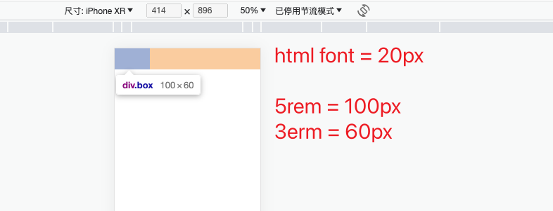

# 移动适配的两种技术方案

* 目前推荐：rem
* 未来趋势：vw / vh


# rem

## 1. rem原理

* rem是单位，相对单位

* rem单位是相对于 **HTML标签的字号** 计算结果

* 1rem = 1HTML字号大小


## 2. rem原理验证

> 验证：1rem = 1HTML字号大小 ？

```css
<style>
    /* 1rem = 1html标签字号大小 */
    html {
        font-size: 20px;
    }

    .box {
        width: 5rem;
        height: 3rem;
        background-color: pink;
    }
</style>
```




## 3. 问题一：如何设置不同的HTML标签字号？

1. 手机屏幕大小不同，分辨率不同， 如何设置不同的HTML标签字号？

### 方案：媒体查询

能够使用 <font color=red>媒体查询</font> 设置 <font color=red>差异化</font> CSS样式

```css
<style>
    /* 使用媒体查询, 根据不同的视口宽度, 设置不同的根字号 */
    @media (width:375px) {
        html {
            font-size: 40px;
        }
    }

    @media (width:320px) {
        html {
            font-size: 30px;
        }
    }
</style>
```


## 4. 问题二：HTML标签字号设置多少合适？

2. 设备宽度不同，HTML标签字号设置多少合适？

### 方案：视口宽度 的 1/10

目前rem布局方案中，将网页等分成10份， HTML标签的字号为 **视口宽度** 的 1/10


## 5. 原始终极代码

```css
 <style>
    /* 1. 不同的视口, HTML标签字号不同, 字号是视口宽度的1/10 */
    @media (width:320px) {
        html {
            font-size: 32px;
        }
    }
    @media (width:375px) {
        html {
            font-size: 37.5px;
        }
    }
    @media (width:414px) {
        html {
            font-size: 41.4px;
        }
    }

    /* 2. 书写盒子尺寸, 单位rem */
    .box {
        width: 9rem;
        height: 3rem;
        background-color: pink;
    }   
</style>
```


## 6. flexible.js库

[flexible.js 本地文件查看](./flexible.js)

* flexible.js 代替 许多媒体查询代码`@media()`。

* flexible.js是手淘开发出的一个用来适配移动端的js框架。 

* 核心原理就是根据不同的视口宽度给网页中html根节点设置不同的font-size。


# vw / vh


## 1. vw / vh 原理

* vw / vh 是相对单位
* **相对视口的尺寸** 计算结果
* vw：viewport width
    * 1vw = 1/100视口宽度
* vh：viewport height
    * 1vh = 1/100视口高度


## 2. 问题：vw / vh 不能同时使用

不同机型的宽高比例不同。


