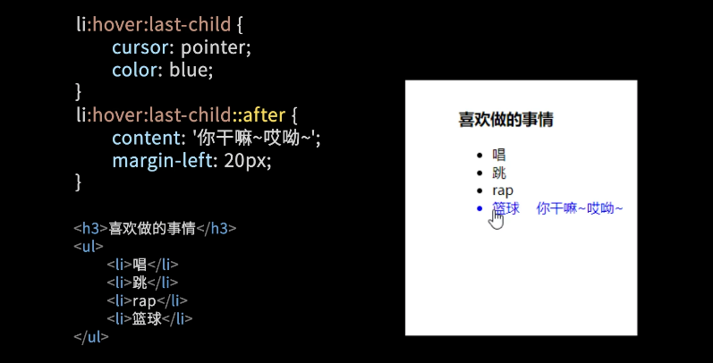

# 一、CSS伪类

* [更多样例](https://c.biancheng.net/css3/pseudo-class.html)

* [链接相关的伪类](https://c.biancheng.net/css3/link.html)


## 1. 概念和基本使用

* **伪类**：以冒号(:)开头，伪类是选择器的一种，它用于选择处于特定状态的元素。

```css
a: hover {
	background-color: red;
}
```


## 2. 高级使用

### a. 伪类可以拼接多个

如下表示：鼠标悬浮在最后一个元素上时，改变光标和颜色


### b. 伪类可以拼接伪元素，但伪元素不可以连续多个




## 3. 伪类大全

| 选择器               | 例子                  | 例子描述                                                     |
| -------------------- | --------------------- | ------------------------------------------------------------ |
| :active              | a:active              | 匹配被点击的链接                                             |
| :checked             | input:checked         | 匹配处于选中状态的 <input> 元素                              |
| :disabled            | input:disabled        | 匹配每个被禁用的 <input> 元素                                |
| :empty               | p:empty               | 匹配任何没有子元素的 <p> 元素                                |
| :enabled             | input:enabled         | 匹配每个已启用的 <input> 元素                                |
| :first-child         | p:first-child         | 匹配父元素中的第一个子元素 <p>，<p> 必须是父元素中的第一个子元素 |
| :first-of-type       | p:first-of-type       | 匹配父元素中的第一个 <p> 元素                                |
| :focus               | input:focus           | 匹配获得焦点的 <input> 元素                                  |
| :hover               | a:hover               | 匹配鼠标悬停其上的元素                                       |
| :in-range            | input:in-range        | 匹配具有指定取值范围的 <input> 元素                          |
| :invalid             | input:invalid         | 匹配所有具有无效值的 <input> 元素                            |
| :lang(language)      | p:lang(it)            | 匹配每个 lang 属性值以 "it" 开头的 <p> 元素                  |
| :last-child          | p:last-child          | 匹配父元素中的最后一个子元素 <p>， <p> 必须是父元素中的最后一个子元素 |
| :last-of-type        | p:last-of-type        | 匹配父元素中的最后一个 <p> 元素                              |
| :link                | a:link                | 匹配所有未被访问的链接                                       |
| :not(selector)       | :not(p)               | 匹配每个非 <p> 元素的元素                                    |
| :nth-child(n)        | p:nth-child(2)        | 匹配父元素中的第二个子元素 <p>                               |
| :nth-last-child(n)   | p:nth-last-child(2)   | 匹配父元素的倒数第二个子元素 <p>                             |
| :nth-last-of-type(n) | p:nth-last-of-type(2) | 匹配父元素的倒数第二个子元素 <p>                             |
| :nth-of-type(n)      | p:nth-of-type(2)      | 匹配父元素的第二个子元素 <p>                                 |
| :only-of-type        | p:only-of-type        | 匹配父元素中唯一的 <p> 元素                                  |
| :only-child          | p:only-child          | 匹配父元素中唯一的子元素 <p>                                 |
| :optional            | input:optional        | 匹配不带 "required" 属性的 <input> 元素                      |
| :out-of-range        | input:out-of-range    | 匹配值在指定范围之外的 <input> 元素                          |
| :read-only           | input:read-only       | 匹配指定了 "readonly" 属性的 <input> 元素                    |
| :read-write          | input:read-write      | 匹配不带 "readonly" 属性的 <input> 元素                      |
| :required            | input:required        | 匹配指定了 "required" 属性的 <input> 元素                    |
| :root                | root                  | 匹配元素的根元素，在 HTML 中，根元素永远是 HTML              |
| :target              | #news:target          | 匹配当前活动的 #news 元素（单击包含该锚名称的 URL）          |
| :valid               | input:valid           | 匹配所有具有有效值的 <input> 元素                            |
| :visited             | a:visited             | 匹配所有已经访问过的链接                                     |


# 二、CSS伪元素

* [更多样例](https://c.biancheng.net/css3/pseudo-element.html)
* [:before,:after 伪元素妙用](http://www.alloyteam.com/2015/04/beforeafter伪元素妙用/)


## 1. 概念和简单使用

* **伪元素**：以双冒号(::)开头，用于创建虚构元素并定义样式。
* **它不存在于文档中**，所以 js 无法操作它
* 它属于主元素本身，有些伪类仅仅是代表元素内容的一部分，譬如:first-letter 代表第一个字母；因此 **当伪元素被点击的时候触发的是主元素的 click 事件**
* 块级元素才能有:before, :after，譬如 img 就不能设置，亦即某些元素是没有:before, :after 的，只要知道一般的块级元素都可以用就行了
    * 我们知道HTML元素分为两种类型：块级元素和行内元素。块级元素都是可以直接设置伪元素的，但是部分行内元素却是无法去设置伪元素的，如替换元素img，a等。
* 优点
    - 减少dom节点数
    - 让css帮助解决部分js问题，让问题变得简单
* 缺点
    - 不利于SEO
    - 无法审查元素，不利于调试


```html
<!DOCTYPE html>
<html>
<head>
    <style>
        p.one::before {
            content:"";
            display: inline-block;
            width: 50px;
            height: 10px;
            background: blue;
        }
        p.two::before {
            content:"要插入的内容";
            color: red;
            font-size: 6px;
        }
        p.three::before {
            content: url('./smiley.gif');
            position: relative;
            top: 8px;
        }
    </style>
</head>
<body>
    <p class="one">伪元素 ::before</p>
    <p class="two">伪元素 ::before</p>
    <p class="three">伪元素 ::before</p>
</body>
</html>
```


## 2. 伪元素妙用 

### a. 清除浮动

```html
<div class="l-form-row">
    <div class="l-form-label"></div>
    ....
</div>

<style>
    .l-form-row:after {
        clear: both;
        content: "\0020";
        display: block;
        height: 0;
        overflow: hidden
    }
</style>
```


### b. 扩大可点区域

在 mobile，特别是小屏手机，可点区域一般需要大一点，这样对用户友好一点。
当主元素实在没办法扩大自身的时候，可以利用 :before, :after 来实现可点区域的扩大，还记得伪元素的特性之一，**伪元素属于主元素，点伪元素就是点击主元素。**


## 3. 伪元素大全

| 伪元素         | 例子               | 例子描述                                              |
| -------------- | ------------------ | ----------------------------------------------------- |
| ::after        | p::after           | 在每个 <p> 元素之后插入内容                           |
| ::before       | p::before          | 在每个 <p> 元素之前插入内容                           |
| ::first-letter | p::first-letter    | 匹配每个 <p> 元素中内容的首字母                       |
| ::first-line   | p::first-line      | 匹配每个 <p> 元素中内容的首行                         |
| ::selection    | p::selection       | 匹配用户选择的元素部分                                |
| ::placeholder  | input::placeholder | 匹配每个表单输入框（例如 <input>）的 placeholder 属性 |


# 三、区别 - GPT

CSS中的伪类和伪元素都是用来选择HTML元素的特定部分或状态的方法，但它们有一些区别。

1. 伪类（Pseudo-classes）：

    - 伪类用于选择元素的特定状态，比如:hover（鼠标悬停状态）、:active（激活状态）、:first-child（第一个子元素）等。
    - 伪类在选择器的最后使用，以冒号（:）开头。
    - 伪类通常用于根据用户的交互或元素的状态来改变样式。

    示例：

    ```css
    a:hover {
      color: red;
    }
    
    li:first-child {
      font-weight: bold;
    }
    
    input:valid {
      border-color: green;
    }
    ```

2. 伪元素（Pseudo-elements）：

    - 伪元素用于选择元素的特定部分，比如::before（在元素内容之前插入内容）、::after（在元素内容之后插入内容）等。
    - 伪元素在选择器的最后使用，以双冒号（::）开头。
    - 伪元素用于在元素的特定位置插入内容，而不是选择元素的状态。

    示例：

    ```css
    p::before {
      content: "前缀：";
    }
    
    button::after {
      content: "点击我";
    }
    
    li::first-letter {
      font-size: 2em;
    }
    ```

总结：

- 伪类用于选择元素的特定状态，而伪元素用于选择元素的特定部分。
- 伪类以冒号（:）开头，而伪元素以双冒号（::）开头。
- 伪类常用于根据用户的交互或元素的状态来改变样式，而伪元素用于在元素的特定位置插入内容。
