# Day02_AJAX综合案例


## 知识点自测

1. 以下代码运行结果是什么？（考察扩展运算符的使用）

   ```js
   const result = {
     name: '老李',
     age: 18
   }
   const obj = {
     ...result
   }
   console.log(obj.age)
   ```
   
   A：报错
   
   B：18
   
   <details>
   <summary>答案</summary>
   <ul>
   <li>B正确</li>
   </ul>
   </details>


2. 什么是事件委托？

   A：只能把单击事件委托给父元素绑定

   B：可以把能冒泡的事件，委托给已存在的向上的任意标签元素绑定

   <details>
   <summary>答案</summary>
   <ul>
   <li>B正确</li>
   </ul>
   </details>


3. 事件对象e.target作用是什么?

   A：获取到这次触发事件相关的信息

   B：获取到这次触发事件目标标签元素

   <details>
   <summary>答案</summary>
   <ul>
   <li>B正确</li>
   </ul>
   </details>


4. 如果获取绑定在标签上自定义属性的值10？

   ```html
   <div data-code="10">西游记</div>
   ```
   
   A：div标签对象.innerHTML
   
   B：div标签对象.dataset.code
   
   C：div标签对象.code
   
   <details>
   <summary>答案</summary>
   <ul>
   <li>B正确</li>
   </ul>
   </details>


5. 哪个方法可以判断目标标签是否包含指定的类名?

   ```html
   <div class="my-div title info"></div>
   ```
   
   A: div标签对象.className === 'title'
   
   B: div标签对象.classList.contains('title')
   
   <details>
   <summary>答案</summary>
   <ul>
   <li>B正确</li>
   </ul>
   </details>


6. 伪数组取值哪种方式是正确的?

   ```js
   let obj = { 0: '老李', 1: '老刘' }
   ```
   
   A: obj.0
   
   B: obj[0]
   
   <details>
   <summary>答案</summary>
   <ul>
   <li>B正确</li>
   </ul>
   </details>


7. 以下哪个选项可以，往本地存储键为‘bgImg’，值为图片url网址的代码

   A：localStorage.setItem('bgImg')

   B：localStorage.getItem('bgImg')

   C：localStorage.setItem('bgImg', '图片url网址')

   D：localStorage.getItem('bgImg', '图片url网址')

   <details>
   <summary>答案</summary>
   <ul>
   <li>C正确</li>
   </ul>
   </details>


8. 以下代码运行结果是？

   ```js
   const obj = {
     username: '老李',
     age: 18,
     sex: '男'
   }
   Object.keys(obj)
   ```

   A：代码报错

   B：[username, age, sex]

   C：["username", "age", "sex"]

   D：["老李", 18, "男"]

   <details>
   <summary>答案</summary>
   <ul>
   <li>C正确</li>
   </ul>
   </details>


9. 下面哪个选项可以把数字字符串转成数字类型？

   A：+’10‘

   B：’10‘ + 0

   <details>
   <summary>答案</summary>
   <ul>
   <li>A正确</li>
   </ul>
   </details>


10. 以下代码运行后的结果是什么？（考察逻辑与的短路特性）

    ```js
    const age = 18
    const result1 = (age || '有年龄')
    
    const sex = ''
    const result2 = sex || '没有性别'
    ```

    A：报错，报错

    B：18，没有性别

    C：有年龄，没有性别

    D：18，’‘

    <details>
    <summary>答案</summary>
    <ul>
    <li>B正确</li>
    </ul>
    </details>
    
    


## 目录

* 案例-图书管理
* 图片上传
* 案例-网站换肤
* 案例-个人信息设置


## 学习目标

> 今天主要就是练，巩固 axios 的使用

1. 完成案例-图书管理系统（增删改查）经典业务
2. 掌握图片上传的思路
3. 完成案例-网站换肤并实现图片地址缓存
4. 完成案例-个人信息设置


## 01.案例_图书管理-介绍

### 目标

案例-图书管理-介绍（介绍要完成的效果和练习到的思维）


### 讲解

1. 打开备课代码运行图书管理案例效果-介绍要完成的增删改查业务效果和 Bootstrap 弹框使用

   

   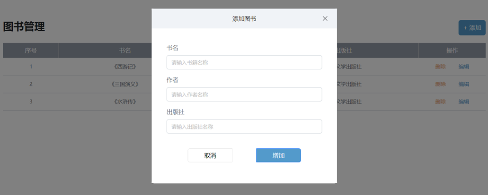
2. 分析步骤和对应的视频模块
   * 先学习 Bootstrap 弹框的使用（因为添加图书和编辑图书需要这个窗口来承载图书表单）
   * 先做渲染图书列表（这样做添加和编辑以及删除可以看到数据变化，所以先做渲染）
   * 再做新增图书功能
   * 再做删除图书功能
   * 再做编辑图书功能（注意：编辑和新增图书是2套弹框-后续做项目我们再用同1个弹框）


### 小结

1. 做完这个案例我们将会有什么收获呢?

   <details>
   <summary>答案</summary>
   <ul>
   <li>掌握前端经典增删改查的业务和思路，对以后开发很有帮助</li>
   </ul>
   </details>


## 02.Bootstrap 弹框_属性控制

### 目标

使用属性方式控制 Bootstarp 弹框的显示和隐藏


### 讲解

1. 什么是 Bootstrap 弹框？

   * 不离开当前页面，显示单独内容，供用户操作

     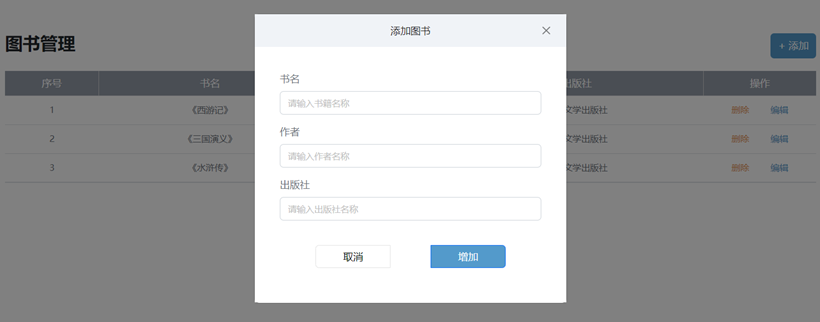

2. 需求：使用 Bootstrap 弹框，先做个简单效果，点击按钮，让弹框出现，点击 X 和 Close 让弹框隐藏

   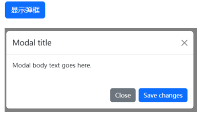

3. 如何使用 Bootstrap 弹框呢？

   1. 先引入 bootstrap.css 和 bootstrap.js 到自己网页中

   2. 准备弹框标签，确认结构（可以从 Bootstrap 官方文档的 Modal 里复制基础例子）- 运行到网页后，逐一对应标签和弹框每个部分对应关系

   3. 通过自定义属性，通知弹框的显示和隐藏，语法如下：

      ```html
      <button data-bs-toggle="modal" data-bs-target="css选择器">
        显示弹框
      </button>
      
      <button data-bs-dismiss="modal">Close</button>
      ```

      

4. 去代码区实现一下

   ```html
   <!DOCTYPE html>
   <html lang="en">
   
   <head>
     <meta charset="UTF-8">
     <meta http-equiv="X-UA-Compatible" content="IE=edge">
     <meta name="viewport" content="width=device-width, initial-scale=1.0">
     <title>Bootstrap 弹框</title>
     <!-- 引入bootstrap.css -->
     <link href="https://cdn.jsdelivr.net/npm/bootstrap@5.2.2/dist/css/bootstrap.min.css" rel="stylesheet">
   </head>
   
   <body>
     <!-- 
       目标：使用Bootstrap弹框
       1. 引入bootstrap.css 和 bootstrap.js
       2. 准备弹框标签，确认结构
       3. 通过自定义属性，控制弹框的显示和隐藏
      -->
     <button type="button" class="btn btn-primary" data-bs-toggle="modal" data-bs-target=".my-box">
       显示弹框
     </button>
   
     <!-- 
       弹框标签
       bootstrap的modal弹框，添加modal类名（默认隐藏）
      -->
     <div class="modal my-box" tabindex="-1">
       <div class="modal-dialog">
         <!-- 弹框-内容 -->
         <div class="modal-content">
           <!-- 弹框-头部 -->
           <div class="modal-header">
             <h5 class="modal-title">Modal title</h5>
             <button type="button" class="btn-close" data-bs-dismiss="modal" aria-label="Close"></button>
           </div>
           <!-- 弹框-身体 -->
           <div class="modal-body">
             <p>Modal body text goes here.</p>
           </div>
           <!-- 弹框-底部 -->
           <div class="modal-footer">
             <button type="button" class="btn btn-secondary" data-bs-dismiss="modal">Close</button>
             <button type="button" class="btn btn-primary">Save changes</button>
           </div>
         </div>
       </div>
     </div>
   
     <!-- 引入bootstrap.js -->
     <script src="https://cdn.jsdelivr.net/npm/bootstrap@5.2.2/dist/js/bootstrap.min.js"></script>
   </body>
   
   </html>
   ```

   


### 小结

1. 用哪个属性绑定来控制弹框显示呢?

   <details>
   <summary>答案</summary>
   <ul>
   <li>data-bs-toggle和data-bs-target</li>
   </ul>
   </details>

2. 用哪个属性来控制隐藏弹框呢？

   <details>
   <summary>答案</summary>
   <ul>
   <li>data-bs-dismiss 关闭的是标签所在的当前提示框</li>
   </ul>
   </details>


## 03.Bootstrap 弹框_JS控制

### 目标

使用 JS 方式控制 Bootstarp 弹框的显示和隐藏


### 讲解

1. 为什么需要 JS 方式控制呢？

   * 当我显示之前，隐藏之前，需要执行一些 JS 逻辑代码，就需要引入 JS 控制弹框显示/隐藏的方式了

   * 例如：

     * 点击编辑姓名按钮，在弹框显示之前，在输入框填入默认姓名
     * 点击保存按钮，在弹框隐藏之前，获取用户填入的名字并打印

     

   

2. 所以在现实和隐藏之前，需要执行 JS 代码逻辑，就使用 JS 方式 控制 Bootstrap 弹框显示和隐藏

   语法如下：

   ```js
   // 创建弹框对象
   const modalDom = document.querySelector('css选择器')
   const modal = new bootstrap.Modal(modelDom)
   
   // 显示弹框
   modal.show()
   // 隐藏弹框
   modal.hide()
   ```

   

3. 去代码区实现一下

   ```js
   // 1. 创建弹框对象
   const modalDom = document.querySelector('.name-box')
   const modal = new bootstrap.Modal(modalDom)
   
   // 编辑姓名->点击->赋予默认姓名->弹框显示
   document.querySelector('.edit-btn').addEventListener('click', () => {
     document.querySelector('.username').value = '默认姓名'
   
     // 2. 显示弹框
     modal.show()
   })
   
   // 保存->点击->->获取姓名打印->弹框隐藏
   document.querySelector('.save-btn').addEventListener('click', () => {
     const username = document.querySelector('.username').value
     console.log('模拟把姓名保存到服务器上', username)
   
     // 2. 隐藏弹框
     modal.hide()
   })
   ```


### 小结

1. 什么时候用属性控制，什么时候用 JS 控制 Bootstrap 弹框的显示/隐藏?

   <details>
   <summary>答案</summary>
   <ul>
   <li>直接出现/隐藏用属性方式控制，如果需要先执行一段 JS 逻辑再显示/隐藏就用 JS 方式控制</li>
   </ul>
   </details>


## 04.案例_图书管理\_渲染列表

### 目标

完成图书管理案例-图书列表数据渲染效果


### 讲解

1. 需求：基于 axios 获取到图书列表数据，并用 JS 代码渲染数据，到准备好的模板标签中

   

2. 步骤：

   1. 获取数据

   2. 渲染数据

      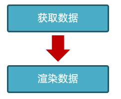

      

3. 获取数据的时候，需要给自己起一个外号，为什么需要给自己起一个外号呢？

   * 我们所有人数据都来自同一个服务器上，为了区分每个同学不同的数据，需要大家设置一个外号告诉服务器，服务器就会返回你对应的图书数据了

   

4. 核心代码如下：

   > 因为默认展示列表，新增，修改，删除后都要重新获取并刷新列表，所以把获取数据渲染数据的代码封装在一个函数内，方便复用

   ```js
   /**
    * 目标1：渲染图书列表
    *  1.1 获取数据
    *  1.2 渲染数据
    */
   const creator = '老张'
   // 封装-获取并渲染图书列表函数
   function getBooksList() {
     // 1.1 获取数据
     axios({
       url: 'http://hmajax.itheima.net/api/books',
       params: {
         // 外号：获取对应数据
         creator
       }
     }).then(result => {
       // console.log(result)
       const bookList = result.data.data
       // console.log(bookList)
       // 1.2 渲染数据
       const htmlStr = bookList.map((item, index) => {
         return `<tr>
         <td>${index + 1}</td>
         <td>${item.bookname}</td>
         <td>${item.author}</td>
         <td>${item.publisher}</td>
         <td data-id=${item.id}>
           <span class="del">删除</span>
           <span class="edit">编辑</span>
         </td>
       </tr>`
       }).join('')
       // console.log(htmlStr)
       document.querySelector('.list').innerHTML = htmlStr
     })
   }
   // 网页加载运行，获取并渲染列表一次
   getBooksList()
   ```

   

   


### 小结

1. 渲染数据列表的2个步骤是什么？

   <details>
   <summary>答案</summary>
   <ul>
   <li>获取数据，分析结构渲染到页面上</li>
   </ul>
   </details>


## 05.案例_图书管理\_新增图书

### 目标

完成图书管理案例-新增图书需求


### 讲解

1. 需求：点击添加按钮，出现准备好的新增图书弹框，填写图书信息提交到服务器保存，并更新图书列表

   

   

2. 步骤：

   1. 新增弹框（控制显示和隐藏）（基于 Bootstrap 弹框和准备好的表单-用属性和 JS 方式控制）

   2. 在点击保存按钮时，收集数据&提交保存

   3. 刷新-图书列表）（重新调用下之前封装的获取并渲染列表的函数）

      

3. 核心代码如下：

   ```js
   /**
    * 目标2：新增图书
    *  2.1 新增弹框->显示和隐藏
    *  2.2 收集表单数据，并提交到服务器保存
    *  2.3 刷新图书列表
    */
   // 2.1 创建弹框对象
   const addModalDom = document.querySelector('.add-modal')
   const addModal = new bootstrap.Modal(addModalDom)
   // 保存按钮->点击->隐藏弹框
   document.querySelector('.add-btn').addEventListener('click', () => {
     // 2.2 收集表单数据，并提交到服务器保存
     const addForm = document.querySelector('.add-form')
     const bookObj = serialize(addForm, { hash: true, empty: true })
     // console.log(bookObj)
     // 提交到服务器
     axios({
       url: 'http://hmajax.itheima.net/api/books',
       method: 'POST',
       data: {
         ...bookObj,
         creator
       }
     }).then(result => {
       // console.log(result)
       // 2.3 添加成功后，重新请求并渲染图书列表
       getBooksList()
       // 重置表单
       addForm.reset()
       // 隐藏弹框
       addModal.hide()
     })
   })
   ```

   


### 小结

1. 新增数据的3个步骤是什么？

   <details>
   <summary>答案</summary>
   <ul>
   <li>准备好数据标签和样式，然后收集表单数据提交保存，刷新列表</li>
   </ul>
   </details>


## 06.案例_图书管理\_删除图书

### 目标

完成图书管理案例-删除图书需求


### 讲解

1. 需求：点击图书删除元素，删除当前图书数据

   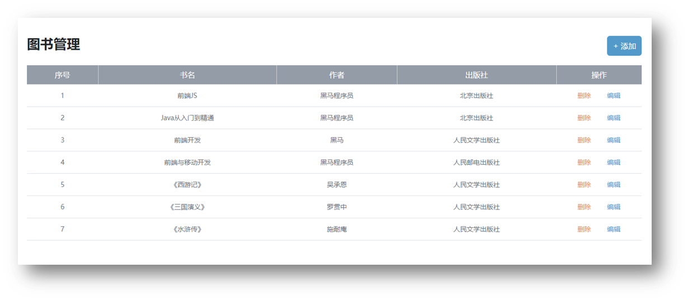
   
   

2. 步骤：

   1. 给删除元素，绑定点击事件（事件委托方式并判断点击的是删除元素才走删除逻辑代码），并获取到要删除的数据id
   2. 基于 axios 和接口文档，调用删除接口，让服务器删除这条数据
   3. 重新获取并刷新图书列表

      


3. 核心代码如下：

   ```js
   /**
    * 目标3：删除图书
    *  3.1 删除元素绑定点击事件->获取图书id
    *  3.2 调用删除接口
    *  3.3 刷新图书列表
    */
   // 3.1 删除元素->点击（事件委托）
   document.querySelector('.list').addEventListener('click', e => {
     // 获取触发事件目标元素
     // console.log(e.target)
     // 判断点击的是删除元素
     if (e.target.classList.contains('del')) {
       // console.log('点击删除元素')
       // 获取图书id（自定义属性id）
       const theId = e.target.parentNode.dataset.id
       // console.log(theId)
       // 3.2 调用删除接口
       axios({
         url: `http://hmajax.itheima.net/api/books/${theId}`,
         method: 'DELETE'
       }).then(() => {
         // 3.3 刷新图书列表
         getBooksList()
       })
     }
   })
   ```

   


### 小结

1. 删除数据的步骤是什么？

   <details>
   <summary>答案</summary>
   <ul>
   <li>告知服务器要删除的数据id，服务器删除后，重新获取并刷新列表</li>
   </ul>
   </details>


## 07-09.案例_图书管理\_编辑图书

### 目标

完成图书管理案例-编辑图书需求


### 讲解

1. 因为编辑图书要做回显等，比较复杂，所以分了3个视频来讲解

2. 需求：完成编辑图书回显当前图书数据到编辑表单，在用户点击修改按钮，收集数据提交到服务器保存，并刷新列表

   

3. 编辑数据的核心思路：

   1. 给编辑元素，绑定点击事件（事件委托方式并判断点击的是编辑元素才走编辑逻辑代码），并获取到要编辑的数据id
   2. 基于 axios 和接口文档，调用查询图书详情接口，获取正在编辑的图书数据，并回显到表单中（页面上的数据是在用户的浏览器中不够准备，所以只要是查看数据都要从服务器获取）

      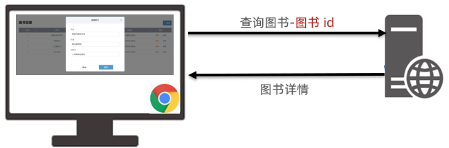
   3. 收集并提交保存修改数据，并重新从服务器获取列表刷新页面

      


4. 核心代码如下：

   ```js
   /**
    * 目标4：编辑图书
    *  4.1 编辑弹框->显示和隐藏
    *  4.2 获取当前编辑图书数据->回显到编辑表单中
    *  4.3 提交保存修改，并刷新列表
    */
   // 4.1 编辑弹框->显示和隐藏
   const editDom = document.querySelector('.edit-modal')
   const editModal = new bootstrap.Modal(editDom)
   // 编辑元素->点击->弹框显示
   document.querySelector('.list').addEventListener('click', e => {
     // 判断点击的是否为编辑元素
     if (e.target.classList.contains('edit')) {
       // 4.2 获取当前编辑图书数据->回显到编辑表单中
       const theId = e.target.parentNode.dataset.id
       axios({
         url: `http://hmajax.itheima.net/api/books/${theId}`
       }).then(result => {
         const bookObj = result.data.data
         // document.querySelector('.edit-form .bookname').value = bookObj.bookname
         // document.querySelector('.edit-form .author').value = bookObj.author
         // 数据对象“属性”和标签“类名”一致
         // 遍历数据对象，使用属性去获取对应的标签，快速赋值
         const keys = Object.keys(bookObj) // ['id', 'bookname', 'author', 'publisher']
         keys.forEach(key => {
           document.querySelector(`.edit-form .${key}`).value = bookObj[key]
         })
       })
       editModal.show()
     }
   })
   // 修改按钮->点击->隐藏弹框
   document.querySelector('.edit-btn').addEventListener('click', () => {
     // 4.3 提交保存修改，并刷新列表
     const editForm = document.querySelector('.edit-form')
     const { id, bookname, author, publisher } = serialize(editForm, { hash: true, empty: true})
     // 保存正在编辑的图书id，隐藏起来：无需让用户修改
     // <input type="hidden" class="id" name="id" value="84783">
     axios({
       url: `http://hmajax.itheima.net/api/books/${id}`,
       method: 'PUT',
       data: {
         bookname,
         author,
         publisher,
         creator
       }
     }).then(() => {
       // 修改成功以后，重新获取并刷新列表
       getBooksList()
   
       // 隐藏弹框
       editModal.hide()
     })
   })
   ```

   


### 小结

1. 编辑数据的步骤是什么？

   <details>
   <summary>答案</summary>
   <ul>
   <li>获取正在编辑数据并回显，收集编辑表单的数据提交保存，重新获取并刷新列表</li>
   </ul>
   </details>


## 10.案例_图书管理\_总结

### 目标

总结下增删改查的核心思路


### 讲解

1. 因为增删改查的业务在前端实际开发中非常常见，思路是可以通用的，所以总结下思路

   > 1.渲染列表（查）
   >
   > 2.新增图书（增）
   >
   > 3.删除图书（删）
   >
   > 4.编辑图书（改）

   

2. 渲染数据（查）

   > 核心思路：获取数据 -> 渲染数据

   ```js
   // 1.1 获取数据
   axios({...}).then(result => {
     const bookList = result.data.data
     // 1.2 渲染数据
     const htmlStr = bookList.map((item, index) => {
       return `<tr>
       <td>${index + 1}</td>
       <td>${item.bookname}</td>
       <td>${item.author}</td>
       <td>${item.publisher}</td>
       <td data-id=${item.id}>
         <span class="del">删除</span>
         <span class="edit">编辑</span>
       </td>
     </tr>`
     }).join('')
     document.querySelector('.list').innerHTML = htmlStr
   })
   ```

   

3. 新增数据（增）

   > 核心思路：准备页面标签 -> 收集数据提交（必须） -> 刷新页面列表（可选）

   ```js
   // 2.1 创建弹框对象
   const addModalDom = document.querySelector('.add-modal')
   const addModal = new bootstrap.Modal(addModalDom)
   document.querySelector('.add-btn').addEventListener('click', () => {
     // 2.2 收集表单数据，并提交到服务器保存
     const addForm = document.querySelector('.add-form')
     const bookObj = serialize(addForm, { hash: true, empty: true })
     axios({...}).then(result => {
       // 2.3 添加成功后，重新请求并渲染图书列表
       getBooksList()
       addForm.reset()
       addModal.hide()
     })
   })
   ```

   

   


4. 删除图书（删）

   > 核心思路：绑定点击事件（获取要删除的图书唯一标识） -> 调用删除接口（让服务器删除此数据） -> 成功后重新获取并刷新列表

   ```js
   // 3.1 删除元素->点击（事件委托）
   document.querySelector('.list').addEventListener('click', e => {
     if (e.target.classList.contains('del')) {
       // 获取图书id（自定义属性id）
       const theId = e.target.parentNode.dataset.id
       // 3.2 调用删除接口
       axios({...}).then(() => {
         // 3.3 刷新图书列表
         getBooksList()
       })
     }
   })
   ```

   

5. 编辑图书（改）

   > 核心思路：准备编辑图书表单 -> 表单回显正在编辑的数据 -> 点击修改收集数据 -> 提交到服务器保存 -> 重新获取并刷新列表

   ```js
   // 4.1 编辑弹框->显示和隐藏
   const editDom = document.querySelector('.edit-modal')
   const editModal = new bootstrap.Modal(editDom)
   document.querySelector('.list').addEventListener('click', e => {
     if (e.target.classList.contains('edit')) {
       // 4.2 获取当前编辑图书数据->回显到编辑表单中
       const theId = e.target.parentNode.dataset.id
       axios({...}).then(result => {
         const bookObj = result.data.data
         // 遍历数据对象，使用属性去获取对应的标签，快速赋值
         const keys = Object.keys(bookObj) 
         keys.forEach(key => {
           document.querySelector(`.edit-form .${key}`).value = bookObj[key]
         })
       })
       editModal.show()
     }
   })
   
   document.querySelector('.edit-btn').addEventListener('click', () => {
     // 4.3 提交保存修改，并刷新列表
     const editForm = document.querySelector('.edit-form')
     const { id, bookname, author, publisher } = serialize(editForm, { hash: true, empty: true})
     // 保存正在编辑的图书id，隐藏起来：无需让用户修改
     // <input type="hidden" class="id" name="id" value="84783">
     axios({...}).then(() => {
       getBooksList()
       editModal.hide()
     })
   })
   ```

   

   


### 小结

1. 学完图书管理案例，我们收货了什么？

   <details>
   <summary>答案</summary>
   <ul>
   <li>现在编辑的虽然是图书数据，以后编辑其他数据，再做增删改查都是差不多的思路</li>
   </ul>
   </details>


## 11.图片上传

### 目标

把本地图片上传到网页上显示


### 讲解

1. 什么是图片上传？
   * 就是把本地的图片上传到网页上显示
2. 图片上传怎么做？
   * 先依靠文件选择元素获取用户选择的本地文件，接着提交到服务器保存，服务器会返回图片的 url 网址，然后把网址加载到 img 标签的 src 属性中即可显示
3. 为什么不直接显示到浏览器上，要放到服务器上呢？
   * 因为浏览器保存是临时的，如果你想随时随地访问图片，需要上传到服务器上
4. 图片上传怎么做呢？
   1. 先获取图片文件对象
   2. 使用 FormData 表单数据对象装入（因为图片是文件而不是以前的数字和字符串了所以传递文件一般需要放入 FormData 以键值对-文件流的数据传递（可以查看请求体-确认请求体结构）

      ```js
      const fd = new FormData()
      fd.append(参数名, 值)
      ```
   3. 提交表单数据对象，使用服务器返回图片 url 网址
5. 核心代码如下：

   ```html
   <!DOCTYPE html>
   <html lang="en">
   
   <head>
     <meta charset="UTF-8">
     <meta http-equiv="X-UA-Compatible" content="IE=edge">
     <meta name="viewport" content="width=device-width, initial-scale=1.0">
     <title>图片上传</title>
   </head>
   
   <body>
     <!-- 文件选择元素 -->
     <input type="file" class="upload">
     
   
     <script src="https://cdn.jsdelivr.net/npm/axios/dist/axios.min.js"></script>
     <script>
       /**
        * 目标：图片上传，显示到网页上
        *  1. 获取图片文件
        *  2. 使用 FormData 携带图片文件
        *  3. 提交到服务器，获取图片url网址使用
       */
       // 文件选择元素->change改变事件
       document.querySelector('.upload').addEventListener('change', e => {
         // 1. 获取图片文件
         console.log(e.target.files[0])
         // 2. 使用 FormData 携带图片文件
         const fd = new FormData()
         fd.append('img', e.target.files[0])
         // 3. 提交到服务器，获取图片url网址使用
         axios({
           url: 'http://hmajax.itheima.net/api/uploadimg',
           method: 'POST',
           data: fd
         }).then(result => {
           console.log(result)
           // 取出图片url网址，用img标签加载显示
           const imgUrl = result.data.data.url
           document.querySelector('.my-img').src = imgUrl
         })
       })
     </script>
   </body>
   
   </html>
   ```

   


### 小结

1. 图片上传的思路是什么？

   <details>
   <summary>答案</summary>
   <ul>
   <li>先用文件选择元素，获取到文件对象，然后装入 FormData 表单对象中，再发给服务器，得到图片在服务器的 URL 网址，再通过 img 标签加载图片显示</li>
   </ul>
   </details>


## 12.案例_网站-更换背景图

### 目标

实现更换网站背景图的效果


### 讲解

1. 需求：先运行备课代码，查看要完成的效果，点击右上角选择本机中提供的素材图片，更换网站背景图

   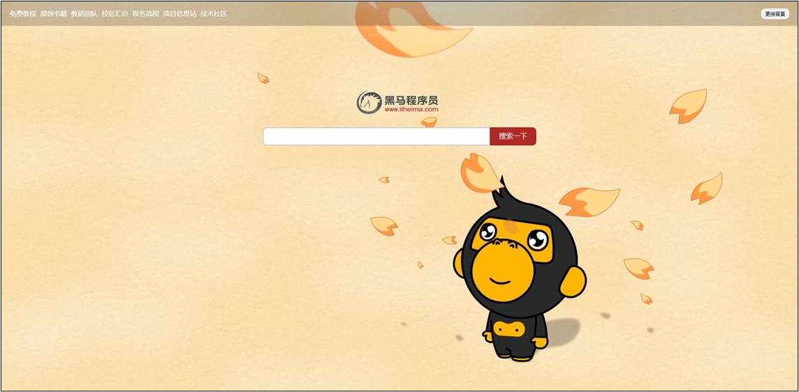
2. 网站更换背景图如何实现呢，并且保证刷新后背景图还在？具体步骤：
   1. 先获取到用户选择的背景图片，上传并把服务器返回的图片 url 网址设置给 body 背景
   2. 上传成功时，保存图片 url 网址到 localStorage 中
   3. 网页运行后，获取 localStorage 中的图片的 url 网址使用（并判断本地有图片 url 网址字符串才设置）
3. 核心代码如下：

   ```js
   /**
    * 目标：网站-更换背景
    *  1. 选择图片上传，设置body背景
    *  2. 上传成功时，"保存"图片url网址
    *  3. 网页运行后，"获取"url网址使用
    * */
   document.querySelector('.bg-ipt').addEventListener('change', e => {
     // 1. 选择图片上传，设置body背景
     console.log(e.target.files[0])
     const fd = new FormData()
     fd.append('img', e.target.files[0])
     axios({
       url: 'http://hmajax.itheima.net/api/uploadimg',
       method: 'POST',
       data: fd
     }).then(result => {
       const imgUrl = result.data.data.url
       document.body.style.backgroundImage = `url(${imgUrl})`
   
       // 2. 上传成功时，"保存"图片url网址
       localStorage.setItem('bgImg', imgUrl)
     })
   })
   
   // 3. 网页运行后，"获取"url网址使用
   const bgUrl = localStorage.getItem('bgImg')
   console.log(bgUrl)
   bgUrl && (document.body.style.backgroundImage = `url(${bgUrl})`)
   ```

   


### 小结

1. localStorage 取值和赋值的语法分别是什么？

   <details>
   <summary>答案</summary>
   <ul>
   <li>localStorage.getItem('key')是取值，localStorage.setItem('key', 'value')是赋值</li>
   </ul>
   </details>


## 13.案例_个人信息设置-介绍

### 目标

介绍个人信息设置案例-需要完成哪些效果，分几个视频讲解


### 讲解

1. 需求：先运行备课代码，查看要完成的效果

   
2. 本视频分为，信息回显 + 头像修改 + 信息修改+ 提示框反馈 4 部分
   1. 先完成信息回显
   2. 再做头像修改-立刻就更新给此用户
   3. 收集个人信息表单-提交保存
   4. 提交后反馈结果给用户（提示框）


### 小结

暂无


## 14.案例_个人信息设置-信息渲染

### 目标

把外号对应的用户信息渲染到页面上


### 讲解

1. 需求：把外号对应的个人信息和头像，渲染到页面表单和头像标签上。

   
2. 注意：还是需要准备一个外号，因为想要查看自己对应的用户信息，不想被别人影响
3. 步骤：
   * 获取数据
   * 渲染数据到页面

4. 代码如下：

   ```js
   /**
    * 目标1：信息渲染
    *  1.1 获取用户的数据
    *  1.2 回显数据到标签上
    * */
   const creator = '播仔'
   // 1.1 获取用户的数据
   axios({
     url: 'http://hmajax.itheima.net/api/settings',
     params: {
       creator
     }
   }).then(result => {
     const userObj = result.data.data
     // 1.2 回显数据到标签上
     Object.keys(userObj).forEach(key => {
       if (key === 'avatar') {
         // 赋予默认头像
         document.querySelector('.prew').src = userObj[key]
       } else if (key === 'gender') {
         // 赋予默认性别
         // 获取性别单选框：[男radio元素，女radio元素]
         const gRadioList = document.querySelectorAll('.gender')
         // 获取性别数字：0男，1女
         const gNum = userObj[key]
         // 通过性别数字，作为下标，找到对应性别单选框，设置选中状态
         gRadioList[gNum].checked = true
       } else {
         // 赋予默认内容
         document.querySelector(`.${key}`).value = userObj[key]
       }
     })
   })
   ```

   


### 小结

1. 渲染数据和图书列表的渲染思路是否一样呢，是什么？

   <details>
   <summary>答案</summary>
   <ul>
   <li>一样的，都是获取到数据，然后渲染到页面上</li>
   </ul>
   </details>


## 15.案例_个人信息设置-头像修改

### 目标

修改用户的头像并立刻生效


### 讲解

1. 需求：点击修改用户头像

   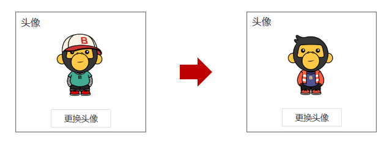
2. 实现步骤如下：

   1. 获取到用户选择的头像文件
   2. 调用头像修改接口，并除了头像文件外，还要在 FormData 表单数据对象中携带外号
   3. 提交到服务器保存此用户对应头像文件，并把返回的头像图片 url 网址设置在页面上

      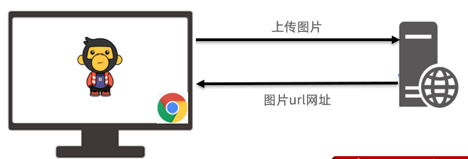
3. 注意：重新刷新重新获取，已经是修改后的头像了（证明服务器那边确实保存成功）
4. 核心代码：

   ```js
   /**
    * 目标2：修改头像
    *  2.1 获取头像文件
    *  2.2 提交服务器并更新头像
    * */
   // 文件选择元素->change事件
   document.querySelector('.upload').addEventListener('change', e => {
     // 2.1 获取头像文件
     console.log(e.target.files[0])
     const fd = new FormData()
     fd.append('avatar', e.target.files[0])
     fd.append('creator', creator)
     // 2.2 提交服务器并更新头像
     axios({
       url: 'http://hmajax.itheima.net/api/avatar',
       method: 'PUT',
       data: fd
     }).then(result => {
       const imgUrl = result.data.data.avatar
       // 把新的头像回显到页面上
       document.querySelector('.prew').src = imgUrl
     })
   })
   ```

   


### 小结

1. 为什么这次上传头像，需要携带外号呢？

   <details>
   <summary>答案</summary>
   <ul>
   <li>因为这次头像到后端，是要保存在某个用户名下的，所以要把外号名字一起携带过去</li>
   </ul>
   </details>


## 16.案例_个人信息设置-信息修改

### 目标

把用户修改的信息提交到服务器保存


### 讲解

1. 需求：点击提交按钮，收集个人信息，提交到服务器保存（无需重新获取刷新，因为页面已经是最新的数据了）
   1. 收集表单数据

   2. 提交到服务器保存-调用用户信息更新接口（注意请求方法是 PUT）代表数据更新的意思

      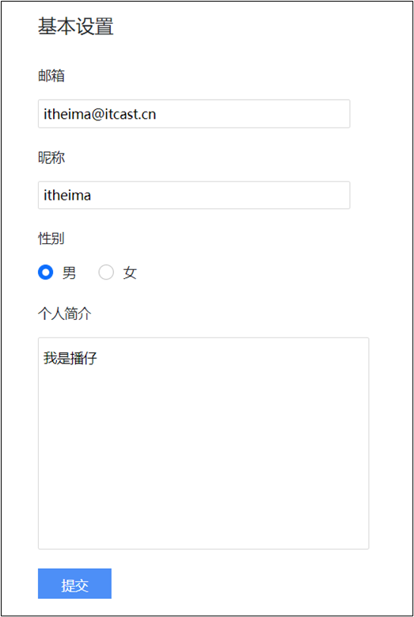

2. 核心代码如下：

   ```js
   /**
    * 目标3：提交表单
    *  3.1 收集表单信息
    *  3.2 提交到服务器保存
    */
   // 保存修改->点击
   document.querySelector('.submit').addEventListener('click', () => {
     // 3.1 收集表单信息
     const userForm = document.querySelector('.user-form')
     const userObj = serialize(userForm, { hash: true, empty: true })
     userObj.creator = creator
     // 性别数字字符串，转成数字类型
     userObj.gender = +userObj.gender
     console.log(userObj)
     // 3.2 提交到服务器保存
     axios({
       url: 'http://hmajax.itheima.net/api/settings',
       method: 'PUT',
       data: userObj
     }).then(result => {
     })
   })
   ```

   


### 小结

1. 信息修改数据和以前增删改查哪个实现的思路比较接近呢？

   <details>
   <summary>答案</summary>
   <ul>
   <li>编辑，首先回显已经做完了，然后收集用户最新改动后的数据，提交到服务器保存，因为页面最终就是用户刚写的数据，所以不用重新获取并刷新页面了</li>
   </ul>
   </details>


## 17.案例_个人信息设置-提示框

### 目标

把用户更新个人信息结果，用提示框反馈给用户


### 讲解

1. 需求：使用 bootstrap 提示框，提示个人信息设置后的结果

   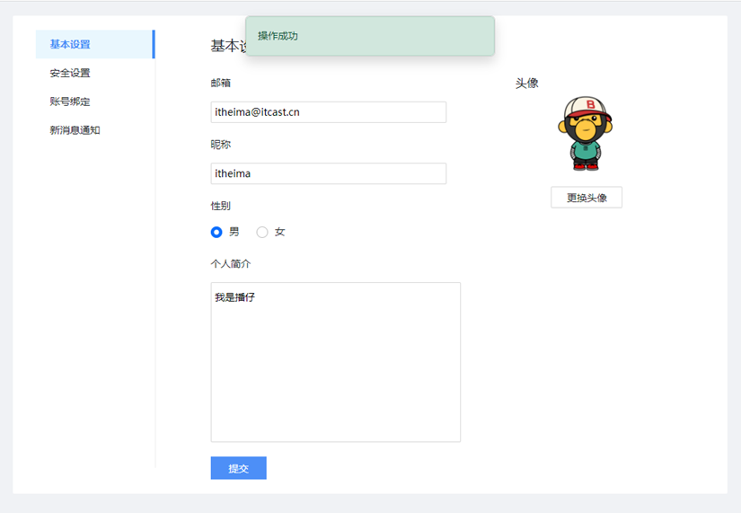

2. bootstrap 的 toast 提示框和 modal 弹框使用很像，语法如下：

   1. 先准备对应的标签结构（模板里已有）

   2. 设置延迟自动消失的时间

      ```html
      <div class="toast" data-bs-delay="1500">
        提示框内容
      </div>
      ```

   3. 使用 JS 的方式，在 axios 请求响应成功时，展示结果

      ```js
      // 创建提示框对象
      const toastDom = document.querySelector('css选择器')
      const toast = new bootstrap.Toast(toastDom)
      
      // 显示提示框
      toast.show()
      ```

      

3. 核心代码：

   ```js
   /**
    * 目标3：提交表单
    *  3.1 收集表单信息
    *  3.2 提交到服务器保存
    */
   /**
    * 目标4：结果提示
    *  4.1 创建toast对象
    *  4.2 调用show方法->显示提示框
    */
   // 保存修改->点击
   document.querySelector('.submit').addEventListener('click', () => {
     // 3.1 收集表单信息
     const userForm = document.querySelector('.user-form')
     const userObj = serialize(userForm, { hash: true, empty: true })
     userObj.creator = creator
     // 性别数字字符串，转成数字类型
     userObj.gender = +userObj.gender
     console.log(userObj)
     // 3.2 提交到服务器保存
     axios({
       url: 'http://hmajax.itheima.net/api/settings',
       method: 'PUT',
       data: userObj
     }).then(result => {
       // 4.1 创建toast对象
       const toastDom = document.querySelector('.my-toast')
       const toast = new bootstrap.Toast(toastDom)
   
       // 4.2 调用show方法->显示提示框
       toast.show()
     })
   })
   ```

   


### 小结

1. bootstrap 弹框什么时候用 JS 方式控制显示呢？

   <details>
   <summary>答案</summary>
   <ul>
   <li>需要执行一些其他的 JS 逻辑后，再去显示/隐藏弹框时</li>
   </ul>
   </details>


## 今日重点(必须会)

1. 掌握增删改查数据的思路
2. 掌握图片上传的思路和流程
3. 理解调用接口时，携带外号的作用
4. 了解 bootstrap 弹框的使用


## 今日作业(必完成)

在配套作业文件夹的md内


## 参考文献

1. [表单概念->百度百科](https://baike.baidu.com/item/%E8%A1%A8%E5%8D%95)
2. [accept属性->mdn](https://developer.mozilla.org/zh-CN/docs/Web/HTTP/Content_negotiation/List_of_default_Accept_values)
3. [accept属性->菜鸟教程](https://www.runoob.com/tags/att-input-accept.html)
4. [FormData->mdn](https://developer.mozilla.org/zh-CN/docs/Web/API/FormData)
5. [BS的Model文档](https://v5.bootcss.com/docs/components/modal/#passing-options)
6. [axios请求方式别名](https://www.axios-http.cn/docs/api_intro)