# 黑马头条-数据管理平台

## 01.Git 初识

1. [概念](https://developer.mozilla.org/zh-CN/docs/Glossary/Git)：一个免费开源，分布式的代码版本控制系统，帮助开发团队维护代码

2. 作用：记录代码内容，切换代码版本，多人开发时高效合并代码内容

3. 如何学：

   个人本机使用：Git 基础命令和概念

   多人共享使用：团队开发同一个项目的代码版本管理

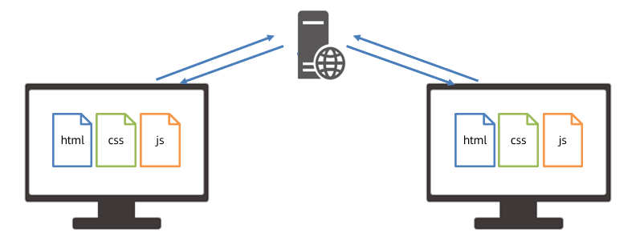

[Windows](https://git-scm.com/)[系统](https://git-scm.com/)：exe 程序，默认下一步即可

Mac系统：dmg 程序，默认下一步即可

检验成功：

1.打开 bash 终端（git 专用）

2.命令：git -v（查看版本号）

配置：用户名和邮箱，应用在每次提交代码版本时表明自己身份

命令：

git config --global user.name "itheima"

git config --global user.email "itheima@itcast.cn"

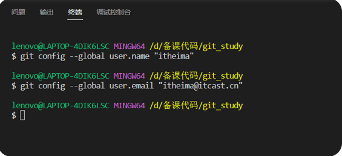

1.为何学习 Git ？

ü 管理代码版本，记录，切换，合并代码

2.Git 学习：

ü 现在本机自己使用

ü 再学习多人共享使用

3.如何安装使用？

ü 程序双击安装

ü 在 VSCode 中使用 bash 终端以及 git 命令

## 02.Git 仓库

Git 仓库（repository）：记录文件状态内容的地方，存储着修改的历史记录

创建：

1.把本地文件夹转换成 Git 仓库：命令 git init

2.从其他服务器上克隆 Git 仓库

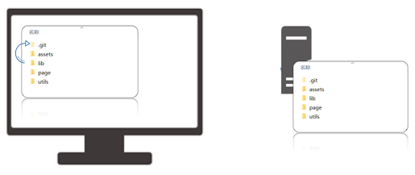

需求：创建一个空白的 Git 仓库

1.什么是 Git 仓库 ？

ü 记录文件状态内容和历史记录的地方（.git 文件夹）

2.如何创建 Git 仓库？

ü 把本地文件夹转换成 Git 仓库：命令 git init

ü 从其他服务器上克隆 Git 仓库

## 03.Git 的三个区域

Git 使用时：

工作区：实际开发时操作的文件夹

暂存区：保存之前的准备区域（暂存改动过的文件）

版本库：提交并保存暂存区中的内容，产生一个版本快照

| **命令**                 | **作用**                 |
| ------------------------ | ------------------------ |
| git add 文件名           | 暂存指定文件             |
| git add .                | 暂存所有改动的文件       |
| git commit -m "注释说明" | 提交并保存，产生版本快照 |

需求：把登录页面新增后，暂存并提交

1.Git 使用时有哪些区域 ？

ü 工作区，暂存区，版本库

2.工作区的内容，最终要如何保存在版本库中？

ü git add 添加到暂存区

ü等待时机后 git commit 提交保存到版本库，产生一次版本快照记录

## 04.Git 文件状态

Git 文件 2 种状态：

ü未跟踪：新文件，从未被 Git 管理过

ü已跟踪：Git 已经知道和管理的文件

| **文件状态** | **概念**          | **场景**             |
| ------------ | ----------------- | -------------------- |
| 未跟踪（U）  | 从未被 Git 管理过 | 新文件               |
| 新添加（A）  | 第一次被 Git 暂存 | 之前版本记录无此文件 |
| 未修改（''） | 三个区域统一      | 提交保存后           |
| 已修改（M）  | 工作区内容变化    | 修改了内容产生       |

使用：修改文件，暂存，提交保存记录，如此反复

需求：新增 css 文件，并使用 git status -s 查看文件状态，并最终提交

第一列是暂存区状态

第二列是工作区状态

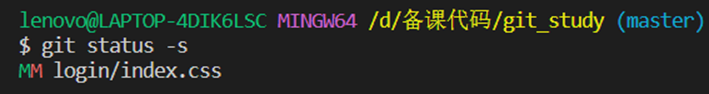

1.Git 文件状态分为哪 2 种 ？

ü 未跟踪和已跟踪（新添加，未修改，已修改）

2.如何查看暂存区和工作区文件状态？

ü git status -s

## 05.Git 暂存区作用

暂存区：暂时存储，可以临时恢复代码内容，与版本库解耦

暂存区 -> 覆盖 -> 工作区，命令：git restore 目标文件（注意：完全确认覆盖时使用）

从暂存区移除文件，命令：git rm --cached 目标文件

1.如何移除暂存区已暂存的文件？

ü git rm --cached 目标文件

## 06.练习-登录页面

需求：新增 JS 代码并暂存提交产生新的版本快照

步骤

1.新增 js 文件和内容

2.临时存放在暂存区

3.提交保存到版本库

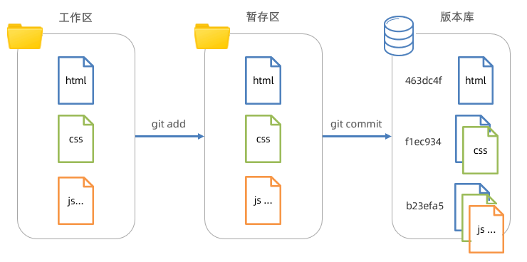

## 07.Git-切换版本

概念：把版本库某个版本对应的内容快照，恢复到工作区/暂存区

查看提交历史：git log --oneline 

回退命令：

git reset --soft 版本号（其他文件未跟踪）

git reset --hard 版本号

git reset --mixed 版本号 （与 git reset 等价）

注意1：只有记录在版本库的提交记录才能恢复

注意2：回退后，继续修改->暂存->提交操作即可（产生新的提交记录过程）

1.什么是 Git 回退版本？

ü 把版本库某个版本对应的内容快照，恢复到工作区/暂存区

2.强制覆盖暂存区和工作区的命令？

ü git reset --hard 版本号

3.如何查看提交历史？

ü git log --oneline 

ü git reflog --oneline

## 08.删除文件

需求：删除 editor.js 文件，并产生一次版本记录

步骤：

1.手动删除工作区文件

2.暂存变更/手动删除暂存区文件造成变更

3.提交保存

总结：

工作区只要改变，都可以暂存提交产生新记录

## 09.忽略文件

概念：.gitignore 文件可以让 git 彻底忽略跟踪指定文件

目的：让 git 仓库更小更快，避免重复无意义的文件管理

例如：

1.系统或软件自动生成的文件

2.编译产生的结果文件

3.运行时生成的日志文件，缓存文件，临时文件等

4.涉密文件，密码，秘钥等文件

创建：

1.项目根目录新建 .gitignore 文件

2.填入相应配置来忽略指定文件

注意：如果文件已经被暂存区跟踪过，可以从暂存区移除即可

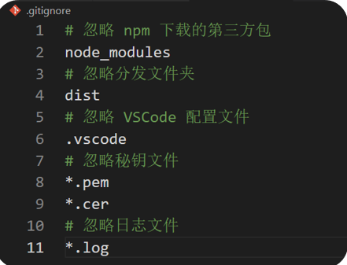

## 10.分支的概念

概念：本质上是指向提交节点的可变指针，默认名字是 master

注意：HEAD 指针影响工作区/暂存区的代码状态

场景：开发新需求 / 修复 Bug，保证主线代码随时可用，多人协同开发提高效率

例如：

在现有代码上创建新分支完成内容列表业务

突然需要紧急修复 Bug - 单独创建分支解决 Bug

需求：创建内容列表 content 分支，并产生 3 次提交记录

步骤：

1. 创建分支命令：git branch 分支名

2. 切换分支命令：git checkout 分支名

3. 工作区准备代码并暂存提交，重复 3 次

   

1.什么是 Git 分支？

ü 指针，指向提交记录

2.HEAD 指针的作用？

ü 影响暂存区和工作区的代码

3.如何创建和切换指针？

ü git branch 分支名

ü git checkout 分支名

## 11.练习-登录 bug 修复

需求：新建 login-bug 分支，做 2 次提交记录（对手机号长度，验证码长度做判断）

步骤：

1.切回到主分支：git checkout master

2.创建新分支：git branch login-bug

3.切换新分支：git checkout login-bug

4.修改代码，暂存，提交产生版本记录

## 12.分支-合并与删除

需求：把 login-bug 合并回到 master 分支并删除 login-bug 分支

步骤：

1.切回到要合入的分支上：git checkout master

2.合并其他分支过来：git merge login-bug

3.删除合并后的分支指针：git branch -d login-bug

## 13.分支-合并与提交

合并提交：发生于原分支产生了新的提交记录后，再合并回去时发生，自动使用多个快照记录合并后产生一次新的提交

步骤：

1.切回到要合入的分支上：git checkout master

2.合并其他分支过来：git merge content

3.删除合并后的分支：git branch -d content

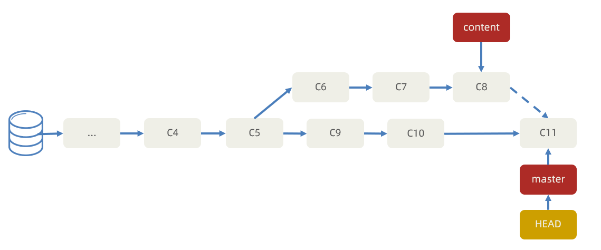

最后合并回到主分支上时，提交记录流程图：

注意：提交记录的顺序按照产生的先后顺序排列，而非合并的先后顺序

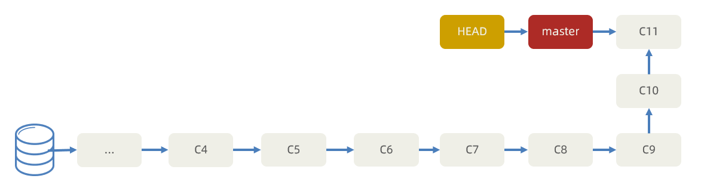

## 14.分支-合并冲突

需求1：基于 master 新建 publish 分支，完成发布文章业务，然后修改内容页面的 html 文件的 title 标签，并提交一次

需求2：切换到 master，也在修改内容页面的 html 文件的 title 标签，并提交一次

冲突：把 publish 分支合并到 master 回来，产生合并冲突

概念：不同分支中，对同一个文件的同一部分修改，Git 无法干净的合并，产生合并冲突

解决：

1.打开 VSCode 找到冲突文件并手动解决

2.解决后需要提交一次记录

避免：（多交流）

1.按页面划分不同分支开发

2.公共代码在统一文件夹维护

3.Node等软件版本统一，npm 包统一下载

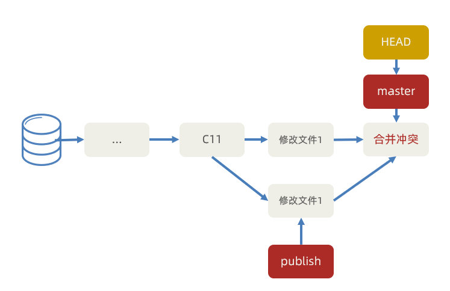

## 15.Git 常用命令

| **命令**                 | **作用**                | **注意**                               |
| ------------------------ | ----------------------- | -------------------------------------- |
| git -v                   | 查看 git 版本           |                                        |
| git init                 | 初始化 git 仓库         |                                        |
| git add 文件标识         | 暂存某个文件            | 文件标识以终端为起始的相对路径         |
| git add .                | 暂存所有文件            |                                        |
| git commit -m '说明注释' | 提交产生版本记录        | 每次提交，把暂存区内容快照一份         |
| git status               | 查看文件状态 - 详细信息 |                                        |
| git status -s            | 查看文件状态 - 简略信息 | 第一列是暂存区状态，第二列是工作区状态 |
| git ls-files             | 查看暂存区文件列表      |                                        |
| git restore 文件标识     | 从暂存区恢复到工作区    | 如果文件标识为 . 则恢复所有文件        |
| git rm --cached 文件标识 | 从暂存区移除文件        | 不让 git 跟踪文件变化                  |
| git log                  | 查看提交记录 - 详细信息 |                                        |
| git log --oneline        | 查看提交记录 - 简略信息 | 版本号 分支指针 提交时说明注释         |

| **命令**               | **作用**                             | **注意**                                                     |
| ---------------------- | ------------------------------------ | ------------------------------------------------------------ |
| git reflog --oneline   | 查看完整历史 - 简略消息              | 包括提交，切换，回退等所有记录                               |
| git reset 版本号       | 切换版本代码到暂存区和工作区         | --soft 模式保留暂存区和工作区原本内容  --hard 模式不保留暂存区和工作区原本内容  --mixed 模式不保留暂存区，工作区保留（默认）  先覆盖到暂存区，再用暂存区对比覆盖工作区 |
| git branch 分支名      | 创建分支                             |                                                              |
| git branch             | 查看本地分支                         |                                                              |
| git branch -d 分支名   | 删除分支                             | 请确保记录已经合并到别的分支下，再删除分支                   |
| git checkout 分支名    | 切换分支                             |                                                              |
| git checkout -b 分支名 | 创建并立刻切换分支                   |                                                              |
| git merge 分支名       | 把分支提交历史记录合并到当前所在分支 |                                                              |
|                        |                                      |                                                              |

## 16.Git 远程仓库

概念：托管在因特网或其他网络中的你的项目的版本库

作用：保存版本库的历史记录，多人协作

创建：公司自己服务器 / 第三方托管平台（Gitee，GitLab，GitHub...）

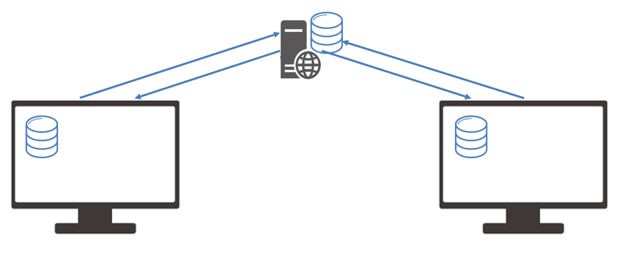

需求：创建远程版本库，并把本地 Git 仓库推送上去保存

步骤：

1.注册第三方托管平台网站账号

2.新建仓库得到远程仓库 Git 地址

3.本地 Git 仓库添加远程仓库原点地址

命令：git remote add 远程仓库别名 远程仓库地址

例如：git remote add origin https://gitee.com/lidongxu/work.git

4.本地 Git 仓库推送版本记录到远程仓库

命令：git push -u 远程仓库别名 本地和远程分支名

例如：git push -u origin master

完整写法：git push --set-upstream origin master:master

1.远程版本库的作用？

ü 保存提交历史记录，多人共享

2.远程版本库使用步骤？

ü 创建远程版本库（自己服务器/第三方托管平台）

ü 本地版本库设置远程地址

ü 推送本地版本库到远程

3.推送的命令？

ü git push -u origin master

## 17.Git 远程仓库 - 克隆

克隆：拷贝一个 Git 仓库到本地，进行使用

命令：git clone 远程仓库地址，例如：git clone https://gitee.com/lidongxu/work.git

效果：在运行命令所在文件夹，生成 work 项目文件夹（包含版本库，并映射到暂存区和工作区）

注意1：Git 本地仓库已经建立好和远程仓库的链接

注意2：仓库公开随意克隆，推送需要身为仓库团队成员

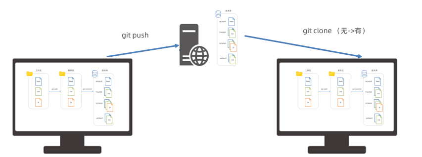

## 18.多人协同开发

需求：小传新代码共享给小智

步骤：

1.小传开发代码 -> 工作区 -> 暂存区 -> 提交 -> 拉取（可选）-> 推送

2.小智 -> 拉取（后续也可以开发代码 -> ... -> 推送）

3.想要看到别人同步上去的最新内容：git pull origin master 等价于 

git fetch origin master:master（获取远程分支记录到本地，未合并）

git merge origin/master (把远程分支记录合并到所在分支下）

## 19.VSCode 中使用 Git

使用：源代码管理，进行暂存，撤销，对比差异，提交等操作

注意：VSCode 打开的项目文件夹下需要有 .git 仓库

## 20.案例-发布黑马头条数据管理平台

需求：把 Webpack 压缩好的 dist 分发文件夹网页，部署到码云上，开启 Page 服务在互联网中浏览

步骤：

1.初始化本地 Git 仓库（这次是非空文件夹-配套素材 dist 文件夹）

2.初始化远程 Git 仓库（这一次也是非空的）

3.本地配置远程仓库链接

4.本地拉取合并一下（确认本地要包含远程内容时使用）

5.本地推送到远程 Git 仓库

6.开启 page 网页服务得到地址浏览

## 21.Git 常用命令

| **命令**                                 | **作用**         | **注意**                                                     |
| ---------------------------------------- | ---------------- | ------------------------------------------------------------ |
| git remote add 远程仓库别名 远程仓库地址 | 添加远程仓库地址 | 别名唯一，地址是 .git 结尾的网址                             |
| git remote -v                            | 查看远程仓库地址 |                                                              |
| git remote remove 远程仓库别名           | 删除远程仓库地址 |                                                              |
| git pull 远程仓库别名 分支名             | 拉取             | 完整写法：git pull 远程仓库别名 远程分支名:本地分支名  等价于：git fetch 和 git merge |
| git push 远程仓库别名 分支名             | 推送             | 完整写法：git push 远程仓库别名 本地分支名:远程分支名  -u：建立通道后以后可以简写 git push |
| git pull --rebase 远程仓库别名 分支名    | 拉取合并         | 合并没有关系的记录                                           |
| git clone 远程仓库地址                   | 克隆             | 从0得到一个远程的Git仓库到本地使用                           |
