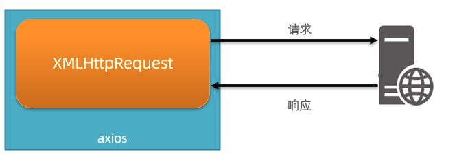
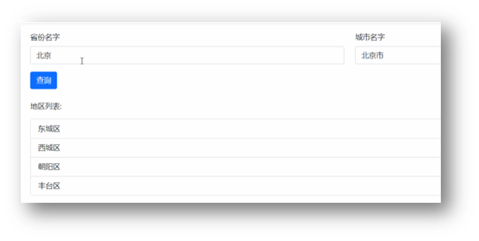
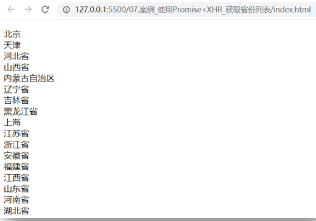

# Day03_AJAX原理


## 知识点自测

1. 以下哪个方法可以把 JS 数据类型转成 JSON 字符串类型?

   A. JSON.stringify()

   B. JSON.parse()

   <details>
   <summary>答案</summary>
   <ul>
   <li>选择A</li>
   </ul>
   </details>


2. 以下哪个方法，会延迟一段时间后，再执行函数体，并执行一次就停止?

   A. setTimeout(函数体, 毫秒值)

   B. setInterval(函数体, 毫秒值)

   <details>
   <summary>答案</summary>
   <ul>
   <li>选择A</li>
   </ul>
   </details>


3. 下面代码 result 结果是多少?

   ```js
   let obj = {
     status: 240
   }
   const result = obj.status >= 200 && obj.status < 300
   ```
   
   A. true
   
   B. 大于
   
   C. 240
   
   D. false
   
   <details>
   <summary>答案</summary>
   <ul>
   <li>选A</li>
   </ul>
   </details>


4. 下面代码运行结果是多少？

   ```js
   let result = 'http://www.baidu.com'
   result += '?a=10'
   result += '&b=20'
   ```
   
   A：'http://www.baidu.com'
   
   B：'?a=10'
   
   C：'&b=20'
   
   D：'http://www.baidu.com?a=10&b=20'
   
   <details>
   <summary>答案</summary>
   <ul>
   <li>选D</li>
   </ul>
   </details>


5. 哪个事件能实时检测到输入框值的变化？

   A：input 事件
   
   B：change 事件
   
   <details>
   <summary>答案</summary>
   <ul>
   <li>选A</li>
   </ul>
   </details>
   
   

## 目录

* XMLHttpRequest 的学习
* Promise 
* 封装简易版 axios
* 案例 - 天气预报


## 学习目标

1. 了解原生 AJAX 语法 - XMLHttpRequest（XHR）
2. 了解 Promise 的概念和使用
3. 了解 axios 内部工作的大概过程（XHR + Promise）
4. 案例 - 天气预报


## 01.XMLHttpRequest - 基础使用

### 目标

了解 AJAX 原理 XHR 的基础使用


### 讲解

1. AJAX 是浏览器与服务器通信的技术，采用 XMLHttpRequest 对象相关代码

2. axios 是对 XHR 相关代码进行了封装，让我们只关心传递的接口参数

3. 学习 XHR 也是了解 axios 内部与服务器交互过程的真正原理

   

4. 语法如下：

   ```js
   const xhr = new XMLHttpRequest()
   xhr.open('请求方法', '请求url网址')
   xhr.addEventListener('loadend', () => {
     // 响应结果
     console.log(xhr.response)
   })
   xhr.send()
   ```

   

   

5. 需求：以一个需求来体验下原生 XHR 语法，获取所有省份列表并展示到页面上

6. 代码如下：

   ```html
   <!DOCTYPE html>
   <html lang="en">
   
   <head>
     <meta charset="UTF-8">
     <meta http-equiv="X-UA-Compatible" content="IE=edge">
     <meta name="viewport" content="width=device-width, initial-scale=1.0">
     <title>XMLHttpRequest_基础使用</title>
   </head>
   
   <body>
     <p class="my-p"></p>
     <script>
       /**
        * 目标：使用XMLHttpRequest对象与服务器通信
        *  1. 创建 XMLHttpRequest 对象
        *  2. 配置请求方法和请求 url 地址
        *  3. 监听 loadend 事件，接收响应结果
        *  4. 发起请求
       */
       // 1. 创建 XMLHttpRequest 对象
       const xhr = new XMLHttpRequest()
   
       // 2. 配置请求方法和请求 url 地址
       xhr.open('GET', 'http://hmajax.itheima.net/api/province')
   
       // 3. 监听 loadend 事件，接收响应结果
       xhr.addEventListener('loadend', () => {
         console.log(xhr.response)
         const data = JSON.parse(xhr.response)
         console.log(data.list.join('<br>'))
         document.querySelector('.my-p').innerHTML = data.list.join('<br>')
       })
   
       // 4. 发起请求
       xhr.send()
     </script>
   </body>
   
   </html>
   ```

   


### 小结

1. AJAX 原理是什么?

   <details>
   <summary>答案</summary>
   <ul>
   <li>window 提供的 XMLHttpRequest</li>
   </ul>
   </details>

2. 为什么学习 XHR ？

   <details>
   <summary>答案</summary>
   <ul>
   <li>有更多与服务器数据通信方式</li>
   <li>了解 axios 内部原理</li>
   </ul>
   </details>

3. XHR 使用步骤？

   <details>
   <summary>答案</summary>
   <ul>
   <li>1. 创建 XHR 对象 2. 调用 open 方法，设置 url 和请求方法 3. 监听 loadend 事件，接收结果 4. 调用 send 方法，发起请求</li>
   </ul>
   </details>


## 02.XMLHttpRequest - 查询参数

### 目标

使用 XHR 传递查询参数给服务器，获取匹配数据


### 讲解

1. 什么是查询参数：携带额外信息给服务器，返回匹配想要的数据
2. 查询参数原理要携带的位置和语法：http://xxxx.com/xxx/xxx?参数名1=值1&参数名2=值2
3. 所以，原生 XHR 需要自己在 url 后面携带查询参数字符串，没有 axios 帮助我们把 params 参数拼接到 url 字符串后面了
4. 需求：查询河北省下属的城市列表

   
5. 核心代码如下：

   ```js
   /**
    * 目标：使用XHR携带查询参数，展示某个省下属的城市列表
   */
   const xhr = new XMLHttpRequest()
   xhr.open('GET', 'http://hmajax.itheima.net/api/city?pname=辽宁省')
   xhr.addEventListener('loadend', () => {
     console.log(xhr.response)
     const data = JSON.parse(xhr.response)
     console.log(data)
     document.querySelector('.city-p').innerHTML = data.list.join('<br>')
   })
   xhr.send()
   ```


### 小结

1. XHR 如何携带查询参数?

   <details>
   <summary>答案</summary>
   <ul>
   <li>在调用 open 方法的时候，在 url? 后面按照指定格式拼接参数名和值</li>
   </ul>
   </details>


## 03.案例 - 地区查询

### 目标

使用 XHR 完成案例地区查询


### 讲解

1. 需求：和我们之前做的类似，就是不用 axios 而是用 XHR 实现，输入省份和城市名字后，点击查询，传递多对查询参数并获取地区列表的需求

   

2. 但是多个查询参数，如果自己拼接很麻烦，这里用 URLSearchParams 把参数对象转成“参数名=值&参数名=值“格式的字符串，语法如下：

   ```js
   // 1. 创建 URLSearchParams 对象
   const paramsObj = new URLSearchParams({
     参数名1: 值1,
     参数名2: 值2
   })
   
   // 2. 生成指定格式查询参数字符串
   const queryString = paramsObj.toString()
   // 结果：参数名1=值1&参数名2=值2
   ```


### 小结

1. JS 对象如何转成查询参数格式字符串?

   <details>
   <summary>答案</summary>
   <ul>
   <li>在调用 open 方法的时候，在 url? 后面按照指定格式拼接参数名和值</li>
   </ul>
   </details>


## 04.XMLHttpRequest - 数据提交

### 目标

通过 XHR 提交用户名和密码，完成注册功能


### 讲解

1. 了解原生 XHR 进行数据提交的方式

2. 需求：通过 XHR 完成注册用户功能

   

3. 步骤和语法：

   1. 注意1：但是这次没有 axios 帮我们了，我们需要自己设置请求头 Content-Type：application/json，来告诉服务器端，我们发过去的内容类型是 JSON 字符串，让他转成对应数据结构取值使用

   2. 注意2：没有 axios 了，我们前端要传递的请求体数据，也没人帮我把 JS 对象转成 JSON 字符串了，需要我们自己转换

   3. 注意3：原生 XHR 需要在 send 方法调用时，传入请求体携带

      ```js
      const xhr = new XMLHttpRequest()
      xhr.open('请求方法', '请求url网址')
      xhr.addEventListener('loadend', () => {
        console.log(xhr.response)
      })
      
      // 1. 告诉服务器，我传递的内容类型，是 JSON 字符串
      xhr.setRequestHeader('Content-Type', 'application/json')
      // 2. 准备数据并转成 JSON 字符串
      const user = { username: 'itheima007', password: '7654321' }
      const userStr = JSON.stringify(user)
      // 3. 发送请求体数据
      xhr.send(userStr)
      ```


4. 核心代码如下：

   ```js
   /**
    * 目标：使用xhr进行数据提交-完成注册功能
   */
   document.querySelector('.reg-btn').addEventListener('click', () => {
     const xhr = new XMLHttpRequest()
     xhr.open('POST', 'http://hmajax.itheima.net/api/register')
     xhr.addEventListener('loadend', () => {
       console.log(xhr.response)
     })
   
     // 设置请求头-告诉服务器内容类型（JSON字符串）
     xhr.setRequestHeader('Content-Type', 'application/json')
     // 准备提交的数据
     const userObj = {
       username: 'itheima007',
       password: '7654321'
     }
     const userStr = JSON.stringify(userObj)
     // 设置请求体，发起请求
     xhr.send(userStr)
   })
   ```

   

### 小结

1. XHR 如何提交请求体数据?

   <details>
   <summary>答案</summary>
   <ul>
   <li>在 send 中携带请求体数据，要按照后端要求的内容类型携带</li>
   </ul>
   </details>


## 05.认识_Promise

### 目标

认识 Promise 的作用和好处以及使用步骤


### 讲解

1. 什么是 Promise ？

   * Promise 对象用于表示一个异步操作的最终完成（或失败）及其结构值

2. Promise 的好处是什么？

   * 逻辑更清晰（成功或失败会关联后续的处理函数）

   * 了解 axios 函数内部运作的机制

     

   * 能解决回调函数地狱问题（后面会讲到），今天先来看下它的基础使用

3. Promise 管理异步任务，语法怎么用？

   ```js
   // 1. 创建 Promise 对象
   const p = new Promise((resolve, reject) => {
    // 2. 执行异步任务-并传递结果
    // 成功调用: resolve(值) 触发 then() 执行
    // 失败调用: reject(值) 触发 catch() 执行
   })
   // 3. 接收结果
   p.then(result => {
    // 成功
   }).catch(error => {
    // 失败
   })
   ```

4. 示例代码：

   ```js
   /**
    * 目标：使用Promise管理异步任务
   */
   // 1. 创建Promise对象
   const p = new Promise((resolve, reject) => {
     // 2. 执行异步代码
     setTimeout(() => {
       // resolve('模拟AJAX请求-成功结果')
       reject(new Error('模拟AJAX请求-失败结果'))
     }, 2000)
   })
   
   // 3. 获取结果
   p.then(result => {
     console.log(result)
   }).catch(error => {
     console.log(error)
   })
   ```

   


### 小结

1. 什么是 Promise ?

   <details>
   <summary>答案</summary>
   <ul>
   <li>表示（管理）一个异步操作最终状态和结果值的对象</li>
   </ul>
   </details>

2. 为什么学习 Promise ?

   <details>
   <summary>答案</summary>
   <ul>
   <li>成功和失败状态，可以关联对应处理函数，了解 axios 内部运作的原理</li>
   </ul>
   </details>

3. Promise 使用步骤？

   <details>
   <summary>答案</summary>
   <ul>
   <li>1. new Promise 对象执行异步任务。2. 用 resolve 关联 then 的回调函数传递成功结果。3.用 reject 关联 catch 的回调函数传递失败结果。</li>
   </ul>
   </details>


## 06.认识_Promise 的状态

### 目标

认识 Promise 的三种状态，知道如何关联成功/失败的处理函数


### 讲解

1. 为什么要了解 Promise 的三种状态 ？

   * 知道 Promise 对象如何关联的处理函数，以及代码的执行顺序

2. Promise 有哪三种状态？

   > 每个 Promise 对象必定处于以下三种状态之一

   1. 待定（pending）：初始状态，既没有被兑现，也没有被拒绝
   2. 已兑现（fulfilled）：操作成功完成
   3. 已拒绝（rejected）：操作失败

   > 状态的英文字符串，可以理解为 Promise 对象内的字符串标识符，用于判断什么时候调用哪一个处理函数

3. Promise 的状态改变有什么用：调用对应函数，改变 Promise 对象状态后，内部触发对应回调函数传参并执行

   

4. 注意：每个 Promise 对象一旦被兑现/拒绝，那就是已敲定了，状态无法再被改变


### 小结

1. Promise 对象有哪 3 种状态?

   <details>
   <summary>答案</summary>
   <ul>
   <li>待定 pending，已兑现 fulfilled，已拒绝 rejected</li>
   </ul>
   </details>

2. Promise 状态有什么用?

   <details>
   <summary>答案</summary>
   <ul>
   <li>状态改变后，如何关联处理函数</li>
   </ul>
   </details>


## 07.使用 Promise 和 XHR_获取省份列表

### 目标

尝试用 Promise 管理 XHR 异步任务


### 讲解

1. Promise 和 XHR 都已经学过基础语法了，我们可以来结合使用一下了

2. 需求：使用 Promise 和 XHR 请求省份列表数据并展示到页面上

   

3. 步骤：

   1. 创建 Promise 对象

   2. 执行 XHR 异步代码，获取省份列表数据

   3. 关联成功或失败回调函数，做后续的处理

      > 错误情况：用地址错了404演示

4. 核心代码如下：

   ```js
   /**
    * 目标：使用Promise管理XHR请求省份列表
    *  1. 创建Promise对象
    *  2. 执行XHR异步代码，获取省份列表
    *  3. 关联成功或失败函数，做后续处理
   */
   // 1. 创建Promise对象
   const p = new Promise((resolve, reject) => {
     // 2. 执行XHR异步代码，获取省份列表
     const xhr = new XMLHttpRequest()
     xhr.open('GET', 'http://hmajax.itheima.net/api/province')
     xhr.addEventListener('loadend', () => {
       // xhr如何判断响应成功还是失败的？
       // 2xx开头的都是成功响应状态码
       if (xhr.status >= 200 && xhr.status < 300) {
         resolve(JSON.parse(xhr.response))
       } else {
         reject(new Error(xhr.response))
       }
     })
     xhr.send()
   })
   
   // 3. 关联成功或失败函数，做后续处理
   p.then(result => {
     console.log(result)
     document.querySelector('.my-p').innerHTML = result.list.join('<br>')
   }).catch(error => {
     // 错误对象要用console.dir详细打印
     console.dir(error)
     // 服务器返回错误提示消息，插入到p标签显示
     document.querySelector('.my-p').innerHTML = error.message
   })
   ```

   


### 小结

1. AJAX 如何判断是否请求响应成功了?

   <details>
   <summary>答案</summary>
   <ul>
   <li>响应状态码在大于等于 200 并且小于 300 的范围是成功的</li>
   </ul>
   </details>


## 08.封装_简易axios-获取省份列表

### 目标

模拟 axios 函数封装，更深入了解 axios 内部运作原理


### 讲解

1. 需求：基于 Promise 和 XHR 封装 myAxios 函数，获取省份列表展示到页面

   

2. 核心语法：

   ```js
   function myAxios(config) {
     return new Promise((resolve, reject) => {
       // XHR 请求
       // 调用成功/失败的处理程序
     })
   }
   
   myAxios({
     url: '目标资源地址'
   }).then(result => {
       
   }).catch(error => {
       
   })
   ```

   

3. 步骤：

   1. 定义 myAxios 函数，接收配置对象，返回 Promise 对象
   2. 发起 XHR 请求，默认请求方法为 GET
   3. 调用成功/失败的处理程序
   4. 使用 myAxios 函数，获取省份列表展示


4. 核心代码如下：

   ```js
   /**
    * 目标：封装_简易axios函数_获取省份列表
    *  1. 定义myAxios函数，接收配置对象，返回Promise对象
    *  2. 发起XHR请求，默认请求方法为GET
    *  3. 调用成功/失败的处理程序
    *  4. 使用myAxios函数，获取省份列表展示
   */
   // 1. 定义myAxios函数，接收配置对象，返回Promise对象
   function myAxios(config) {
     return new Promise((resolve, reject) => {
       // 2. 发起XHR请求，默认请求方法为GET
       const xhr = new XMLHttpRequest()
       xhr.open(config.method || 'GET', config.url)
       xhr.addEventListener('loadend', () => {
         // 3. 调用成功/失败的处理程序
         if (xhr.status >= 200 && xhr.status < 300) {
           resolve(JSON.parse(xhr.response))
         } else {
           reject(new Error(xhr.response))
         }
       })
       xhr.send()
     })
   }
   
   // 4. 使用myAxios函数，获取省份列表展示
   myAxios({
     url: 'http://hmajax.itheima.net/api/province'
   }).then(result => {
     console.log(result)
     document.querySelector('.my-p').innerHTML = result.list.join('<br>')
   }).catch(error => {
     console.log(error)
     document.querySelector('.my-p').innerHTML = error.message
   })
   ```

   


### 小结

1. 自己封装的 myAxios 如何设置默认请求方法 GET?

   <details>
   <summary>答案</summary>
   <ul>
   <li>config.method 判断有值就用，无值用‘GET’方法</li>
   </ul>
   </details>


## 09.封装_简易axios-获取地区列表

### 目标

修改 myAxios 函数支持传递查询参数，获取辽宁省，大连市的地区列表


### 讲解

1. 需求：在上个封装的建议 axios 函数基础上，修改代码支持传递查询参数功能

1. 修改步骤：
   
   1. myAxios 函数调用后，判断 params 选项
   2. 基于 URLSearchParams 转换查询参数字符串
   3. 使用自己封装的 myAxios 函数显示地区列表
   
3. 核心代码：

   ```js
   function myAxios(config) {
     return new Promise((resolve, reject) => {
       const xhr = new XMLHttpRequest()
       // 1. 判断有params选项，携带查询参数
       if (config.params) {
         // 2. 使用URLSearchParams转换，并携带到url上
         const paramsObj = new URLSearchParams(config.params)
         const queryString = paramsObj.toString()
         // 把查询参数字符串，拼接在url？后面
         config.url += `?${queryString}`
       }
   
       xhr.open(config.method || 'GET', config.url)
       xhr.addEventListener('loadend', () => {
         if (xhr.status >= 200 && xhr.status < 300) {
           resolve(JSON.parse(xhr.response))
         } else {
           reject(new Error(xhr.response))
         }
       })
       xhr.send()
     })
   }
   
   // 3. 使用myAxios函数，获取地区列表
   myAxios({
     url: 'http://hmajax.itheima.net/api/area',
     params: {
       pname: '辽宁省',
       cname: '大连市'
     }
   }).then(result => {
     console.log(result)
     document.querySelector('.my-p').innerHTML = result.list.join('<br>')
   })
   ```

   


### 小结

1. 外面传入查询参数对象，myAxios 函数内如何转查询参数字符串?

   <details>
   <summary>答案</summary>
   <ul>
   <li>使用 URLSearchParams 对象转换</li>
   </ul>
   </details>


## 10.封装_简易axios-注册用户

### 目标

修改 myAxios 函数支持传递请求体数据，完成注册用户


### 讲解

1. 需求：修改 myAxios 函数支持传递请求体数据，完成注册用户功能

2. 修改步骤：

   1. myAxios 函数调用后，判断 data 选项
   2. 转换数据类型，在 send 方法中发送
   3. 使用自己封装的 myAxios 函数完成注册用户功能

3. 核心代码：

   ```js
   function myAxios(config) {
     return new Promise((resolve, reject) => {
       const xhr = new XMLHttpRequest()
   
       if (config.params) {
         const paramsObj = new URLSearchParams(config.params)
         const queryString = paramsObj.toString()
         config.url += `?${queryString}`
       }
       xhr.open(config.method || 'GET', config.url)
   
       xhr.addEventListener('loadend', () => {
         if (xhr.status >= 200 && xhr.status < 300) {
           resolve(JSON.parse(xhr.response))
         } else {
           reject(new Error(xhr.response))
         }
       })
       // 1. 判断有data选项，携带请求体
       if (config.data) {
         // 2. 转换数据类型，在send中发送
         const jsonStr = JSON.stringify(config.data)
         xhr.setRequestHeader('Content-Type', 'application/json')
         xhr.send(jsonStr)
       } else {
         // 如果没有请求体数据，正常的发起请求
         xhr.send()
       }
     })
   }
   
   document.querySelector('.reg-btn').addEventListener('click', () => {
     // 3. 使用myAxios函数，完成注册用户
     myAxios({
       url: 'http://hmajax.itheima.net/api/register',
       method: 'POST',
       data: {
         username: 'itheima999',
         password: '666666'
       }
     }).then(result => {
       console.log(result)
     }).catch(error => {
       console.dir(error)
     })
   })
   ```


### 小结

1. 外面传入 data 选项，myAxios 函数内如何携带请求体参数?

   <details>
   <summary>答案</summary>
   <ul>
   <li>判断外面传入了这个属性，自己转成 JSON 字符串并设置请求头并在 send 方法中携带</li>
   </ul>
   </details>


## 11-12.案例_天气预报-默认数据

### 目标

把北京市的数据，填充到页面默认显示


### 讲解

1. 需求：介绍本项目要完成的效果，和要实现的步骤和分的步骤和视频

   

2. 步骤

   1. 先获取北京市天气预报，展示
   2. 搜索城市列表，展示
   3. 点击城市，切换显示对应天气数据

3. 本视频先封装函数，获取城市天气并设置页面内容

4. 核心代码如下：

   ```js
   /**
    * 目标1：默认显示-北京市天气
    *  1.1 获取北京市天气数据
    *  1.2 数据展示到页面
    */
   // 获取并渲染城市天气函数
   function getWeather(cityCode) {
     // 1.1 获取北京市天气数据
     myAxios({
       url: 'http://hmajax.itheima.net/api/weather',
       params: {
         city: cityCode
       }
     }).then(result => {
       console.log(result)
       const wObj = result.data
       // 1.2 数据展示到页面
       // 阳历和农历日期
       const dateStr = `<span class="dateShort">${wObj.date}</span>
       <span class="calendar">农历&nbsp;
         <span class="dateLunar">${wObj.dateLunar}</span>
       </span>`
       document.querySelector('.title').innerHTML = dateStr
       // 城市名字
       document.querySelector('.area').innerHTML = wObj.area
       // 当天气温
       const nowWStr = `<div class="tem-box">
       <span class="temp">
         <span class="temperature">${wObj.temperature}</span>
         <span>°</span>
       </span>
     </div>
     <div class="climate-box">
       <div class="air">
         <span class="psPm25">${wObj.psPm25}</span>
         <span class="psPm25Level">${wObj.psPm25Level}</span>
       </div>
       <ul class="weather-list">
         <li>
           
           <span class="weather">${wObj.weather}</span>
         </li>
         <li class="windDirection">${wObj.windDirection}</li>
         <li class="windPower">${wObj.windPower}</li>
       </ul>
     </div>`
       document.querySelector('.weather-box').innerHTML = nowWStr
       // 当天天气
       const twObj = wObj.todayWeather
       const todayWStr = `<div class="range-box">
       <span>今天：</span>
       <span class="range">
         <span class="weather">${twObj.weather}</span>
         <span class="temNight">${twObj.temNight}</span>
         <span>-</span>
         <span class="temDay">${twObj.temDay}</span>
         <span>℃</span>
       </span>
     </div>
     <ul class="sun-list">
       <li>
         <span>紫外线</span>
         <span class="ultraviolet">${twObj.ultraviolet}</span>
       </li>
       <li>
         <span>湿度</span>
         <span class="humidity">${twObj.humidity}</span>%
       </li>
       <li>
         <span>日出</span>
         <span class="sunriseTime">${twObj.sunriseTime}</span>
       </li>
       <li>
         <span>日落</span>
         <span class="sunsetTime">${twObj.sunsetTime}</span>
       </li>
     </ul>`
       document.querySelector('.today-weather').innerHTML = todayWStr
   
       // 7日天气预报数据展示
       const dayForecast = wObj.dayForecast
       const dayForecastStr = dayForecast.map(item => {
         return `<li class="item">
         <div class="date-box">
           <span class="dateFormat">${item.dateFormat}</span>
           <span class="date">${item.date}</span>
         </div>
         
         <span class="weather">${item.weather}</span>
         <div class="temp">
           <span class="temNight">${item.temNight}</span>-
           <span class="temDay">${item.temDay}</span>
           <span>℃</span>
         </div>
         <div class="wind">
           <span class="windDirection">${item.windDirection}</span>
           <span class="windPower">${item.windPower}</span>
         </div>
       </li>`
       }).join('')
       // console.log(dayForecastStr)
       document.querySelector('.week-wrap').innerHTML = dayForecastStr
     })
   }
   
   // 默认进入网页-就要获取天气数据（北京市城市编码：'110100'）
   getWeather('110100')
   ```

   


### 小结

1. 做完这个项目会带来什么收货?

   <details>
   <summary>答案</summary>
   <ul>
   <li>可以做一个真正有意义的业务，查看城市的天气预报，测试自己封装的 myAxios 函数是否好用</li>
   </ul>
   </details>


## 13.案例_天气预报-搜索城市列表

### 目标

根据关键字，展示匹配的城市列表


### 讲解

1. 介绍本视频要完成的效果：搜索匹配关键字相关城市名字，展示城市列表即可

   

2. 步骤

   1. 绑定 input 事件，获取关键字
   2. 获取展示城市列表数据

3. 核心代码如下：

   ```js
   /**
    * 目标2：搜索城市列表
    *  2.1 绑定input事件，获取关键字
    *  2.2 获取展示城市列表数据
    */
   // 2.1 绑定input事件，获取关键字
   document.querySelector('.search-city').addEventListener('input', (e) => {
     console.log(e.target.value)
     // 2.2 获取展示城市列表数据
     myAxios({
       url: 'http://hmajax.itheima.net/api/weather/city',
       params: {
         city: e.target.value
       }
     }).then(result => {
       console.log(result)
       const liStr = result.data.map(item => {
         return `<li class="city-item" data-code="${item.code}">${item.name}</li>`
       }).join('')
       console.log(liStr)
       document.querySelector('.search-list').innerHTML = liStr
     })
   })
   ```

   


### 小结

1. 监听输入框实时改变的事件是什么?

   <details>
   <summary>答案</summary>
   <ul>
   <li>input事件</li>
   </ul>
   </details>


## 14.案例_天气预报-展示城市天气

### 目标

点击搜索框列表城市名字，切换对应城市天气数据


### 讲解

1. 介绍本视频要完成的效果：点击城市列表名字，切换当前页面天气数据

   

2. 步骤

   1. 检测搜索列表点击事件，获取城市 code 值
   2. 复用获取展示城市天气函数

3. 核心代码如下：

   ```js
   /**
    * 目标3：切换城市天气
    *  3.1 绑定城市点击事件，获取城市code值
    *  3.2 调用获取并展示天气的函数
    */
   // 3.1 绑定城市点击事件，获取城市code值
   document.querySelector('.search-list').addEventListener('click', e => {
     if (e.target.classList.contains('city-item')) {
       // 只有点击城市li才会走这里
       const cityCode = e.target.dataset.code
       console.log(cityCode)
       // 3.2 调用获取并展示天气的函数
       getWeather(cityCode)
     }
   })
   ```

   


### 小结

1. 这次我们获取城市天气，传递的是城市名字还是 code 值?

   <details>
   <summary>答案</summary>
   <ul>
   <li>看后端要求传递什么，就传什么即可</li>
   </ul>
   </details>


## 今日重点(必须会)

1. 了解 AJAX 原理之 XMLHttpRequest（XHR）相关语法
2. 了解 Promise 的作用和三种状态
3. 了解 axios 内部运作的过程
4. 完成案例-天气预报


## 今日作业(必完成)

参考作业文件夹作用


## 参考文档

1. [Ajax原生-mdn](https://developer.mozilla.org/zh-CN/docs/Web/Guide/AJAX/Getting_Started)
3. [同步异步-mdn](https://developer.mozilla.org/zh-CN/docs/Web/API/XMLHttpRequest/Synchronous_and_Asynchronous_Requests)
4. [回调函数-mdn](https://developer.mozilla.org/zh-CN/docs/Glossary/Callback_function)
5. [Promise-mdn](https://developer.mozilla.org/zh-CN/docs/Web/JavaScript/Reference/Global_Objects/Promise)

