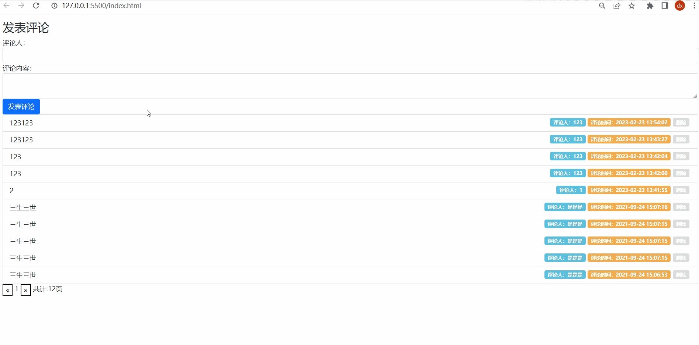

# Day04_AJAX进阶

## 客观题

* 参考客观题目录下的excel

* 在线直接答题：https://ks.wjx.top/vm/miNp0Vr.aspx# 

  > ps：本测试链接来自问卷星，请不要轻信问卷星广告！

## 主观题

### 作业1- 事件循环面试题

请查看配套文件夹里代码运行的结果

### 作业2- 评论列表

目标：完成如下评论列表效果

要求：

1. 默认上来展示所有评论列表数据（注意不区分用户了）感受下大家数据互相影响，也可以看到别人评论
2. 新增评论功能
3. 删除评论功能
4. 分页切换评论列表数据功能
5. 删除最后一条评论，列表要自动回到上一页

接口文档：https://apifox.com/apidoc/shared-1b0dd84f-faa8-435d-b355-5a8a329e34a8/api-82668108

配套资料：配套标签和样式在文件夹内

## 排错题

配套文件夹内的《案例-学习反馈》里面有 3 处错误，请帮帮这位同学实现更换网站背景的效果吧

## 面试题(自行扩展)

1. 你是怎么理解事件代理的?

   [参考文档](https://lamphc.github.io/fe-up/#/JavaScript/event_agent?id=%e9%9d%a2%e8%af%95%e5%ae%98%ef%bc%9a%e8%a7%a3%e9%87%8a%e4%b8%8b%e4%bb%80%e4%b9%88%e6%98%af%e4%ba%8b%e4%bb%b6%e4%bb%a3%e7%90%86%ef%bc%9f%e5%ba%94%e7%94%a8%e5%9c%ba%e6%99%af%ef%bc%9f)

2. 说说你对事件循环的理解？

   [参考文档](https://lamphc.github.io/fe-up/#/JavaScript/event_loop?id=%e9%9d%a2%e8%af%95%e5%ae%98%ef%bc%9a%e8%af%b4%e8%af%b4%e4%bd%a0%e5%af%b9%e4%ba%8b%e4%bb%b6%e5%be%aa%e7%8e%af%e7%9a%84%e7%90%86%e8%a7%a3)
