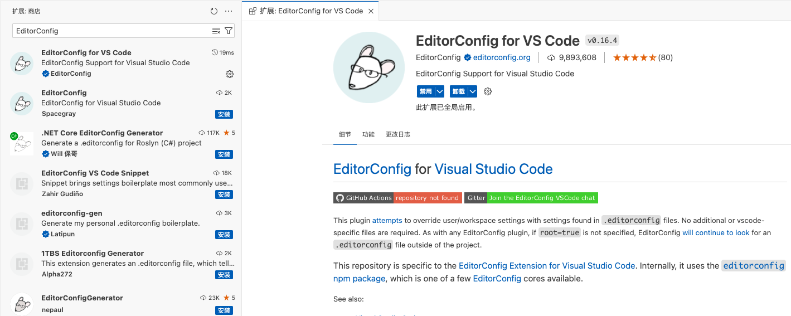
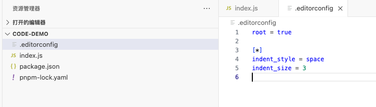
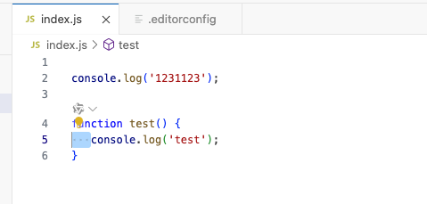

## VScode 插件 - EditorConfig

因为VS Code是没有绑定 **EditorConfig** 这个玩意的，所以才会需要插件。




## 创建 .editorconfig文件

VSCode中.editorconfig文件配置

```sh
# 对所有文件有效  //[*js]只对js文件有效
[*]
#设置编码格式
charset = utf-8
#缩进类型  可选space和tab
indent_style = space
#缩进数量可选整数值2 or 4,或者tab
indent_size = 2
#换行符的格式
end_of_line = lf
# 是否在文件的最后插入一个空行  可选true和false
insert_final_newline = true
# 是否删除行尾的空格  可选择true和false
trim_trailing_whitespace = true
```




## 重启VSCode，验证


