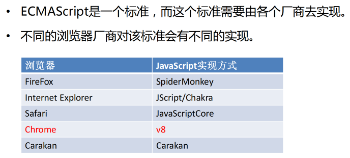

# 一、JavaScript 简史


# 二、JavaScript 的组成

* ECMAScript：规定了js基础语法核心知识。 
    * 比如：变量、分支语句、循环语句、对象等等 

* Web APIs : 
    * DOM 操作文档，比如对页面元素进行移动、大小、添加删除等操作 
    * BOM 操作浏览器，比如页面弹窗，检测窗口宽度、存储数据到浏览器等等


# 三、ECMAScript 与 JavaScript 关系




# 四、解释型语言 & 动态语言

计算机高级语言主要有『编译型』和『解释型』

* JavaScript是一门解释型语言，所谓解释型值语言不需要被编译为机器码在执行，而是直接执行。
* 解释型语言运行较慢也是它的劣势。
* 不过解释型语言中使用了JIT技术，使得运行速度得以改善。


* **动态语言（弱类型语言）**是运行时才确定数据类型的语言，变量在使用之前无需申明类型，通常变量的值是被赋值的那个值的类型。比如Php、Asp、JavaScript、Python、Perl等等。

* **静态语言（强类型语言）**是编译时变量的数据类型就可以确定的语言，大多数静态语言要求在使用变量之前必须生命数据类型。比如Java、C、C++、C#等。


* JavaScript是一门动态语言，所谓的动态语言可以暂时理解为在语言中的一切内容都是不确定的。比如一个变量，这一时刻是个整型，下一时刻可能会变成字符串了。当然这个问题我们以后再谈。

* 不过在补充一句动态语言相比静态语言性能上要差一些，不过由于JavaScript中应用的JIT技术，所以JS可能是运行速度最快的动态语言了。


# 五、JavaScript 书写位置

* CSS书写位置
    * 行内样式表
    * 内部样式表 
    * 外部样式表

* JavaScript书写位置
    * 行内 JavaScript 
    * 内部 JavaScript 
    * 外部 JavaScript （推荐）

**行内 JavaScript**

```html
<body>
		<!--
			可以将js代码编写到标签的onclick属性中
			当我们点击按钮时，js代码才会执行
			
			虽然可以写在标签的属性中，但是他们属于结构与行为耦合，不方便维护，不推荐使用
		-->
		<button onclick="alert('讨厌，你点我干嘛~~');">点我一下</button>
		
		<!--
			可以将js代码写在超链接的href属性中，这样当点击超链接时，会执行js代码
		-->
		<a href="javascript:alert('让你点你就点！！');">你也点我一下</a>
  	<!--
			这是空效果
		-->
		<a href="javascript:;">你也点我一下</a>
</body>
```

**内部 JavaScript**

```html
<!--
  可以将js代码编写到script标签	
  -->
<script type="text/javascript">	
		alert("我是script标签中的代码！！");
</script>
```

**外部 JavaScript**

```html
<!--
  可以将js代码编写到外部js文件中，然后通过script标签引入
  写到外部文件中可以在不同的页面中同时引用，也可以利用到浏览器的缓存机制
  推荐使用的方式
-->
<!--
  script标签一旦用于引入外部文件了，就不能在编写代码了，即使编写了浏览器也会忽略
  如果需要则可以在创建一个新的script标签用于编写内部代码
-->
<script type="text/javascript" src="js/script.js"></script>
<script type="text/javascript">
  alert("我是内部的JS代码");
</script>
```

**注意事项：**

* 书写的位置尽量写到文档末尾 </body> 前面 

* 外部 js 标签中间不要写代码，否则会被忽略


# 六、JavaScript 输入输出语法

```html
<body>
    <script>
        // 1.文档输出语法
        document.write('我是div标签')
        document.write('<h1>我是标题111</h1>')

        // 2.弹框输出语法
        alert('我是弹框')

        // 3.控制台输出
        console.log('我是控制台输出')

        // 4.输入弹框
        prompt('请输入姓名：')
    </script>
</body>
```

**实战案例**

```js
<body>
    <script>
        let uname = prompt('请输入姓名')
        let age = prompt('请输入年龄')
        let gender = prompt('请输入性别')
        document.write(uname, age, gender)
    </script>
</body>
```


# 七、JavaScript 变量与常量

[ECMAScript 6 入门 - let](https://es6.ruanyifeng.com/#docs/let)

## 1. var 与 let

**优化一：var可以先使用，后声明；let没有变量提升**

```js
// 10
// 描述：此时num先使用，后声明。
num = 10;
console.log(num);
var num;


// Uncaught ReferenceError: Cannot access 'num' before initialization
// 描述：let解决了此问题
num = 10;
console.log(num);
let num;
```


**优化二：var可以重复声明同名变量；let变量不能重复声明**

```js
// 20
// 描述：var重复声明变量，取最后一个。
var num = 10
var num = 20
console.log(num)


// Uncaught SyntaxError: Identifier 'num' has already been declared
// 描述：let不支持重复声明同名变量
let num = 10
let num = 20
console.log(num)
```


**优化三：var没有块级作用域；let定义块级作用域变量**

在ES6之前，我们都是用var来声明变量，而且JS只有 **函数作用域** 和 **全局作用域**，没有 **块级作用域**，所以`{}`限定不了var声明变量的访问范围。

在代码块内，使用let命令声明变量之前，该变量都是不可用的。这在语法上，称为 **“暂时性死区”**（temporal dead zone，简称 TDZ）。

```js
// 9
// 描述：var没有块级作用域
{
		var i = 9;
}
console.log(i);


// Uncaught ReferenceError: i is not defined
// 描述：let有块级作用域
{
		let i = 9;  // i变量只在 花括号内有效！！！
}
console.log(i);
```


## 2. 变量提升 

> 声明提升（hoisting）：函数声明和变量声明总是会被解释器悄悄地被"提升"到方法体的最顶部。

### a. 声明提升，初始化不会提升

[runoob - JavaScript 声明提升](https://www.runoob.com/js/js-hoisting.html)

**声明提升**

```js
// 声明提升
x = 5; // 变量 x 设置为 5
console.log(a);
var x; // 声明 x

// 输出
5
```

**初始化提升（不支持）**

```js
 // 初始化提升，失败
var x = 5; // 初始化 x
console.log(x);
console.log(y);
var y = 7; // 初始化 y

// 输出
5
undefined
```

```js
var x = 5; // 初始化 x
var y;     // 声明 y
console.log(x);
console.log(y);
y = 7;    // 设置 y 为 7

// 输出
5
undefined
```


### b. 面试题

在ES6之前，我们都是用var来声明变量，而且JS只有 **函数作用域** 和 **全局作用域**。

```js
// 常见面试题目1：
var a = 99;            // 全局变量a
f();                   // f是函数，虽然定义在调用的后面，但是函数声明会提升到作用域的顶部。 
console.log(a);        // a=>99,  此时是全局变量的a
function f() {
  console.log(a);      // 当前的a变量是下面变量a声明提升后，默认值undefined
  var a = 10;
  console.log(a);      // a => 10
}

// 输出结果：
undefined
10
99
```


## 3. let 配合for循环的独特应用

`let`非常适合用于 `for`循环内部的块级作用域。JS中的for循环体比较特殊，每次执行都是一个全新的独立的块作用域，用let声明的变量传入到 for循环体的作用域后，不会发生改变，不受外界的影响。看一个常见的面试题目：

```js
for (var i = 0; i <10; i++) {  
  	setTimeout(function() {  // 同步注册回调函数到 异步的 宏任务队列。
    		console.log(i);      // 执行此代码时，同步代码for循环已经执行完成
  	}, 0);
}
// 输出结果
10   共10个
// 这里面的知识点： JS的事件循环机制，setTimeout的机制等
```

如果把 `var`改成 `let`声明：

```js
// i虽然在全局作用域声明，但是在for循环体局部作用域中使用的时候，变量会被固定，不受外界干扰。
for (let i = 0; i < 10; i++) { 
  setTimeout(function() {
    console.log(i);    //  i 是循环体内局部作用域，不受外界影响。
  }, 0);
}
// 输出结果：
0  1  2  3  4  5  6  7  8  9
```


## 4. const

**概念：**使用 const 声明的变量称为“常量”。 

**使用场景：**当某个变量永远 **不会改变** 的时候，就可以使用 const 来声明，而不是let。 

**命名规范：**和变量一致 

```javascript
/*
	声明一个常量π
*/
const PI = 3.1415926;  

PI = 2.111; // ERROR: 1.常量不允许更改值

const PI1; // ERROR: 2.常量声明的时候必须赋值
```


## 5. 变量作用域

```js
/*
 * 作用域
 * 	- 作用域指一个变量的作用的范围
 * 	- 在JS中一共有两种作用域：
 * 		1.全局作用域
 * 			- 直接编写在script标签中的JS代码，都在全局作用域
 * 			- 全局作用域在页面打开时创建，在页面关闭时销毁
 * 			- 在全局作用域中有一个全局对象window，
 * 				它代表的是一个浏览器的窗口，它由浏览器创建我们可以直接使用
 * 			- 在全局作用域中：
 * 				创建的变量都会作为window对象的属性保存
 * 				创建的函数都会作为window对象的方法保存
 * 			- 全局作用域中的变量都是全局变量，
 * 				在页面的任意的部分都可以访问的到
 * 
 * 		2.函数作用域
 * 
 */

var a = "hello";
console.log(window.a);

// hello
```


# 八、JavaScript 数据类型

* 5种基本数据类型：
    * 字符串型（String） 
    * 数值型（Number） 
    * 布尔型（Boolean） 
    * null型（Null） 
    * undefined型（Undefined）

* 引用数据类型：
    * 对象（Object）


## 类型判断 - typeof

```js
/*
  可以使用一个运算符 typeof
  来检查一个变量的类型
  语法：typeof 变量	
  检查字符串时，会返回string
  检查数值时，会返回number
*/
typeof "123"  		// string
typeof 10			// number
typeof Infinity  	// number
typeof NaN  		// number
typeof false 		// boolean
typeof undefined	// undefined
```


## 标识符

```js
/*
 * 标识符
 * 	- 在JS中所有的可以由我们自主命名的都可以称为是标识符
 * 	- 例如：变量名、函数名、属性名都属于标识符
 * 	- 命名一个标识符时需要遵守如下的规则：
 * 		1.标识符中可以含有字母、数字、_、$
 * 		2.标识符不能以数字开头
 * 		3.标识符不能是ES中的关键字或保留字
 * 		4.标识符一般都采用驼峰命名法
 * 			- 首字母小写，每个单词的开头字母大写，其余字母小写
 * 			helloWorld xxxYyyZzz
 * 
 * 	- JS底层保存标识符时实际上是采用的Unicode编码，
 * 		所以理论上讲，所有的utf-8中含有的内容都可以作为标识符
 */
```


## 1. 字符串 String

### a. 转义字符

```js
/*
  在字符串中我们可以使用\作为转义字符，
    当表示一些特殊符号时可以使用\进行转义

    \" 表示 "
    \' 表示 '
    \n 表示换行
    \t 制表符
    \\ 表示\
*/
str = "我说:\"今天\t天气真不错！\"";  
str = "\\\\\\"; 

// 我说:"今天	天气真不错！"
// \\\
```


### b. 模板字符串

```js
// 模板字符串 外面用`` 里面 ${变量名}
let age = 20
document.write(`我今年${age}岁了`)
```


### c. 字符串方法

```js
//创建一个字符串
var str = "Hello Atguigu";

/*
 * 在底层字符串是以字符数组的形式保存的
 * ["H","e","l"]
 */
```

#### 1. length属性

```js
/*
 * length属性
 * 	- 可以用来获取字符串的长度
 */
console.log(str.length);
```

#### 2. charAt()

```js
/*
 * charAt()
 * 	- 可以返回字符串中指定位置的字符
 * 	- 根据索引获取指定的字符	
 */
str = "中Hello Atguigu";
var result = str.charAt(6);
```

#### 3. charCodeAt()

```js
/*
 * charCodeAt()
 * 	- 获取指定位置字符的字符编码（Unicode编码）
 */
result = str.charCodeAt(0);
```

#### 4. formCharCode

```js
/*
 * String.formCharCode()
 * 	- 可以根据字符编码去获取字符
 */
result = String.fromCharCode(0x2692);
```

#### 5. concat()

```js
/*
 * concat()
 * 	- 可以用来连接两个或多个字符串
 * 	- 作用和+一样
 */
result = str.concat("你好","再见");
```

#### 6. indexof() & lastIndexOf()

```js
/*
 * indexof()
 * 	- 该方法可以检索一个字符串中是否含有指定内容
 * 	- 如果字符串中含有该内容，则会返回其第一次出现的索引
 * 		如果没有找到指定的内容，则返回-1
 * 	- 可以指定一个第二个参数，指定开始查找的位置
 * 
 * lastIndexOf();
 * 	- 该方法的用法和indexOf()一样，
 * 		不同的是indexOf是从前往后找，
 * 		而lastIndexOf是从后往前找
 * 	- 也可以指定开始查找的位置
 */
str = "hello hatguigu";
result = str.indexOf("h",1);
result = str.lastIndexOf("h",5);
```

#### 7. slice()

```js
/*
 * slice()
 * 	- 可以从字符串中截取指定的内容
 * 	- 不会影响原字符串，而是将截取到内容返回
 * 	- 参数：
 * 		第一个，开始位置的索引（包括开始位置）
 * 		第二个，结束位置的索引（不包括结束位置）
 * 			- 如果省略第二个参数，则会截取到后边所有的
 * 		- 也可以传递一个负数作为参数，负数的话将会从后边计算
 */
str = "abcdefghijk";
result = str.slice(1,4);
result = str.slice(1,-1);
```

#### 8. substring()

```js
/*
 * substring()
 * 	- 可以用来截取一个字符串，可以slice()类似
 * 	- 参数：
 * 		- 第一个：开始截取位置的索引（包括开始位置）
 * 		- 第二个：结束位置的索引（不包括结束位置）
 * 		- 不同的是这个方法不能接受负值作为参数，
 * 			如果传递了一个负值，则默认使用0
 * 		- 而且他还自动调整参数的位置，如果第二个参数小于第一个，则自动交换
 */
result = str.substring(0,1);
```

#### 9. substr()

```js
/*
 * substr()
 * 	- 用来截取字符串
 * 	- 参数：
 * 		1.截取开始位置的索引
 * 		2.截取的长度
 */
str = "abcdefg";
result = str.substr(3,2);
```

#### 10. split()

```js
/*
 * split()
 * 	- 可以将一个字符串拆分为一个数组
 * 	- 参数：
 * 		-需要一个字符串作为参数，将会根据该字符串去拆分数组
 */
str = "abcbcdefghij";
result = str.split("d");

/*
 * 如果传递一个空串作为参数，则会将每个字符都拆分为数组中的一个元素
 */
result = str.split("");
```

#### 11. toUpperCase()

```js
/*
 * toUpperCase()
 * 	- 将一个字符串转换为大写并返回
 */
result = str.toUpperCase();
```

#### 12. toLowerCase()

```js
/*
 * toLowerCase()
 * 	-将一个字符串转换为小写并返回
 */
result = str.toLowerCase();
```


## 2.数值 Number

* 在JS中所有的数值都是Number类型，包括 **整数** 和 **浮点数**（小数）

* JS中可以表示的数字的最大值、最小值
     * 最大值：Number.MAX_VALUE
        * 1.7976931348623157e+308
     * 大于0的最小值：Number.MIN_VALUE
        * 5e-324

* 如果使用Number表示的数字超过了最大值，则会返回一个
       *      Infinity表示：正无穷
       *      -Infinity表示：负无穷
       *      使用 `typeof` 检查 `Infinity` 也会返回number
* `NaN` 是一个特殊的数字，表示：Not A Number
    * 使用`typeof` 检查一个 `NaN` 也会返回number


### a. Infinity

```js
// 两个很大的数相乘
a = -Number.MAX_VALUE * Number.MAX_VALUE;
console.log(a);

// -Infinity
```


### b. NaN

* `NaN` 是一个特殊的数字，表示：Not A Number

* 使用`typeof` 检查一个 `NaN` 也会返回number

```js
// 两个字符串相乘
console.log("abc" * "bcd");	 // NaN
console.log('pink老师' - 2);  // NaN
console.log(NaN - 2);	// NaN
console.log(NaN + 2);	// NaN
console.log(NaN / 2);	// NaN
console.log(NaN === NaN);	// false
```


### c. 浮点运算不精确

```js
/*
 * 如果使用JS进行浮点运算，可能得到一个不精确的结果
 * 所以千万不要使用JS进行对精确度要求比较高的运算	
 */
var c = 0.1 + 0.2;
console.log(c);

// 0.30000000000000004
```


### d. 二、八、十六进制的数字

```js
/*
 * 在js中，如果需要表示16进制的数字，则需要以0x开头
 * 			  如果需要表示8进制的数字，则需要以0开头
 * 			  如果要要表示2进制的数字，则需要以0b开头
 * 				但是不是所有的浏览器都支持
 * 	
 */

//十六进制
a = 0x10;  	// number 16
a = 0xff;		// number 255
a = 0xCafe;	// number 51966

//八进制数字
a = 070;	// number 56

//二进制数字
a = 0b10;	// number 2

//向"070"这种字符串，有些浏览器会当成8进制解析，有些会当成10进制解析
a = "070";

//可以在parseInt()中传递一个第二个参数，来指定数字的进制
a = "0101";
a = parseInt(a, 2); // 2
a = parseInt(a, 8); // 65
a = parseInt(a, 10); // 101
a = parseInt(a, 16); // 257

console.log(typeof a);
console.log(a);
```


## 3.布尔值 - Boolean

```js
/*
 * Boolean 布尔值
 * 	布尔值只有两个，主要用来做逻辑判断
 * 	true
 * 		- 表示真
 * 	false
 * 		- 表示假
 * 
 * 使用typeof检查一个布尔值时，会返回boolean
 */
var bool = false;			
console.log(typeof bool);
console.log(bool);

// boolean
// false
```


## 4. 空值 - Null

Javaseript 中的nul1 仅仅是一个代表“无”、“空”或“值未知”的特殊值。

**null工作中的使用场景：**

* 官方解释：把nul1 作为尚未创建的对象。
* 大白话：将来有个变量里面存放的是一个对象，但是对象还没创建好，可以先给个null。

```js
/*
 * Null（空值）类型的值只有一个，就是null
 * null这个值专门用来表示一个为空的对象
 * 使用typeof检查一个null值时，会返回object
 */
var a = null;
console.log(typeof a);

// object
```


## 5. 未定义 - Undefine

只声明变量，不赋值的情况下，变量的默认值为 undefined，一般很少【直接】为某个变量赋值为 undefined.

**Undefine工作中的使用场景：**

* 我们开发中经常声明一个变量，等待传送过来的数据。
* 如果我们不知道这个数据是否传递过来，此时我们可以通过检测这个变量是不是undefined，就判断用户是否有数据传递过来。

```js
/*
 * Undefined（未定义）类型的值只有一个，就undefind
 * 	当声明一个变量，但是并不给变量赋值时，它的值就是undefined
 * 	使用typeof检查一个undefined时也会返回undefined
 */
var b = undefined;
console.log(typeof b);

// undefined
```


### a. null 和 undefined 区别：

详细文档：《JS中undefined与null》

- undefined 表示没有赋值
- null 表示赋值了，但是内容为空

* undefined值实际上是由null值衍生出来的，所以如果比较undefined和null是否相等，会返回true；

```js
console.log(null == undefined);  // true
console.log(null === undefined); // false
```


## 6. 对象 - Object

### a. 对象分类 + 新增、修改、删除属性

```js
/*
 * 对象的分类：
 * 	1.内建对象
 * 		- 由ES标准中定义的对象，在任何的ES的实现中都可以使用
 * 		- 比如：Math String Number Boolean Function Object....
 * 
 * 	2.宿主对象
 * 		- 由JS的运行环境提供的对象，目前来讲主要指由浏览器提供的对象
 * 		- 比如 BOM DOM
 * 
 * 	3.自定义对象
 * 		- 由开发人员自己创建的对象
 */
 
 
// 创建对象
/*
 * 使用new关键字调用的函数，是构造函数constructor
 * 	构造函数是专门用来创建对象的函数
 * 使用typeof检查一个对象时，会返回object
 */
var obj = new Object();

/*
 * 在对象中保存的值称为属性
 * 向对象添加属性
 * 	语法：对象.属性名 = 属性值;
 */

//向obj中添加一个name属性
obj.name = "孙悟空";
//向obj中添加一个gender属性
obj.gender = "男";
//向obj中添加一个age属性
obj.age = 18;

/*
 * 读取对象中的属性
 * 	语法：对象.属性名
 * 
 * 如果读取对象中没有的属性，不会报错而是会返回undefined
 */

console.log(obj.gender);
console.log(obj.hello);

/*
 * 修改对象的属性值
 * 	语法：对象.属性名 = 新值
 */
obj.name = "tom";

/*
 * 删除对象的属性
 * 	语法：delete 对象.属性名
 */
delete obj.name;
```


### b. 属性名 + 属性值

```js
/*
 * 向对象中添加属性
 * 属性名：
 * 	- 对象的属性名不强制要求遵守标识符的规范
 * 		什么乱七八糟的名字都可以使用
 * 	- 但是我们使用是还是尽量按照标识符的规范去做
 * 
 */
obj.name = "孙悟空";

//obj.var = "hello";

/*
 * 如果要使用特殊的属性名，不能采用.的方式来操作
 * 	需要使用另一种方式：
 * 		语法：对象["属性名"] = 属性值
 * 	读取时也需要采用这种方式
 * 
 * 使用[]这种形式去操作属性，更加的灵活，
 * 	在[]中可以直接传递一个变量，这样变量值是多少就会读取那个属性
 * 
 */
obj["123"] = 789;
obj["nihao"] = "你好";
var n = "nihao";
console.log(obj["123"]);

/*
 * 属性值
 * 	JS对象的属性值，可以是任意的数据类型
 * 		甚至也可以是一个对象
 */

obj.test = true;
obj.test = null;
obj.test = undefined;

//创建一个对象
var obj2 = new Object();
obj2.name = "猪八戒";

//将obj2设置为obj的属性
obj.test = obj2;
```


### c. 检查一个对象中是否含有指定的属性

#### 方式一：in 运算符

```js
/*
 * in 运算符
 * 	- 通过该运算符可以检查一个对象中是否含有指定的属性
 * 		如果有则返回true，没有则返回false
 *  - 语法：
 * 		"属性名" in 对象
 */
//检查obj中是否含有test2属性
console.log("test2" in obj);
console.log("test" in obj);
console.log("name" in obj);
```


#### 方式二：hasOwnProperty()

```js
//可以使用对象的hasOwnProperty()来检查对象自身中是否含有该属性
//使用该方法只有当对象自身中含有属性时，才会返回true
console.log(mc.hasOwnProperty("age"));
```


### d. 对象字面量

```js
/*
 * 使用对象字面量，可以在创建对象时，直接指定对象中的属性
 * 语法：{属性名:属性值,属性名:属性值....}
 * 	对象字面量的属性名可以加引号也可以不加，建议不加,
 * 	如果要使用一些特殊的名字，则必须加引号
 * 
 * 属性名和属性值是一组一组的名值对结构，
 * 	名和值之间使用:连接，多个名值对之间使用,隔开
 * 	如果一个属性之后没有其他的属性了，就不要写,
 */
var obj2 = {

    name:"猪八戒",
    age:13,
    gender:"男",
    test:{name:"沙僧"}

};
```


### e. 对象属性是个函数

```js
/*
 * 创建一个对象
 */
var obj = new Object();

//向对象中添加属性
obj.name = "孙悟空";
obj.age = 18;

//对象的属性值可以是任何的数据类型，也可以是个函数
obj.sayName = function(){
    console.log(obj.name);
};

//console.log(obj.sayName);
//调方法
obj.sayName();


//对象字面量
var obj2 = {
    name:"猪八戒",
    age:18, // 属性
    sayName:function(){  // 方法
        console.log(obj2.name);
    }
};

obj2.sayName();
```


### f. 遍历属性

```js
var obj = {
    name:"孙悟空",
    age:18,
    gender:"男",
    address:"花果山"
 };

//枚举对象中的属性
//使用for ... in 语句
/*
* 语法：
* 	for(var 变量 in 对象){
* 	
*   }
* 
* for...in语句 对象中有几个属性，循环体就会执行几次
* 	每次执行时，会将对象中的一个属性的名字赋值给变量
*/

for(var n in obj){
    console.log("属性名:" + n);
    console.log("属性值:" + obj[n]);
}
```


### g. 创建对象

#### 方式一：对象字面量

```js
var obj2 = {
    name:"猪八戒",
    age:13,
    gender:"男",
    test:{name:"沙僧"}
};
```

#### 方式二：工厂方法

```js
/*
 * 使用工厂方法创建对象
 * 	通过该方法可以大批量的创建对象
 */
function createPerson(name , age ,gender){
    //创建一个新的对象 
    var obj = new Object();
    //向对象中添加属性
    obj.name = name;
    obj.age = age;
    obj.gender = gender;
    obj.sayName = function(){
      alert(this.name);
    };
    //将新的对象返回
  	return obj;
}

var obj2 = createPerson("猪八戒",28,"男");
var obj3 = createPerson("白骨精",16,"女");
var obj4 = createPerson("蜘蛛精",18,"女");
```

**工厂方法的弊端**

```js
/*
 * 用来创建狗的对象
 */
function createDog(name , age){
    var obj = new Object();
    obj.name = name;
    obj.age = age;
    obj.sayHello = function(){
      	alert("汪汪~~");
    };
    return obj;
}
/*
 * 使用工厂方法创建的对象，使用的构造函数都是Object
 * 	所以创建的对象都是Object这个类型，
 * 	就导致我们无法区分出多种不同类型的对象
 */
//创建一个狗的对象
var dog = createDog("旺财",3);

console.log(dog);
console.log(obj4);
```


#### 方式三：构造方法

* 十四、函数
    * 6. 构造函数


# 九、类型转换 - 显示转换

* 强制类型转换
     * 	指将一个数据类型强制转换为其他的数据类型
     * 	类型转换主要指，将其他的数据类型，转换为：`String` `Number` `Boolean`


## 1. 转换为String

### a. 方式一：toString()

```js
/*
 * 将其他的数据类型转换为String
 * 	方式一：
 * 		- 调用被转换数据类型的toString()方法
 * 		- 该方法不会影响到原变量，它会将转换的结果返回
 * 		- 但是注意：null和undefined这两个值没有toString()方法，
 * 			如果调用他们的方法，会报错
 */
var a = 123;
a = a.toString();

a = true;
a = a.toString();

a = null;
a = a.toString(); //报错

a = undefined;
a = a.toString(); //报错
```


### b. 方式二：String()

```js
/*
 * 将其他的数据类型转换为String 
 *  方式二：
 * 		- 调用String()函数，并将被转换的数据作为参数传递给函数
 * 		- 使用String()函数做强制类型转换时，
 * 			对于Number和Boolean实际上就是调用的toString()方法
 * 			但是对于null和undefined，就不会调用toString()方法
 * 				它会将 null 直接转换为 "null"
 * 				将 undefined 直接转换为 "undefined"
 */
var a = 123;
a = String(a);	// "123"

a = null;
a = String(a);  // "null"
typeof a				// string

a = undefined;
a = String(a);  // "undefined"
typeof a				// string
```


## 2. 转换为Number

* 有三个函数可以把非数值转换为数值：Number()、parseInt() 、parseFloat()
    * `Number()` 可以用来转换任意类型的数据，而后两者只能用于转换字符串
    * `parseInt()` 只会将字符串转换为整数
    * `parseFloat()` 可以转换为浮点数


### a. 字符串 --> 数字

**方式一： Number()函数**

* 1.如果是纯数字的字符串，则直接将其转换为数字
* 2.如果字符串中有非数字的内容，则转换为 `NaN`
* 3.如果字符串是一个空串或者是一个全是空格的字符串，则转换为0

**方式二：parseInt() 函数 与parseFloat() 函数**

* parseInt() 把一个字符串转换为一个整数
* parseFloat() 把一个字符串转换为一个浮点数

```js
//调用Number()函数来将a转换为Number类型
var a = "123";
a = Number(a);

/*
 * parseInt()可以将一个字符串中的有效的整数内容去出来，
 * 	然后转换为Number
 */
a = parseInt(a);

/*
 * parseFloat()作用和parseInt()类似，不同的是它可以获得有效的小数
 */
a = "123.456.789px";
a = parseFloat(a);
```

**非String使用parseInt()或parseFloat()**

```js
/*
 * 如果对非String使用parseInt()或parseFloat()
 * 	它会先将其转换为String然后在操作
 */
a = true;
a = parseInt(a);
console.log(typeof a);  // number
console.log(a);	// NaN

a = 198.23;
a = parseInt(a);
console.log(typeof a); // number
console.log(a); // 198
```


### b. 布尔 --> 数字

```js
/*
  true 转成 1
	false 转成 0
*/
a = false;
a = Number(a);
```


### c. null --> 数字

```js
// null --> 数字     0
a = null;
a = Number(a);  // 0
```


### d. undefined --> 数字

```js
// undefined --> 数字 NaN
a = undefined;
a = Number(a);  // NaN
```


## 3. 转换为Boolean

**记忆**： **空串、0、NaN、null、undefined 转换为布尔值后都是false, 其余则为 true** 

```js
/*
 * 将其他的数据类型转换为Boolean
 * 	- 使用Boolean()函数
 * 		- 数字 ---> 布尔
 * 			- 除了0和NaN，其余的都是true
 * 
 * 		- 字符串 ---> 布尔
 * 			- 除了空串，其余的都是true
 * 
 * 		- null和undefined都会转换为false
 * 
 * 		- 对象也会转换为true
 * 		
 */

Boolean("")	//false
Boolean(0)	//false
Boolean(NaN)	//false
Boolean(null)	//false
Boolean(undefined)	//false

// 其他都是true
Boolean(123)	//true
Boolean(-123)	//true
Boolean(Infinity)	//true
```


# 十、类型转换 - 隐式转换

```js
console.log(1 + 1)	// 2
console.log('pink' + 1)	// pink1

console.log(2 + 2)	// 4
console.log(2 + '2') // 22

console.log(2 - 2)	// 0
console.log(2 - '2')  // 0  

console.log(+12)	// 12
console.log(+'123')  // 123
```


# 十一、Unicode编码

```html
<script type="text/javascript">
  /*
   * 在字符串中使用转义字符输入Unicode编码
   * 	\u四位编码，十六进制
   */
  console.log("\u2620");
</script>


<body>
    <!--在网页中使用Unicode编码
        &#编码; 这里的编码需要的是十进制
    -->
    <h1 style="font-size: 200px;">&#9760;</h1>
    <h1 style="font-size: 200px;">&#9856;</h1>
</body>
```


# 十二、运算符（简单省略）

## 1. 比较运算符

```js
// 比较运算符有隐式转换 把'2' 转换为 2  双等号 只判断值
console.log(2 == '2')  // true
console.log(undefined === null) // false
// === 全等 判断 值 和 数据类型都一样才行
// 以后判断是否相等 请用 ===  
console.log(2 === '2')
console.log(NaN === NaN) // NaN 不等于任何人，包括他自己
console.log(2 !== '2')  // true  
console.log(2 != '2') // false 
console.log('-------------------------')
console.log('a' < 'b') // true
console.log('aa' < 'ab') // true
console.log('aa' < 'aac') // true
console.log('-------------------------')
```


# 十三、流程控制语句（简单省略）

## 1. if - else 

```js
if(条件表达式) {
		语句...
} else {
		语句...
}
```

## 2. Switch

```js
switch(条件表达式){
		case 表达式:
				语句...
				break;
		case 表达式:
				语句...
			 	break;
		default:
				语句...
				break;
}
```

## 3. for

```js
for(var i = 0 ; i < 10 ; i++ ){
		alert(i);
}
```


# 十四、函数 - function

函数 function

* 函数也是一个对象

* 使用typeof检查一个函数对象时，会返回function


## 1. 创建函数

### a. 使用"构造函数"来创建一个函数对象

```js
var fun = new Function("console.log('Hello 这是我的第一个函数');");
```


### b. 使用 "函数声明" 来创建一个函数

```js
function fun2() {
    console.log("这是我的第二个函数~~~");
}
```


### c. 使用 "函数表达式" 来创建一个函数

```js
var fun3 = function(){
	console.log("我是匿名函数中封装的代码");
};
```


## 2. 函数的参数

```js
function sum(a,b){
    console.log(a+b);
}

/*
 * 调用函数时解析器不会检查实参的类型,
 * 	所以要注意，是否有可能会接收到非法的参数，如果有可能则需要对参数进行类型的检查
 *  函数的实参可以是任意的数据类型
 */
sum(123,"hello");
sum(true , false);

/*
 * 调用函数时，解析器也不会检查实参的数量
 * 	多余实参不会被赋值
 *  如果实参的数量少于形参的数量，则没有对应实参的形参将是undefined
 * 
 */
sum(123,456,"hello",true,null);
sum(123);
```

### a. 隐含的参数

```js
/*
 * 在调用函数时，浏览器每次都会传递进两个隐含的参数：
 * 	1.函数的上下文对象 this
 * 	2.封装实参的对象 arguments
 * 		- arguments是一个类数组对象,它也可以通过索引来操作数据，也可以获取长度
 * 		- 在调用函数时，我们所传递的实参都会在arguments中保存
 * 		- arguments.length可以用来获取实参的长度
 * 		- 我们即使不定义形参，也可以通过arguments来使用实参，
 * 			只不过比较麻烦
 * 			arguments[0] 表示第一个实参
 * 			arguments[1] 表示第二个实参 。。。
 *		- 它里边有一个属性叫做callee，
 * 			这个属性对应一个函数对象，就是当前正在指向的函数的对象
 * 		
 */

function fun(a,b){
    console.log(arguments instanceof Array);  
    console.log(Array.isArray(arguments));
    console.log(arguments[1]);
    console.log(arguments.length);
    console.log(arguments.callee == fun);
}

fun("hello",true);

// false  false  true  2  true
```


## 3. 函数返回值

```js
/*
 * 	如果return语句后不跟任何值就相当于返回一个undefined，
 * 	如果函数中不写return，则也会返回undefined
 * 
 * 	return后可以跟任意类型的值
 */
function sum(a , b , c) {
    var d = a + b + c;
    return d;
}

//调用函数
//变量result的值就是函数的执行结果
//函数返回什么result的值就是什么
var result = sum(4,7,8);


/*
 * 返回值可以是任意的数据类型
 * 	也可以是一个对象，也可以是一个函数
 */
function fun2(){
    //返回一个对象
    return {name:"沙和尚"};
}

function fun3(){
    //在函数内部再声明一个函数
    function fun4(){
        alert("我是fun4");
    }
    
    //将fun4函数对象作为返回值返回
    return fun4;
}
```


## 4. 立即执行函数

```js
//函数对象()
/*
 * 立即执行函数
 * 	函数定义完，立即被调用，这种函数叫做立即执行函数
 * 	立即执行函数往往只会执行一次
 */
(function(){
    alert("我是一个匿名函数~~~");
})();

(function(a,b){
    console.log("a = "+a);
    console.log("b = "+b);
})(123,456);
```


## 5. this

```js
/*
 * 解析器在调用函数每次都会向函数内部传递进一个隐含的参数,
 * 	这个隐含的参数就是this，this指向的是一个对象，
 * 	这个对象我们称为函数执行的 上下文对象，
 * 	根据函数的调用方式的不同，this会指向不同的对象
 * 		1.以函数的形式调用时，this永远都是window
 * 		2.以方法的形式调用时，this就是调用方法的那个对象
 */

function fun(){
    // 表明：this = window，
    //		this.name = window.name
    console.log(this.name);
}

var name = "全局的name属性";
fun(); 

// 全局的name属性             
```


## 6. 构造函数

```js
/*
 * 创建一个构造函数，专门用来创建Person对象的
 * 	构造函数就是一个普通的函数，创建方式和普通函数没有区别,
 * 	不同的是构造函数习惯上首字母大写
 * 
 * 构造函数和普通函数的区别就是调用方式的不同
 * 	普通函数是直接调用，而构造函数需要使用new关键字来调用
 * 
 * 构造函数的执行流程：
 * 	1.立刻创建一个新的对象
 * 	2.将新建的对象设置为函数中this,在构造函数中可以使用this来引用新建的对象
 * 	3.逐行执行函数中的代码
 * 	4.将新建的对象作为返回值返回
 * 
 * 使用同一个构造函数创建的对象，我们称为一类对象，也将一个构造函数称为一个类。
 * 	我们将通过一个构造函数创建的对象，称为是该类的实例
 * 
 * this的情况：
 * 	1.当以函数的形式调用时，this是window
 * 	2.当以方法的形式调用时，谁调用方法this就是谁
 * 	3.当以构造函数的形式调用时，this就是新创建的那个对象
 * 
 */
function Person(name , age , gender){
    this.name = name;
    this.age = age;
    this.gender = gender;
    this.sayName = function(){
      	alert(this.name);
    };
}

var per = new Person("孙悟空",18,"男");
var per2 = new Person("玉兔精",16,"女");
var per3 = new Person("奔波霸",38,"男");
```


### a. instanceof

```js
/*
 * 使用instanceof可以检查一个对象是否是一个类的实例
 * 	语法：
 * 		对象 instanceof 构造函数
 * 如果是，则返回true，否则返回false
 */
console.log(per instanceof Person);
console.log(dog instanceof Person);

/*
 * 所有的对象都是Object的后代，
 * 	所以任何对象和Object左instanceof检查时都会返回true
 */
console.log(dog instanceof Object);
```


## 7. 原型 - prototype

### a. 为什么引入原型？

> 解决多个对象公用一个方法，减少内存。
>
> 将对象中共有的内容，统一设置到原型对象中。

**原方案：在构造方法中增加方法 	**

```js
/*
 * 创建一个Person构造函数
 * 	- 在Person构造函数中，为每一个对象都添加了一个sayName方法，
 * 		目前我们的方法是在构造函数内部创建的，
 * 			也就是构造函数每执行一次就会创建一个新的sayName方法
 * 		也是所有实例的sayName都是唯一的。
 * 		这样就导致了构造函数执行一次就会创建一个新的方法，
 * 			执行10000次就会创建10000个新的方法，而10000个方法都是一摸一样的
 * 			这是完全没有必要，完全可以使所有的对象共享同一个方法
 */
function Person(name , age , gender){
  this.name = name;
  this.age = age;
  this.gender = gender;
  //向对象中添加一个方法
  this.sayName = fun;
}

//将sayName方法在全局作用域中定义
/*
 * 将函数定义在全局作用域，污染了全局作用域的命名空间
 * 	而且定义在全局作用域中也很不安全
 */
function fun(){
  alert("Hello大家好，我是:"+this.name);
};

var per = new Person("孙悟空",18,"男");   // 每个对象都有一个新方法sayName()
var per2 = new Person("玉兔精",16,"女");	// 每个对象都有一个新方法sayName()
var per3 = new Person("奔波霸",38,"男");  // 每个对象都有一个新方法sayName()
```

**新方案：原型**

```js
//向原型中添加sayName方法
Person.prototype.sayName = function(){
  	alert("Hello大家好，我是:"+this.name);
};

//创建一个Person的实例
var per = new Person("孙悟空",18,"男");
var per2 = new Person("猪八戒",28,"男");
per.sayName();
per2.sayName();
```


### b. 原型的基本原理

```js
/*
 * 原型 prototype
 * 
 * 	我们所创建的每一个函数，解析器都会向函数中添加一个属性prototype
 * 		这个属性对应着一个对象，这个对象就是我们所谓的原型对象
 * 	如果函数作为普通函数调用prototype没有任何作用
 * 	当函数以构造函数的形式调用时，它所创建的对象中都会有一个隐含的属性，
 * 		指向该构造函数的原型对象，我们可以通过__proto__来访问该属性
 * 
 * 	原型对象就相当于一个公共的区域，所有同一个类的实例都可以访问到这个原型对象，
 * 		我们可以将对象中共有的内容，统一设置到原型对象中。
 * 
 * 当我们访问对象的一个属性或方法时，它会先在对象自身中寻找，如果有则直接使用，
 * 	如果没有则会去原型对象中寻找，如果找到则直接使用
 * 
 * 以后我们创建构造函数时，可以将这些对象共有的属性和方法，统一添加到构造函数的原型对象中，
 * 	这样不用分别为每一个对象添加，也不会影响到全局作用域，就可以使每个对象都具有这些属性和方法了
 */

function MyClass(){

}

//向MyClass的原型中添加属性a
MyClass.prototype.a = 123;

//向MyClass的原型中添加一个方法
MyClass.prototype.sayHello = function(){
  alert("hello");
};

var mc = new MyClass();

var mc2 = new MyClass();

console.log(MyClass.prototype);
console.log(mc2.__proto__ == MyClass.prototype);

//向mc中添加a属性
mc.a = "我是mc中的a";

console.log(mc2.a);

mc.sayHello();
```


### c. 原型的原型

```js
/*
* 原型对象也是对象，所以它也有原型，
* 	当我们使用一个对象的属性或方法时，会现在自身中寻找，
*   原型的原型对象，我们可以通过__proto__来访问该属性，
* 		自身中如果有，则直接使用，
* 		如果没有则去原型对象中寻找，如果原型对象中有，则使用，
* 		如果没有则去原型的原型中寻找,直到找到Object对象的原型，
* 		Object对象的原型没有原型，如果在Object原型中依然没有找到，则返回undefined
*/

console.log(mc.__proto__.hasOwnProperty("hasOwnProperty"));	// false
	
console.log(mc.__proto__.__proto__.hasOwnProperty("hasOwnProperty")); 	// true

console.log(mc.__proto__.__proto__.__proto__);	// null

console.log(mc.hello);	// undefined

console.log(mc.__proto__.__proto__.__proto__);	// null
```


### d. 向原型中添加一个name属性

```js
/*
 * 创建一个构造函数
 */
function MyClass(){
	
}

//向MyClass的原型中添加一个name属性
MyClass.prototype.name = "我是原型中的名字";

var mc = new MyClass();
mc.age = 18;
console.log(mc.name);

// 我是原型中的名字
```

**验证是否添加成功 - 同八-6-c**

```js
//使用in检查对象中是否含有某个属性时，如果对象中没有但是原型中有，也会返回true
console.log("age" in mc);	// true
console.log("name" in mc);	// true
console.log("hasOwnProperty" in mc);	// true

//可以使用对象的hasOwnProperty()来检查对象自身中是否含有该属性
//使用该方法只有当对象自身中含有属性时，才会返回true
console.log(mc.hasOwnProperty("age")); 	// true
console.log(mc.hasOwnProperty("name"));	// false
console.log(mc.hasOwnProperty("hasOwnProperty")); 	// false
```


### e. 重写toString()

**默认的toString()**

```js
function Person(name , age , gender){
    this.name = name;
    this.age = age;
    this.gender = gender;
}

var per = new Person("孙悟空", 18, "男");
var result = per.toString();
console.log(result);    

// [object Object]
```


**重写的toString()**

```js
function Person(name, age, gender) {
	this.name = name;
	this.age = age;
	this.gender = gender;
}

//修改Person原型的toString
Person.prototype.toString = function(){
	return "Person[name="+this.name+",age="+this.age+",gender="+this.gender+"]";
};

//创建一个Person实例
var per = new Person("孙悟空", 18, "男");
var result = per.toString();
console.log(result);

// Person[name=孙悟空,age=18,gender=男]
```


### f. 垃圾回收 - GC

```js
/*
 * 垃圾回收（GC）
 * 	- 就像人生活的时间长了会产生垃圾一样，程序运行过程中也会产生垃圾
 * 		这些垃圾积攒过多以后，会导致程序运行的速度过慢，
 * 		所以我们需要一个垃圾回收的机制，来处理程序运行过程中产生垃圾
 *  - 当一个对象没有任何的变量或属性对它进行引用，此时我们将永远无法操作该对象，
 * 		此时这种对象就是一个垃圾，这种对象过多会占用大量的内存空间，导致程序运行变慢，
 * 		所以这种垃圾必须进行清理。
 * 	- 在JS中拥有自动的垃圾回收机制，会自动将这些垃圾对象从内存中销毁，
 * 		我们不需要也不能进行垃圾回收的操作
 * 	- 我们需要做的只是要将不再使用的对象设置null即可
 * 
 */
var obj = new Object();
// 对对象进行各种操作。。。。
obj = null;
```


## 8. 函数对象的方法

### a. call() 和 apply()

```js
function fun(a,b) {
    console.log("a = "+a);
    console.log("b = "+b);
    //alert(this);
}

var obj = {
    name: "obj",
    sayName:function(){
        alert(this.name);
    }
};

/*
 * call()和apply()
 * 	- 这两个方法都是函数对象的方法，需要通过函数对象来调用
 * 	- 当对函数调用call()和apply()都会调用函数执行
 * 	- 在调用call()和apply()可以将一个对象指定为第一个参数
 * 		此时这个对象将会成为函数执行时的this
 * 	- call()方法可以将实参在对象之后依次传递
 * 	- apply()方法需要将实参封装到一个数组中统一传递
 * 
 * 	- this的情况：
 * 		1.以函数形式调用时，this永远都是window
 * 		2.以方法的形式调用时，this是调用方法的对象
 * 		3.以构造函数的形式调用时，this是新创建的那个对象
 * 		4.使用call和apply调用时，this是指定的那个对象
 */
fun.call(obj,2,3);
fun.apply(obj,[2,3]);
```


# 十五、数组

## 1. 创建数组

```js
//创建数组对象
var arr = new Array();

//使用构造函数创建数组时，也可以同时添加元素，将要添加的元素作文构造函数的参数传递
//元素之间使用,隔开
var arr2 = new Array(10,20,30);

//创建一个长度为10的数组
var arr2 = new Array(10);

//使用字面量来创建数组
//语法:[]
var arr = [];

//数组中的元素可以是任意的数据类型
arr = ["hello",1,true,null,undefined];

//也可以是对象
var obj = {name:"孙悟空"};
arr = [obj,{name:"沙和尚"},{name:"猪八戒"}];

//也可以是一个函数
arr = [function(){alert(1)},function(){alert(2)}];

//二维数组
arr = [[1,2,3],[3,4,5],[5,6,7]];

//使用typeof检查一个数组时，会返回object
console.log(typeof arr);  // object
```


## 2. 赋值、取值

```js
/*
 * 向数组中添加元素
 * 语法：数组[索引] = 值
 */
arr[0] = 10;
arr[1] = 33;
arr[2] = 22;
arr[3] = 44;
arr[10] = 31;
```


## 3. 数组方法

### a. length

```js
/*
 * 获取数组的长度
 * 可以使用length属性来获取数组的长度(元素的个数)
 * 	语法：数组.length
 * 
 * 对于连续的数组，使用length可以获取到数组的长度（元素的个数）
 * 对于非连续的数组，使用length会获取到数组的最大的索引+1
 * 		尽量不要创建非连续的数组
 */
console.log(arr.length);

/*
 * 修改length
 * 	如果修改的length大于原长度，则多出部分会空出来
 *  如果修改的length小于原长度，则多出的元素会被删除
 */
arr.length = 10;
```

### b. push()

```js
/*
 * push()
 * 	- 该方法可以向数组的末尾添加一个或多个元素，并返回数组的新的长度
 * 	- 可以将要添加的元素作为方法的参数传递，
 * 		这样这些元素将会自动添加到数组的末尾
 * 	- 该方法会将数组新的长度作为返回值返回
 */

var result = arr.push("唐僧","蜘蛛精","白骨精","玉兔精");
```

### c. pop()

```js
/*
 * pop()
 * 	- 该方法可以删除数组的最后一个元素,并将被删除的元素作为返回值返回
 */
result = arr.pop();
```

### d. unshift()

```js
/*
 * unshift()
 * 	- 向数组开头添加一个或多个元素，并返回新的数组长度
 * 	- 向前边插入元素以后，其他的元素索引会依次调整
 */
arr.unshift("牛魔王","二郎神");
```

### e. shift()

```js
/*
 * shift()
 * 	- 可以删除数组的第一个元素，并将被删除的元素作为返回值返回
 */
result = arr.shift();
```

### f. slice()

```js
/*
 * slice()
 * 	- 可以用来从数组提取指定元素
 * 	- 该方法不会改变元素数组，而是将截取到的元素封装到一个新数组中返回
 * 	- 参数：
 * 		1.截取开始的位置的索引,包含开始索引
 * 		2.截取结束的位置的索引,不包含结束索引
 * 			- 第二个参数可以省略不写,此时会截取从开始索引往后的所有元素
 * 		- 索引可以传递一个负值，如果传递一个负值，则从后往前计算
 * 			-1 倒数第一个
 * 			-2 倒数第二个
 */
var result = arr.slice(1,4);
result = arr.slice(3);
result = arr.slice(1,-2);
```

### h. splice()

```js
/*
 * splice()
 * 	- 可以用于删除数组中的指定元素
 * 	- 使用splice()会影响到原数组，会将指定元素从原数组中删除
 * 		并将被删除的元素作为返回值返回
 * 	- 参数：
 * 		第一个，表示开始位置的索引
 * 		第二个，表示删除的数量
 * 		第三个及以后。。
 * 			可以传递一些新的元素，这些元素将会自动插入到开始位置索引前边
 * 	
 */
arr = ["孙悟空","猪八戒","沙和尚","唐僧","白骨精"];
var result = arr.splice(3,0,"牛魔王","铁扇公主","红孩儿");
```

### i. concat()

```js
/*
 * concat()可以连接两个或多个数组，并将新的数组返回
 * 	- 该方法不会对原数组产生影响
 */
var result = arr.concat(arr2,arr3,"牛魔王","铁扇公主");
```

### j. join()

```js
/*
 * join()
 * 	- 该方法可以将数组转换为一个字符串
 * 	- 该方法不会对原数组产生影响，而是将转换后的字符串作为结果返回
 * 	- 在join()中可以指定一个字符串作为参数，这个字符串将会成为数组中元素的连接符
 * 		如果不指定连接符，则默认使用,作为连接符
 */
result = arr.join("@-@");
```

### k. reverse()

```js
/*
 * reverse()
 * 	- 该方法用来反转数组（前边的去后边，后边的去前边）
 * 	- 该方法会直接修改原数组
 */
arr.reverse();
```

### l. sort()

```js
/*
 * sort()
 * 	- 可以用来对数组中的元素进行排序
 * 	- 也会影响原数组，默认会按照Unicode编码进行排序
 */
arr.sort();

/*
 * 即使对于纯数字的数组，使用sort()排序时，也会按照Unicode编码来排序，
 * 	所以对数字进排序时，可能会得到错误的结果。
 */
arr = [2,5,7,11,22,333];
console.log(arr.sort())  //  [11, 2, 22, 333, 5, 7]  ERROR

/*
 * 我们可以自己来指定排序的规则
 * 	我们可以在sort()添加一个回调函数，来指定排序规则，
 * 		回调函数中需要定义两个形参,
 * 		浏览器将会分别使用数组中的元素作为实参去调用回调函数
 * 		使用哪个元素调用不确定，但是肯定的是在数组中a一定在b前边
 * 	- 浏览器会根据回调函数的返回值来决定元素的顺序，
 * 		如果返回一个大于0的值，则元素会交换位置
 * 		如果返回一个小于0的值，则元素位置不变
 * 		如果返回一个0，则认为两个元素相等，也不交换位置
 * 
 * 	- 如果需要升序排列，则返回 a-b
 * 		如果需要降序排列，则返回b-a
 */
arr = [5,4,2,1,3,6,8,7];

arr.sort(function(a,b){

    //前边的大
    /*if(a > b){
        return -1;
    }else if(a < b){
        return 1;
    }else{
        return 0;
    }*/

    //升序排列
    //return a - b;

    //降序排列
    return b - a;
});
```


## 4. 遍历数组

### a. for 

```js
//创建一个数组
var arr = ["孙悟空","猪八戒","沙和尚","唐僧","白骨精"];
for(var i=0 ; i<arr.length ; i++){
    console.log(arr[i]);
}
```

### b. forEach

```js
/*
 * 	JS中还为我们提供了一个方法，用来遍历数组
 * forEach()
 * 		- 这个方法只支持IE8以上的浏览器
 * 			IE8及以下的浏览器均不支持该方法，所以如果需要兼容IE8，则不要使用forEach
 * 			还是使用for循环来遍历
 */

/*
 * forEach()方法需要一个函数作为参数
 * 	- 像这种函数，由我们创建但是不由我们调用的，我们称为回调函数
 * 	- 数组中有几个元素函数就会执行几次，每次执行时，浏览器会将遍历到的元素
 * 		以实参的形式传递进来，我们可以来定义形参，来读取这些内容
 * 	- 浏览器会在回调函数中传递三个参数：
 * 		第一个参数，就是当前正在遍历的元素
 * 		第二个参数，就是当前正在遍历的元素的索引
 * 		第三个参数，就是正在遍历的数组
 * 		
 */
arr.forEach(function(value , index , obj){
    console.log(value);
});
```


# 十六、Date

```js
/*
 * Date对象
 * 	- 在JS中使用Date对象来表示一个时间
 */

//创建一个Date对象
//如果直接使用构造函数创建一个Date对象，则会封装为当前代码执行的时间
var d = new Date();

//创建一个指定的时间对象
//需要在构造函数中传递一个表示时间的字符串作为参数
//日期的格式  月份/日/年 时:分:秒
var d2 = new Date("2/18/2011 11:10:30");

/*
 * getDate()
 * 	- 获取当前日期对象是几日
 */
var date = d2.getDate();

/*
 * getDay()
 * 	- 获取当前日期对象时周几
 * 	- 会返回一个0-6的值
 * 		0 表示周日
 * 		1表示周一
 * 		。。。
 */
var day = d2.getDay();

/*
 * getMonth()
 * d2 = new Date("12/18/2011 11:10:30");
 * - 获取当前时间对象的月份
 * 	- 会返回一个0-11的值
 * 		0 表示1月
 * 		1 表示2月
 * 		11 表示12月
 */
var month = d2.getMonth();

/*
 * getFullYear()
 * 	- 获取当前日期对象的年份
 */
var year = d2.getFullYear();

/*
 * getTime()
 * 	- 获取当前日期对象的时间戳
 * 	- 时间戳，指的是从格林威治标准时间的1970年1月1日，0时0分0秒
 * 		到当前日期所花费的毫秒数（1秒 = 1000毫秒）
 * 	- 计算机底层在保存时间时使用都是时间戳
 */
var time = d2.getTime();

var d3 = new Date("1/1/1970 0:0:0");
time = d3.getTime();
console.log(time);


//利用时间戳来测试代码的执行的性能
//获取当前的时间戳
var start = Date.now();

for(var i=0 ; i<100 ; i++){
    console.log(i);
}

var end = Date.now();

console.log("执行了："+(end - start)+"毫秒");
```


# 十七、Math

```js
/*
 * Math
 * 	- Math和其他的对象不同，它不是一个构造函数，
 * 		它属于一个工具类不用创建对象，它里边封装了数学运算相关的属性和方法
 * 	- 比如
 * 		Math.PI 表示的圆周率
 */
console.log(Math.PI);

/*
 * abs()可以用来计算一个数的绝对值
 */
console.log(Math.abs(-1));

/*
 * Math.ceil()
 * 	- 可以对一个数进行向上取整，小数位只有有值就自动进1
 * Math.floor()
 * 	- 可以对一个数进行向下取整，小数部分会被舍掉
 * Math.round()
 * 	- 可以对一个数进行四舍五入取整
 */
console.log(Math.ceil(1.1));
console.log(Math.floor(1.99));
console.log(Math.round(1.4));

/*
 * Math.random()
 * 	- 可以用来生成一个0-1之间的随机数
 *  - 生成一个0-10的随机数
 * 	- 生成一个0-x之间的随机数
 * 		Math.round(Math.random()*x)
 * 
 * 	- 生成一个1-10
 * 	- 生成一个x-y之间的随机数
 * 		Math.round(Math.random()*(y-x)+x)
 */
//生成0-10之间的随机数
console.log(Math.round(Math.random()*10));
//生成1-6之间的随机数
console.log(Math.round(Math.random()*5+1));

/*
 * max() 可以获取多个数中的最大值
 * min() 可以获取多个数中的最小值
 */
var max = Math.max(10,45,30,100);
var min = Math.min(10,45,30,100);

/*
 * Math.pow(x,y)
 * 	返回x的y次幂
 */
console.log(Math.pow(12,3));

/*
 * Math.sqrt()
 *  用于对一个数进行开方运算
 */
console.log(Math.sqrt(2));
```


# 十八、包装类

```js
/*
 * 基本数据类型
 * 	String Number Boolean Null Undefined
 * 引用数据类型
 * 	Object
 * 
 * 在JS中为我们提供了三个包装类，通过这三个包装类可以将基本数据类型的数据转换为对象
 * 	String()
 * 		- 可以将基本数据类型字符串转换为String对象
 * 	Number()
 * 		- 可以将基本数据类型的数字转换为Number对象
 *  Boolean()
 * 		- 可以将基本数据类型的布尔值转换为Boolean对象
 * 	但是注意：我们在实际应用中不会使用基本数据类型的对象，
 * 		如果使用基本数据类型的对象，在做一些比较时可能会带来一些不可预期的结果
 */

//创建一个Number类型的对象
var num = new Number(3);
var num2 = new Number(3);
var str = new String("hello");
var str2 = new String("hello");
var bool = new Boolean(true);
var bool2 = true;

//向num中添加一个属性
num.hello = "abcdefg";

console.log(str === str2);   // false

var b = new Boolean(false);
if(b){
    alert("我运行了~~~"); 
}

/*
 * 方法和属性之能添加给对象，不能添加给基本数据类型
 * 	当我们对一些基本数据类型的值去调用属性和方法时，
 * 		浏览器会临时使用包装类将其转换为对象，然后在调用对象的属性和方法
 * 		调用完以后，在将其转换为基本数据类型
 */
var s = 123;

s = s.toString();

s.hello = "你好";

console.log(s.hello);
//console.log(typeof s);
```


# 十九、正则表达式（省略）

```js
/*
 * 	- 正则表达式用于定义一些字符串的规则，
 * 		计算机可以根据正则表达式，来检查一个字符串是否符合规则，
 * 		获取将字符串中符合规则的内容提取出来
 */

//创建正则表达式的对象
/*
 * 语法：
 * 	var 变量 = new RegExp("正则表达式","匹配模式");
 *  使用typeof检查正则对象，会返回object
 * 	var reg = new RegExp("a"); 这个正则表达式可以来检查一个字符串中是否含有a
 * 在构造函数中可以传递一个匹配模式作为第二个参数，
 * 		可以是 
 * 			i 忽略大小写 
 * 			g 全局匹配模式
 */
var reg = new RegExp("ab","i");
```

## 2. 正则表达式的方法

### a. test()

```js
/*
 * 正则表达式的方法：
 * 	test()
 * 	 - 使用这个方法可以用来检查一个字符串是否符合正则表达式的规则，
 * 		如果符合则返回true，否则返回false
 */
var result = reg.test(str);
//console.log(result);
console.log(reg.test("Ac"));
```


