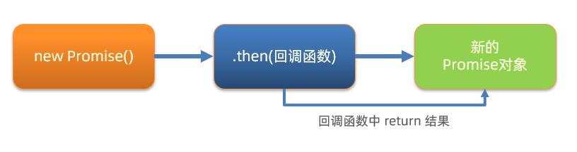
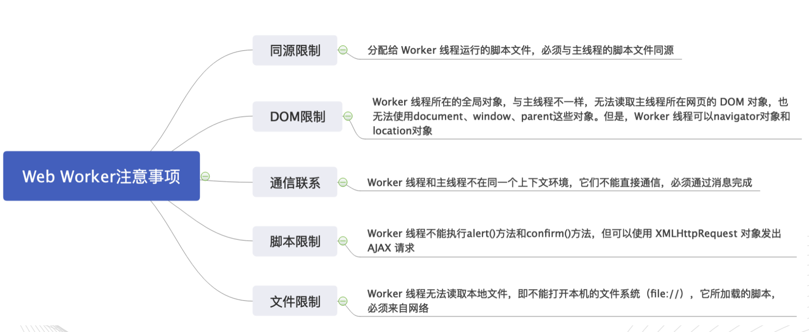

# 一、概念篇

JavaScript 的执行机制涉及多个重要概念，包括**单线程模型**、**事件循环**、**调用栈**、**任务队列**等，它们共同决定了 JavaScript 如何处理同步与异步代码。

## 1. **单线程模型**

JavaScript 是**单线程**的语言，这意味着它一次只能执行一个任务（代码）。单线程的优势是避免了多线程带来的复杂性（如竞争条件、死锁等），但也意味着如果一个任务执行时间过长，整个程序的其他任务都会被阻塞。因此，JavaScript 引入了**异步机制**，以便处理长时间任务而不阻塞主线程。

## 2. **调用栈（Call Stack）**

**调用栈**是 JavaScript 中执行同步代码的机制。它是一个栈结构，用于存储函数调用。每当一个函数被调用时，它会被压入栈顶；当函数执行完毕时，它会被弹出栈。

### 调用栈示例：

```javascript
function foo() {
  console.log('foo');
}

function bar() {
  foo();
  console.log('bar');
}

bar();
```

执行步骤：

1. 首先 `bar()` 被压入调用栈；
2. `bar()` 调用 `foo()`，`foo()` 被压入调用栈；
3. `foo()` 执行完后，从调用栈弹出；
4. `bar()` 执行完后，从调用栈弹出。

## 3. **同步与异步任务**

在 JavaScript 中，任务分为**同步任务**和**异步任务**：

- **同步任务**：立即执行，直接进入调用栈处理。
- **异步任务**：不会立即执行，等到特定条件满足（如定时器结束、网络请求返回等）后再执行。异步任务通过事件循环机制处理。

## 4. **事件循环（Event Loop）**

**事件循环**是 JavaScript 处理异步任务的核心机制。事件循环负责监控调用栈和任务队列。当调用栈为空时，它会从任务队列中取出任务，放入调用栈中执行。

### 事件循环工作流程：

1. **调用栈中的任务执行完毕**后，事件循环会检查是否有待处理的任务。
2. **如果调用栈为空**，事件循环从**任务队列**中取出第一个任务并将其放入调用栈执行。
3. **如果调用栈不为空**，事件循环等待栈中任务执行完再继续。

## 5. **任务队列（Task Queue）**

任务队列是存放**异步任务**的地方，任务分为**宏任务**（macro task）和**微任务**（micro task）。不同类型的任务会进入不同的队列：

- **宏任务**（macro task）：如 `setTimeout`、`setInterval`、`I/O` 操作等，执行顺序相对较低。
- **微任务**（micro task）：如 `Promise.then`、`MutationObserver`，执行顺序比宏任务要高。

### 任务队列的执行顺序：

1. **执行一个宏任务**（如从 `setTimeout` 中取出一个回调）。
2. **执行完宏任务后**，会检查是否有微任务队列中的任务，并执行所有微任务。
3. **所有微任务执行完后**，再去执行下一个宏任务。

### 示例：

```javascript
console.log('start');

setTimeout(() => {
  console.log('setTimeout');
}, 0);

Promise.resolve().then(() => {
  console.log('Promise');
});

console.log('end');
```

执行顺序：

1. **同步代码**：`console.log('start')` 和 `console.log('end')` 会首先执行，依次输出 `start` 和 `end`。
2. **微任务**：`Promise.resolve().then()` 属于微任务，它会在当前宏任务执行结束后立即执行，输出 `Promise`。
3. **宏任务**：`setTimeout()` 是宏任务，它会在微任务执行完后执行，最后输出 `setTimeout`。

最终输出结果是：

```
start
end
Promise
setTimeout
```

## 6. **宏任务与微任务的执行顺序**

- **微任务**（如 `Promise` 的 `.then`）在每个宏任务之后立即执行。
- **宏任务**（如 `setTimeout` 和 `setInterval`）是按事件循环的调度执行。

每次事件循环都会执行一个宏任务，执行完后会立刻检查微任务队列，并清空所有的微任务。

## 7. **Promise、async/await 与事件循环**

### **Promise**：

`Promise` 是一种异步编程的方式，它可以表示一个未来完成或失败的操作，并允许你对该操作的结果进行处理。

```javascript
let promise = new Promise((resolve, reject) => {
  setTimeout(() => {
    resolve('Success!');
  }, 1000);
});

promise.then((value) => {
  console.log(value);  // 输出 "Success!" after 1 second
});
```

### **async/await**：

`async/await` 是基于 `Promise` 的语法糖，它使得异步代码可以用同步风格书写，但本质上还是异步操作。

```javascript
async function fetchData() {
  const data = await fetch('https://api.example.com/data');
  console.log(data);
}
```

`await` 会暂停 `async` 函数的执行，直到 `Promise` 解决（resolved）。事件循环会继续执行其他任务，直到 `Promise` 返回结果。

## 8. **总结**

- **调用栈**处理同步任务，函数调用以先进后出的方式进行。
- **任务队列**存放异步任务，任务分为宏任务和微任务。
- **事件循环**负责监控调用栈，当栈为空时，它会从任务队列中取出任务进行执行。
- **微任务**优先于宏任务执行，且微任务会在每次宏任务执行完之后立即处理。


# 二、深入


## 回调函数地狱

1. 展示默认第一个省，第一个城市，第一个地区在下拉菜单中
2. 概念：在回调函数中嵌套回调函数，一直嵌套下去就形成了回调函数地狱
3. 缺点：可读性差，异常无法捕获，耦合性严重，牵一发动全身


```js
axios({ url: 'http://hmajax.itheima.net/api/province' }).then(result => {
  const pname = result.data.list[0]
  document.querySelector('.province').innerHTML = pname
  // 获取第一个省份默认下属的第一个城市名字
  axios({ url: 'http://hmajax.itheima.net/api/city', params: { pname } }).then(result => {
    const cname = result.data.list[0]
    document.querySelector('.city').innerHTML = cname
    // 获取第一个城市默认下属第一个地区名字
    axios({ url: 'http://hmajax.itheima.net/api/area', params: { pname, cname } }).then(result => {
      document.querySelector('.area').innerHTML = result.data.list[0]
    })
  })
})
```


## Promise链式调用 - 解决回调地狱

1. 概念：依靠 then() 方法会返回一个新生成的 Promise 对象特性，继续串联下一环任务，直到结束
2. 细节：then() 回调函数中的返回值，会影响新生成的 Promise 对象最终状态和结果
3. 好处：通过链式调用，解决回调函数嵌套问题



```js
/**
 * 目标：掌握Promise的链式调用
 * 需求：把省市的嵌套结构，改成链式调用的线性结构
*/
// 1. 创建Promise对象-模拟请求省份名字
const p = new Promise((resolve, reject) => {
  setTimeout(() => {
    resolve('北京市')
  }, 2000)
})

// 2. 获取省份名字
const p2 = p.then(result => {
  console.log(result)
  // 3. 创建Promise对象-模拟请求城市名字
  // return Promise对象最终状态和结果，影响到新的Promise对象
  return new Promise((resolve, reject) => {
    setTimeout(() => {
      resolve(result + '--- 北京')
    }, 2000)
  })
})

// 4. 获取城市名字
p2.then(result => {
  console.log(result)
})

// then()原地的结果是一个新的Promise对象
console.log(p2 === p)
```


```js
/**
 * 目标：把回调函数嵌套代码，改成Promise链式调用结构
 * 需求：获取默认第一个省，第一个市，第一个地区并展示在下拉菜单中
*/
let pname = ''
// 1. 得到-获取省份Promise对象
axios({url: 'http://hmajax.itheima.net/api/province'}).then(result => {
  pname = result.data.list[0]
  document.querySelector('.province').innerHTML = pname
  // 2. 得到-获取城市Promise对象
  return axios({url: 'http://hmajax.itheima.net/api/city', params: { pname }})
}).then(result => {
  const cname = result.data.list[0]
  document.querySelector('.city').innerHTML = cname
  // 3. 得到-获取地区Promise对象
  return axios({url: 'http://hmajax.itheima.net/api/area', params: { pname, cname }})
}).then(result => {
  console.log(result)
  const areaName = result.data.list[0]
  document.querySelector('.area').innerHTML = areaName
})
```


## async 和 await

`async/await` 是基于 `Promise` 的语法糖，它使得异步代码可以用同步风格书写，但本质上还是异步操作。

1. 概念：在 async 函数内，**使用 await 关键字取代 then 函数**，等待获取 Promise 对象成功状态的结果值 
2. 做法：使用 async 和 await 解决回调地狱问题

```js
/**
 * 目标：掌握async和await语法，解决回调函数地狱
 * 概念：在async函数内，使用await关键字，获取Promise对象"成功状态"结果值
 * 注意：await必须用在async修饰的函数内（await会阻止"异步函数内"代码继续执行，原地等待结果）
*/
// 1. 定义async修饰函数
async function getData() {
  // 2. await等待Promise对象成功的结果
  const pObj = await axios({url: 'http://hmajax.itheima.net/api/province'})
  const pname = pObj.data.list[0]
  const cObj = await axios({url: 'http://hmajax.itheima.net/api/city', params: { pname }})
  const cname = cObj.data.list[0]
  const aObj = await axios({url: 'http://hmajax.itheima.net/api/area', params: { pname, cname }})
  const areaName = aObj.data.list[0]


  document.querySelector('.province').innerHTML = pname
  document.querySelector('.city').innerHTML = cname
  document.querySelector('.area').innerHTML = areaName
}

getData()
```


## Web Worker

* [阮一峰 - Web Worker 使用教程](https://www.ruanyifeng.com/blog/2018/07/web-worker.html)
* [MDN - 使用 Web Workers](https://developer.mozilla.org/zh-CN/docs/Web/API/Web_Workers_API/Using_web_workers)
* [demo](https://stackblitz.com/edit/web-worker-demo-16?file=index.js)

`Web Worker` 是 HTML5 标准的一部分，这一规范定义了一套 API，允许我们在 js 主线程之外开辟新的 Worker 线程，并将一段 js 脚本运行其中，它赋予了开发者利用 js 操作多线程的能力。


HTML5中支持了 `Web Worker`，使得能够同时执行两段JS了，那是不是就是说JS实现了“多线程”了呢？我们来看看Web Worker的官方解释：

> 通过使用Web Workers，Web应用程序可以在独立于主线程的后台线程中，运行一个脚本操作。这样做的好处是可以在独立线程中执行费时的处理任务，从而允许主线程（通常是UI线程）不会因此被阻塞/放慢。

独立线程，看似像是实现了“多线程”，然而他是独立于主线程，也就是主线程依然是那个主线程没有变！虽然你大妈已经不是你大妈了，但是你大爷还是你大爷！JS单线程的本质依然没有变！

WebWorker是向浏览器申请一个子线程，该子线程服务于主线程，完全受主线程控制。




```html
<!DOCTYPE html>
<html lang="en">
<head>
    <meta charset="UTF-8">
    <meta name="viewport" content="width=device-width, initial-scale=1.0">
    <title>Web Worker</title>
</head>
<body>
    <button onclick="startWorker()">开始</button>
    <button onclick="stopWorker()">停止</button>
    <button onclick="updateNum()">在运行时点击</button>
    <div id="output"></div>
    <div id="num"></div>

    <script id="worker" type="app/worker">
        function updateSync() {
            for (let i = 0; i < 10000000000; i++) {
                if (i % 100000 === 0) {
                    postMessage(i);
                }
            }
        }
        updateSync();
    </script>

    <script>
        let worker;
        function startWorker() {
            let blob = new Blob([document.querySelector('#worker').textContent]);
            let url = window.URL.createObjectURL(blob);
            console.log(url);
            worker = new Worker(url);

            worker.onmessage = function(e) {
                document.getElementById('output').innerHTML = e.data;
            }
        }

        function stopWorker() {
            if (worker) {
                worker.terminate();
            }
        }
        
        let num = 0;
        function updateNum() {
            num++;
            document.getElementById('num').innerHTML = num;
        }
    </script>
</body>
</html>
```


